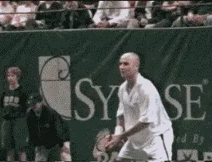
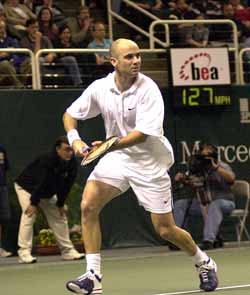
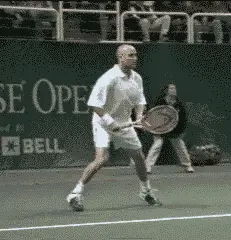
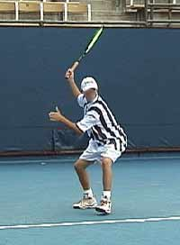
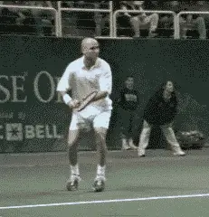
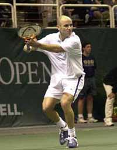
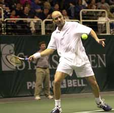
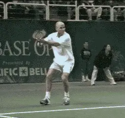
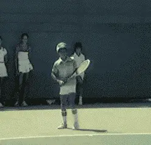

# Myth of the Backswing -- The Backhand

# John Yandell

**Watch Agassi and you will see that the key to preparation is the first
move or unit turn with the body, not the racquet.**

"Get your racquet back early!" It's a universal mantra in club tennis
and tennis teaching. Perhaps you believe in "early racquet
preparation" and have labored hard to follow this sacred advice. If so,
you are the victim of one of the most powerful myths in tennis: the myth
of the backswing. The idea that the backswing is the key to good
preparation is a myth that has caused great damage to players at all
levels.

How can the backswing be a myth? All strokes have a preparation phase,
and obviously, this must involve the racquet at some point. But the fact
is good players don't initiate their forehands by "taking the racquet
back."

The real key to early preparation is not the racquet, but the shoulders
and feet. The first move is a full body turn, or a unit turn, initiated
with the feet and the torso. There is no independent arm movement. The
backswing is a secondary phase that follows this first move with the
body.

**What are the drawbacks of starting your forehand with a
"backswing"?**

**The start of Agassi's turn. The shoulders and feet have turned
sideways, but the racquet has not moved independently.**

**[If the arm moves independently at the start of the motion, the
bio-mechanics of the entire stroke are thrown out of sequence. The
shoulder turn will be incomplete. This means the shoulders cannot rotate
fully back through the shot. Not only is the rotation of the shoulders
more limited, it also tends to be premature, so that the shoulders and
hips are too open at contact.]**

**[In addition to limiting the role of the shoulders, taking your
racquet back first often creates another critical problem: poor hitting
arm position. When the arm moves first, there is a high probability that
the racquet will never find the correct position at the end of the
backswing, when it actually starts forward to the ball.]**

Typically the racquet position as this point will be too high, and the
hitting arm will be too straight. The contact will be late. The racquet
head will tend to veer rapidly off the shot line and across the body.
The forward swing, like the preparation, will come primarily from the
arm, sometimes with tremendous muscle effort, but the player will be
unable to tap his real potential to generate power or topspin. In
extreme cases, the player may actually slice under the ball, losing the
ability to hit with topspin. Control and fluidity are lost, and the arm
and elbow take a beating.

If we look at virtually all the top players in the pro game -- and
players with solid groundstrokes at any level -- we never see the
hitting arm or racquet move first. The backswing is a secondary element
to the critical first move with the feet and shoulders.

Watch Pete Sampras, Andre Agassi, Lindsay Davenport, even heavy topspin
players, such as Tommy Haas. The first move is virtually identical. The
feet and the shoulders turn sideways. The left or opposite hand stays on
the racquet. As the body turns, the arms naturally come across the body.
The racquet and hitting arm do not move independently. They turn with
the rest of the body.

**Watch the first move in the preparation, as the feet and shoulders
turn Agassi's body sideways as a unit.**

On a good forehand at any level, this unit turn is what allows the
shoulders to coil as fully as possible. The shoulders can then uncoil
fully as they rotate back through the hit, driving the racquet head
through the line of the shot. Coaches such as Robert Lansdorp call this
"hitting through the ball."

Contrast that to the average club player who struggles with the sacred
dictum: get the racket back first! The first move is to yank the racquet
and hitting arm away from the body, stalling the shoulder turn, and
fatally restricting the potential of the shot.

**The Circular Backswing**

The problem is greatly compounded if this initial arm motion takes the
form of a circular, or loop backswing. Starting the stroke with a
circular backswing is perhaps the most deadly tendency in club tennis.
In junior tennis, it also causes major technical problems, even for
talented players at high competitive levels. This initial circular
backswing often becomes almost comically large, with the racquet
extending up to several feet over the head, and/or traveling back well
behind the plane of the body.

It's a bleak picture, but a common one at the club level and,
unfortunately, in high level junior tennis. Over the last two years,
I've had the opportunity to film dozens elite American junior players.
What I have seen has been shocking.

**Many of our top junior players have looping motions far larger than
the top pros.**

Despite unmistakable talent, many of these players have abysmal
technique. Often they have swings far larger than the top pros. Videos
show their hitting arms are literally buckling after contact, coming
radically upwards and across their bodies instead of traveling forward
on the line of the shot.

These are permanent technical limitations that restricts a young
player's potential to progress to higher levels of the competitive
game.

The same tendencies are as debilitating at the club level. The
experience I had years ago with an avid student, and the problems that
befell his forehand, still stand out in my mind.

Brent took up tennis in his 30s as a complete beginner and fell in love
with game. He owned a very successful business and was semi-retired. He
had never been athletic, but found quite quickly he could play tennis
more than well enough to hold his own with his friends. He played
everyday, sometimes twice a day, and took lessons 2 or 3 times week.

I taught him a compact forehand with a straight backswing, and the shot
worked very well. But Brent was avid to receive as much instruction as
possible and since my schedule wouldn't allow spending more time with
him, he decided to go to a well known adult tennis college for an
intense, week long learning experience.

When Brent came back, his forehand was completely changed. His motion
now began with an absolutely gigantic, looping backswing and almost no
shoulder turn. Waving his racquet around in a huge circle over his head,
he was unable to get it into position for the foreswing.

The result was that he came through with the racquet face almost wide
open. His topspin drive had been destroyed. He now had an underspin or
chop forehand. Although he was able to float the ball into the court
with a severe high to low motion, he had no power. When he would try to
hit harder, the ball would take off literally almost straight upwards,
sometimes hitting the fence in the air.

I was horrified, and Brent was severely confused, since a noted national
expert and his local teaching pro disagreed so completely about how to
teach the most basic shot in the game he loved.

We worked for a long time to compact his preparation so he could once
again hit up and generate topspin. But apparently the damage was done.
The giant loop was like a virus that had permanently altered his tennis
genetic code. He was never able to control this new arm motion
sufficiently to regain his former consistency, and some of his childlike
enthusiasm for tennis disappeared. Brent finally moved away to live
permanently at his summer home. I occasionally wonder if he still enjoys
the game and what that forehand looks like today.

**The Loop Backswing**

But, could a loop backswing really be as bad as that? Isn't it true
that all the top players use some form of a loop? And shouldn't we all
try to copy the technique of the top pros?

The answer to the first question is yes. Most top pros definitely have a
loop in their forehand motion. But let's begin by actually looking at
the nature of the loop in the professional game. Then we can address the
second question about what to copy.

**Agassi's motion from the completion of the turn to the top of the
loop**

**The key questions to ask about the pro loop are: When does it begin?
What shape does it take? And most importantly: Where does the loop
deliver the hitting arm and racquet at the critical moment when it
starts forward and upward to the ball?**

If we examine players such as Andre Agassi, Tommy Haas or Pete Sampras,
we will see they all begin their preparation with the unit turn and no
significant motion in either arm. This turn precedes the loop backswing
with the arm.

In Agassi's case, as he starts the unit turn, his hands turn the
racquet face slightly downward. But in relation to the rest of his body,
it's as if his arms had actually stayed in the ready position. They
stay in front of his torso at about waist level. Since they are attached
to the rest of his body, they naturally turn as a function of the turn
with the feet and shoulders.

With this initial whole body move, Agassi has already achieved three
fourths or more of his entire shoulder turn without moving his arm or
racquet. Only at the point do his arms begin to separate. His opposite,
or left arm continues across his body until it is parallel with the
baseline, or even pulled slightly further back. His racquet hand closes
the racquet face slightly more until it is around 60 degrees to the
court. Finally he begins to raise the racquet and trace the
circumference of a compact circle. As the loop begins, his shoulders are
still turning. When he reaches the top of his backswing, the shoulder
turn is complete. This is what I call the pro looping motion.

![A person playing tennis Description automatically generated with medium                                                                                                                    
**The start of Agassi's loop backswing. The hands separate only after most of the turn is complete.**                                                      **The completion of the turn. At the top of the backswing, Agassi's racquet is at most a foot above his head. Both his arm and racquet have stayed on his right side.**

This pro looping motion is compact in two ways. First the racquet stays
on his right side, never traveling backwards behind the plane of his
body. Second, the height of his loop never reaches more than about a
racquet head's height above his head, at the highest. On his service
returns or when he is on the run, this loop is even more compact,
verging on a straight backswing motion.

Note: Agassi has now aligned himself behind the ball on the back foot
and is perfectly balanced. From this position he is ready to initiate
the forward step to the ball, and also, begin the movement of the
racquet to the contact. In the high velocity world of pro tennis when
the players have only about one second between hits, it is important to
note Agassi reaches this position--shoulders fully coiled with racquet
at the top of the backswing--at the time the ball bounces on the court.

The next key to the success of the forward swing is the hitting arm
position that Agassi establishes at the bottom of the loop-the point at
which the racquet actually starts forward and upward to the ball. This
is what I call the double bend or the power palm position.[(See Myth of
the
Wrist)](Myth%20of%20the%20Wrist%20-%20the%20Mordern%20Pro%20Forhand.docx).
The elbow is tucked in toward the waist and the wrist is laid back. As
noted in the article on the Myth of the Wrist, this core position
remains unchanged as the racquet moves through the contact point, with
the wrist release coming only after the ball is well off the strings.

**The critical hitting arm or power palm position - elbow in with the
wrist laid back.**

The precise bio-mechanical value of the looping motion in the pro game
remains a matter of speculation and debate. Does it generate more
racquet head speed? Is it a timing mechanism? Does it allow the pros to
move more efficiently by keeping their hands and racquet in front of
them when they move laterally? (Or is it some combination of all of
these factors?)

One of the goals of the Advanced Tennis Research Project is to identify,
quantify and analyze these and other bio-mechanical elements. Three
dimensional quantitative data may eventually reveal the more about the
advantages of the pro loop. At this point, however, it is possible to
say that whatever the value of the loop, it is secondary to the unit
turn and the establishment of the power hitting arm position as the
racquet actually starts forward and upward to the ball.

This is why starting the motion with the arm causes so much devastation
at the club level. More than once I've heard players, students, and
teaching pros defend the loop as the sacred first move and "the key to
racquet head speed." But it is ridiculous to argue that the loop
provides more racquet head speed if the player is unable to fully turn
or establish the hitting arm position. That's an extreme example of
putting the cart before the horse.

**So what is the answer to the second question we posed about whether to
copy the loop from the pros?**

In the pro game, the loop is used to connect the two most critical
points in the swing, the turn and the hitting arm position at the start
of the foreswing.

**The circular backswing connects two critical points in the pro
forehand: the turn and the hitting arm position when the racquet starts
forward to the ball.**

***[Many club and junior players have loops bigger than the top pros,
but they fail to establish the unit turn and the double bend hitting arm
position. These are the more fundamental elements players should first
seek to copy from the pros.]***

Any player can hit the ball well if he has these two positions,
regardless of the exact size or shape of his backswing. But without
them, the forehand simply will never be consistent or reach it's
potential and the looping motion can do nothing to overcome these
deficiencies. Instead, as we have seen, it actually causes these more
basic problems to occur.

That is why at our tennis school we teach the simpler straight
backswing, emphasizing the turn and the hitting arm position when the
racquet starts forward to the ball. The great irony is that players who
develop these two positions tend to then develop a compact loop
naturally and automatically. As a player progresses to higher levels,
this loop may expand in size somewhat, but it's position in the
sequence of the motion remains the same-after the turn and before the
foreswing.

The larger loop should be secondary to all this, and Pete Sampras is a
perfect example. Most teaching pros have heard this from one or more
students, "I'm developing a close faced loop because I want to hit my
forehand like Pete Sampras."

**The young Pete Sampras (age 9) hits a perfect model forehand using a
small compact loop and perfect hitting arm position.**

Sampras's loop is more closed face and probably slightly larger than
Agassi's. But Pete's distinctive backswing motion was not part of his
fundamental technical development. It evolved much later, long after the
more critical elements were in place.

How do we know this? From the remarkable video of Pete at age 9, taken
by his coach Robert Lansdorp. As the video shows, Pete begins his motion
with a shoulder turn and a small, beautifully compact loop. His hitting
arm position as he starts to the ball is perfect, and it stays that way
through the stroke. You see few players today at the pro level who look
as good technically as Pete Sampras did at age 9, much less in the
juniors or club tennis.

If you want to develop a great forehand, take a tip from Pete and start
with the core fundamentals. Once you become an elite nationally ranked
player--or the best 4.0 player in your club--maybe you'll naturally
expand your swing a bit and give it your own unique stamp, the way Pete
did. But first, liberate yourself from the myth of the backswing. It's
the only way to find out how good your forehand could actually become.

John Yandell is widely acknowledged as one of the leading videographers
and students of the modern game of professional tennis. His high speed
filming for Advanced Tennis and TPA have provided new visual
resources that have changed the way the game is studied and understood
by both players and coaches. He has done personal video analysis for
hundreds of high level competitive players, including Justine
Henin-Hardenne, Taylor Dent and John McEnroe, among others.

In addition to his role as Editor of TPA he is the author of
the critically acclaimed book Visual Tennis. The John Yandell Tennis
School is located in San Francisco, California.

---

<!-- prevnext-nav -->
[← Read](myth-of-the-back-foot.md)  |  [Advanced Tennis Index](index.md)  |  [Read →](ball-spin-in-pro-tennis.md)
