# Myth of the Wrist:

# The Modern Pro Forehand

# John Yandell

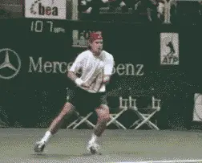

**Does Tommy Haas's forehand look "wristy"? Take a closer as the
racket goes through the hitting zone.**

We've heard it a million times during TV matches, "With a flick of the
wrist, he rifled another winner up the line!" It's a favorite phrase
of many commentators, including the great John McEnroe. It's also
common in tennis teaching. Recently I heard a teaching pro bellow at a
beginning student: "Snap your wrist! 70% of your power is in your
wrist!"

It may be widely believed and widely taught, but does that make it true?
Is the wrist snap the key to producing power in tennis? The answer is
no. In fact, with a few limited exceptions, the wrist plays no role in
the bio-mechanics of the strokes. "The flick of the wrist" is a myth,
a myth that is at the root of many technical problems for players at all
levels.

If the wrist is a myth, doesn't that also go against what we see with
our own eyes when we watch the pros? It seems obvious that many top
players release their wrists on most if not every stroke.

How Entrenched is the Myth of the Wrist?

**Read what a leading text book for teaching pros has to say:**

**"When the wrist is used to generate racket head velocity through the
stroke, a 'coupling' effect is produced, which accentuates power. When
these forces work laterally, tremendous pace can be developed."**

But the question to ask is when does this wrist release occur, and what
role, if any, does it play in the active bio-mechanics of the stroke? In
this article we will examine the myth of the wrist in the modern pro
forehand, using Andre Agassi and Tommy Haas examples. In subsequent
articles, we'll examine the myth of the wrist in other strokes as well.

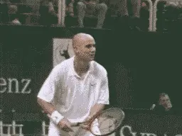

**When does his wrist really release and what role does it play in a
great forehand such as Andre Agassi's?**

Both Andre Agassi and Tommy Haas are known for powerful forehands, and
both at times appear to be quite "wristy." Their grips are also
typical of the range of forehand grips in the modern pro game.

Agassi's grip is a moderate semi-western with most of his hand behind
the racket handle and part of his hand underneath.

Haas's grip is an extreme semi-western, verging on a full western, with
less of his hand behind the handle, and more of his hand underneath.

To the naked eye, both players may appear to use considerable wrist, but
this perception is due to the limits of human vision. The naked eye
cannot register an event that takes place in 4 milliseconds--the length
of time it takes for a tennis racket to strike a tennis ball. What the
racket, hitting arm, and wrist are doing at the contact are, literally,
invisible to the human eye.

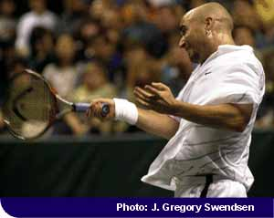

**Andre Agassi demonstrates the two key elements in the "power palm"
position: the elbow tucked in toward the torso and the wrist laid
back.**

Like the human eye, TV replays are also of limited value in studying
strokes because television cameras also lack the optical capacity to
register high speed events. Most TV cameras film at only 30 frames a
second and blur the images in replay due to their slow shutter speeds.

For the past 4 years, researchers from the Advanced Tennis Research
Project have been filming the world's best players using new generation
high speed digital cameras, similar to the "Mac Cams" used by network
TV to replay line calls at the U.S. Open. These cameras, which film at
250 frames/second with high speed shutters, are allowing us to
investigate the bio-mechanics of live pro match play in ways that were
previously impossible.

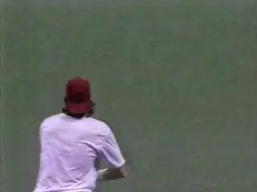

The following analysis of the role of the wrist in the modern forehand
is based on this revolutionary digital footage that allows us to "see"
the hit --as well as the critical frames just before and just after.

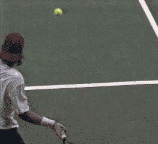

**Haas's hitting arm position as it moves through contact-elbow bent
wrist laid back, with the palm of the hand driving the hit.**

Advanced Tennis filming reveals that there is no wrist snap involved in
pro forehands, even with players such as Agassi and Haas. Rather than
flick the wrist, pro players hit their forehandsby driving the racket
with the palm of the hand.

To do this, they establish a set hitting arm position as they start the
forward swing to the ball. This position remains unchanged until long
after the ball is off the strings. When the top players set up their
hitting arms, you'll typically see an angle of anywhere from 45 and 90
degrees between the hand and the forearm. This is combined with an elbow
position which is bent and tucked into toward the side of the body.

Essentially the players maintain this angle as the racket moves toward
the contact, at the hit itself, and well beyond the contact. This is not
to say the arm is rigid or locked. In fact it should be the opposite,
relaxed with the minimum amount of grip pressure required to control the
racquet. Sometimes as the racquet accelerates forward to the contact,
you'll see this angle decrease slightly. But this is a passive movement
that is a natural consequence of the swing. If the wrist really was to
snap forward, from right to left, it would throw the racket radically
off the line of the shot, and in the extreme "snap' the ball directly
into the side fence!

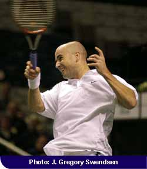

**The internal rotation of the hitting arm, continuing after the hit,
driving the natural release of the wrist.**

So to review this pro hitting arm position has two elements. First the
elbow is bent and tucked in toward the torso. Second, the wrist is laid
back.

We refer to this position-elbow in and wrist laid back-the double bend
or "power palm" position. It enables the player to use the palm of his
hand to push the racket forward and upward generating power and spin.

The push forward and upward with the palm of the hand is in turn driven
by the rotation of the player's torso and hitting arm. This double
rotation of the shoulders and hitting arm, driving the palm of the hand
and the racket, are the keys to understanding the bio-mechanics of the
modern pro forehand.

This first step on the forehand for any modern player is a full shoulder
turn, with the left arm crossing the body and the shoulders turned
square to the net or even further. This turn is followed by a looping or
circular backswing that delivers the racket into position to move
forward to the ball.

As the racket moves forward, the torso will now rotate 90 degrees or
more back through the hit, continuing until the shoulders are parallel
to the baseline or beyond. This shoulder rotation drives the hitting arm
and the palm of the hand.

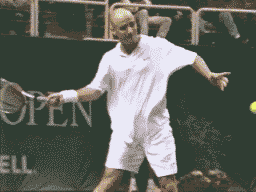

**Agassi's hitting arm in the power palm position as it moves through
the hitting zone. The wrist release will come long after the ball is
gone.**

**[At the same time that the shoulders are rotating, however, there is a
second critical rotation. This second rotation is the internal rotation
of the hitting arm.]**

As the racket moves forward, the entire arm is rotating independently,
as a unit, from the shoulder. As the high speed digital footage clearly
shows, the arm is actually turning over from bottom to top. This
rotation can be up to 180 degrees as the racket moves through the swing.

As it rotates from bottom to top, the hitting arm stays in the double
bend or power palm position. This means the angle of the wrist and elbow
relative to each other remains unchanged. This allows the palm to drive
the racket head upward and outward through the shot.

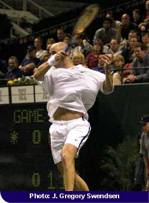

**The hitting arm has rotated a full 180 degrees through the hit, with
the wrist release as a natural consequence or reaction.**

Again, the wrist joint itself plays no role in this forward motion to
the ball. There is no wrist "snap," "flick," or "release" at the
contact. For the double rotation to be effective, the wrist must remain
in the power palm or laid back position.

***[Only as the player moves well out into the followthrough and the
hitting arm starts to relax, does the wrist begin to release-light years
after the hit in the high speed time frame of professional tennis. Since
the ball has been off the strings for many milliseconds when this wrist
movement begins to occur, it is obvious that the wrist could play no
role in generating the hit.]***

In reality the wrist release is caused by the forces generating the
swing, rather than the other way around. Wrist movement is a
consequence, not a cause of the motion. It is a natural reaction to the
rotation of the hitting arm. It happens automatically, with no
additional or conscious muscle contraction on the part of the player. In
fact, if the arm is relaxed, it is virtually impossible for a players
like Agassi or Haas to prevent this wrist release from occurring.

Generally, the more extreme the grip, the more extreme the internal
hitting arm rotation. The more extreme the arm rotation the earlier and
more extreme the wrist release.

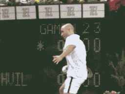

**The full movement of the hitting arm on the forward swing. Notice the
arm rotation and the release of the wrist after contact.**

The amount of arm rotation for a given player can also vary depending
upon the height of the ball, and the amount of topspin he imparts. There
is also usually more arm rotation on balls that are especially high or
low. Generally, the more topspin, the more arm rotation.

On balls slightly above waist level, Agassi will sometimes come through
the hit with the racket virtually on edge, a position similar to a
classical player such as Sampras. In all these variations, the power
palm position and the internal angles at the elbow and wrist remain
essentially unchanged.

Why has the myth of the wrist dominated tennis analysis for decades?
Because the movement of the wrist after contact is one of the few things
that the human eye can actually see in pro bio-mechanics. Possibly this
is because the followthrough takes up more time compared to the contact,
or possibly it is because the racket slows down during the
followthrough.

For whatever reason, the eye can see that the wrist has moved by the end
of the stroke. Unfortunately, this perception has led to the common
belief this wrist motion is causally related to the hit.

![A person playing tennis Description automatically generated with medium                                                                                                                                  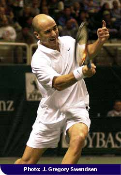
**A view of a more extreme arm roll, shortly after contact. Arm rotation is turning the racket head over, but note the wrist remains laid back.**                                                                      **A great image of the driving all the way through the ball, with a long finish and the wrist at eye level.**

If you have suffered from a lack of control, consistency, spin and/or
power on your own forehand, particularly if you have a semi-western
grip, you should examine the role of the wrist and the hitting arm.
Develop a feel for the double bend or palm power position, letting your
elbow fall in naturally toward your waist. The wrist must move into the
laid back position at the completion of the backswing, at the very
latest.

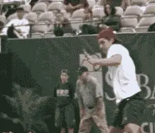

**The full range of hitting arm motion, the double bend, the arm
rotation, and the eventual wrist release.**

Now visualize you are driving the ball by pushing the racket forward and
upward with your palm. You should try to model Agassi by keeping the
palm moving through the line of the shot as long as possible. You can
drive the ball with more pace by extending the palm further along this
line.

For more topspin, the hand moves more steeply upward, and the arm
rotation is more extreme. The followthrough should be smooth and long,
the natural unrestricted consequence of a powerful move to the ball,
finishing with the wrist at about eye level.

When working on the hitting arm position, if possible film yourself
using a digital camcorder with a fast shutter speed of 1/1000 of a
second or more.

Film a dozen or more examples. Likely you will catch at least one
contact point between the racket and the ball, as well as some good
images of your hitting arm just before and after contact. This will
allow you to compare your actual positions to the animations and digital
movies, and see for yourself how the shoulder rotation, arm rotation and
hitting arm position all work together to drive the ball.

By developing and keying on these images, the wrist action on your
forehand will find its natural role. You won't have to think about it.
Just relax and let it happen. Focus on the bio-mechanical elements that
actually make the stroke happen, and you'll overcome the myths
surrounding the use of the wrist and develop a powerful, reliable
forehand no matter what your level of play.

John Yandell is widely acknowledged as one of the leading videographers
and students of the modern game of professional tennis. His high speed
filming for Advanced Tennis and TPA have provided new visual
resources that have changed the way the game is studied and understood
by both players and coaches. He has done personal video analysis for
hundreds of high level competitive players, including Justine
Henin-Hardenne, Taylor Dent and John McEnroe, among others.

In addition to his role as Editor of TPA he is the author of
the critically acclaimed book Visual Tennis. The John Yandell Tennis
School is located in San Francisco, California.
