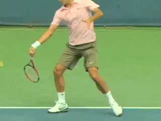
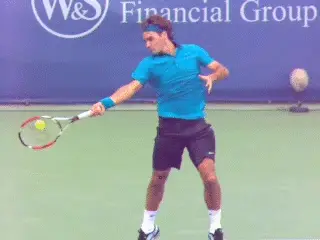
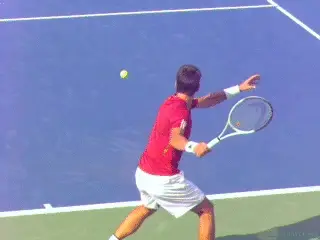
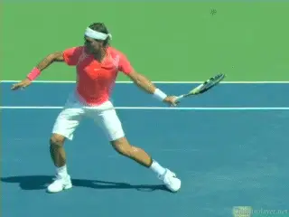
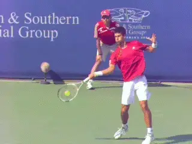
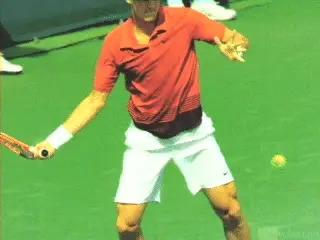

# Myths about Low to High in The

# Modern Forehand

# John Yandell

There is no more sacred belief about the forehand than "swing low to
high for topspin." Sacred, yes. But what does "low to high" really
mean?

You hear experts advise that the forward swing should start one or two
feet or even further below the ball. What does the high speed video
show?

**Can pro players actually hit topspin if the hand moves forward from
above the ball?**

That the idea of starting two feet below the ball is a myth. And that in
the new era of the windshield wiper forehand, the actual height can vary
slightly but in a startlingly way.

***The two key reference points for understanding the height of the
swing are the racket hand and the racket head. The definition of high to
low can be very different depending on which one you look
at.***

Most people think of the "low to high" path as something that is
controlled by the hand. But the reality is, as we have seen in past
articles, the hand itself is at most a few inches below the ball at the
start the forward swing.

The High Speed Archives show this, with many, many forehand examples
with the hand slightly below the ball. But that's not all when you
start to look closely. There are also numerous examples where the hand
can start forward at what appears to be the same height as the ball.
Stranger still, the hand can also start at a height slightly above the
ball--and still produce a heavy topspin forehand. Yes, above!

**From contact the racket tip can turn over as much as 180 degrees in
the so-called windshield wiper.**

How could any player hit topspin, especially the stratospheric levels of
players like Nadal, Federer, and Djokovic, with the hand above the ball?
There is an answer. Let's take a close look at the action of the
hitting arm at the start of the forward swing, and specifically the
rotation of the hand, arm, and racket before, during and after the hit.

**Start of the Wiper**

**The key to understanding this apparent paradox is understanding both
parts of the windshield wiper, a technical element that has become
ubiquitous in the modern game, especially the part of the wiper that
happens before the contact.**

Most explanations of the windshield wiper focus on the path of the
racket from the contact to the followthrough. In this part of the swing,
the racket tip can turn over as much as 180 degrees.

Think of the racket tip pointing at one sideline at contact and then in
about a tenth of a second, turning all the way over till it points at
the other sideline, basically tracing a half circle. That's the wiper
finish.

But the amount of wiper rotation in the followthrough can also be less.
Or can happen a fraction of a second later so that the hand is already
moving backward when the wiper completes. The motion is tremendously
variable, which is one factor that accounts for the range of spin the
top players produce.

**On most pro forehands there is significant backward hand and arm
rotation in the backswing.**

I've called this wiper action "hand and arm rotation," ([link](John%20Yandell-Your%20forehand%20and%20the%20modern%20forehand-The%20Forward%20Swing%20Hand%20and%20Arm%20Rotation.docx))
because it stems from the upper arm and the shoulder. The wiper is not
from the wrist or the forearm, despite what you might have heard.

**[You will see how the motion is initiated at the shoulder joint and
driven by that upper arm rotation. The hand arm and racket are basically
rotating as a unit.]**

**[But the arm and racket can also rotate backwards before the forward
swing as the player completes the backswing. When the hand arm and
racket rotate backward in this way the racket head also rotates backward
and down.]**

**[This part wiper is the key to understanding the path of the forward
swing and what really constitutes low to high. This is because the
racket arm does not simply or only rotate forward from
contact.]**

**This backward rotation places the racket head below the ball
regardless of the actual height of the hand. Most pro forehands in the
modern era have at least some of this backward
rotation.**

The amount of backward rotation is just as variable as the forward
rotation described above. In the extreme case this backward rotation can
approach 90 degrees, so that the tip of the racket appears to point
almost directly down at the court.

When the arm is rotated backward like this, the beginning of the forward
windshield wiper action is well before contact. This means the racket
head is already moving upward through the rotation of the hand and arm
from the shoulder.

**Watch the extreme backwards until the racket tip is almost down at the
court. Then watch how that increases the wiper rotation through the
forward swing.**

This is what explains the seeming paradox of the hand height. When the
arm rotates backward, the hand can be slightly above the level of the
ball and the racket head can still be well below.

***The massive forward or upward rotation of the hitting arm from this
position is a critical dimension in the low to high motion. The amount
of this rotation and the speed of this rotation help explain the
increases in spin in the pro game, where players routinely generating up
to 3000rpm of spin and more on forehand drives that can reach 90 or
100mph.***

How does all this relate with the traditional idea of "brushing" up
the back of the ball for topspin? There isn't a contradiction. The two
actually work together.

***The brushing action is different than the wiper rotation. The
brushing comes from the upward, lifting action of the arm from the
shoulder.*** Watch in the animation how the hand
and arm lift the racket so that brushes up the back of the ball. This
brushing is going on simultaneously with the wiper.

According to Brian Gordon, however, the wiper rotation is capable of
generating far more racket speed than the traditional lifting and
brushing alone. Again, this helps explain why the racket hand can be at
or even above the level of forehands hit with such tremendous spin.

The game of tennis, and especially pro tennis, is extremely dynamic. The
speed and complexity of the strokes means critical moments are invisible
to the naked eye.

**In addition to the wiper rotation, the hand and arm lift from the
shoulder--the traditional idea of brushing the ball for topspin.**

This is nowhere more true than in the fractions of a second when the
forward swing generates topspin. High speed video is what makes it
possible for us to unravel or at least try to unravel these
complexities.

So the question becomes this. Should the average player try to hit
topspin by raising his hand above ball level?

I know there are at this moment subscribers out there trying! But I
think the real take away is simply learning how to experiment with a
fuller wiper. It's about trying out the backward rotation not the hand
height.

***[Try hitting some forehands from the turn position with the racket
hand and arm rotated back so that the racket tip is angled down toward
the ground before starting the forward swing. Make sure this rotation is
unitary and keeps the shape of the hitting arm position in
tact.]***

But don't worry about the height of the hand, much less try to place it
above the ball. The hand height will take care of itself. Swing forward
from this backward rotated position. Now complete the wiper finish in
the usual way by turning the head over until it points part way or all
the way toward the opposite sideline in the followthrough.

What does that feel like? If you get comfortable with it, you will feel
and see you ball rotation increase visibly.

Now try incorporating that backward rotation in the entire motion from
the ready position. But compare the spin effect with the other key
characteristics of your ball before you decide to make it the norm. Are
you giving up obvious depth or speed?

**A significant percentage of pro forehands are hit with minimal
backward rotation.**

***[It's a pro element. But remember it's still an extreme element and
is used variably by the top players. A large percentage of pro forehands
are still hit with minimal backward wiper rotation.]***

It's fun to understand and experiment. And the full wiper can be very,
very effective on many balls--high and heavy, short low and wide. Or to
hit deep, high bouncers.

***Just remember that the extension of the swing is what creates a
real power drive. That hasn't changed in pro tennis and it hasn't
changed at any other level.***

In general when I see students in person this is one of the elements
that is almost always in need of improvement--extension of the forward
swing. But when you can add some of these variations to the basic drive,
then you have a forehand that can take your game up a level, or maybe
more!

John Yandell is widely acknowledged as one of the leading videographers
and students of the modern game of professional tennis. His high speed
filming for Advanced Tennis and TPA have provided new visual
resources that have changed the way the game is studied and understood
by both players and coaches. He has done personal video analysis for
hundreds of high level competitive players, including Justine
Henin-Hardenne, Taylor Dent and John McEnroe, among others.

In addition to his role as Editor of TPA he is the author of
the critically acclaimed book Visual Tennis. The John Yandell Tennis
School is located in San Francisco, California.
