# Rafael Nadal's Forehand 

**Rafael Nadal's Forehand**

**John Yandell**

No doubt that the two most talked about forehands in the men's game
belong to Roger Federer and Rafael Nadal. But they couldn't appear to
be more different. It's an amazing aspect of professional tennis:
players can succeed at the highest levels with radically different grips
and swings. You just don't see that basic technical variety in any
other sport.

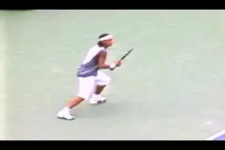

**Two great players demonstrate the incredible diversity and complexity
of the modern forehand.**

We've already examined Federer's forehand in detail in two previous
articles. ([link](http://www.tennisplayer.net/members/avancedtennis/john_yandell/evolution_modern_forehand/evolution_modern_forehand_part1/roger_federer_evolution_modern_forehand_part1.html).)
So now let's take a look at Nadal in the same way using the high speed
video footage developed by Advanced Tennis. In many ways the high speed
footage confirms the obvious: when we look closely at the swings of
these two players, they put the complex technical elements of the
forehand together in different ways. But like all top players, Federer
and Nadal share certain commonalities. Interestingly, they also share
one element that is rarer among the top players--the use of the
straight hitting arm position. We'll see though that they don't use
this element in an identical fashion.

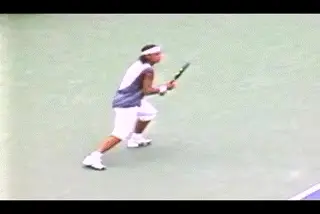

**How does Nadal's forehand fit into the analytic framework we've
created?**

All our previous work on the forehand really pays off when we start to
analyze Nadal. Since we have looked closely at so many components in the
forehand, we have a framework for evaluating how Nadal does or doesn't
use them. This is based on the articles in the Advanced Tennis section
on the commonalities and differences across the grip styles. ([link](Advanced%20Tennis%20TOC.docx))

**Grip**

So let's start with the grip and look at how Rafael puts together his
forehand from the spectrum of possible elements. If we look closely at
how he holds the racket, Nadal is at the opposite end of the spectrum
from Roger Federer. Federer has one of the most conservative grips of
all of the top players. And Nadal probably has the most extreme.

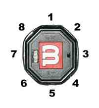
Grip is determined by the position of the heel pad and the index knuckle on the bevels.

***[As we've discussed before, the common grip
terminology--"eastern," "semi-western," "western"--is too vague
and virtually useless in describing the grip differences in the modern
pro game.]*** For example, there are at least a half dozen pro
grip variations that could be called "semi-western." A clearer way to
look at the grips is to examine how the hand is positioned on the bevels
of the racket handle. As we have seen, there are 8 bevels counting
clockwise from the top. The best way to describe the grips is by seeing
where the index knuckle and the heel pad are positioned on these bevels.

I want to note that even with the high speed video it's not possible to
tell a player's grips with 100% certainty. But if we look at a lot of
examples it seems reasonably clear that Federer is a 3 / 3 1/2 . This
means his heel pad is on bevel 3 and the index knuckle is on the edge
between 3 and 4. Nadal obviously is much further underneath the handle.
His index knuckle appears to be on the 4th bevel, or possibly a little
further down toward the edge with bevel 5. His heel pad is partially on
bevel 4 and partially on bevel 5, the bottom bevel. That probably makes
him a 4 / 4 1/2, or even a 4 1/2 / 4 1/2 .

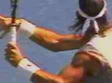

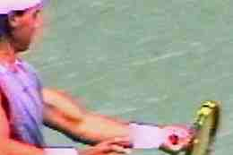

It's not a full western grip. That would be a 5 /5. But it's as close
to it as any player I've filmed, with the possible exception of
Sebastien Grosjean, who seems about the same. It's more extreme than
either Roddick or Hewitt or even Fernando Gonzalez. Those guys are more
like 4 /4 s. You can tell how extreme the grip is when you look at the
hand at contact. Nadal appears to have most of the palm of his hand
under the handle.

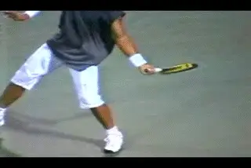

**4 views of Nadal's grip. The index knuckle is on Bevel 4 with the
heel pad between Bevels 4 and 5.**

It is generally believed that the more extreme the grip, the greater the
capacity to generate spin. But we found that Federer challenges that
belief. Despite his nearly classical grip we found Federer has an
incredible ability to create spin levels of 4000rpm or more, much higher
than other players with similar grips like Sampras or Agassi or Tim
Henman. ([link](http://www.tennisplayer.net/members/mystheavyball/john_yandell/Spintest/spin_test.html)
for more spin data.) Our high speed filming determined that the average
spin on Roger's forehand was 2700rpm. This is virtually identical to
Andy Roddick who also averaged about 2700rpm. This ability to create and
vary spin is related to Federer's ability to rotate his hand and arm
through the hit. This hand rotation also accounts for the amazing
variety of finishes we have previously observed.

But Nadal takes the spin factor to yet another level. With the high
speed camera, we were able to measure the spin on 25 of his forehands.
The spin values ranged from about 2000rpm up to almost 5000rpm. 5000rpm!
That's equal to or slightly higher than the spin values on the second
serve of Pete Sampras. It's just an unbelievable amount of rotation.

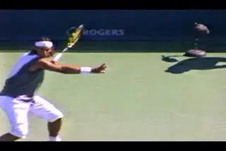

**Nadal takes forehand spin to a whole new level.**

Nadal's average forehand spin value was above 3200rpm. That's 20% or
so higher than either Federer or Roddick. It's approaching double the
figure we measured in 1997 for Pete Sampras and Andre Agassi. It's
about the same as the former Spanish champion Sergi Bruguera. But the
question is; what is happening in his motion that produces this type of
action?

**The Preparation Constant**

Let's go through and examine his forehand, starting with the
preparation. The fundamentals of preparation appear to be one of the few
constants we can still trace across the whole range of players, grips,
and shot variations. We've identified the elements several times before
([link](http://www.tennisplayer.net/members/avancedtennis/john_yandell/building%20_the_modern%20_forehand/building_modern_forehand_pg1/building_modern_forehand_pg1.html).)
And for Nadal they are no different than the other top players. The
preparation starts with a unit turn--the feet and the torso turning
sideways as a unit. This is what initiates the racket preparation, not
the independent movement of the hand or arm.

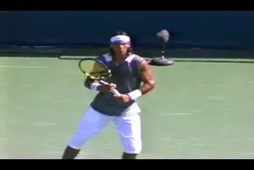

**The fundamental unit turn--still not widely accepted in teaching.**

***[This point bears repeating because it is, unfortunately, still a
minority view in teaching. How many times have you heard this? "Take
your racket back early." The preparation does not start with the
racket! It starts with the unit turn with the body. [Initially the
racket is just going along for the ride.]]***

If you watch the video carefully you'll see that the position of the
racket changes slightly as he initiates the motion. Rafael relaxes his
grip on the racket as he starts the unit turn. The racket tip tilts
further forward then tilts back. But there is no independent arm
movement that could be called a racket take back. Instead, as the feet
and torso turn sideways, the racket automatically turns as well.

Nadal's unit turn looks as strong as or stronger than any of the other
top players. His shoulders turn until they are 45 degrees to the net, or
maybe more, before the racket really starts to move on it's own. It's
only when he reaches this position that he actually begins to move his
hand independently and start the backswing.

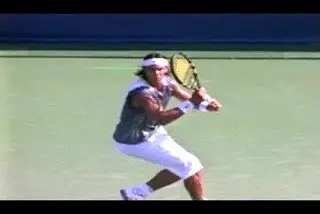

**The Full Turn with the arm stretched across the baseline.**

***[Now watch what happens when Nadal starts to separate his hands. His
right arm immediately begins to straighten out, stretching across his
body. This is the second characteristic preparation element, also
something we've identified in virtually every top player.]***
The opposite arm straightens out so that it points directly at the
sideline. From the front we can see the stretch in his arm clearly. Now
look at the angle of his shoulders. They are turned somewhat past 90
degrees to the net. This is the completion of the turn, the position is
which the upper body is fully coiled.

**The Backswing Illusion**

Nadal has an inverted backswing motion as we found with many top
players, meaning that he turns the top edge of the racket upside down as
the hands start up. This keeps the racket in closer to the body similar
to Federer's motion. In our analysis of pro backswings ([link](http://www.tennisplayer.net/members/avancedtennis/john_yandell/building%20_the_modern%20_forehand/building_modern_forehand_backswing_page1/building_modern_forehand_backswing_page1.html))
we found that there were actually two measures of the backswing size.
One was the height of the tip of the racket. The other is the height of
the hand. The movement of the hand is a better indicator of the actual
path and size of the loop.

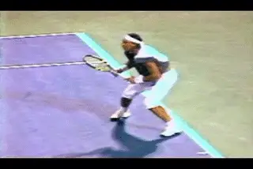

**An inverted backswing with the tip upward and a low hand position.**

If we look at Nadal's racket first, we see that he points the tip more
directly upward sooner in the motion than Federer or Agassi. In the
video it appears that when the tip points straight up, the racket head
is above the top of his head. If we look at his hand however, it appears
to be at about shoulder level, or sometimes slightly lower. This is
actually the same height or lower than Agassi, probably about the same
as Federer. So isn't that interesting? A common belief is that a large
backswing means more racket head speed. But like Agassi and Federer,
Nadal has one of the biggest forehands in the game with one of the
smallest loops, based on the path of the hand.

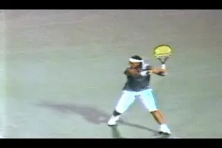

**Nadal closes the racket face later in the backswing, but still creates
the characteristic racket head angle as he swings forward.**

Nadal's backswing is more compact than most other players in still one
other respect. Most players straighten out the arm somewhat or
completely as they continue the motion backward and down. As they do
this, they close the racket face to a greater or lesser degree. Not
Rafael. He keeps his elbow bent longer, with the racket closer to his
body as it moves backward and down. Compared to most players, he
straightens out his arm later in the motion.

Many coaches believe that the racket face should be closed as it starts
forward. The high speed footage shows this isn't really true. Although
players close the face partially or even completely in the downward
phase of the backswing, this changes by the time they reach the bottom
of the loop and/or as they start forward to the ball.

At that point, the actual angle of the racket face is determined by the
grip. With a classical grip like Sampras, the plane of the racket can be
on edge or square to the court. As the grips become more extreme, the
angle changes with the racket face closing proportionately. The more
extreme the grip the more closed the face. As we've discussed in detail
in the backswing article, this is a natural function of the way the
players hold the racket. The players with the more extreme grips will
have the face closed 45 up to about 60 degrees, but the face never
points straight down on the way toward contact.

This is more difficult to see for Nadal than for other players. This is
because Nadal is slower to straighten out the arm. It happens literally
in the last split second as he reaches the bottom of the backswing. He
closes the racket face but not quite all the way down. But the angle of
the racket changes just as he starts the forward swing to the ball. We
can see that the face actually changes to an angle of around 60 degrees
to the court, which is characteristic for his grip style. My experience
shows me that this all happens naturally, and it is definitely a mistake
to try to force the face closed in the belief that somehow this will
increase topspin.

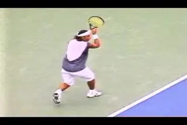

**Hitting inside, Nadal keeps his arm straighter longer.**

**The Straight Hitting Arm**

Although most players straighten the arm as the racket moves backwards
and down, they generally let the elbow bend and fall in again toward the
torso as they approach the bottom of the backswing. This allows them to
find the double bend hitting arm position as the racket starts forward
to the ball, with the elbow tucked in and the wrist laid back. Federer
does this at times, as we saw. He uses the double bend hitting arm
position probably on about a third of the forehands he hits. On another
third the elbow is somewhat bent, though less than the classical double
bend position.

On the other third, Federer keeps the arm completely straight through
the contact and well out into the followthrough, again, something we've
discussed in previous articles. ([link](http://www.tennisplayer.net/members/avancedtennis/john_yandell/evolution_modern_forehand/evolution_modern_forehand_part1/roger_federer_evolution_modern_forehand_part2.html).)
With Federer we found that the straight hitting arm is associated with
his ability to keep his swing closer to the line of the shot longer,
typically or inside balls.

Nadal does something similar on inside balls extending the swing along
the line of the shot, with the arm staying straight longer. But Nadal
uses the straight arm hitting position much more than Federer. In fact
he has his arm straight at contact on the vast majority of balls he hits
from anywhere on the court. I looked closely at around a hundred and
fifty forehands, and found that Nadal has a straight arm position at
contact on over 80% of them. This is more than twice the percentage of
Federer.

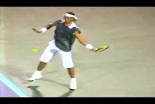

**On most balls, Nadal moves more quickly out of the straight arm
position.**

**Two Basic Finishes**

Which brings us to the finish. Again there are major differences when we
compare Nadal and Federer. With Federer we saw an almost infinite array
of possible finishes. Roger finishes over his shoulder, or at waist
level, or anywhere in between. He combines any of these finish heights
with varying amounts of hand rotation turning the racket head over more
or less depending on the ball. But Nadal is much less varied. He uses
two basic finishes on over 90% of his forehands.

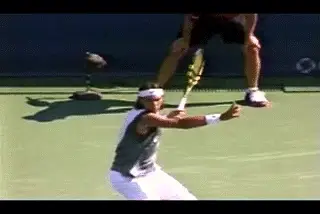

**On the majority of his forehands, Nadal reverses his finish.**

His most common finish is the one that has attracted the most attention
from television commentators and other observers. This is what Robert
Lansdorp calls the reverse finish, with the racket moving sharply upward
after contact, traveling over his head, then moving backwards, and
finishing on the left side of the body. ([link](http://www.tennisplayer.net/members/famouscoach/robert_lansdorp/lansdorp_reverse_forehand_images/lansdorp_reverse_forehand.html).)
Brett Hobden calls this same followthrough the vertical finish, because
the swing plane is more vertical or straight up and down ([link](http://www.tennisplayer.net/members/famouscoach/brett_hobden/seven_modern_topspin_forehands/seven_modern_topspin_forehands.html).)
Whatever you want to call it, Nadal uses this finish on over half his
forehands.

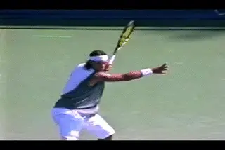

**Nadal's other main finish, across the body at shoulder level.**

But there is another finish he uses almost as much. Over 40% of his
finishes are much more traditional, finishing across the body. On a
small percentage of these he actually goes up over his shoulder similar
to Agassi or Sampras. More typically however his racket goes across the
body and around the torso finishing at about the top of the shoulder.
Sometimes he will also finish lower across the body, similar to some of
Federer's finishes. But this is on only a small percentage of shots.

So why does he use which finish when? My first hypothesis was that it
might be related to the amount of spin. Maybe that extreme reverse
finish was his way of hitting heavier topspin. But the numbers showed
that they two finishes produced virtually the same amount of average
spin--about 3200rpm.

**Which Finish When?**

The type of finish seems more related to his position of the court.
Although I could find examples of both finishes from virtually
everywhere, there were clear correlations in the numbers of finishes
from certain positions. When Nadal plays inside, he tends to finish most
swings across the body, with fully two thirds of his finishes at about
shoulder level. On short balls, it's about half and half, half reverse
finishes and half across the body at shoulder level. When he hits in the
center of the court, the balance shifts again, with a slightly higher
percentage of reverse finishes. And when he moves wide is or is on the
run virtually every finish is a reverse.

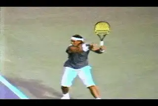

**On the run Nadal reverses. Playing inside he finishes across.**

So why is it that Nadal hits so many more reverse or vertical finishes
than other players? Normally this finish is more associated with
classical style grips. Is it simply a unique preference? That could be,
but consider two other factors as well. First that amazing left arm of
his. It looks like it belongs to a boxer. Giant biceps have never been
considered desirable for tennis. But Nadal's arms aren't only muscular
they are exceptionally long, and appear to be very quick and flexible.
Possibly the combination of strength, length, and flexibility allows him
to do things other players can't--such as reverse a huge topspin
forehand from almost anywhere on the court and generate 4000rpm of spin.

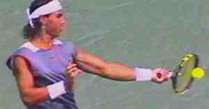
**It's an amazing left arm, unlike the hitting arm of any other top player, probably ever.**

Another factor to consider is ball height. The reverse finish is usually
associated with balls that are somewhat lower in the strike zone.
Although Nadal has an extreme grip and can easily handle shoulder high
balls, his contact point on most balls is surprisingly low. He plays the
majority of his forehands at around waist level. This is due to his
position on the court which can be 15 feet or more behind the baseline.
That may be key to understanding why he can hit so many reverse
finishes, something that would be harder on higher balls hit closer in.
Let's keep an eye on him at the French and see what the finishes and
contact heights look like there.

**Hand Rotation**

The other independent variable in the followthrough is hand and arm
rotation. This is how the hand and racket turn over as a unit as they
move through the swing. It accounts for the differences in the look of
the finishes in the modern game, as we have seen. With the more
underneath grips the players have to turn the hand and racket over to a
certain degree just to get the racket through the motion. ([link](http://www.tennisplayer.net/members/avancedtennis/john_yandell/building%20_the_modern%20_forehand/key_differences_grip_styles/key_differences_grip_styles_page4.html)).
But players also vary the amount of rotation depending on the ball, and
the amount of spin they want to hit. This is particularly true with a
player like Federer who uses every possible increment of hand rotation
in combination with the many other variables in his forehand.

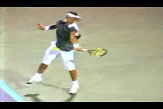

**Nadal rotates his hand over roughly 180 degrees on virtually every
ball.**

But the interesting thing about Nadal is how consistent this element is
in his forehand. With his extreme grip, the hand rotation is a natural
part of the motion. But on virtually every ball, he turns the racket as
much he possibly can or close to it. This is very different than
Federer.

The easiest way to see this is to look at the top of the racket as it
starts forward to the ball. The edge of the racket basically points
upward toward the sky as it approaches contact. As the swing progresses
the edge of the racket starts to turn. ***At the completion of the
wrap, the edge turns completely upside down and is pointing down at the
court. That's roughly 180 degrees of rotation.***
Sometimes it's even more. You can see it most easily in the across the
body finish, but if you look closely, you'll see it in the reverse
finish as well. Unlike other players with fairly extreme grips, like
Hewitt or even Guga, Nadal doesn't vary this rotation much or reduce it
in order to flatten the ball out. That probably helps account for the
stratospheric spin rates we noted at the start of the article. In all
the balls we measured we found only one that was spinning at less than
2000rpm.

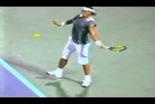

**A little harder to see but watch the top edge of the racket rotate on
the reverse finish.**

**Torso Rotation**

**[A final factor we've looked at across the grip styles is the amount
of torso rotation in the forward swing]**. ([link](Building%20the%20Modern%20Forehand-Differences%20Across%20the%20Grip%20Styles.docx).)
Originally we found that there was a correlation between grip style and
the amount of torso rotation. A classical player like Pete Sampras had
about 90 degrees of forward rotation. A more extreme player like Roddick
could have up to twice that, up to about 180 degrees. And a player like
Agassi was somewhere in between.

Then Roger Federer came along and blew that correlation apart. We found
Federer uses virtually any torso rotation pattern from classical to
extreme. This means he can finish with his shoulders parallel to the
net. Or that he can continue the rotation another 90 degrees until his
front shoulder is pointing at his opponent, or he can rotate anywhere
between the two extremes.

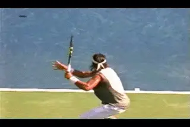

**On the reverse finish, Nadal's shoulders finish parallel to the
baseline.**

Nadal is another exception, but for different reasons than Federer.
Federer has more rotation than we would expect with his grip style.
Nadal actually has less. When he finishes across his body with the hand
at shoulder level, Nadal usually does continue his body rotation with
his shoulders somewhat past parallel to the baseline. But this rotation
is more limited than players like Roddick who have less extreme grips.
Nadal rarely if ever reaches the extreme position with his front
shoulder pointing at the opponent. Usually it's more like 30 degrees
past parallel. It also appears to happen slightly later in the motion,
more a part of the recovery phase than a continuation of the drive
through the contact. And on some balls it's less or doesn't happen at
all.

With the reverse finish, Nadal's rotational pattern is also
consistently more limited. Remember that this is the finish he uses on
the majority of his forehands. ***Rather than continuing to rotate his
torso, the shoulder rotation stops as soon as his shoulders reach
parallel with the baseline.*** From there it's all
arm extension and hand and arm rotation. Again we see a top player
reversing the paradigm. Nadal has an extreme grip, but a straight
hitting arm position, but on most balls he has a torso rotation pattern
and a revers finish more associated with the classical style.

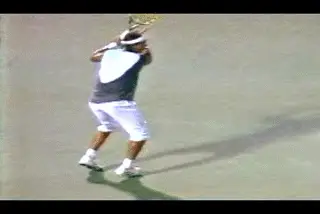

**Nadal has less forward torso rotation than most extreme players.**

**Extension**

So what does all that mean for the extension and finish of the motion?
We've talked about the universal finish across the grip styles. We've
identified some general checkpoints. The hand is at about eye level and
even with the opposite shoulder, and the forearm at about a 45 degree
angle to the court. Typically there is about two feet of spacing between
the racket hand and the torso. We found that Sampras, Agassi, Roddick
and even Federer reached this position when they are driving the ball
relatively flat.

Again we see that this doesn't completely apply to Nadal. This is
probably due to the consistently incredible levels of spin. Not that
Nadal doesn't hit the ball hard, because, obviously he does. But the
balance between ball speed and spin definitely seems skewed in the
direction of the spin. The reduced torso rotation is probably related to
this as well.

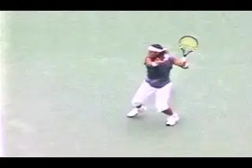

**Nadal's spacing at the finish position is usually less than other top
players.**

The emphasis is on generating spin either with the reverse finish, or
with heavy hand rotation when he swings across the body. When he hits
the ball from the inside position, his arm can stay straight and extend
out along the line of the shot, as we noted, but when it does come
across the body, the spacing is clearly less than most of the other top
players.

**And the Wrist?**

We've found that there is a tremendously complex interplay of factors
that go into producing the full range of potential shots. But the
forward snap of the wrist isn't one of them. ***We saw with Federer
that even with the straight hitting arm position, the wrist position is
still laid back, and in fact can be even further laid back compared to
the more traditional double bend hitting arm position. The laid back
wrist remains a key element in allowing the transfer of energy into the
shot.***

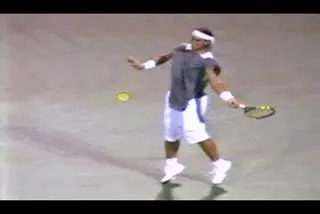

**With the straight arm hitting position the wrist can be laid back more
than with the double bend.**

As with the rest of the arm, the wrist is relatively loose and relaxed.
It can move forward somewhat during the start of the forward swing. It
can actually move back due to the force of the contact. And it will
naturally release forward after contact as the hand and racket moves
forward into the followthrough. All this is the consequence of the
forces generated by making the key positions in the stroke, regardless
of the grip style. So forget about trying to use your wrist and
concentrate on the actual factors that go into producing speed and spin
in a great forehand, regardless of grip style.

**And It All Means?**

It's a good thing that Rafael Nadal and Roger Federer were the last two
players we studied in this series of articles, rather than the first.
Otherwise, I might have given up on the effort to make systematic sense
of all the elements we see in the modern forehand, and how they can be
combined into the amazing variety of shots we see in professional
tennis. After looking at Nadal I am more amazed than ever at how great
players find a way to blend the elements in ways that suit there
particular temperament and strategic style.

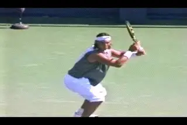

**What can most players adopt from the world's most elite pros? Stay
tuned.**

Once again I think it's important to note that as fascinating as all
this is, we need to sound a note of sincere caution before attempting
most of these things at home. The fact is that the show courts on the
pro tour are a different universe from the ones the rest of the world's
tennis players inhabit. We need to puzzle out why the pros do what they
do, and see what parts of that actually apply to the situations faced by
players at other levels, from club players to league players to juniors
to college players to senior players and everyone else in between.

We've come along way in this series, and we are almost ready to make
those assessments. But first we need to look at one other factor that
relates to this: the hitting stance in pro tennis and how and why they
are used by top players.

John Yandell is widely acknowledged as one of the leading videographers
and students of the modern game of professional tennis. His high speed
filming for Advanced Tennis and TPA have provided new visual
resources that have changed the way the game is studied and understood
by both players and coaches. He has done personal video analysis for
hundreds of high level competitive players, including Justine
Henin-Hardenne, Taylor Dent and John McEnroe, among others.

In addition to his role as Editor of TPA he is the author of
the critically acclaimed book Visual Tennis. The John Yandell Tennis
School is located in San Francisco, California.
