# The Backhand Volley 

# John Yandell

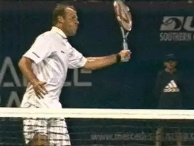

**Forehand and backhand volleys: basic similarities, basic
differences.**

How different are the forehand and backhand volleys? It's a fascinating
and complex question. The fact is that there are fundamental
similarities and fundamental differences. ([link](http://www.tennisplayer.net/members/avancedtennis/john_yandell/volleys/forehand_volley/forehand_volley.html)
for the forehand article.)

We saw on the forehand volley that the shape of the hitting arm was a
critical component of the technical swing pattern. When it comes to the
backhand volley this is equally true. **[Understanding the hitting arm
shape and how to use it is the secret to establishing and mastering the
stroke.]**

A second fundamental is also the same on the two volleys. This is **[the
role of the shoulders and the feet in the preparation, or unit turn,
that starts the motion.]** These factors are interrelated and
happen together.

**Differences**

**[But there are also two fundamental differences between the forehand
and backhand volleys. The first is the amount of spin.]** **[The
second is the direction of the swing plane.]** These differences
have led to a lot of confusion in learning and executing the two
strokes.

Forehand volleys in pro tennis average less than 1000rpm of spin. But in
general, the backhand volleys average more than twice that, or over
2000rpm. ([link](http://www.tennisplayer.net/members/mystheavyball/john_yandell/spintest_part2/spintest_part2.html).)

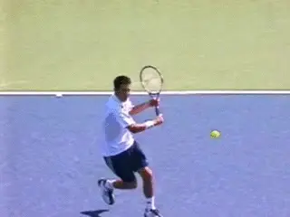

**The backhand volley: more spin and a more downward swing plane.**

**[The spin differential is directly related to the second difference,
the angle of the swing plane.]** The swing plane on the forehand
volley is flatter, more in line with the direction of the shot. But the
swing plane on the backhand volley is normally more sharply downward.
Because of this, in some ways, the feeling of the two shots can be very
different.

The problem is that many players have one feeling or the other, and
apply it on both sides. This means they end up either hitting downward
too much on the forehand volley, or hitting through the backhand volley
on too straight a line.

And yes, it's a matter of degree, because both components are present
in virtually all volleys. But understanding how to combine them in the
right balance is what makes a given volley effective.

So let's go through the backhand volley, break it down step by step,
and see how all the components fit and work together.

**We can understand the backhand volley grip in terms of the relationship between the racket handle bevels, the index knuckle and the heel pad.**

**Grip**

As we saw on the forehand, there is a limited range of volley grips used
by the top players. Virtually every top player uses some version of a
continental or mild eastern grip on both sides. But the grip can still
be a controversial issue.

Once again we can refer to the grip terminology we've developed to
describe how the hand connects with the racket on all strokes. The issue
is how a player positions the index knuckle and the heel pad in relation
to the bevels on the grip.

It would be hard to be precise without walking out on the court and
grabbing Tim Henman or Roger Federer by the racket hand, but it appears
that the strongest volley grips in the pro game are around a 2 / 1.

This means the index knuckle is on the second bevel from the top, and
the heel pad is mainly on the top of the frame, or bevel 1. But even
these players look like they slide part of the heel pad off Bevel 1 and
slightly toward the second bevel.

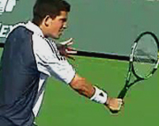

**Hard to define precisely, but some version of a mild backhand grip.**

Many players use a slightly milder grip, more like a 2 1/2 / 1 1/2. This
means the heel pad is at most halfway on top of the frame, sometimes
less, and the index knuckle is straddling the edge between bevels 2 and
3. In my experience this milder grip works the best for most players.
But there is a range and every player should experiment until he finds
the grip that works best going back and forth between the two sides.

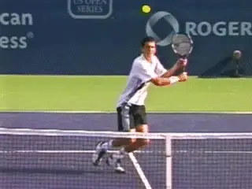

**Do the top players make subtle grip shifts? Are they invisible?**

Many knowledgeable observers argue, however, **[that the top players
actually use different grips at the net, shifting how they hold the
racket at least slightly from ball to ball, and it's probably true.
It's just difficult or impossible to see in the video.]**

Would it make sense to rotate the hand a little more toward the top to
hit a shoulder high, relatively flat backhand volley? Yes. Or go the
other way slightly on a low ball to hit with a little more slice? Yes,
again.

What about the forehand versus the backhand side? In general could you
hit many forehand volleys with a grip shifted slightly toward the
forehand side? Probably true as well. There are really two questions
here. Do the top players shift the grip? And, if so, is it a conscious
adjustment?

And what about the idea of at least starting out with two distinct
grips--shifting from a forehand grip to a backhand grip and back when
you are learning?

My experience is that some players can learn a single volley grip and
hit effectively on both sides literally from the first ball. But others
have real problems, usually on the forehand side. Due to the slightly
flatter nature of the swing, they end up chopping down too much with any
version of a backhand grip.

Conversely, some players will get the feeling for the hitting arm
position on the backhand volley much faster if they start with a
slightly stronger backhand grip.

So in my view, it's not a black and white issue, but in the long run
you want to settle on one volley grip that you can use on both sides. As
for the slight adjustments, you can experiment in practice to get the
feeling of how they improve your leverage or ability to generate
underspin on various balls. But in match play any changes will probably
have to take care of themselves.

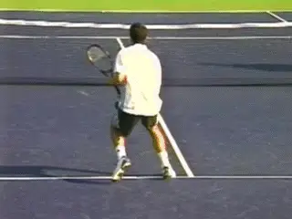

**The body turn and the set up with the hitting arm position.**

**Preparation**

As with the forehand volley--or the groundstrokes for that matter--the
backhand volley begins with a unit turn. The exact pattern of the steps
can vary depending on the path of the player and the oncoming ball, but
basically the feet and shoulders turn sideways as a unit. Because the
players are moving in, this step is sometimes forward, with the front
foot pointing at an angle toward the sideline.

Compared to the forehand volley the shoulder turn is usually a little
stronger. The line of the shoulders at the completion of the turn can be
60 degrees up to about 90 degrees to the net depending on the ball. This
is compared to about 45 degrees or possibly 60 degrees on most
forehands.

**Open U Hitting Arm**

The second component in the preparation is establishing the hitting arm
shape. On the forehand volley article we saw that the hitting arm is
configured into an Open U shape. The shape of the backhand volley
hitting arm is essentially the same.

**The characteristic U shape with the upper arm and racket at about a 45 degree angle to the forearm.**

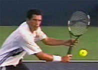

The forearm forms the base of the U, with the racket and upper arm
forming the legs, angled at roughly 45 degrees to the base. The opposite
arm cradles the racket at the throat, and helps to create this shape and
position the racket.

It's easiest to see the U shape when the forearm is parallel to the
court or close to it. But if you study the examples in the high speed
archive, you'll see this shape around the contact on virtually every
pro backhand volley. ([link](http://www.tennisplayer.net/members/high_speed_archive/volleys/backhand_volley/backhand_volley_1_high_speed.html).)

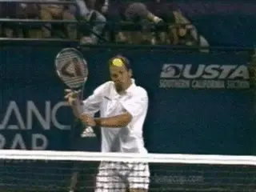

**Watch the hitting arm shape stay in tact and move almost directly
forward through contact.**

The hitting arm position is critical because it is what allows the
player to drive the forward swing from the front shoulder. From this
position you can see how the front shoulder or deltoid muscles move the
racket and hitting arm to the contact. The shoulder stays in position
and the hitting arm structure moves forward as a unit.

You can see this most clearly on flatter volleys closer to the net.
Although these are relatively rare, you can see a virtually pure example
in the Rusedski animation. Watch how the hitting arm structure is
unchanged and how the hitting arm and racket travel basically forward
from just before until just after contact.

As with the one-handed groundstrokes, this forward motion is combined
with the movement of the left arm backwards in the opposite direction.
This opposition of the arms is what helps keep the torso sideways,
essentially at the same angle to the net as at the completion of the
turn. The contact point itself will be only slightly in front of the
plane of the shoulders.

This critical forward hitting arm motion is very hard to see, taking
only fractions of a second and comprising only a few frames even in high
speed video. But mastering it is critical. To help show it I've
isolated it further in another animation, again or a volley that is hit
virtually flat. Watch the forward, unitary movement of the hitting arm
structure using the front shoulder muscles.

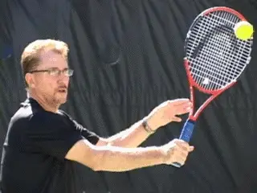

**A closer look at the forward motion of the hitting arm from the
shoulder.**

In my experience, for most players to build a solid motion, it's
necessary to restrict this additional arm motion as much as possible in
creating a basic model. Often it's necessary to hit the ball almost
totally flat as in the animation to really feel how this works.

**Is it a Punch?**

Which brings us to the two most common volley tips. Because the hitting
arm and racket move forward from the shoulder, the concept of
"punching" the volley doesn't make much sense on the backhand volley.
The fist is pointed basically to the sideline once the player sets up
the hitting arm shape.

A "punch" would imply that the fist would explode in that direction,
with the arm extending toward the sideline, staying parallel to the net.
That of course would eliminate the forward movement to the ball. If you
still want to think of the motion as some type of blow, however, think
of it as a backhanded slap.

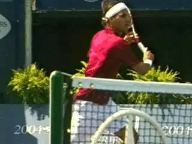

**How accurate are the most common volley "tips"**

**Is It Firm?**

The idea of keeping the wrist somewhat firm however, applies much better
on the backhand volley than the forehand. Why? Because on the forehand
the palm of the hand is behind the handle, pushing the racket. On the
backhand volley, the hand and palm are on the opposite side of the
handle, closest to the ball, at least partially. Of course you don't
want to be stiff or rigid on any stroke, but I think a little
"firmness" here is important to keep the shape of the hitting arm in
tact.

**The Backswing**

I feel that it is very important to develop a feeling for the role of
the hitting arm using the compact model outlined above. But the reality
is that few backhand volleys are hit with just this basic forward motion
and/or virtually flat. Most are hit with substantial backswings and high
levels of underspin. That's one of the things that sets the backhand
volley apart from the forehand as we noted.

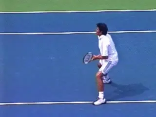

**Two backswing factors: raising the hand and hitting arm, and rotating
them backwards from the shoulder.**

So let's see how to combine the hitting arm shape and movement with the
backswing and the creation of underspin. As the unit turn starts, the
players begin to set up the hitting arm position almost immediately. The
players typically reach the Open U position when the racket reaches the
front edge of the body, and sometimes before.

This is where the additional backswing begins. There are two components.
First the players raise their hands and the entire hitting arm
structure, usually keeping the shape in tact. Then the rotate the
hitting arm backwards in the shoulder joint. This is what opens the
angle of the face of the racket.

On very high balls you sometimes see the racket tip extend well beyond
the rear edge of the body before the start of the forward swing. But the
hand itself rarely goes back further than the middle or the torso. At
most it may reach the rear edge of body. (More on this in the next
article.)

The position of the racket tip is due to the increased backward, or
external rotation of the hitting arm in the shoulder joint. You see some
version of this elevation and rotation of the hitting arm on the
majority of backhand volleys at all levels.

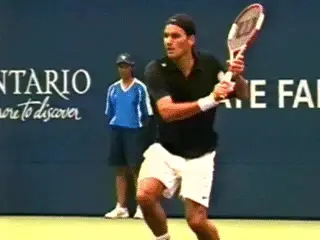

**The combined forward and downward movement to the contact.**

**The Forward Swing**

We are now in a position to see how the backswing and hitting arm
structure work together in the forward swing. The motion of the hitting
arm forward from the shoulder is driving the motion. But by raising the
hand and hitting arm structure, and rotating them backward, the players
set the racket face open and above the oncoming ball.

The difference is that the plane of the swing is now downward, compared
to the simpler flat model. This combination of the downward swing and
slightly opened racket face is what produces the underspin at a level
that sometimes equals that of the pro groundstrokes. The difference with
the basic forward motion is that the plane of the movement is now on a
diagonal that is downward as well as forward.

The amount of downward and forward movement can be mixed in many
combinations. The player can take a slightly lower or higher backswing.
He can rotate the hitting arm structure backward a little more or a
little less. The forward swing plane can be angled slightly more
downward or slightly more outward.

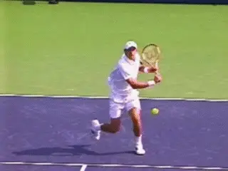

**Sometimes the elbow extends fully, other times not.**

**Elbow Extension**

Which brings us to another complexity. Often as the racket starts
forward down, the elbow straightens out. Many analysts and coaches
identify this as the critical movement in generating the hit. I think
the high speed video shows something else.

Sometimes the elbow straightens completely by contact. Sometimes it
straightens out after. On some balls however, the elbow stays bent
throughout the forward swing, or it straightens only partially. It
possibly adds racket head speed (or not), but since it is only present
on a percentage of backhand volleys, we have to consider it a secondary
or supplemental movement.

**Cupping**

One final point to understand is what often happens to the angle of the
racket face after the contact. We saw the same issue on the forehand
volley. On many balls the racket face appears to open, even going
parallel to the court as it moves through the contact. This is sometimes
called "cupping" the volley.

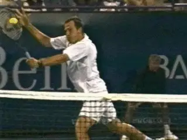

**Watch the racket face bevel and slide open after the hit.**

**[What the high speed video shows is that this is a consequence. Some
combination of the angle of the racket face, the angle of the swing
plane, and the force of the ball at contact, can cause the racket face
to deflect. But let this happen naturally if at all. The underspin is
coming from the swing plane and the angle of the racket face at
contact.]**

So there we have the elements in the basic backhand volley. **The
foundation is understanding how to set up and move the hitting arm
through the shot as a unit.** It may be hard to see
in the high speed footage, but this element there in every pro backhand
volley in our archive. Once you develop your own feel for it, you'll
know exactly why that is.

Next, we'll look more at full range of variations on the backhand
volley. Stay Tuned.

John Yandell is widely acknowledged as one of the leading videographers
and students of the modern game of professional tennis. His high speed
filming for Advanced Tennis and TPA have provided new visual
resources that have changed the way the game is studied and understood
by both players and coaches. He has done personal video analysis for
hundreds of high level competitive players, including Justine
Henin-Hardenne, Taylor Dent and John McEnroe, among others.

In addition to his role as Editor of TPA he is the author of
the critically acclaimed book Visual Tennis. The John Yandell Tennis
School is located in San Francisco, California.

---

<!-- prevnext-nav -->
[← Read](the-forehand-volley-variations.md)  |  [Advanced Tennis Index](index.md)  |  [Read →](the-backhand-volley-variations.md)
