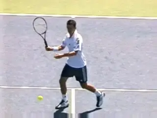
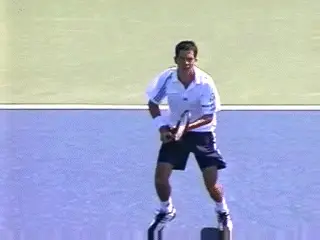
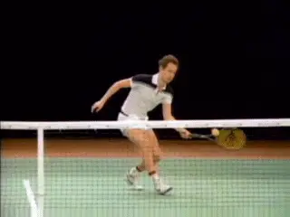
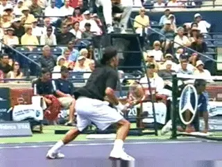
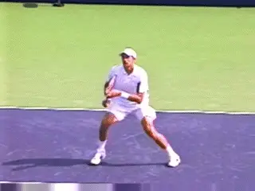
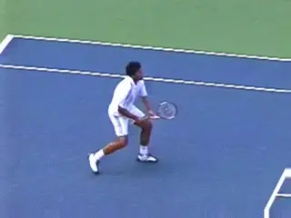
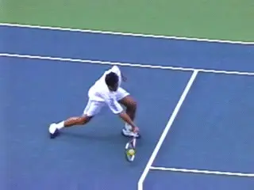
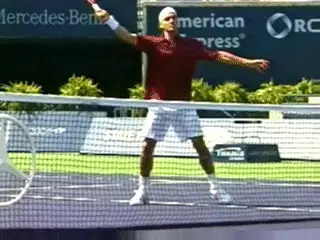
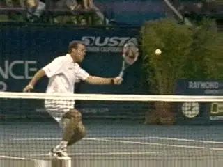
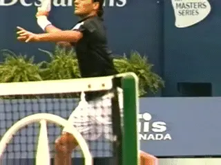

# The Forehand Volley: Variations

# John Yandell

**The magic element: the U hitting arm shape.**

In the last article we looked at the core elements on the forehand
volley. We did this through a close examination of high speed footage of
pro volleys developed by Advanced Tennis Research, filmed at 250 frames
a second. ([)](The%20Forehand%20Volley.docx) This footage
allowed us to examine the lightening volley fast swing patterns in a
detailed way not impossible with the human eye, or even with
conventional 30 frame per second video.

In this analysis, we saw the role of the feet and the shoulders in the
unit turn and preparation. We also saw the critical role of the hitting
arm shape, what we called the Open U. This shape can be described as
follows. The forearm forms the base of the U. The upper arm and the
racket form the legs. The legs are open to the base at an angle of about
45 degrees.

We saw that this hitting arm position is what allows the player to drive
the motion forward with the shoulder. To see how this worked, we looked
at examples of players hitting basic shoulder high volleys. ([link](The%20Forehand%20Volley.docx).) If you've felt this effect you
now how satisfying and clean it can be.

But if you go to the net a lot, you are well aware that only a small
percentage of forehand volleys are this simple. If you could count on a
steady stream of shoulder high balls, you'd see a lot more players at
all levels go up to the net a lot more often.

**What about when the ball is higher, lower, or softer?**

**[The fact is the ball frequently comes wider and/or higher and/or
lower and/or harder and/or softer. Or some combination of those factors.
As we noted, the height of the contact point can vary from the ankles to
well above the top of the head. This is far and away the greatest
diversity of any of the basic strokes, and one of the factors that makes
the volley so difficult to master.]**

**The Variations**

So what happens to the basic elements we identified in the first
article--and especially the U shape--when we look at the shot
variations? Let's work through a range of different volleys and see
what stays the same and what does not. I think you'll be surprised at
what we see.

Quite a few people wrote in after the first article with comments about
the U shape. In general, everyone recognized it in the footage presented
with the article. But many people made the point that the shape didn't
hold on other balls. And I agree.

**Watch Johnny Mac and Tim Henman kept the U shape in tact.**

**The hitting shape often changes just before the critical moment of
the contact.** In fact you can find the hitting arm
in many different configurations depending on the ball and how the
player is positioned. The arm can straighten out partially or all the
way, and the angle between the racket and the forearm--one leg of the
U--can change in either direction.

It's important to understand that we can also find clear examples of
more difficult balls where the players hold the shape of the Open U
throughout the motion. Look at the animation of John McEnroe hitting a
gorgeous low volley, followed by Tim Henman hitting a high one. Both
players are able to position the U shape behind the ball and drive the
motion from the shoulder.

Interestingly, even when the hitting arm shape changes significantly at
contact, it frequently regains the U Shape after contact. This is one
reason I think it is so important for players to learn it from the
beginning and to feel its central role in the execution of the stroke.

**Watch the hitting arm go out of the U shape, then in again after
contact.**

**Swing Shapes**

You also see variations in the length of the swing, the shape of the
swing, and in the muscle groups the players use to move the racket
through the contact. Players may swing the hitting arm forward and
across the body. Or they may swing the hitting arm sharply downward from
the shoulder. Players also rotate the hitting arm and racket backwards
and forwards in the shoulder joint, the same kind of "supination" and
"pronation" movements we see in the serve.

What is fascinating however is that these adaptations almost always
occur after the players establish the basic U shape. And despite the
changes in the U and the additional movements, **the shoulder rotation
remains a central force driving the motion
forward.**

So on virtually every ball, the players begin with some degree of unit
turn and also establish the U shape. The shoulder rotation starts the
forward motion. Then, from this point, they alter the shape of the
hitting arm and the shape of the swing to adapt to the ball.

This is why players who try to learn the more difficult adaptive shapes
first have so many problems. They don't have the feel of the simple,
solid motion forward motion to the contact that comes with the setting
up the basic shape. So let's look at what happens on a wide range of
different balls and how the hitting arm changes as well as what other
factors come into play in executing the motion.

**The elbow extends. The hitting arm and racket swing across from the
shoulder.**

**Stretch Volleys**

For starters, watch the animation of Max Mirnyi hitting a stretch
forehand volley. Watch the perfect unit turn, the set up on the outside
foot, and the creation of the hitting arm position. Now watch what
happens next.

As the racket moves forward to contact the ball, Max extends his hitting
arm from the elbow until it is virtually straight. This probably extends
his reach an additional 6 inches. The shape of the hitting arm has
changed substantially, going from a U to more of an L shape.

But, as Max extends and changes the shape of the hitting arm, watch how
the rotation of the shoulder still drives the arm forward. This torso
rotation is the same element we saw in the more basic volley. The rear
shoulders rotates probably around 30 degrees until it is parallel with
the net at contact.

Now watch and see how an additional element no comes in completing the
motion. Watch the hitting arm and racket move forward and across the
body.The torso stops rotating. The hitting arm stays virtually straight.
The L shape is perfectly preserved. To continue the swing, Max is using
his front shoulder muscles to move the arm and racket as a unit without
any internal play or movement in this altered hitting arm structure.
It's like a gate swinging on a hinge.

**But watch how in another split second the elbow has flexed
again**, ***partially regaining the U shape. No
wonder the motions on the volleys are misunderstood. The arm moved from
the U shape to the L shape and then back again to the U shape, driven by
two different shoulder motions--all in a few tenths of a second. This
is why we need the high speed video to study the dynamics of the swing
pattern.***

**Taylor Dent extends the hitting arm from the elbow, pushing the
contact in front.**

**Low Volleys**

Now let's look the changes in the shape of the hitting arm and in the
motion on a tough low volley, hit by Taylor Dent.

Taylor is virtually scrapping this ball off the court. Most players and
coaches would agree it's one of the most difficult shots in the game.
Unfortunately, if you come to the net in pro tennis, you need to be
ready to hit a lot of these, and do that successfully. And that's
probably one reason why players don't come in that much.

Watch the sequence. Taylor does a great job of getting down in his legs.
But that alone isn't enough to reach this ball. He also bends somewhat
at the waist. But the racket still won't be low enough. The final
factor is the change in the hitting arm position. Notice how he changes
from the U shape to the L shape, again by straightening the arm at the
elbow. This is similar to the adaptation Max Mirnyi made on the stretch
volley above.

This shift accomplishes two things. First, by dropping the angle of the
forearm, he is able to lower the racket head sufficiently to hit
slightly upward on the ball and get the trajectory of the shot up and
over the net.

Second, with the arm straightened out into the L shape, he is able to
reach a few inches further forward to contact the ball before it bounces
on the court. It keeps him from having to hit an even more difficult
half volley. Because his last step with the front foot is so large,
it's also the only way he can still keep the contact in front.

Notice though that the shoulder rotation still initiates the forward
movement of the racket. But like Max, Taylor also uses the front
shoulder muscles to push the hitting arm structure forward independent
of the torso rotation.

**Watch the wrist pushed further back by the impact.**

Another interesting point is what happens to the wrist. Watch what
happens to the racket after contact, and especially the angle between
the wrist and the forearm. The wrist is laid back in the L shape around
45 degrees just before contact. **[After the hit the racket head
actually moves backward slightly increasing this angle to about 90
degrees.]** We can see it in Taylor and also another low volley
hit by Max Mirnyi in the animation.

From this action we can surmise that **[the players are holding the
racket only tight enough to keep the hitting arm shape, and no
tighter.]** The grip pressure is probably softer than you might
imagine, especially if you have been trained to keep the wrist "firm."
Again the problem with keeping the volley "firm" is that it tends to
make the average player even more tense and rigid.

**Downward Angle**

One of the most interesting aspects of all the forehand volley motions
we've been looking at is how level the forward swing patterns really
is. This is why so players trained to hit sharply downward for underspin
usually hit volleys that float rather than stick.

**The hitting arm and racket move downward from the shoulder joint.**

The shape of the swings is consistent with the spin data we have on the
forehand volley, which had the least spin of any of the shots we studied
in our heavy ball analysis. ([link](http://www.tennisplayer.net/members/mystheavyball/john_yandell/spintest_part2/spintest_part2.html).)
On average the pro forehand volley has less than 1000rpm of spin,
actually about 800rpm. A backhand volley usually has more than twice as
much spin,at about 2000rpm. We'll see that makes sense when we look at
the swing patterns in an upcoming article.

**[On most forehand volleys, there is only a slight downward angle to
the swing plane]**. **The racket is moving much more forward
than downward. This is why stress the rotational element in the forward
swing so much.**

Occasionally though you will see a radically downward swing pattern, as
in the example of the high Federer forehand volley in the animation.
This extreme example helps us see how that downward component of the
swing is generated.

The downward motion is another unitary movement of the arm and racket,
again driven by the front shoulder muscles. It's similar to the
movement across the body we saw above, just in a different direction.

This downward component starts at the same time as the forward
rotational movement coming from the rear shoulder. But it typically
continues after the forward rotation is complete. Look in the Federer
animation and watch the arm and racket continue to move downward after
the back shoulder is stationary.

**The additional opening of the racket face is an effect not a cause.**

**Opening the Face**

One of the most perplexing elements in the forehand volley motion **is
the additional opening or tilting back of the racket face that occurs
around contact. This is sometimes called "cupping" the
volley.**

Is it an intentional movement? Is it the key to underspin? Or is
something else happening here that isn't well understood? If you look
at the high speed video you'll see that this change in the angle of the
racket face is an effect. It seems to happens almost exclusively as a
result of the contact with the ball.

This makes sense in the context of what we've described above. The
racket face is slightly open. It's moving forward and slightly
downward. The swing is also flattening out coming into the contact. To
do this you can see that the player is usually rotating his forearm
slightly backwards.

Now, when the ball hits the strings, the forearm rotation increases and
the racket face turns back significantly further. But it's not a
universal phenenomenon. Some balls it happens, and others it doesn't.
Yes you can see it many of the video examples, but should you worry
about trying to make it happen? The answer is no, in my opinion**[. Let
it occur, naturally, or not, as a result of executing the motion and the
confluence of factors described above.]**

**Watch the backward and then forward rotation of the upper arm in the
shoulder joint.**

**Upper Arm Rotation**

There is one additional, more radical component to the arm action we've
identified. This is on super high forehand volleys. It involves the
backward rotation of the upper arm in the shoulder joint, and then the
forward rotation taking the racket through the hit.

Watch the incredible animation of Pete Sampras hitting a tough high
volley from the side view. Watch what happens to the hand, hitting arm
and racket. First, the hand goes back the edge of the rear shoulder, and
at this point the racket is pretty much straight up and down. So that
looks like a traditional volley.

But watch what happens next. Now the upper arm rotates further backwards
in the shoulder socket. You can also see the wrist become more laid
back. This is again an indication of the relatively lack of tension in
the hitting arm.

When we look at the forward swing we see the familiar forward rotation
of the rear shoulder. So again, look that this basic motion we
identified as a core part of the shot comes into play even in the most
extreme variations.

We also see Pete raise the arm and racket upward using the shoulder
muscles. But watch how the hitting arm and racket structure rotates
forward in the shoulder joint. Look at the elbow. You'll see it rotate
forward around 45 degrees to the contact. At this point look that the
angle of the racket face is pointing just slightly down. After the
contact the rotation continues probably an equivalent amount, another 45
degrees or so.

**A complete forehand volley: mastery of core and supplemental
elements.**

It appears that this ball is being hit virtually or completely flat. As
we'll see in an upcoming article, this is the exact opposite of the way
spin works on super high backhand volleys. Pretty incredible and one
more example that there is a lot of complexity in the volley motions
that has to be analyzed and sequenced in terms of importance in building
the shot for yourself.

So there we have it for the variations on the forehand volley. What we
see is that the additional elements in the swing pattern are seamlessly
integrated with the core motion we identified in the first article.

This is why it's so important and valuable for players at all levels to
learn the underlying structure of the motion. Now as players learn to
deal with more and more difficult balls, they can adjust and add the
additional elements we've identified in this article.

Next: On to the backhand volley!

John Yandell is widely acknowledged as one of the leading videographers
and students of the modern game of professional tennis. His high speed
filming for Advanced Tennis and TPA have provided new visual
resources that have changed the way the game is studied and understood
by both players and coaches. He has done personal video analysis for
hundreds of high level competitive players, including Justine
Henin-Hardenne, Taylor Dent and John McEnroe, among others.

In addition to his role as Editor of TPA he is the author of
the critically acclaimed book Visual Tennis. The John Yandell Tennis
School is located in San Francisco, California.
