# The Forehand Volley

# John Yandell

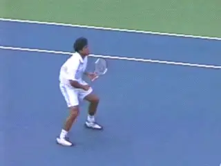

**Why are the volleys difficult to understand and to master?**

The volley motions may be the most compact in terms of the size of the
swings, but understanding them is every bit as challenging as the other
strokes. Maybe more so.

In my opinion, most teaching information about how to hit the volley is
inaccurate and counterproductive. This may help partially explain why so
few players volley confidently and well.

Let's see if we can do something to improve all that. In this article
we'll start with the forehand volley. We'll isolate the illusive core
elements in the forehand volleys of the best players of the world.

Specifically in this first article, we'll look at the critical and
misunderstood role of the hitting arm. Then we'll go on to look at some
of the variations and complexities of the forehand volley.

Then we'll take a look at the patterns of the footwork, including the
role of the split step, as well as the other critical step patterns
before and after leading to the execution of the shot. From there we'll
progress to the backhand volley and do the same.

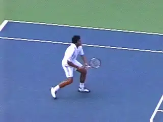

**The extreme range of contact heights makes the volleys unique.**

**The Problem**

If the volleys are so compact, why are they also so difficult to
understand, teach and execute? There are several reasons.

First, even in the digital video era, there's a lot less video to
study. Compared to groundstrokes, returns, and serves, there are,
obviously, far fewer volleys hit in the modern pro game, and this is
reflected in the available data bases.

The footage in the Stroke Archives shows this. There are about 700 total
Rafael Nadal stroke clips. But less than 20 of them are volleys. That's
about 3% of the total stroke clips. With Roger Federer there are over 70
volley examples. But that's still less than 10% of the total shots.

A second problem has to do with nature of the video data. Because the
motions are so brief, seeing exactly what happens around contact is
difficult even in the regular stroke archive footage, which is filmed at
30 frames a second.

Third, the contact point can be over the player's head, or at the level
of the ankles, or anywhere in between. That's more extreme than every
other stroke in the game. There are also significant variations in the
spin. Some volleys are hit quite flat, others with underspin that can
exceed 2000rpm. That changes the shape of the swing around contact more
than other strokes.

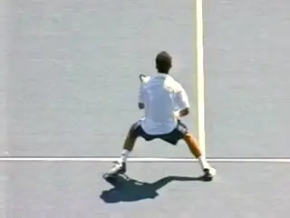

**The player's movement, the oncoming ball, and the shot line can all
be different diagonals.**

Additionally, the players tend to be moving much more directly forward
than on any other shots. Often they are coming forward on diagonals that
are at sharp angles to the flight of the oncoming ball. And the diagonal
of the shot they choose to hit may be in either direction also at a
sharp angle to the way they are moving.

Finally, the shot angles the player choose are usually sharper at the
net than off the ground. All of this can require significant, rapid
adjustments in the shape of directions of the swing patterns.

So it's all more complex than it may appear. That's why I'm so
excited about this article, and the corresponding addition we are making
to the High Speed Archive. With this issue, we're starting an entirely
new data base of high speed footage strictly of the volleys of the top
players, all filmed by Advanced Tennis Research in live pro matches
([link](http://www.tennisplayer.net/members/high_speed_archive/volleys/forehand_volley/forehand_volley_high_speed.html?TimHenmanFHVWarmUpFront-001-0001_Tennisplayer440.pct).)

This footage was shot at 250 frames a second. That's eight times more
information than regular video. Together with this series of articles I
think this data base will go a long way in helping us understand what
really happens at the net and how any player can develop superior
technical volleys for themselves. And remember these clips are all
downloadable with an online upgrade to Quick Time Pro as we discussed in
the article on using the resources of the site. ([link](http://www.tennisplayer.net/members/teaching_systems/john_yandell/using_tennisplayer/using_tennisplayer.html).)

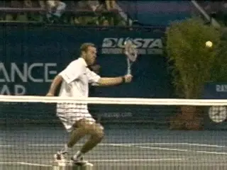

**The secret to understanding the volleys--hitting arm position.**

**Is it Really a Punch?**

This lack of good imagery of world class volleys probably contributes to
the inaccuracy and ineffectiveness of most terminology used in
traditional teaching.

**[The two most common volley tips are "Punch the Volley," and "Keep
a Firm Wrist." Neither is an accurate description of the actual volley
motions.]**

Now if hearing one of those phrases makes you volley like Tim Henman, I
say great, stick with it. My point is that these common tips don't
describe what happens in a world class volley. So if you suspect that
your volley could actually improve--and maybe dramatically--these
articles will give you clear models of the actual elements in the stroke
and some powerful new imagery and terminology to use on the court.

**The Secret of the Hitting Arm Position**

A detailed study of the high speed footage reveals is that there is a
secret to understanding and executing the forehand volley that has gone
largely unrecognized in coaching and teaching.

**[This secret is the positioning of the hitting arm.]** The
positioning in the preparation, and especially, in the forward motion to
the contact. Let's use the footage to identify how this works for the
top players and how to develop it yourself. But before we do, we have to
address one other basic question, grips.

**Grip**

Volley grips are a controversial topic. Virtually all volleys in pro
tennis are hit with some version of a mild eastern backhand or
continental grip. But which version do the top players use, and which
version is right for you?

generated](media_the-forehand-volley/media/image6.jpg)

The relationship between the racket bevels, the heel pad and the index knuckle determines the grip.

To understand we can use the grip terminology we've developed to
describe how the hand connects with the racket on the other strokes. To
do this we look at how the player positions the index knuckle and the
heel pad in relation to the bevels on the grip handles. The pictures
show the 8 bevels and the location of the two key points on the hand.

When we look at where these key points are positioned on the bevels by
the top players, we see that the strongest volley grip in the pro game
today is probably a 2 / 1.

This means the index knuckle is on the second bevel from the top, and
the heel pad is mainly on the top of the frame, or bevel 1. But I think
even the players with the stronger grips and the index knuckle clearly
on Bevel 2 slide part of the heel pad off Bevel 1 and slightly toward
the second bevel.

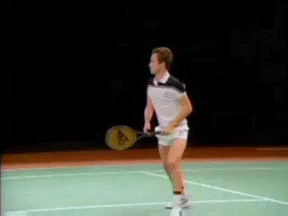

**John McEnroe used a mild forehand volley grip that is probably
well-suited to most players.**

And many players use a slightly milder grip, more like a 2 1/2  /  1
1/2. This means the heel pad is at most halfway on top of the frame,
sometimes less, and the index knuckle is straddling the edge between
bevels 2 and 3. Even in the footage it's hard to see all this
precisely, but I think this discussion at least covers the range of
options.

In my experience the mildest grip in this range---the 2 1/2  /  1
1/2--is also the one that works the best for most players, especially
below the highest levels of the game. It's the grip used by one of the
greatest volleyers of all time, John McEnroe, so it must be pretty
effective at the world class level as well.

There are two other important questions regarding grip. First, should a
player immediately try to master a true volley grip or should he start
with an eastern forehand grip--a 3 / 3 grip in our new terminology?

There are passionate advocates on both sides of this issue, but in my
opinion the answer isn't absolute. Yes, you want a true volley grip.
But my experience is that many players at the club level who start with
some version of a backhand grip never learn to make solid contact.

Instead of hitting through the volley they end up moving the racket too
far downward during the swing. The contact point is often late.
Frequently the ball pops up and/or floats. This makes it almost
impossible to hit a winner at the net.

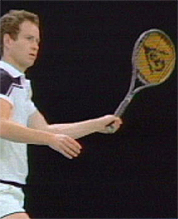

**Pro forehand volley grips fall within a limited range but are tough to define precisely.**

If you have these problems on your volley, you need to move to an
eastern grip and learn to hit flat, solid volleys with the proper swing
line. If you can establish this feel, it can then translate into the
motion with a true volley grip.

The other grip issue is whether skilled players who have some version of
the volley grip make slight grip shifts from ball to ball. Billie Jean
King believes strongly that top players do this, and I think that she is
probably correct.

Whether you can train yourself to make these shifts systematically in
high speed exchanges--or whether the shifts just happen
instinctively--that's another question. But this is secondary to
developing the core elements in the forehand volley. So let's address
the basic issues for now, and think about subtle, advanced grip shifts
later on.

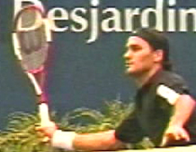

*Video demonstration — the original video for this article was hosted on TennisPlayer.net.*

**The Secret of the Hitting Arm**

So now let's get back to the secret: how players position the hitting
arm and racket. This is the critical unrecognized element in the
forehand volley. But every top pro player uses it. And if you learn what
it's about and learn to set it up correctly, it's a magic key that
makes a great forehand volley possible at virtually any level.

What do I mean by **[hitting arm position? I mean the shape of the
hitting arm and racket at the completion of the shoulder turn, and also,
how they then move forward together to the contact. I call this hitting
arm shape the Open "U."]**

This positioning begins at the start of the forehand volley motion. As
we saw with the groundstrokes ([link](Common%20Elements%20Across%20the%20Grip%20Styles.docx)), **the
key to the preparation is to start the motion with the feet and the
shoulders.**

**The motion begins with a step to the side with the outside or right
foot combined with a unit turn of the shoulders, arms and
racket.** ***At the completion of this unit turn,
the hitting arm is set up in the shape that can best be described as an
Open "U."***

**The forearm forms the bottom or base of the
"U."** ***[The upper arm and the racket form the
legs of the U. The "legs" are both at about a 45 degree angle to the
forearm or base.]***

**[This "U" shape, is the core hitting arm
configuration.]** It is probably easiest to recognize when
the forearm is horizontal, or parallel to the court surface, but as
we'll see when we explore all the variations, the "U" can turn and
move in different directions and at many different angles.

**A Perfect Model**

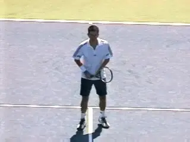

**Watch Henman's perfect unit turn and positioning of the hitting
arm.**

We can thank Tim Henman for giving us a virtually perfect example of
this critical first move, how the hitting arm is positioned, and the
shape. Look at this animation filmed in the warmup of the Canadian Open
in Montreal.

Watch how the outside foot turns until it points sideways at a 45 degree
angle. Simultaneously the upper body starts to rotate. Note that as this
rotation starts, he keeps both hands on the racket. After the hands
separate, the body continues to turn until it reaches a 45 degree angle
to the net, roughly the same as the outside foot. The left arm also
points across the body at a similar angle.

If you've read the articles on preparation on the forehand in the
Advanced Tennis section, you'll realize that this is basically a
segment of the same unitary preparation as on the forehand groundstroke.
[link](Common%20Elements%20Across%20the%20Grip%20Styles.docx)
Rather than the shoulders and feet turning 90 degrees plus, they turn
roughly half as far.

Now look at the virtually perfect example of the hitting arm shape. The
bottom or base of the "U" is parallel to the court. The upper arm and
the racket are at about a 45 degree angle to the base.

Not the position of the racket in relation to the torso. The plane of
the racket face is positioned at roughly the edge of the front shoulder.
The unit turn has positioned it here with very little additional arm
movement.

**The Forward Swing**

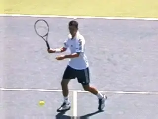

**The forward swing with the shoulder driving the hitting arm shape.**

So what happens next? Watch that from this position there is a small
additional backswing to change the direction of the racket. In my
experience, this happens naturally. It's not something the player has
to do consciously.

The player needs to know where the racket should be at the critical
moments. On the forehand volley, these are the complete of the
preparation, the contact, and the end of the forward motion of the
hitting arm shape. If you have clear images and checkpoints of these
positions, the body will connect the dots. This is why players who try
to physically model a backswing on the volley usually end up with far
too large a motion.

**Contact**

Watch how the rear shoulder drives the motion to the contact. **The
hand, arm and racket rotate forward through the motion as a
unit.** ***In essence the palm of the hand and the
shoulder are pushing the racket face to the contact.*** **[The critical
point is that the hitting arm shape stays constant.]**

There is a lot of discussion about players and coaches about "early
contact" on the volley. If a player really understands how to use the
hand and shoulder to drive the racket, the positioning of the contact
tends to take care of itself.

Watch that the hitting arm structure moves forward roughly a foot or a
foot and half. So the contact is slightly in front. But too much
emphasis on early contact can be a negative because it causes players to
extend the arm from the elbow and lose the hitting arm shape.

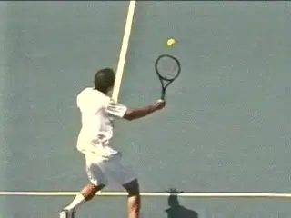

**Another look at how the hitting arm retains its shape moving through
contact.**

**Other Angles**

Let's see the movement of the hitting arm in the forward swing from
another angle looking at a Pete Sampras volley, filmed from behind. Note
that Pete has achieved the same elements we just looked at in the
preparation phase. These are the unit turn and the creation of the
hitting arm position in the shape of the open "U." The racket edge is
again around the edge of the front shoulder.

Now watch again what happens. As the hand, hitting arm, and shoulder
rotate forward as a unit, the racket is pushed forward to the contact by
the palm of the hand.

**[The hitting arm shape has remained in tact,]** as we saw with
the Henman volley. [Note how simple, minimal and compact this forward
motion truly is.]

Now look at the angle of the wrist. It has remained laid back so the
palm can push the racket head forward. Again, this places the contact
point slightly in front of the front edge of the body. From this angle
you can see how the forward motion is slightly circular, with the hand
racket and arm moving on a curve or an arc from the shoulder.

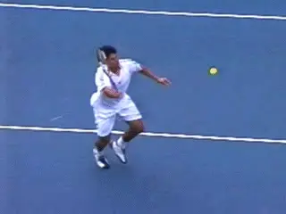

**The finish for the hitting arm position with the butt of the racket
pointing off the front leg.**

Now look at the isolation of the same movement from yet another angle in
the animation of Taylor Dent. Look at the perfect construction of the
hitting arm position. **Watch the shoulder start to rotate forward,
driving this shape to the contact.**

This critical core movement is very brief, subtle and hard to see, even
with the high speed video. This is in my opinion why the shot is
misunderstood. But the structure of the hitting arm and how it is driven
through the shot are the absolute central components in learning to hit
a technically sound forehand volley.

Watch how the integrity of the shape is maintained through the hit. The
rotation of the shoulder drives the hitting arm forward. There is no
internal movement in the hitting arm and the shape of the "U' remains
unchanged.

From this side view we can see a great checkpoint for maintaining this
structure and the pushing motion all the way through the critical part
of the motion. Look at the butt of the racket and note how it butt
points just past or in front of the edge of the front leg. This forms
the final checkpoint to master in developing the core motion.

**[THE 3 KEY POSITIONS FROM 3 DIFFERENT VIEWS]**

Turn                                                                                                                                                                         Contact                                                                                                                                                                         Finish
![A person playing tennis Description automatically generated with medium                                                                                                       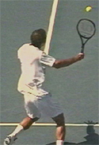

![A person playing tennis Description automatically                                                                                                                 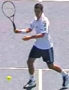

![A person playing tennis Description automatically generated with medium                                                                                                       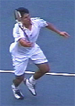

**Traditional Phrases**

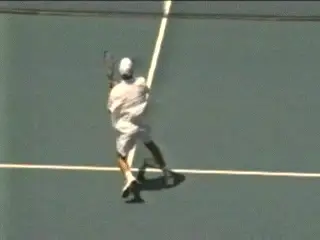

**Terms like "Punch" and "Firm Wrist" don't correspond with how the
volley is actually hit.**

Once we understand the shape and the motion of the hitting arm, we can
see why the traditional teaching descriptions of the forehand volley
don't make sense. The idea that the volley is a "punch" creates the
belief that the key motion is to straighten out the arm and extend it
forward from the elbow.

This destroys the integrity of the hitting arm shape. The arm now forms
a straight line rather than an open "U." The idea of simply extending
the arm in a punch also tends to take the push or the rotation of the
back shoulder out of the shot. In my opinion, you couldn't think of a
better phrase than "punch" to make sure you'll never execute the
actual technical elements of a good forehand volley.

There are similar problems with the second major teaching idea--"keep
the wrist firm." **As we can see the wrist is actually laid slightly
back.** This is a fundamental aspect of creating
the open "U" shape. **It's what allows the player to make contact
slightly in front with the racket face more or less square to the
ball.**

**[Without this laid back wrist position, the ball will get past the
front edge of the body and the contact will be late.]** If that
happens, yes, you better keep your wrist firm--really firm. You'll
need to be quite tense to compensate for the flaws in your motion and in
your timing that created the late contact.

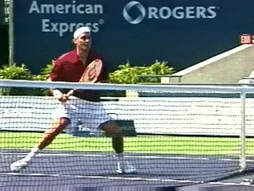

**But how do we account for the wild range of forehand volley
variations?**

**Not That Simple**

So is that really all there is to it? If it's that simple why haven't
more people picked up on the hitting arm concept and why don't players
and coaches notice it when they watch the top players? Doesn' it seem
that there is often a lot more backswing and a lot more followthrough on
many or most volleys than in the examples I've given?

What about the way the forearm rotates or supinates backwards before the
forward swing--especially with the bigger backswings--and then forward
into the shot? Doesn't the wrist break and come forward on many
forehand volleys? What about when the ball is super high or super low?

What about underspin? Doesn't the angle and shape of the arm and racket
change during the forward swing to create spin? Doesn't the racket face
slide under the ball and open up during and after the contact? How do
you account for all of these factors in the theory of the hitting arm
shape?

All of the above questions and comments are valid. Actually they don't
invalidate or contradict the role of the basic elements I've
identified. But the focus on the complexities are a major source of the
difficulties most people have trying to develop the volley. So go back
the sequence photos and master the three key positions with the check
points. Then watch the magic start to happen.

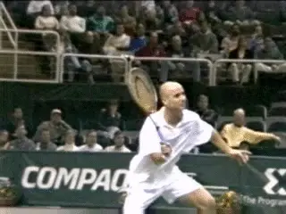

**The 3 key positions: Turn, Contact, Finish**

As I said at the beginning, there is probably more variation in the
actual swing shapes in the volley than in any other shot. Bill Mountford
has already written an excellent article for TPA that outlines
many of these specific differences used situationally by all the top
players. ([link](http://www.tennisplayer.net/members/tour_strokes/bill_mountford/modern_volley/modern_volley.html).)

These complexities and variations are what we are going to look at
closely in the upcoming articles. We'll see how the hitting arm
position expands and contracts, how it rotates backwards and forwards,
what happens with different ball heights, and spins, how the shape of
the swing changes, and more, including the many footwork variations,
some including split steps and some not.

But in looking through this forest, let's not lose site of what all the
trees have in common. We've identified a magic core dimension in this
motion, and you can use it build a rock solid forehand volley at any
level of play. Work on that and Stay Tuned!

John Yandell is widely acknowledged as one of the leading videographers
and students of the modern game of professional tennis. His high speed
filming for Advanced Tennis and TPA have provided new visual
resources that have changed the way the game is studied and understood
by both players and coaches. He has done personal video analysis for
hundreds of high level competitive players, including Justine
Henin-Hardenne, Taylor Dent and John McEnroe, among others.

In addition to his role as Editor of TPA he is the author of
the critically acclaimed book Visual Tennis. The John Yandell Tennis
School is located in San Francisco, California.
