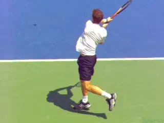
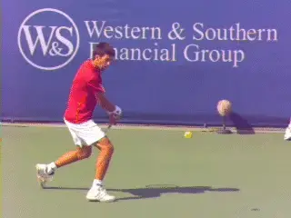
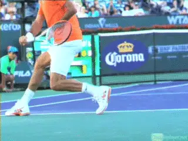
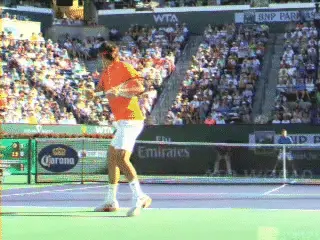
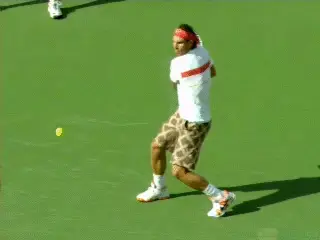

# The myth of the Recovery Step:

# Backhand

# John Yandell

In the last article we saw the sequencing of the recovery step on the
forehand in pro tennis. Contrary to some coaching theories, the outside
foot does not swing around as part of the stroke, instead happening
after the completion of the extension of the forward swing. ([link](The%20myth%20of%20the%20Recovery%20Step%20-%20Forehand.docx).)

Now let's look at the recovery step the pro backhand, both the
one-hander and the two. High video shows that despite important
differences in the stances, the sequences are similar.

**The sequence of the backhand recovery step is fundamentally similar to
the forehand.**

The recovery step is not part of the stroke. It follows the completion
of the forward swing. If anything, the recovery step can be less
pronounced on the backhands.

**"Advanced" Footwork**

Again, this conclusion is counter to one school of "advanced" coaching
which argues that court coverage and even shotmaking are enhanced by
throwing the recovery foot around as part of the motion in the stroke.

A friend I used to hit with was working with a pro in the Bay Area who
was a big proponent of this "early pro timing" recovery step. That pro
thought he saw the top players dramatically speeding the body rotation
by throwing the recovery step around.

His thinking was extreme. He believed that even for a 4.0 player like my
friend the body should be completely open to the net at the completion
of the forward swing--and, of course, "ready" to recover faster.

**The actual sequence: forward swing to extension with the recovery foot
still well behind-- only then swinging around to the outside.**

My friend had adopted this "advanced" footwork on his one-handed
backhand. His backhand was clearly his weaker side before, and after the
change, he would occasionally produce a shot that seemed to have more
velocity. But the reality was his backhand was much worse and had become
phenomenally inconsistent.

Nevertheless, as with so many players, my friend was oblivious to actual
results. He was completely enamored with his use of what he thought was
"pro" technique.

**Reality**

So what is the reality for the pros my friend thought he was emulating?
How does the recovery step work on high level backhands?

The answer is simple for anyone who takes the time to study high speed
video frame by frame. As with the forehand, the recovery foot stays in
the position dictated by the stance until after the extension of the
forward swing.

Watch in the animation how the players reach the outward and upward
completion of the motion. Now as the racket starts to move backwards in
the wrap on the final deceleration phase, the rear foot starts to move
around.

**[The sequence is forward swing, recovery step. And from there the
player pushes off with the recovery step to return toward the center of
the court. Again, forward swing, recovery step, and then movement back
toward the center.]**

**The Rear Foot**

Despite this general principle there are also some differences to
understand between forehands and backhand. First, the spacing or width
of the recovery step to the outside is often less on the backhands.

**The closed stance with the rear recovery foot behind can mean the
recovery step itself lands less to the player's side.**

The reason is related to the differences in the stances. On the forehand
the players are usually hitting with open stances and the recovery foot
is the outside or left foot closest to the ball.

On high level men's backhands, however, we have seen that the preferred
stance is closed stance, created with a large diagonal cross step.

This is true for the two-hander, ([link](https://www.tennisplayer.net/members/avancedtennis/john_yandell/modern_backhand_stances/two_hander/))
and for the one-hander as well. ([link](https://www.tennisplayer.net/members/avancedtennis/john_yandell/modern_backhand_stances/one_hander/).)
In both cases with the closed stance, the recovery foot is now the foot
furthest from the ball, significantly behind the position of the front
foot.

This means the distance between the feet is typically wider than on a
forehand. To swing around, the rear foot actually comes from up to
several feet further away.

That can mean the actual length of the recovery step is longer. But
because of where it starts the landing point is often less to the
outside and closer to the player's body, or even in line with the front
foot.

**The Kick Back**

In addition to the exact positioning of the recovery step, another
important difference to understand is the relationship between the rear
foot and the body rotation. We saw on the forehand that the recovery
foot can actually kick slightly backwards before coming around.

**This kick back can be more extreme on the backhand. This is due to the
differences in the positioning of the shoulders at contact.**

**The rear foot can move backwards-sometimes substantially-- in order
to control the amount and timing of the body rotation.**

As we have seen, at contact on the forehand the shoulders and hips are
usually open or parallel to the net. But the shoulder positions at
contact on pro backhands are more closed.

On the pro one-hander the hips and shoulders are roughly perpendicular
to the net at contact. That's 90 degrees or so less rotation than the
forehands.

On the pro two-hander the angle of the shoulders is about 45 degrees to
the net. That's about half the rotation of the forehand.

In both cases, early movement of the recover step opens the shoulders
too much too soon and destroys this alignment. This explains why there
is sometimes more pronounced backward motion with the recovery step.

**By keeping the rear foot behind and/or kicking it backwards, players
slow or reduce the body rotation helping create the proper, more closed
alignments at contact.**

**Destruction**

All this makes the idea of swinging the recovery foot around on the
backhand a worse idea even than on the forehand. Why, because it is more
disruptive of the proper sequence of the body rotation. Ironically, in
the attempt to add "advanced" elements to your game you can actually
end up destroying the core elements in your strokes.

**On the open stance backhand, the recovery step pattern is more similar
to the forehand.**

**Open Stance**

Although most high level backhands are hit closed stance, the open
stance is used strategically and situationally by both one-handers and
two handers. For open stance backhands, the same basic timing of the
recovery step applies.

The recovery step starts at the completion of the forward swing as the
racket moves into the wrap or final deceleration phase. But the pattern
is probably more similar to the open stance forehand, because the
recovery foot is now the outside foot closest to the ball.

In general, the principles are clear across the pro ground strokes.
Coaches and players can be fooled by the movements of top players in
real time. They can also be fooled by video, such as the ubiquitous you
tube clips, that don't allow frame by frame advance. Still these clips
are posted endlessly on messages boards to "support" stroke analysis
when what they really show may be something totally different than what
is claimed.

If you are working on your footwork, including the critical aspect of
recovery, make sure you video yourself and take a close look at the
sequence of the motion, including the all critical extension of the
swing. That's the way to maximize not only your shot production but
your ability to cover the court as rapidly and efficiently as possible!

John Yandell is widely acknowledged as one of the leading videographers
and students of the modern game of professional tennis. His high speed
filming for Advanced Tennis and TPA have provided new visual
resources that have changed the way the game is studied and understood
by both players and coaches. He has done personal video analysis for
hundreds of high level competitive players, including Justine
Henin-Hardenne, Taylor Dent and John McEnroe, among others.

In addition to his role as Editor of TPA he is the author of
the critically acclaimed book Visual Tennis. The John Yandell Tennis
School is located in San Francisco, California.
