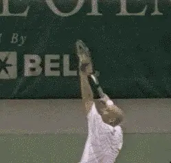
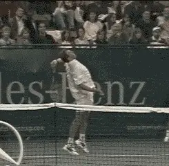
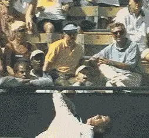
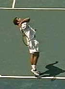
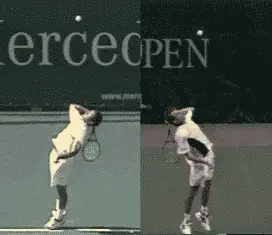
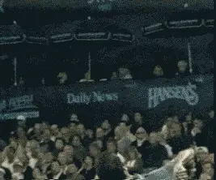
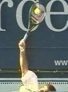

# The Myth of the Wrist: The Serve

# John Yandell

If I were to identify the single most common piece of technical advice
on the serve-and possibly the world's most common "tennis tip," it
would be "snap your wrist" to get power and spin.

**Belief in the wrist snap is a common myth. In reality it has nothing
to do with the bio-mechanics of the swing path on the serve.**

It might be familiar advice, and thousands of recreational players may
try it everyday, but Advanced Tennis high speed digital video shows that
the "wrist snap" is a myth. In reality the role of the wrist is
"passive," and the emphasis on wrist snap obscures the true
bio-mechanical keys to developing a sound swing path on the serve.

When coaches talk about the alleged action of the wrist on the serve,
they describe it in two ways. First, as a "snap" in which the wrist
breaks forward in the so-called "wave bye bye" motion.

Second, they describe it as a "carving" motion in which the wrist
moves the racquet head around the side of the ball to impart slice.

High speed video shows that neither is an accurate description of what
actually happens to the wrist in the service motion of the best players.

There is no wrist "snap" at contact. Any forward movement of the wrist
occurs long after the ball is off the racquet.

As for the idea of "carving" around the side of the ball, that
doesn't happen either. With the ball on the strings for only 1/250 of a
second, there's no way the racquet could move substantially, much less
trace a path partially around the circumference of the ball.

In reality, the front edge of the racquet is moving the other way
(slightly backward) as part of the pronation of the hitting arm.

**The human eye confuses what sometimes happens after contact, with what
actually causes the hit. The result? The Myth of the Wrist Snap.**

When I say the wrist snap is a myth, I am not claiming there is no
movement of the wrist whatsoever in the serving motion. It's just that
this movement is not a causative factor.

The wrist definitely moves slightly upward as the racquet moves up to
contact. Sometimes it appears to move slightly from left to right (for a
right hander) during or after contact, but other times this sideways
movement is absent. It sometimes (but not always) moves or breaks
forward after contact.

A player like Marat Safin has little or no forward movement after
contact. Greg Rusedksi sometimes has a radical forward movement of the
wrist in the followthrough, but other times none at all. Sampras is
somewhere in between. Sometimes his wrist breaks slightly forward, but
sometimes it doesn't.

For all these players, the forward motion of the wrist, if and when it
does occur, is a reaction to the hitting motion, not the cause.

It also appears that these various wrist movements are not something
players are doing consciously or through specific muscle contractions.
Instead they seem to be the natural consequence of other core elements
in the motion.

Far from being the key to power and spin, then, the role of the wrist in
the serve appears to be passive. It plays virtually no role in creating
a great swing path and good ball contact, and the attempt to emphasize
the wrist in the hitting action is misguided and counterproductive.
***As one well-known national coach puts it: the wrist is along for
the ride.***

No significant wrist action at contact on the serve? How could that be?
Before you call up your personal teaching professional and berate him
for misleading you all these years, realize one thing-it's not really
his fault! This is because no pro-or any other human being-has actually
ever seen the moment of contact on the serve, or any other stroke. The
event lasts only about 4 milliseconds, or 1/250 of a second-much too
fast an event for the human eye to resolve clearly.

**Rotating the body is another source of stable power. Again, the
racquet head remains in a fixed position.**

So where does the widespread belief in the wrist snap come from? We
can't see the contact point with the naked eye. But what we do see
somewhat more clearly is what happens a few milliseconds later, when the
motion has started to slow down. We can see the wrist has changed
position, sometimes rather radically. What we can't see is that this
change didn't happen during contact with the ball.

If you watch a lot of high level serving either on TV or in person,
it's easy to conclude that the wrist "snaps" forward. In the motion
of Greg Rusedski, for example, the angle between the wrist and the
racquet can change by 90 degrees or more on some serves.

But this is where the Advanced Tennis high speed video is critical to
understand the actual sequence of events. Filmed at 250 frames per
second, we can see the snap at contact is an illusion, happening well
out into the followthrough and long after the ball has left the strings.

If this change in angle between the racquet and the arm happens after
the contact, it can't be a causal factor in the motion. If it was a
causal factor, we would see it in the serves of all the top players
most, if not all of the time.

***There is no doubt that the arm and hand action in the service
motion is by far the most complex of all the
strokes.*** As we have seen (Myth of the Wrist,
Forehand), on the forehand, all top players establish a hitting arm
position before contact that is basically unchanged until well after the
ball is off the strings. The same is true on the backhand side, and on
the volleys also.

It's different on the serve. The position of the hand, forearm, and
upper arm all change relative to each other from the start of the upward
swing to the ball until well after the ball has left the strings and the
followthrough is almost complete.

So, if the wrist snap isn't the secret, what are the real keys to this
complex motion and to developing a high quality technical swing pattern?
We can identify three elements that are shared by virtually all the top
servers.

**Pete Sampras**

**Note the nearly identical position of the racquet to the body at the completion of the racquet drop. Click on the player's photo to study high speed video of the entire motion from this camera position.**

**[The first is the position of the racquet at the completion of the
racquet drop. The second the triceps extension that straightens out the
arm as it moves upward to contact. The third is the internal rotation of
the hitting arm.]**

Let's take a close look at the actual pattern of the swing on the serve
and see the role of all of these elements, including what actually
happens to the wrist in the motions of Pete Sampras, Greg Rusedski,
Marat Safin, and Andre Agassi--4 players who at first glance may appear
to have widely divergent technical patterns.

Let's start with the first critical bio-mechanical element: the
position of the racquet in relationship to the body at the completion of
the racquet drop.

Despite all their differences--the shape of the backswing, the height
of the toss, the timing of the motion, the depth of knee bend, the level
of body rotation--all four players reach the bottom of the racquet drop
with the racquet in virtually the same position relative to the body.

**This position is with the racquet along the side of, and
perpendicular to, the plane of the torso. There is absolutely no such
thing as a "back scratch" position.** Instead the
racquet falls along the side of the server's body. Note, all four
players achieve this with a relatively low elbow position. That is, the
upper arm is parallel to or close to parallel with the plane of the
shoulders.

**Despite the many differences in their motions, Sampras and Rusedski
share the 3 key elements of racquet drop, triceps extension, and
internal arm rotation.**

The average player may or may not have the flexibility to model this
position exactly, and may need a higher elbow position in order to
develop a full drop. There is no doubt, however, that achieving the
fullest possible drop with the lowest possible elbow position is the
most fundamental key in developing a good motion.

***From the racquet drop position, the player is now ready to start
the motion upward and forward to the ball. This motion has two parts.
The first is the triceps extension. At the drop, the hitting arm is bent
at the elbow at around 90 degrees. Through a contraction of the triceps
muscles, the player begins to straighten his arm and move it upward
toward contact, until it becomes fully extended (i.e., straight) at the
contact point itself.***

***When the arm is about half way to full extension, the hand,
racquet, forearm, and upper arm also begin to rotate from left to right
(again for a righthander). This is the third factor in the swing
pattern. This internal rotating motion is often referred to by the
technical term "pronation." At the time of the contact, the hitting
arm and the racquet are rotating as a unit from the shoulder, a motion
that continues well out into the follow through.***

One of the liveliest debates in coaching in recent years has been over
the role of pronation, particularly the extreme or fully "pronated"
position in the followthrough. This position can appear quite extreme in
a player such as Sampras, causing some players and coaches to stress the
post contact rotation as a key to good serving.

In reality, the continuation of the arm rotation is a consequence of the
way the player moves the hand, arm, and racquet to the ball. This
movement pattern is the key to the swing path. The post contact
pronation, like the movement of the wrist, is a consequence and not a
cause.

Although the motion from the drop to the contact is complex, we can
actually boil it down to a single key. A few years ago at a coaching
convention when I was presenting some high speed video of Sampras's arm
action, a teaching pro in the audience stood up and said: "It's like
giving the ball a 'high five' with a continental grip."

I didn't get the pro's name, and I hope he emails in if he's reading
this article, because I'd like to give him full credit for this
description, which is virtually a perfect analogy.

From the racquet drop, the player should attempt to give the ball a
"high five" with the palm of his racquet hand. With the continental
serving grip, this will take the racquet head directly on the correct
path to the ball and cause the player to make contact at an angle that
will maximize both power and spin.

We can see here what the problem is with both of the wrist snap
analogies introduced at the beginning of the article, and why both have
such a negative impact. The attempt to execute either will actually
disrupt or prevent the proper execution of the real swing path to the
ball.

Trying the "wave bye bye" snap will encourage the player to rotate the
arm too early in order to get the hand in position to "snap" directly
forward. Trying to "carve" around the side of the ball will prevent
the player from rotating at all.

So where does all this leave the wrist? And how do we account for the
actual motion of the wrist we observe in the video? Let's look how the
position of the wrist changes over the course of the motion from the
racquet drop to the contact and then out in the followthrough.

**The complex, but passive wrist movement in the serve of Pete Sampras,
before, during and after contact.**

First, at the drop, we can see the wrist naturally falls into a slightly
laid back position. In order for the arm to straighten out fully, the
wrist has to come forward so that the palm of the hand is in line with
the rest of the arm and can rotate as a unit from the shoulder.

This happens in the last few frames before contact, as the video shows.
Is this evidence of a "snap"? I don't think this is what we are
seeing. If there were a conscious "snap" we would see this forward
motion continue at the contact and directly afterwards. We would see
some version of the "wave bye bye" position right after contact. But
we don't. I've been asked at coaching presentations if it's possible
that contact with the ball might be stopping the "snap" from
continuing.

It's a great question, but I don't think so. Try it yourself. Toss a
ball in the air and hit it forward by snapping your wrist forward with
the "wave bye bye" motion. The force of the contact isn't nearly
enough to prevent you from breaking your wrist forward as you strike the
ball.

And notice one more thing. The ball went down! Many bio-mechanical
researchers have established that the racquet head is moving upward at
contact. This would be very difficult to achieve if, on every serve,
players were really trying to snap the wrist forward. An error in timing
of only thousandths of a second would cause the ball to bounce on the
server's side of the net!

So this slight movement in the wrist on the way up isn't the start of a
snap. It just brings the racquet in line with the arm in preparation for
contact. Is it caused by even a slight muscle contraction? Probably not.
More likely it's the natural result of the triceps extension and the
arm rotation in the movement from the racquet drop to the ball.

Which brings us to what may be the most important point about the wrist.
It may not "snap," but that doesn't mean it should be stiff! We all
know that the great servers look relaxed and effortless. To maximize the
racquet head acceleration from the drop to the contact, the whole arm
needs to be as loose as possible and that includes the wrist. This
relaxation, I believe, helps explains any motion we do see in the wrist
either during or after contact.

Look closely at the animation of Pete's wrist action above and you'll
see this in the sideways, left to right movement that seems to happen
just after the contact. It's what bio-mechanists call "ulnar
deviation." You can feel this for yourself if you go to the racquet
drop position with the palm of your hand. Now with an imaginary
continental grip, give an imaginary ball an imaginary "high five."
Watch (and feel) what your wrist does. It won't snap forward, but it
will naturally flex a little from left to right.

Now try it again and continue the motion with an imaginary
followthrough. Watch again (and feel) how after the wrist moves left to
right, it will then move or "break" slightly forward. If your wrist is
loose, you won't be able to stop either of these motions from
happening.

This explains the wrist motion we see in the service motion of the top
players. Their arms are relaxed and their wrists naturally move as a
consequence of their technical swing pattern. The amount and type of
wrist motion we see in these servers also seems to be related to the
type and location of the serve. For example, when Sampras goes wide in
the deuce court, or when Rusedski goes wide in the ad, both seem to show
more sideways wrist motion.

Pete Sampras

**Click on the player to study high speed video of the arm action in the serve.**

When they go down the middle, there tends to be more forward break after
the hit. This makes perfect sense in terms of the slight changes in
racquet trajectory and the relative amounts of sidespin versus topspin
the players put into these different deliveries. In all cases though,
their motions are built on the three keys of racquet drop, arm
extension, and internal arm rotation.

As I said, these issues of how the hand, arm, racquet, and wrist move on
the service motion are complex, impossible to see with the naked eye,
and difficult to analyze and describe. So I've included some additional
high speed digital movies of the four players I've discussed. Check
them out for yourself and see whether you agree or disagree about the
role of the wrist and the key elements in the swing path on the serve.

John Yandell is widely acknowledged as one of the leading videographers
and students of the modern game of professional tennis. His high speed
filming for Advanced Tennis and TPA have provided new visual
resources that have changed the way the game is studied and understood
by both players and coaches. He has done personal video analysis for
hundreds of high level competitive players, including Justine
Henin-Hardenne, Taylor Dent and John McEnroe, among others.

In addition to his role as Editor of TPA he is the author of
the critically acclaimed book Visual Tennis. The John Yandell Tennis
School is located in San Francisco, California.

---

<!-- prevnext-nav -->
[← Read](the-myth-of-the-wrap.md)  |  [Advanced Tennis Index](index.md)  |  [Read →](myth-of-the-wrist-the-backhand.md)
