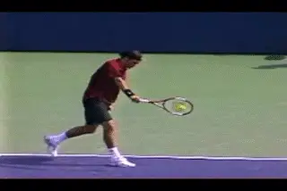
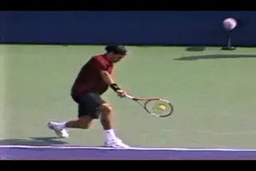
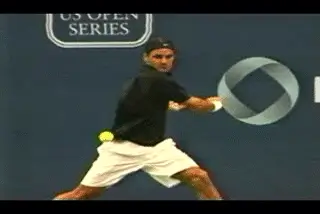
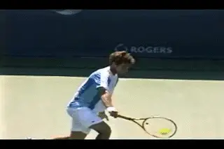
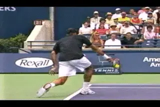
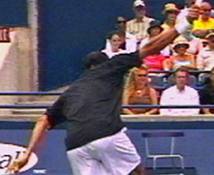
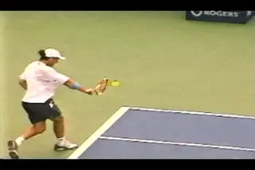
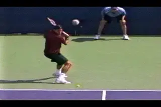
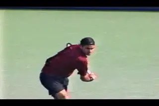
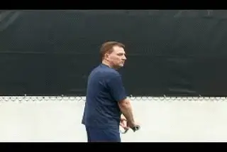

# The One Handed Topspin Backhand-Hand and Arm Rotation

**The One-Handed Topspin Backhand**

**Hand and Arm Rotation**

**John Yandell**

In the previous articles we have covered a lot of territory in our
understanding of the one-handed backhand, including the core elements of
the stroke, the stances, and the differences between the classical and
extreme styles. ([link](The%20One%20Handed%20Topspin%20Backhand-Hitting%20Stances.docx).)

Now let's move on to one final element. This is hand and arm rotation.
The rotation of the hand, arm, and racket are critical in understanding
the forehand, as we have seen. But they are also a basic, if less
extreme factor, in the one-hander.

**Watch the racket face turn over and the difference in where it
points.**

What do we mean by hand and arm rotation? We mean the internal rotation
of the hitting arm from the shoulder, and also, the rotation of the
forearm during the forward swing. The result is the clockwise rotation
of the racket head during the contact.

**The hand and arm and turn over as a unit with the racket facing the
net.**

When it comes to the forehand, the wide range and varying degrees of
hand and arm rotation is one of the most complex and confusing elements
to understand. ([link](http://www.tennisplayer.net/members/avancedtennis/john_yandell/building%20_the_modern%20_forehand/key_differences_grip_styles/key_differences_grip_styles_page4.html).)

This rotation is less extreme and harder to observe in the one-handed
backhand. But it is still an important factor, especially in generating
spin. The great modern players one-handed players can use this increased
rotation to add additional topspin to virtually any ball they hit.

You can see this in the first Federer animation above. Roger is hitting
two similar balls from the same position in the court. On the first ball
he comes through with a classic finish and the racket on edge. But on
the second ball he rotates the hand and racket over much faster so that
the strings are actually facing the opponent when he reaches the finish.

Watch the more extreme rotation again, isolated in the second animation.
***The hand, arm and racket are turning over as a unit as Roger goes
from the contact to the followthrough. So how does this element fit into
the game of the top players and how should the average player utilize it
at lower levels?***

**The hand and racket comes through with less rotation on flatter
shots.**

When we think of the classic one-handed drive, we think of the racket
coming through with the racket edge close perpendicular to the net at
the finish. ***[If you watch closely as the hitting arm moves through
the hit, you'll see that there actually is some rotation of the hand
and arm in the classic on edge finish.]*** It's subtle and
usually limited to about 45 degrees or so. But if you look for it, you
can see that it's there.

**Rotation Variations**

Once you know what you are looking for, you can also find plenty of
examples of shots hit by one-handers where there is less rotation than
on the classic finish.

On these balls, the racket never reaching a vertical angle to the court.
Instead the tip and shaft stay at about a 45 degree angle well out into
the followthrough. Typically you see this on balls that are hit
significantly flatter. You see it when players are on the run. You also
see it quite frequently on drive returns.

Players with extreme grips like Gustavo Kuerten can use this finish on
high balls. Even when the ball is well above waist level, Guga is able
to hit through the shot with little hand rotation and tremendous pace.

**More players are using more rotation more often.**

So there is actually a variety of hand and arm rotation on the
one-handed backhand in the modern game. There is a classic version and a
flatter version, and a more extreme version. But increasingly you see
the top players using the more extreme version more often, rotating the
hand and racket face more, and doing this on more and more balls.

The purpose of this additional rotation is analogous to what we saw on
the forehand. It allows players to increase topspin by making the path
of the racket head slightly steeper just before the contact. It's
possible that it may also contribute to overall racket head speed.

We saw in our analysis of the forehand that the racket head can rotate
up to 180 degrees, or even more. We also saw that one of the things that
makes Federer's forehand special is the degree and the variety of this
rotation. We are now seeing a similar range of variation on the backhand
side.

As with the forehand, if we learn to recognize the position of the
racket face at the most extended point in the followthrough, it's a
good indicator of how much the hand and arm have rotated, as well as an
indicator of the total amount of spin a player has hit on a given ball.

**The Rotation Mechanism**

***So how does it work on the backhand? This rotation is generated
from the shoulder, but also from the forearm. The upper arm rotates in
the shoulder socket, and the forearm rotates from the elbow. This means
that there are two components in this rotation, and that there is some
internal play in the hitting arm from the elbow downward as the hand
turns over.***

**Watch the additional rotation on the second backhand, as indicated by
the position of the Swoosh.**

This use of the forearm allows the player to rotate the racket further
than would be possible from the shoulder alone. It's actually similar
to the rotation of the arm on the serve, which comes partially from the
shoulder and partially from the forearm, as the racket moves upward
through the hit and out into the followthrough.

As noted, this effect is less extreme on the one handed backhand than on
the serve or the forehand. This makes it more difficult to recognize
and/or gauge with the naked eye, or even at times when looking at video.

We saw that the rotation is about 45 degrees in the classic finish. In
the more extreme version it's probably a maximum of about 90 degrees.
But if you look closely it's clear. Take a look at the two Federer
backhands to the right, again similar balls hit from similar positions
on the court. The first backhand is a classic finish and the second one
has the extreme rotation.

Watch the Nike swoosh on Federer's sweatband at the end of the
animation. In the first backhand, it's not really visible because it
still faces upward. On the second backhand the arm rotates until the
Swoosh is visible. So in the second video the Swoosh rotated further.
Rather than stopping when it was pointing upward at the sky at contact,
it continued rotating until it was pointing at the side fence.

Try it yourself and see that the forearm is rotating over around 90
degrees in the course of this motion, about twice as much as in the
classic finish. If you look at the stills below, you can see the
difference not only in the position of the Swoosh, but in the angle of
the hand to the court.

**A closer look: note the position of the Swoosh in the second still, but also the angle of the hand--the difference is the increased rotation.**

**Is It the Wrist?**

Notice when I said hand and arm rotation I didn't say "wrist." It's
important if you want to experiment with this factor to understand how
it is really generated.

**When the wrist releases after the hit, the tip of the racket tilts
forward.**

With a one-handed backhand grip, whether classical or extreme, the wrist
is naturally laid back when part of the hand rotates to the top of the
frame during the grip change. Because the entire arm turns over, the
wrist turns over as part of this unitary movement. But this is not an
independent movement. It's part of the larger rotation.

Yes, because of the secondary rotation of the forearm, the hand and
wrist may turn over further than the upper arm. But the position of the
wrist relative to the forearm and the racket doesn't change during the
contact.

After the hit, you can definitely see the wrist flex forward on some
balls. This is more likely to happen when the rotation is sudden and
more extreme. You can see it in the Gaudio animation--the wrist
releases and the tip of the racket tilts forward at an angle of up to
about 45 degrees.

***[But look closely and see how this happens after the contact as the
racket moves outward into the followthrough. This is again similar to
the serve. The release of the wrist occurs after the contact as a result
of the forces of the swing.]***

**Incredible elevation, with the hand and arm rotating as a
unit--before the wrap.**

**The Wrap**

In our previous analysis we saw that on more basic backhand drives the
elbow sometimes relaxes and bends backwards when the racket moves from
the followthrough into the wrap phase. ([link](The%20One%20Handed%20Topspin%20Backhand-The%20Forward%20Swing.docx).)
This same wrapping effect is probably as common or more common when the
hand and arm rotation are increased.

Take a look at the incredible animation of Federer elevating off the
court to hit a topspin backhand on a shoulder high ball. (Warning: Do
Not Try This at Home.) Watch the extreme hand and arm rotation which
undoubtedly contributes to his ability to generate spin. You can see
that the elbow bends and moves substantially backwards. It all happens
really fast and the wrap can appear to be part of the forward hitting
motion. (For more on the Myth of the Wrap, [link](http://www.tennisplayer.net/members/avancedtennis/john_yandell/the_myth/the_myth_of_the_wrap_images/the_myth_of_the_wrap.html).)

**But look closely at when all this really happens. Watch the hand and
racket rotate, but notice that as they rotate the arm stays straight all
the way through the extension of the forward swing. The forces generated
by the rotation probably help account for the exaggerated wrap, but this
again falls into the category of consequence rather than
cause.**

**On low balls, extreme rotation can lead to an earlier bend in the
elbow.**

**The Exception**

**[In other extreme cases, however, the elbow can bend earlier, before
the racket reaches full extension. This is usually on low balls, when
the upward component of the swing is especially fast, undoubtedly
increased by the additional hand and arm rotation.]**

In these cases the rotation from the forearm probably gets ahead of the
upper arm rotation, and just takes over the brushing action. Since the
arm isn't (or shouldn't be) totally rigid, the elbow naturally bends.
You can see this effect on occasion with most of the one-handed players,
but be careful about trying this one at home as well. It's the
exception, not the norm.

**The Implications**

Federer's amazing backhand acrobatics aside, what are the practical
implications here, if any? I think they are significant for players at
all levels--as important as hand and arm rotation on the forehand, and
maybe at times even more so.

**Why? Because it is more difficult to generate substantial topspin on
the one-handed backhand. Too many club players are obsessed with topspin
for its own sake. They end up hitting shorter looping balls, or using
extreme grips that aren't warranted by their natural pace or the types
of balls they have to hit, because they think topspin in and of itself
is the goal.**

**Rotate the hand and racket as a unit finishing at eye level with the
strings facing the net.**

***[But there are legitimate instances where mastery of this factor of
hand and arm rotation can make a difference in the effectiveness of your
one-hander. The first is in the creation of short angles, especially on
passing shots. The second is creating spin on low balls to hit up over
the net and/or hit deep looping replies. A third is to control fast high
bouncing balls. Another is to hit topspin lobs.]***

Players who want to develop this should experiment first in controlled
drill, ideally with a teaching pro or on a ball machine. Don't just
read the article and assume you can make it work in your next match.

***Visualize rotating everything as a unit. Be careful not to lose the
integrity of the straight hitting arm. Finish at eye level as with the
classic finish, then stop and check where the face of the strings point.
They should face the net at the extension of the swing with hitting arm
still straight.***

Work specifically on the short angles, and then on dealing with low and
high balls, and varying the heights of your replies. Use targets. If you
develop hand and arm rotation progressively, you can add an important
dimension to your one-hander that can make a difference in your
competitive outcomes.

So that's it for our one-handed series. I learned a lot in creating it,
and I hope you did as well. We'll be doing some condensed summaries of
the key points in all the multi-part Advanced Tennis articles in the
future, forehand, both backhands, serve, etc. In the meantime, let us
know what you think in the Forum.

John Yandell is widely acknowledged as one of the leading videographers
and students of the modern game of professional tennis. His high speed
filming for Advanced Tennis and TPA have provided new visual
resources that have changed the way the game is studied and understood
by both players and coaches. He has done personal video analysis for
hundreds of high level competitive players, including Justine
Henin-Hardenne, Taylor Dent and John McEnroe, among others.

In addition to his role as Editor of TPA he is the author of
the critically acclaimed book Visual Tennis. The John Yandell Tennis
School is located in San Francisco, California.
