# 3D Technologies and Analysis - The serve wind up

**3D Technologies and Analysis:**

**The Serve Wind Up**

**Dr. Brian Gordon**

Last month I introduced a technology and a computer interface that shows
how we incorporate 3D measurement and analysis into player development
[(Click
here)](3D%20Technologies%20and%20Analysis%20-%20an%20Introduction.docx).
This on court coaching application goes a step beyond the previous uses
of quantitative technology, which have been primarily in academic
research. I believe it represents the future of tennis coaching.

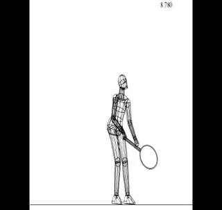

**What does 3D analysis tell us about the first phase of the serve?**

The implications and potential benefits of quantitative data are vast.
If you had a chance to examine the dimensions of the interface in the
first article, I hope you were intrigued by the scope of the information
now available to evaluate stroke mechanics. ([link](3D%20Technologies%20and%20Analysis%20-%20an%20Introduction.docx).)

**[The question however is what it all means. Vast amounts of new
information can be overwhelming. It can leave the student and coach
wondering where to start. I know because I have spent the last several
years wrestling with the issue as I integrated this powerful new tool
into my coaching practice.]**

Starting this month, I hope to remove some of the potential confusion
that surrounds an applied 3D approach. We'll do this by beginning to
break apart the components of the data presentation, and see how they
apply to an actual player. **[We'll start with the serve. This article
represents the first in a four part series on what is arguably the most
important stroke in tennis.]**

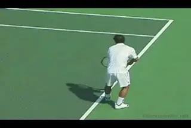

**What are the optimum angles of the key body positions at the end of
Phase 1?**

**Four Phases of the Serve**

**The serve in my view is made up of four phases: the wind up, the
back swing, the upward swing, and the follow
through.** You can see these phases in the computer
interface if you select "Racquet Speed Data" under data options. As
the animation is played, the 4 phases of the swing are displayed.

In this first article I will focus exclusively on the first phase: the
wind up. We'll discuss the nature of the wind up, and then present some
target measurements we use to evaluate players. These targets are
expressed as the angles of key body positions at the conclusion of the
wind up. Based on our research, they are optimum values that can be used
to measure the effectiveness of each phase. What I want to demonstrate
is how the parts of the motion contribute to the establishment of these
key measurements.\
\
Before we start, a brief warning. It is important to realize that one of
the most important findings in our quantitative work is that there is no
"perfect" way to execute any tennis stroke. It's just more complex
than that.

**[4 Phases:]**
  1. Wind Up

  2. Back Swing

  3. Upward Swing

  4. Follow Through

This conclusion may be disappointing for those seeking the "silver
bullet" solution to the serve, or any other stroke problem. But that's
reality. The good news is that our results can point to a variety of
paths for players to develop effective strokes based on their
preferences and capabilities, as well as their stroke patterns at the
beginning of our program.

The coaching strategy we use is to tailor stroke components to the
physical capabilities of individual students. This, of course, requires
knowledge of those capabilities. And 3D technology and research does not
provide information about player capabilities. This is where the
judgment and experience of the coach still plays the critical role.

But the technology does provide unparalleled information about the other
critical factors: objective information about the stroke components that
are currently being used, combined with an understanding of the various
options and their implications.

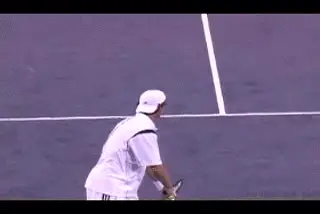

**The wind up: from the separation of the hands to the beginning of the
racquet drop.**

Assessing how to apply this information, given the capabilities of a
given player, is where the process transits from science to art in the
hands of the coach. It's important to understand that the science
itself doesn't blindly dictate what should happen. It just provides a
new perspective to help in that process. The application of this
information is still based on the creative and intuitive decisions made
by coaches and players themselves.

**A Beginning**

And so we begin the discussion of the serve and of the main issues
confronting coaches and players as revealed by the quantitative data. To
the extent possible, this will be done in the context of the data
accessible through the provided interface, using a young junior
tournament player as our example.

Only by getting your hands dirty with the provided data will you be able
to follow the intricacies of the discussion, and form your own theories
which may well be different from mine. I'm hoping that you'll share
whatever thoughts you have with me about this in the Forum.

**Phase 1: The Wind Up**

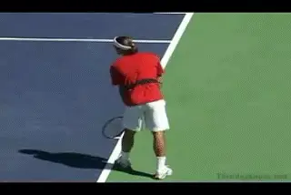

**The end of the wind up usually corresponds with the beginning of the
leg drive.**

**In our definition, the wind up starts as the tossing hand and/or
ball separate from the racquet. It concludes when the racquet starts to
drop into the back swing loop.**

Determining the end of the wind up can be somewhat subjective but is
normally visually obvious when seen from multiple viewpoints. Among
servers with good mechanics, we have found that the end of the wind up
coincides exactly with initiation of the leg drive.

So what is the big deal about the wind up? Great servers use a wide
range of wind ups and still deliver pro level effectiveness. Why devote
a whole article to a serve phase that seemingly has little to do with
the end result of the motion?

**[The answer is that the wind up sets the table for critical motions
later in the swing. As a result, the motions during the wind up, and
particularly the positions and angles attained at the end of the wind
up, can make or break the entire service motion, affecting all the
components.]**

These components include: the arm and racquet path, the foot and leg
work, and the position of the body. So let's look at each of those in
some detail, and how they are related to the first phase of the motion.

**A pendulum wind up with the racket tracing the circumference of the
circle.**

**Arm and Racquet Path**

To understand how we view the arm and racket path, take a close look at
the stick figure animation in the interface. Turn the racquet path on
using the "Path" button. This highlights the racquet motion and
defines the racquet path progression.

Using the side view of our junior player (the left stick figure), we can
see that he uses a traditional pendulum windup. This means the racket
essentially traces the circumference of a circle as it moves down and
then backwards and upwards in the wind up.

So is that good? Our experience has been that a pendulum motion is
beneficial in giving the player the time needed for the segmental
positioning of the body and for weight transfer--critical factors that
we measure at the end of the wind up phase.

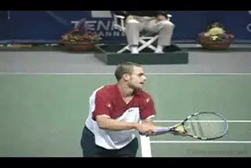

**Roddick: the extreme example of an abbreviated windup.**

Based on our database of Division 1 college players, the wind up
typically accounts for about 60 % of the total swing time for high level
servers. How does our player stack up here? He's pretty much dead on
track. By clicking on "Stroke Phase Statistics" we can see that his
wind up accounts for 58 % of the total swing time. A traditional
pendulum wind up creates a racquet path length that is about 150 - 200 %
of the standing height of the server.

These percentage values are obviously somewhat variable. They are not
absolutes. But if a large path value is combined with a small time value
it can indicate an abnormally fast progression with a pendulum windup,
which may cause problems later on.

But we know that the pendulum windup is only one possible variation. In
pro tennis, few players have full pendulum motions. Most use some
version of an abbreviated wind up style. The most extreme example here
is Andy Roddick.

We said the length of a classic pendulum wind up is somewhere in the
range of 150 % to 200 % of the height of the server. When this
measurement falls to 100 % or less, we can definitely say that the
player is using an abbreviated style. The abbreviated style, has gained
popularity based on the success of Roddick and is highly advocated in
some coaching circles.

But what do the differences in wind up style really mean? Is there an
advantage to one style or the other? Biomechanical research has
indicated that there is actually not a significant difference between
the two styles in two critical dimensions. Research done on players in
Olympic competition found that that contact racquet speed and the loads
on the hitting arm joints are not really affected by the wind up style.

**[So does wind up style matter? Yes. The reason is that the different
styles tend to produce significantly different body positions at the
conclusion of the wind up, and in some of the key values we measure.
With the abbreviated wind up, the elbow tends to be lower, the forearm
tends to point towards the hitting side of the body, and the racquet
tends to be positioned to the hitting side of the body.]**

These are not minor differences. They can profoundly affect the
transition to the second phase of the serve or the back swing. Although
it would be getting ahead of the story to go into too much detail now,
the differences in the wind up can alter the organization of the joint
rotations that generate racquet speed in the upward swing.

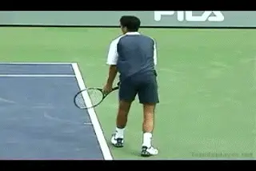

**Different wind ups can complicate the integration of leg drive and
body rotation.**

Further, the differences in wind up styles can complicate the
integration of the leg drive with upper body motion. Many players
seeking to imitate the pros may actually create more problems for
themselves than they solve if they are not able to master the more
difficult aspects of the abbreviated wind ups. We'll see the
implications of this to both joint rotation and leg drive in upcoming
installments.

**The Backswing Transition: Continuous versus Hesitation**

If we look at "Racquet Speed Data" option for our junior player, we
can see one additional wind up attribute that requires close
consideration. This factor is actually independent of the various
potential shapes of the backswing. This is racquet head speed as the
racquet transits out of the wind up into the backswing.

Does the racket hesitate and lose speed, or is the transition continuous
with the racket head speed continuing to build?

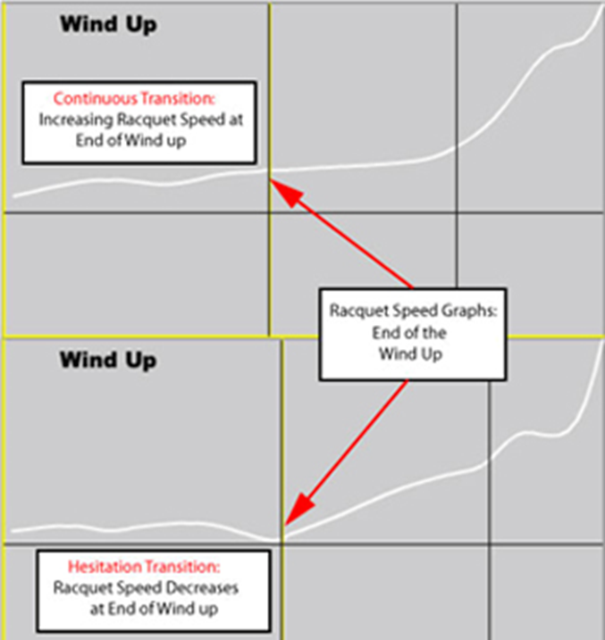

*Video demonstration — the original video for this article was hosted on TennisPlayer.net.*
**[Two transitions: one with increasing, the other decreasing racket head speed.]**

Put another way: is there a slow down, or even pause or a hesitation, or
is this transition continuous? We see both variations in the serves of
high level as well as developing players. ***Some have a continuous
transition, others have what I call a hesitation
transition.***

When servers demonstrate a clear decrease in racquet speed towards the
end of the wind up, is this a significant problem? The answer can be yes
or no. There is an apparent benefit to the continuous transition because
it means some additional racquet speed as the server enters the back
swing.

But we have found that the continuous transition actually increases the
difficulty of coordinating the leg drive with the racquet progression
especially in younger developing players. Again, more on these pluses
and minuses as our series unfolds.

**Leg and Foot Motion**

Leg and foot motion is another subject that has received much attention
in tennis literature. Previous quantitative studies looked at the forces
received from the ground (ground reaction force) during the leg drive of
serves hit with "foot up" and "foot back" techniques.

One study found that when the legs were closer together this ground
reaction force possessed a larger vertical component. When the legs were
further apart, the horizontal component was larger. Intuitively this
makes sense, as if asked to jump for maximum height, most athletes will
naturally position their feet in close proximity.

**All things being equal, the foot position affects the direction of the groundforce**.
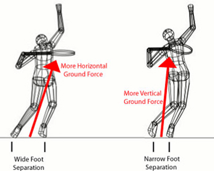

*Video demonstration — the original video for this article was hosted on TennisPlayer.net.*

In reality the amount of horizontal and vertical ground force is more
complex than that. Certainly there is no simple correlation when we look
at pro players. Some of the players that get highest off the ground use
wide platform stances, while some of the players who barely leave the
court use some version of the pinpoint.

However, there is an important underlying point here that explains the
apparent contradiction shown by the pros. Research shows that there is
going a relatively larger vertical component in the ground force when
the feet are closer together.

The height off the court a player attains, however, is dependent on the
overall size of the vertical component. This is influenced by the
strength of the leg push. So more leg push, even with a more
horizontally oriented ground force, could still end up generating
greater height off the ground. The point is that the effects of the leg
drive can be manipulated by adjustments in the width of the stance, and
the type of stance, as we'll see below.

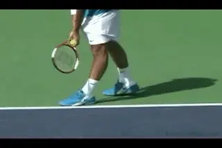

**Federer uses a wide Platform and Roddick uses a Narrow.**

**Stance Terminology**

The "foot up" and "foot back" terminology corresponds roughly to the
common coaching terminology of "pinpoint" and "platform" stances,
and this is the terminology I'll use. To be clear I'll refer to any
serve where back foot movement occurs as "pinpoint" and any serve
where no back foot movement occurs as "platform". This distinction
between pinpoint and platform holds regardless of the relative distance
between the feet.

**[But the platform stance has to be subdivided into narrow and wide
designations, depending on the distance between the feet.]** By
this designation, both Roger Federer (wide) and Andy Roddick (narrow)
are platform servers.

Similarly with the pinpoint stance, there are two different types. The
foot slides in both cases, but how far and where? One version is what we
can call the standard pinpoint where the back foot is placed directly
behind the front. The second is the lateral pinpoint where the back foot
is placed to the hitting side (perhaps even slightly forward of) front
foot. Again this tends to influence the body's segmental positioning at
the end of the wind up.

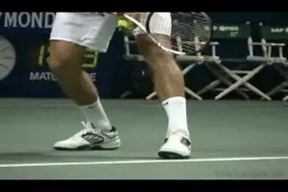

*Video demonstration — the original video for this article was hosted on TennisPlayer.net.*

**Max Mirni uses a Standard Pinpoint. Marat Safin uses a Lateral
Pinpoint.**

Looking at the stick figure, it is clear that our player has a platform
stance. This stance has already been modified as a result of his work in
our program. The feeling of our coaching staff was that our player
needed more beneficial leg drive, and that his more extreme platform
stance may have been limiting that, so we experimented with moving the
back foot closer up in his starting stance.

You can see the change by comparing his initial numbers to the current
values. In the interface select "Compare Trials" and the date
"081906." The difference in the stick figures shows the adjustment
made in his stance.

Interestingly, initially our player lowered the peak vertical force from
his leg drive. So while we succeeded in making the ground force more
vertical, this subject did not push as hard with his legs as he did
before. This phenomenon was later reversed as he became more accustomed
to the narrower stance. What was apparent immediately in this stance
adjustment was the change in the pattern or direction of vertical force,
which was higher overall during his leg push in the next phase of the
motion, the back swing.

You can see this by selecting "Angular Momentum Graphs" and in the
"Data Display Options" selecting "Vertical Ground Reaction Force."
Clearly, the blue line (081906) was higher in the middle of the leg push
indicating a burst of stronger drive. However, the green line (111106)
was higher at the beginning and end of the leg push indicating
improvement in the overall quality of the drive in creating beneficial
vertical ground force.

**Center of Mass**

The forward position of body mass at the completion of the windup is a
key characteristic of the performance servers that provide our model
data base.

When we looked at the data on our player, we felt that the stance
adjustment would also help him achieve this. In fact, having the feet
closer together accomplishes this task by definition, but it also allows
the body to lean forward more by the end of the wind up. Again the
result was successful as you can see if you go to "Enter Table Mode",
"Center of Mass Position Data." Note the horizontal location
difference in line one of the table. This line reports the horizontal
distance between the center of mass and the front foot. For our player
it moved forward by four inches which is a very significant change.

I should note that both the increased vertical ground reaction force
goal and the more forward center of mass could have actually been
accomplished (and perhaps even enhanced in the center of mass case) by
converting our player to a pinpoint stance.

There are two reasons we didn' t go in this direction with this player.
One reason was the added complexity that sliding the foot adds,
especially with a young player who already has a platform stance. The
second, less obvious reason relates to the working conditions of the leg
muscles that create the leg drive.

**Leg drive force refers to the cumulative effect that the muscles
have in pushing against the ground.** Earlier I
mentioned this as one of the main factors determining the size of the
vertical ground force. ***The muscles have properties that allow them
to generate more force in certain conditions than in others. These
conditions can be created by various footwork and leg
strategies.***

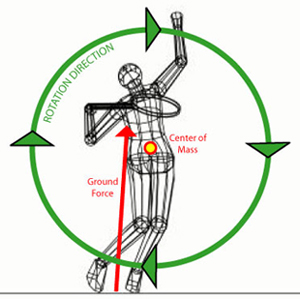

*Video demonstration — the original video for this article was hosted on TennisPlayer.net.*
**To maximize body rotation and angular momentum, players must direct the ground force behind the center of mass.**

**One way to enhance this force is through what we call a "counter
movement."** What that means in this case is the
timing of the straightening or extension of the knees following the
bend. ***[The knee bend is the counter movement to the straightening of
the legs that follows.]***

This is typically produced most easily with a platform stance. ***[The
platform stance allows the extension muscles to generate more force
because of the timing of the bend: a fast lengthening contraction of
these muscles during the knee bend, is followed immediately by the
shortening contraction during knee straightening.]*** It is
significantly more difficult to achieve this benefit from use of a
pinpoint stance because the knees typically flex much earlier (prior to
the foot slide) and remain flexed for a longer duration.

**Angular Momentum**

So, as I said, the leg drive, the direction of the ground reaction force
and the position of the body center of mass are factors that set up what
happens next in the serve. Combined they have a critical effect on body
rotation. Or more technically they have an effect on body angular
momentum. This is because angular momentum is proportional to the speed
of body rotation.

**[To maximize forward angular momentum, the player has to maximize the
leg drive and the creation of ground reaction force. But equally
important, the player has to direct this ground reaction force as far as
possible BEHIND the center of mass of the body.]**

Most of this forward angular momentum is generated during the back
swing. But some of it can be generated in the wind up through
manipulation of the footwork and leg motion. For this reason, footwork
is important during the wind up to establish preparation for later
phases of the serve. We have found the pinpoint stances are the most
effective in generating this. It is not uncommon for pinpoint servers to
generate at least 20 %of their total forward angular momentum during the
wind up.

By contrast, the narrow platform is least effective in producing forward
angular momentum, with the wide platform in between. This comparison can
be seen directly in the example player data in the "Compare Trials"
page. Again enter the "Table Mode" and select "Angular Momentum
Data" in the "Data Display Options" menu. As expected, narrowing the
stance decreased the amount of forward angular momentum generated during
the wind up from 15.3 % to 11.8 %of the maximum value. This is shown on
the second line of the table.

**It is important to note that each footwork option has relative
advantages and disadvantages dictating that the approach used is based
on specific needs of a given individual.** The main
footwork approaches and their relative success in accomplishing the
covered mechanical goals are summarized in the table.

**Stance Variations and Key Components**
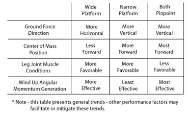

From this table you might conclude that the pinpoint stances are
superior because they tend to produce favorable results in 3 categories.
These are directing the ground force vertically, moving the center of
mass forward, and generating angular momentum. By contrast the platform
stances tend to be favorable in directing the ground force vertically
(narrow), and in creating the leg joint and muscles conditions described
above.

But we have to remember that this table represents what is happening
only at the conclusion of the wind up, which is the first of the 4
Phases of the motion. It is simply descriptive of what is happening with
certain factors at the end of the first stage of the serve. What a
player gains in Phase 1 may or may not be outweighed by other factors
operating in the later phases. We'll see how the relative advantages of
both stances play out in greater detail when we progress to Phases 2
through 4.

**Again there are no simple yes or no answers here. Depending on the
player, the more favorable leg drive conditions of the platform stance
may or may not outweigh the advantages of the pinpoint in positioning
the center of mass, and creating angular momentum in the initial phase
of the motion.**

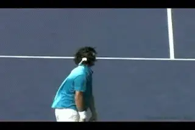

*Video demonstration — the original video for this article was hosted on TennisPlayer.net.*

**The arm to trunk goal is a minimum angle of 80 degrees.**

**Key Body Positions**

So now we get to the actual payoff of all our work understanding the
wind up factors. Let's look at the key body positions and the angles at
the end of the windup.

All of the body actions and motions we've been looking at lead to
important body and segment positions. These positions are important
because the success of the rest of the motion depends on them. The list
provided is by no means exhaustive, but does contain those of greatest
diagnostic power in my experience.

The key positions are expressed as angles. They can be accessed through
the "Data Options" menu in the "Joint/Segment Angles" section.
Values for measurements are shown in bar and table form and a graphic of
the angle shown is drawn on the best view of the players stick figure in
the graph legend section.

**Upper Arm To Trunk**

The upper arm to trunk angle is an indicator of the ease of future
timing between the leg drive and upper body (particularly the hitting
arm and racquet) motion. As I will discuss in the back swing article,
very specific joint rotations are required in the back swing loop.

These rotations are most effective if the elbow is elevated to a certain
level as they are initiated. The goal value of 80 degrees represents our
experience of the minimum level of this elevation. Our junior player
exhibits an angle less than 80 degrees indicating he must first elevate
the elbow with shoulder abduction/flexion prior to entering the
productive portion of the back swing loop. You may recall that that a
low elbow position is often, but not necessarily, associated with an
abbreviated back swing.

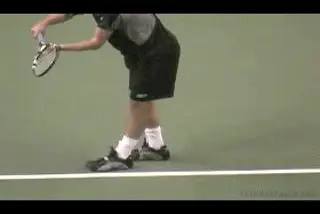

*Video demonstration — the original video for this article was hosted on TennisPlayer.net.*

**Knee bend angles can range from 90 to 120 degrees.**

**Front Knee Angle**

We use flexion of the knees as an indicator of overall leg joint
preparation for the leg drive. Further, our experience has been it is
easiest for students to focus attention on the front knee. Aside from
the leg drive factors already discussed, the extent of flexion prior to
extension determines leg drive effectiveness through range of motion
manipulation.

The knee bend value is very dependent on individual strength but we have
established a goal value of 110 degrees. This means the angle between
the upper and lower leg is 110 degrees at the bottom of the knee bend.

Values between 90 and 120 are common. But more is not always better
here, as excessive flexion can decrease leg drive due to muscle length
and leverage disadvantages. It is important that the angle at the end of
the wind up represent the maximum flexion. This can be verified by
selecting "Leg and Trunk Data" in "Data Options" and observing the
bar graph elements that track knee angles.

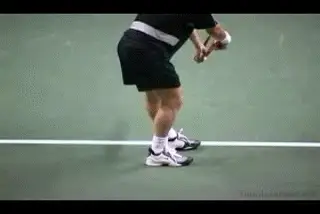

*Video demonstration — the original video for this article was hosted on TennisPlayer.net.*

**The line of the hips to the baseline perpendicular: a minimum 10
degree value.**

**Line of Hips to Baseline**

**The angle of the hips to the baseline is important as an indicator
of the range of motion available for hip rotation in later phases of the
serve.** Our data indicates 10 degrees to the
non-hitting side of a line perpendicular to the baseline is a good
amount. Top players can achieve substantially more. Less angle, or an
angle skewed to the hitting side (ie, with the hips "open" to the net)
point to potential range of motion deficiency.

One cause of reduced hip rotation is the use of the lateral pinpoint
stance in which the rear foot moves to the right of the front foot.
Another is early initiation of hip rotation generally as a result of
premature leg drive. The latter can be verified by selecting "Leg and
Trunk Data" in "Data Options" and observing either the line graph for
hip rotation speed, or the bar graph elements that track the line of the
hips angle.

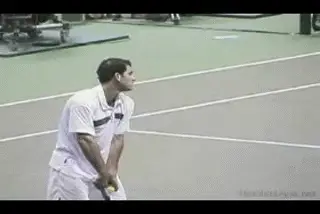

*Video demonstration — the original video for this article was hosted on TennisPlayer.net.*

**Turning the shoulders 20 degrees past perpendicular to the baseline is
a conservative value.**

**Line of Shoulders to Baseline**

**[This angle is also important as an indicator of range of available
motion in rotation. A minimum goal value is 20 degrees to a line
perpendicular to the baseline.]** Values less than the
conservative goal of 20 degrees to the non-hitting side of the baseline
perpendicular are typically caused (and can be verified) by the same
causes as the hip counterpart.

**Particular attention should be placed on this angle relative to the
hip angle.** Having the shoulders rotated more than
the hips is evident in all high level servers and, combined with timing
of the rotation, implies muscular advantage to the muscles that rotate
the upper trunk.

**Backward Lean of the Trunk**

**[The backward lean of the trunk (seen primarily in a side view) is
another attribute observed in nearly all high level servers.]**
**By leaning the trunk back up to 30 degrees**,
**[more rotational range is available for future forward trunk
rotation.]** Also, evidence suggests this position forces the
back knee into flexion, causing extension to occur under more favorable
(slower) muscle contractile conditions. Extreme backward leans should be
avoided as it becomes counter productive to the goal of positioning the
center of mass forward.

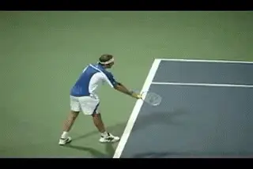

**The backward trunk lean value can be as much as 30 degrees.**

**Lateral Lean of the Trunk**

**Lateral lean of the trunk (seen in a back view) is a natural
consequence of knee flexion.** ***In later phases
of the serve its role is important to twisting rotation of the
trunk.*** **[Pro players can have extreme lateral
lean corresponding largely to the depth of the knee bend.]** As
will be discussed in future articles, lateral pinpoint stances tend to
cause even more extreme leans in the lateral direction.

**[However, at the end of the wind up, for most players this angle
should be kept to a minimum, as extensive lean will interfere with
generation of forward angular momentum.]** For juniors we
recommend a lateral lean of no more than 80 degrees. Some junior
players, including our example player, can tend to greatly exceed the 80
degree goal angle so coaches should be aware of this position.

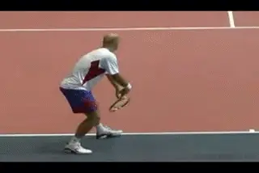

**The lateral lean is the angle of the trunk to the court from the rear
view.**

**Conclusion**

That concludes my description of the serve wind up. You may have noticed
that I described different wind ups, and noted some potential
difficulties involved in the abbreviated motions. When it came to our
junior player, I included some of the decisions we had made based on our
coaching experience, as guided by the data.

But I did not explicitly state the relative superiority of any
technique. The reason is that such statements are impossible to make in
the general sense, and I would not presume to be able to make them. With
few exceptions, any of the positions and techniques I described
represent viable options to wind up execution. The question really is
how well the player has developed conditions for future success at the
completion of the windup, and how his body is positioned by key body
angles.

The good news for those that don't have access to 3D technology is that
most of the wind up options are observable on court with video
technology and the knowledge of what to look for. Observation and
analysis becomes increasingly complicated, however, with regard to the
back swing and upward swing even with 3D technology. But that is where
we are boldly heading in the coming months.

**References:**

The research referenced regarding foot position and ground force was
headed by Dr. Bruce Elliott. Elliott, B.C. and G.A. Wood,  **The
biomechanics of the foot-up and foot-back tennis service techniques,**
Australian Journal of Sports Science 3(2): 3-6.

The research cited comparing attributes of abbreviated versus full back
swings was also headed by Dr. Bruce Elliott. Elliott, B., G. Fleisig, R.
Nichols, and R. Escamilla. 2003. Technique effects on upper limb loading
in the tennis serve. Journal of Science and Medicine in Sport  6(1):
76-87.

Dr. Brian Gordon has changed the understanding of the

Biomechanically Engineered Stroke Technique (BEST) is the

only empirically based stroke mechanics system in the world,

growing from three decades of both academic and applied on

court research. He is a founder of the Tennis Center for

Performance Research in Miami, Florida, which is creating a

new paradigm for player development. The center has assembled

an unprecedented group of specialists with cutting edge

knowledge across the entire range of tennis performance.

To visit his website, [**[Click

Here!]**](https://tennisperformanceresearch.com/)

Top contact him directly, [**[Click

Here!]**](mailto:gamabrian@icloud.com)
