# Developing an ATP Forehand - Part1

**Developing an ATP Forehand:\
Part 1: The Dynamic Slot**

**Brian Gordon, PhD**

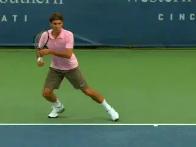

**With the BEST system, anyone can develop the elements of an ATP
forehand.**

In this exclusive series of articles for TPA, I am presenting a
new approach to understanding, learning and teaching tennis. The initial
articles will cover the forehand, specifically our forehand model which
is similar to what you see on the ATP tour. But then they will progress
to the two-handed backhand and the serve as well.

This approach is different than previous teaching systems in a
fundamental way. This is because it is based on years of quantitative
biomechanical research, research that is also combined with extensive on
court work with elite players and coaches.

The on court work has been conducted over the past two years at the Rick
Macci Tennis Academy in Boca Raton, Florida. This on court development,
guided by the quantitative research and analysis, has led to the
development of a teaching system Rick and I call Biomechanically
Engineered Stroke Technique, or the BEST system for short.

This initial series of articles will be an overview, based on coaching
presentations I have done that attempt to simplify and make the BEST
concepts accessible in the wider world of teaching and playing. John
Yandell and I have worked back and forth on this article many times to
present the information in a fashion he feels will be the most
beneficial to TPA subscribers.

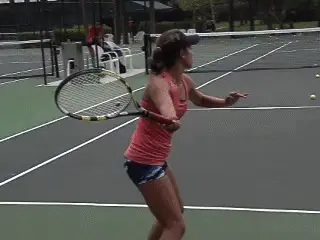

**The first articles will deal with learning implications for players at
all levels.**

I do this with some reservation, however, because these initial articles
will deal more with broad concepts, the conclusions themselves, and the
BEST teaching implications without going into the full biomechanical
research that provides their scientific basis.

That research basis is really the heart of the BEST System and very
important to fully understanding how and why our system works. In a
subsequent series of more technical articles I will be presenting the
research in much greater detail for those who want to delve into science
of biomechanics and understand the mechanical concepts that underlie the
teaching concepts.

In addition to my work, TPA will also be publishing a series of
articles from Rick himself, so subscribers will have the opportunity to
see the approach through the eyes of one of the world's best known
developmental coaches.

**The BEST System**

Development of the BEST system has been a true collaboration with Rick
Macci. Together Rick and I have worked to develop and implement it,
primarily with sectional and nationally ranked juniors, but also with
some pro players at various levels.

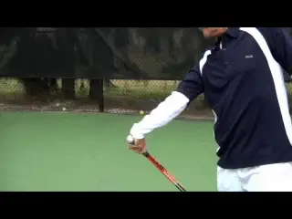

**My collaborator Rick Macci has translated the research conclusions
into teaching progressions.**

My primary role has had two aspects. The first is a definition of a
working model of optimal strokes from the perspective of the
neuromuscular-skeletal system. The second is systematic assessment of
player's development in the system using quantitative 3D analysis.
Rick's contribution has been to use his unparalleled experience as a
developmental coach to transform this information in to on court
teaching progressions.

**The Difference**

It is important to emphasize that the BEST System was developed based on
objective quantitative analysis of hundreds of players over many years.
Specific stroke attributes have been assessed based on their
neuromuscular-skeletal pros and cons in the production of racquet head
velocity. This assessment was conducted without regard to individual
players, but rather through the creation of a massive database.

Although I am not presenting many of the details of the mechanical
concepts in this first series, I do want to stress that assessing the
effectiveness of the BEST system on court is not a matter of theory or
opinion. It is based on quantified data that allows us to track a
player's development and progression toward the model through regular 3D
measurements.

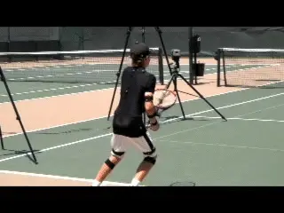

**We use scientific grade 3D technology to measure racquet speed before,
during, and after technical changes.**

If we tell a student that following our interventions will increase
their forehand racquet speed, we are able to demonstrate that this
actually occurs. We know this because we have measured the actual speed
of his racquet before, during, and after the changes.

**Optimizing the Muscular System**

I don't believe that developing advanced technique is entirely a
question of age, or of strength, or even of natural ability. It's a
question of teaching players to optimize the performance of their
muscular systems.

My years of research combined with my current work with Rick have
convinced me that it is possible to teach the BEST System forehand to
everyone we work with. I mean that without exception, including even
boys and girls as young as four years old.

It applies to competitive players at all levels and club players as
well. Using this approach allows any player to literally turbocharge his
forehand, by building a technical foundation skipping many of the
typical developmental steps.

**Too Good to Be True?**

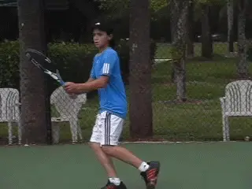

**Developing a pro style forehand isn't a matter of age, strength, or
gender.**

How is this possible? The process involves showing players how to use
their muscles more effectively. This means utilizing neuromuscular
optimization techniques such as elements of the stretch-shorten cycle,
the same elements used by elite players.

The stretch-shorten cycle is a known mechanism in sport science and
training. Generally it means that a muscle used in a given movement is
first forcibly stretched in the opposite direction before it contracts.

Using elements of the stretch-shorten cycle significantly increases the
muscles ability to deliver force. In tennis, that force can be
systematically elicited through technique adaptation.

By establishing certain positions in the forehand motion, players can
trigger stretch-shorten mechanisms automatically. This is why players at
all levels of ability can develop ATP level forehand technique.

**More Compact, More Power**

One of the most fascinating aspects of the research is that this use of
elements of the stretch-shorten cycle means that our forehand involves
less motion not more. The forehand in our system is more compact than
other options and therefore simpler to execute.

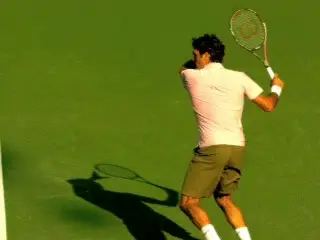

**The ATP forehand model combines less motion with more power.**

This is important given the increasing speed of the sport. As the levels
go up, this more compact motion has a huge advantage---time. In the
supersonic world of the pro game the players with the most power are
also the players who are able to get to the contact most quickly. It may
be a necessity at the highest levels of the pro game, but this
combination of power and timing has incredible advantages for players at
any level.

This is also why we monitor players every 3 months taking 3D
measurements to make sure that when they decrease their range of motion
or size of swing that the positioning of the hitting arm and the
sequencing is correct and hasn't cost players racquet speed, and that
in fact it has caused them to gain.

To say that less motion equals more racquet speed may seem counter
intuitive. But in fact many observers have noted how the top players
with the greatest forehands, especially on the men's side, often have
the most compact motions. Roger Federer is a classic example.

To repeat: what we have discovered is that when the table is set
correctly, less motion actually can equal significantly more racquet
head speed. We consider the ability to teach this to be a significant
coaching breakthrough.

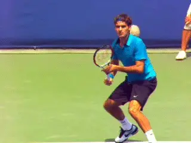

**One of the most explosive forehands with one of the most compact
motions.**

In our forehand, players use elements of the stretch-shorten cycle to
allow key muscle groups to perform more efficiently in the forehand,
simply by adhering to specific positions of the body, hitting arm and
racquet late backswing and early in the forward swing.

These positions and motions also allow players to increase the amount of
independent arm motion in the forward swing, generating significant
additional racket speed.

**Background**

Before we go into detail on how to make all this happen, let's provide
some background on how these concepts were developed. For more than 15
years, I have dedicated myself to researching the biomechanics of tennis
strokes. My goal has been to define optimal stroke patterns.

That statement is based on an underlying assumption---that is there such
a thing as an optimum stroke. And I believe this to be true. Although I
am still in the process of refining the concepts, I think the picture is
becoming increasingly clear.

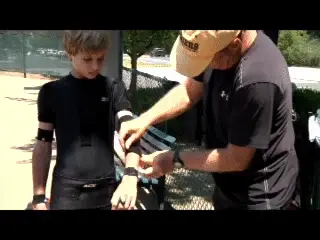

**The BEST system is based on 3D measurements of hundreds of players.**

Over the last decade I have measured hundreds of tennis players with 3D
measurement technology. This has included elite Division 1 college
players, elite juniors of all ages, and pro players at various levels.

How does this technology work? Through a scientific grade system of 10
infrared cameras each filming at 400 frames per second. The cameras
track 60 reflective markers attached to the players using a suit and a
series of elastic bands.

The measurement system is non-invasive, meaning it allows the players to
move around the court unimpaired by cords or wires and produce their
strokes naturally. This is the scientific version of the systems used in
making animated movies and video games.

That's how we capture and compute the 3D real-time data describing the
movement of the human body hitting tennis strokes. Once we capture this
data we then analyze it using custom designed computer software.

The software allows us to calculate the actual 3D position of the
racquet and body at every instant in the stroke. These results in turn
allow us to study the physics of the motion, what is called
biomechanics.

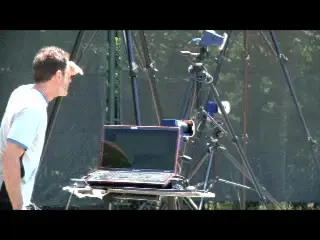

**10 cameras, 60 sensors, 400 frames per second.**

These data allow us to accurately measure the 3D joint angles, the
velocity of the racquet and the body parts, rotational speeds,
accelerations, and even calculate some forces and torques.

In essence it allows us to quantify everything that has an impact on the
production or the quality of the stroke. And again, more about the
research and the data to come.

**The ATP Forehand**

So what has all this research shown us about optimal forehand technique?
It looks similar to what we see in men's pro tennis, what I call the ATP
style forehand.

It was no surprise to me that one critical factor in executing an ATP
style forehand is perfect synchronization of leg drive, trunk rotation,
and hitting arm movement. The surprise was in the details of the
sequencing and positioning.

Entering the forward swing the hitting arm and racquet must be in
exactly the correct position when the trunk rotation starts in order to
gain muscular optimization. If done correctly players will create what I
call the "dynamic slot."

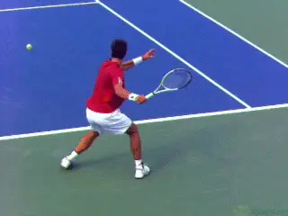

**The ATP forehand: perfect synchronization of leg drive, trunk
rotation, and hitting arm.**

The dynamic slot is a specific, characteristic rotation of the hitting
arm and racket in the early forward swing, in which the racket literally
rotates down and backwards or "flips" over. But this happens
automatically as a characteristic of the previous positions and
movements. This is why we think of it as dynamic.

The idea of "finding the slot" in the forehand is not new. It's common
for players and teaching pros to talk about the racquet finding the slot
with the butt of the racquet pointing at the ball.

But the "dynamic" slot is something entirely different because it
results automatically from a particular series of positions and motions
late in the backswing and in the early part of the forward swing.

What our research shows about the dynamic slot corresponds visually with
what we see in the forehands on the ATP tour. As the high speed video on
TPA demonstrates, the dynamic slot is a core commonality of the
forehands of players including Roger Federer, Novak Djokovic, and Rafael
Nadal. On court, Rick and I have proven that it is also something that
virtually any player can develop for themselves

To create the dynamic slot and achieve this precise synchronization
requires a very precise understanding of the forward swing. I define the
start of the forward swing as the exact instant the hitting hand has
BOTH forward and lateral speed, meaning the first instant it is moving
both forward but also sideways along the baseline.

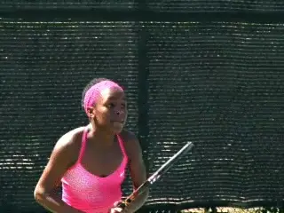

**The Type 1 forehand with a large backswing and the racket pointing
behind the body.**

**Three Types**

Let's see how all this works by studying the prevalent forehand models
in competitive tennis. Without oversimplifying too much it's fair to say
that there are 3 distinct types.

**Type 1**

The Type 1 swing is prominent among junior level players, especially for
younger players and at lower levels. Type 2 is common on the WTA tour.
The Type 3 swing is what you see on the ATP tour and corresponds most
closely to the principles discovered by research that we see in the BEST
system.

At the end of the turns, the positions in all three swings are
relatively similar, although the pro players tend to have better
preparation of the legs with more knee bend, and sometimes better body
turns as well. But when we look at the backswings, and in particular,
the descending portions of the loop (when the hand is moving vertically
downward), we start to see bigger differences between the types.

Junior players using the Type 1 forehand tend to have what we call the
helicopter forehand swing, with a large (and sometimes extremely large)
backswing. In these backswings the racquet typically goes back well
behind the plane of the body defined by the shoulder joints and mid-hip
joint location.

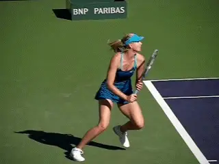

**In the Type 2 swing, common on the WTA tour, the racket points less
far behind the body.**

By that I mean that the tip of the racquet, rather than pointing at the
rear fence is actually pointing behind the player toward the side fence.
In the extreme case, the racquet can be parallel to the baseline and
pointing directly at the sideline.

The elbow also tends to be lower and in close proximity to the torso
during the backswing. The result is that the Type 1 forward swing tends
to be more of a unitary and circular motion, with the trunk and the arm
moving forward together, so that there is little independent motion of
the hitting arm.

This Type 1 racquet positioning is common in junior players, and
especially girls. And this is not a random event. There's a reason the
players do it.

Developing juniors often use as much range of motion (as big a swing) as
they possibly can in an effort to generate racquet speed. So they take
their racquets as far back in the backswing as they possibly can.

This strategy may succeed to some extent in generating racquet speed.
However, as players progress through the higher levels there is an
obvious downside.

This is in terms of the timing. Starting the forward swing from further
away behind the body means traveling a greater distance to reach the
contact point. That simply takes longer.

**Type 2**

Compare this to the Type 2 swing. This is the swing that is prevalent on
the woman's WTA tour.

Generally the lateral component in the backswing is more moderate so
that the racquet head tends not to point as far (laterally) behind the
body. The body preparation and the use of the legs is usually better.

You also see less of a unitary forward swing. Yet you can still see that
even the very top players in the women's game are using length of swing
to generate speed. This type of swing has adverse timing implications,
and these are more apparent at higher levels.

[Another downside is that the lateral component to the backswing
mandates a more circular path. The hand must come from further behind
the body and on more of a curve to reach the contact.]

This means less independent pull through of the hitting arm in the
forward swing. While conducive to generating forward speed of the
racquet, this swing path makes it more difficult to combine the forward
racquet speed with vertical speed for spin. In essence, there is a trade
off between ball speed and spin.

This is why there is no true "heavy ball" in women's tennis, as we see
in the men's game. The positioning of the hitting arm in both the Type 1
and Type 2 forehands simply does not allow players to generate high ball
speed and heavy spin at the same time.

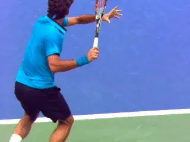

**In the ATP forehand, the arm is on a diagonal with racquet head above
and on the hitting side of the hand.**

This is why the ball speeds in women's tennis can approach or even equal
those of the men. But the spin component is significantly less. As John
Yandell's high speed filming has shown, top women may average 1500rpm on
the forehand, while the men are a minimum of 2500rpm or higher.

**Type 3**

Now let's compare that to the Type 3 swing, or the ATP style of forehand
we see in the men's game. First, notice how in the backswing the elbow
has moved further away from the torso.

[But the most distinct difference is the position of the racquet in
relation to the hand. In the Type 3 swing, the racquet head is on the
hitting side of the hand as the hand starts to move forward. The racquet
head is also above the hand, and the entire arm is extended away from
the body toward the back fence on a slight diagonal skew to the hitting
side.]

This is a critical point to understand. Without even talking about
racquet speed, the obvious advantage here is that this position
significantly decreases the distance to the contact point. [This in turn
decreases the time required. If I have a smaller range of motion and all
else equal, I can get to contact quicker.]

But that is only part of the benefit. The position of the hitting arm
and racquet in the ATP swing means that the [top players are able to
incorporate far more independent arm motion from the shoulder joint in
the forward swing.]

The independent arm motion and the more direct forward path of the hand
optimize the amount and the direction of the force a player can apply to
the racquet grip with his hand. [This is what sets up the ability to use
the stretch-shorten cycle component enhancement in the forward
swing--and to generate the additional racquet speed.]

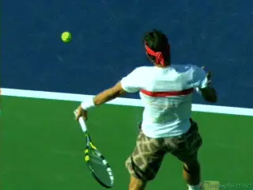

**Watch the more linear path to contact and internal rotation of the
hitting arm structure in the forward swing.**

[By independent arm motion I mean the forward motion from the shoulder,
but also (for a right-hander) the counterclockwise or internal rotation
of the entire hitting arm structure. When executed properly this
independent arm motion significantly contributes to racquet head
velocity.]

A final major advantage of the hitting arm position is that the more
direct arm path for the elbow and hand during the forward swing makes it
easier to pull the arm through the torso rotation. Rather than
approaching the ball on a curve more from the players left, the swing is
more directly forward.

[This facilitates the ability to position the arm further forward at
contact. This forward positioning makes it far easier to isolate and
partition joint rotations for forward racquet head speed and/or vertical
racquet head speed.]

**[This means ball speed and spin can be concurrently optimized. This
combination of rotations is what creates the true "heavy ball". This is
the major technical difference between the forehands on the men's and
women's tour.]**

**Stretch-Shorten Cycle**

Most coaches and players have probably heard of the concept of the
stretch-shorten cycle, as it has often been used--and often
inaccurately---to describe elements of the strokes. But what does that
concept actually mean? And how does it really apply to the forehand?

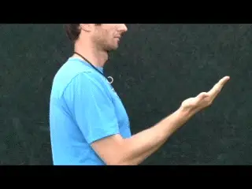

**A simple muscle contraction compared to one enhanced through use of
pre-stretching.**

The stretch-short cycle is a muscle enhancing mechanism in which a
series of events in a motion such as a tennis stroke increases muscular
force production capability. This series of events is usually a
counter-rotation at a joint -- that is to say a joint rotation in one
direction immediately followed by rotation in the other direction.

To better understand this, let's consider a simple example, such as
bending (flexing) the elbow. Typically if you want to bend your elbow,
the brain sends a command to the bicep muscle that crosses the elbow
joint. The biceps muscle in turn shortens or contracts.

This in turn causes the elbow to bend after a brief delay due to command
transmission time. Simple enough.

But let's assume that as you try to bend your elbow, someone else pulls
your forearm in the other direction, causing the elbow to actually
straighten rather than bend. In this event, even though the bicep is
contracting and attempting to shorten, it is actually being forced to
lengthen and/or stretch by the pull in the other direction.

This places the bicep in a very high force state. Technically this state
is known as an eccentric contraction.

Now consider what happens if the person forcing the elbow to extend
suddenly lets go. The bicep can now shorten from this enhanced state,
generating significantly more force. This sequence of events constitutes
a stretch-shorten cycle.

I will go into more technical detail about individual force enhancing
components of the stretch-shorten and the exact mechanisms used on the
forehand in future articles. But for now, suffice it to say, the
components of the stretch shorten cycle greatly enhance a muscle's
ability to generate contractile strength.

**Muscular Enhancement in the Type 3 Forehand**

This same principle of muscular enhancement through the use of elements
of the stretch shorten cycle is the cornerstone of the Type 3 or ATP
style forehand. It also forms the foundation of technique development in
the BEST System.

Let's see how this muscle enhancement functions in the use of
independent arm motion and the creation of the dynamic slot and in the
forward swing. This is the secret to turbocharging your forehand.

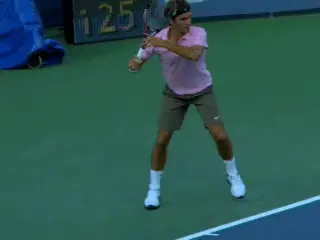

**The hitting arm on a diagonal, with the racket head above and to the
right of the hitting hand.**

Recall that in the type 3 forehand that the elbow is elevated and away
from the torso and in line with the shoulders.

Note that the hitting hand is slightly to the hitting side of the elbow
and the racquet head is slightly to the hitting side of the hand, and
that it is also above the hand.

The result of this positioning is to extend the combined mass of the
hitting arm and racquet away from (behind) the shoulder joint at the
completion of the backswing.

The line of the arm is also on a slight diagonal away from the torso.
This extended position is in stark contrast to the positions in the Type
1 and 2 forehands where the hand and racquet are laterally behind or
close to the torso.

This positioning means that when the leg drive, hip rotation, and upper
trunk rotation sequence is initiated, a force is exerted on the arm at
the shoulder joint. Due to the position of the arm and racket and the
mass distribution this creates, the arm tends to lag slightly behind.

**[As it lags, it is applying an eccentric or counter stretch to the
shoulder muscles similar to what we saw in the elbow bend example. These
are the muscles that are about to be used to pull the arm forward in the
forward swing.]**

**[[The body's response is to contract these shoulder muscles to counter
the lag.] The result is the creation of elements of the
stretch-shorten cycle.]**

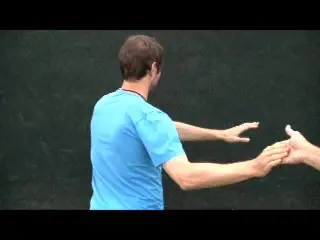

**Holding back the arm demonstrates how the sling shot is created.**

The effect off all this on the swing is powerful and results in the
creation of what I sometimes called the sling shot effect. You can feel
how this works by (gently) holding a player's arm back as the torso
rotates, and then releasing the arm once a stretch is established.

To this point in the motion, we have the racquet and the arm extended
away from the torso on a slight diagonal with the racquet head above and
to the outside of the hand. We have seen the trunk rotation creates the
lag in the arm/racquet structure and this in turn eccentrically
stretches the shoulder muscles.

Now to initiate the forward swing the player starts to pull the grip of
the racquet forward. This pull with the hand creates a forward and
slightly lateral force applied to the end or grip of the racquet.

The size and direction of the puling force is important and a combined
effect of torso (hip and upper trunk) rotation and independent forward
arm motion from the shoulder joint -- arm motion that has been enhanced
as just described.

**The Flip**

The pulling force on the grip in turn creates what we call the "flip,"
or the backward racquet rotation. The flip happens because the force
generated by the pull on the grip actually causes the racket to rotate
in the opposite direction -- **[downwards and backwards to the
non-hitting side of the hand.]**

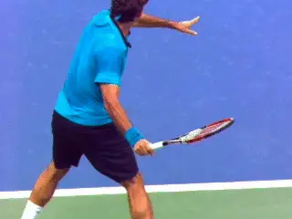

**As the hand starts to pull forward, the flip creates the dynamic
slot.**

This flip motion is what creates the dynamic slot. The dynamic slot is
created automatically when the rotation or flip of the racquet causes
counter-rotation of key hitting arm joints early in the forward swing.

I say counter-rotations because these flip driven joint rotations are in
a direction opposite to the rotations of the same joints later in the
forward swing (near contact). For example, racquet rotation in the
dynamic slot causes the upper arm to rotate backward (external shoulder
rotation) prior to being reversed (internal shoulder rotation) near
contact.

**The most critical of these counter-rotations is of the upper arm
(external rotation of the shoulder joint) and, to a lesser extent, the
counter-rotation of the forearm (supination).**

There is a third rotation that is also important for positioning,
although it is not targeted for stretch-shorten enhancement as some
coaches believe**. This is the wrist lay- back (or extension). The
fascinating and complex role of how the wrist actually functions in the
ATP forehand will be detailed in future articles.**

**One More Time**

So let's review the creation of the dynamic slot. When the hand starts
to pull the racquet forward, the rotation or flip of the racquet causes
three things to happen. The upper arm rotates backwards (shoulder
external rotation). The forearm also rotates backwards (forearm
supination). The wrist is also forced into a laid back position (wrist
extension), with this laid back position being more extreme using the
more conservative grips like Federer.

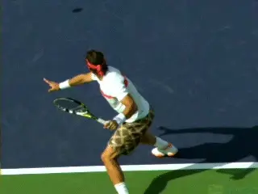

**In an extreme flip the racquet tip can end up pointing down toward the
court.**

If you watch pro forehands in slow motion you can see all these motions
occur to varying degrees depending on the player and exact shot. The
effect is often so drastic that at the end of the flip, the tip of the
racket ends up pointing downward at the court.

And here is the critical point. **The dynamic slot occurs during the
start of the forward swing, not in the back swing. It happens as a
result of the player pulling the grip forward which causes the racquet
to rotate or flip. The flip of the racquet then causes the key arm joint
counter-rotations (most critically, the shoulder external rotation) --
and this is what creates the conditions for muscular enhancement at the
key arm joints.**

It is very important to understand how this happens as a consequence of
the correct positions and motions, and not through the conscious muscle
manipulations of the player. The downward and backward racquet rotation
is causing the joint rotations and NOT the associated muscles.

In fact, the muscles opposing the joint rotations are actually working
(eccentrically stretching) to control the depth of the racquet rotation.
This creates two very positive scenarios. First, this is engaging
elements of the stretch-shorten cycle for muscular enhancement in the
forward swing. Second, the depth of the racquet rotation, critical to
the ball speed/ball spin relationship at contact, simply has to be
controlled rather than manufactured.

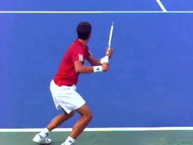

**Players are not robots so the creation of the dynamic slot has
variations.**

By that I mean, with the ATP forehand, producing a more vertical racquet
path in the forward swing (for more spin) is simply done by allowing the
racquet to rotate more in the dynamic slot with minimal change to the
overall motion pattern. By contrast, larger adjustments to the overall
pattern of motions of the body segments must be consciously
"manufactured" to attain the more vertical path with the other types of
forehands. The powerful implications of this will be covered in greater
detail in future articles.

We see individual variations in the dynamic slot because everyone is not
a systematically programmed robot. But the key points are the same.

**[The top players minimize their range of motion and create incredible
racquet head speed with the flip into the slot.]** The
synchronized motion of the hitting arm with the trunk is what creates
the conditions for this "turbocharging" effect.

The fact is that this chain of events to set up the dynamic slot, if
executed correctly, is an eloquent, simple way to utilize muscular
enhancement to maximize racquet head velocity. The most encouraging
thing to us mere mortals is that these optimizations are dependent on
technique -- only not the technique not found in the Type 1 and Type 2
forehands.

**Back to Strength**

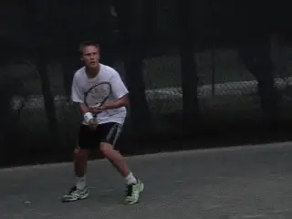

**It requires a process, but any player can make the leap to the ATP
style forehand.**

So let's return to the question of strength. **[Many coaches believe
that if you have a shorter swing, clearly you have to be stronger
because you're accelerating the racquet over a shorter
period.]**

What the data and our experience working with players everyday shows is
that it isn't necessary to be stronger to do this because the primary
mechanism isn't strength. While strength definitely helps, it is
player's ability to optimize the performance of their muscular system
through the very specific positions and actions of the ATP style swing
that is most important.

If it is true that muscle performance optimization through technique is
more important than strength, it follows that virtually anyone can make
the leap from Type 1 to Type 3 directly. Admittedly this is not always
an instantaneous process and needs to be guided through carefully
planned progressions and training, but it is possible and achievable for
virtually any player.

**And One More Time**

Understanding the results of 15 years of research is a lot to take in in
just one article. So let's review what we have learned by looking at the
near perfection of the Type 3 or ATP forehand in the creation of the
dynamic slot from what I consider the clearest perspective, which is
from the rear view.

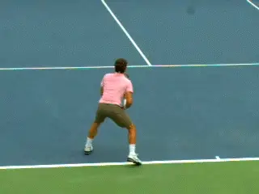

**[The ATP dynamic slot: unit turn, descending loop with hitting arm and
racket positioned to right of hand, the start of the pull, and finally
the flip into the dynamic slot.]**

Watch the full unit turn with both hands on the racquet. Note that
during the unit turn the elbow is perfectly positioned away from the
torso and roughly in line with the shoulders.

Now note the descending part of the loop with the hand moving downward.
The player keeps the elbow elevated and straightens it out to a greater
or slightly less degree.

At the conclusion of the descending portion of the loop note the elbow
is still elevated, the hand is to the hitting side of the elbow, and the
racquet head is above, and to the hitting side of, the hand. The hitting
arm and racquet are on a slight diagonal to the shoulder.

Next watch how the forward movement of the hand initiates the forward
swing. The forward motion of the hand creates a pulling effect or force
applied to the grip of the racquet. This force, in turn causes the
racquet to rotate or flip down and back.

As the racquet rotates, this causes the shoulder to externally rotate or
rotate backwards. The forearm also supinates or rotates backwards.
Finally note how the wrist extends to a laid back position---but as will
be discussed in later articles, not for the reasons held in some
coaching circles.

The slot can only be considered a "dynamic slot" if there are elements
of the stretch-shorten cycle involved. This is why the quality of the
forehand positions can only be assessed through quantitative analysis.
And again more on that later, and how you can have the opportunity to be
measured yourself.

So that's it for part one. Stay tuned for the next article on what
happens next in the forward swing.

In that article we will look at how dynamic slot enhancement affects
racket velocity at contact. Further we will look at how arm geometry, or
the hitting arm positions (double-bend versus straight arm) affect that
enhancement. Finally, we will investigate the final racquet acceleration
to contact, a subject that will come as quite a surprise to many. Should
be interesting!

Dr. Brian Gordon has changed the understanding

technique. His Biomechanically Engineered Stroke

Technique (BEST) is the only empirically based

stroke mechanics system in the world, growing

from three decades of both academic and applied

on court research. He is a founder of the Tennis

Center for Performance Research in Miami,

Florida, which is creating a new paradigm for

player development. The center has assembled an

unprecedented group of specialists with cutting

edge knowledge across the entire range of tennis

performance.

To visit his website, [**Click

Here!**](https://tennisperformanceresearch.com/)

Top contact him directly, [**Click

Here!**](mailto:gamabrian@icloud.com)
