# How to avoid Tennis Injuries | The Physio Movement

**Posted on: Feb 18th, 2019 by thephysiomovement | Categories: [Sports
Medicine &
Nutrition](https://www.thephysiomovement.com.au/category/sports-medicine-nutrition/)**

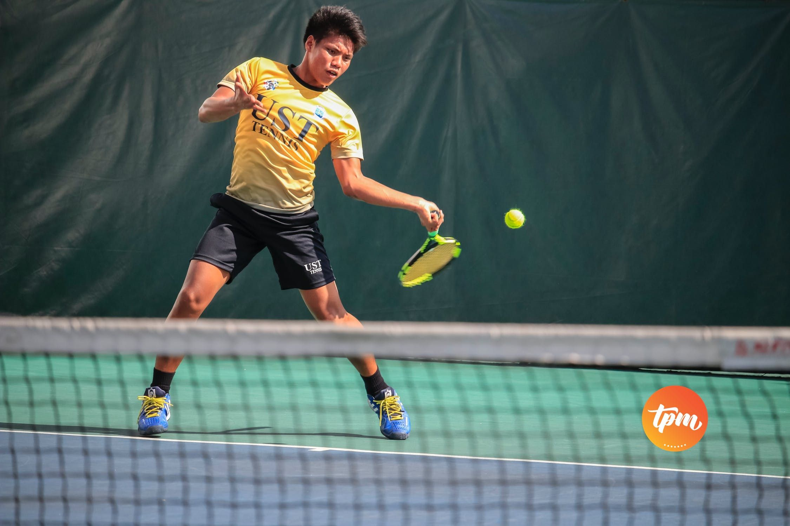

## **How to Avoid a Tennis Shoulder Injury** 

## **The anatomy of the Rotator Cuff**

The rotator cuff is a term given to a group of four specific muscles and
tendons that act to provide strength and stability of the shoulder joint
during multi-directional movement and loading of the shoulder joint.
These muscles also act to maintain the head of the upper arm bone
(humerus) in the shoulder socket during dynamic shoulder movements.

### **The rotator cuff muscles include:**

#### **Supraspinatus**

#### **Infraspinatus**

#### **Teres minor**

#### **Subscapularis**

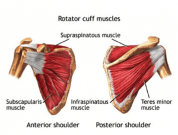

*Video demonstration — the original video for this article was hosted on TennisPlayer.net.*

[Due to the high demands the tennis serve places on the shoulder
complex,** rotator cuff injuries** are among the most common injuries
for the competitive tennis player.] These injuries frequently
occur due overuse of the rotator cuff during the service motion, where
the rotator cuff is subjected to high eccentric loads when decelerating
the arm following ball impact.

These eccentric contractions of the rotator cuff following ball impact
are of vital importance in the shoulder as they assist in maintaining
the stability required to both prevent injury and enhance performance.
**During the tennis serve the upper arm is initially elevated
approximately 90-100 degrees relative to the
body.** From this position, large forces are
produced by the internal rotator muscles of the shoulder such as the
pectoral muscles and rotator cuff to accelerate the arm and racquet head
upwards and forwards toward an explosive ball impact.

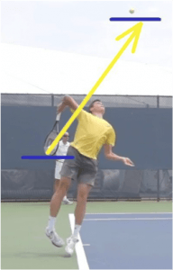

**Serve preparation phase prior to ball impact**

**Immediately following ball impact, the posterior rotator cuff muscles
have to maximally contract to rapidly decelerate the arm as the arm
continues to follow-through, whilst also being responsible for
maintaining shoulder joint stability.** **[Efficient deceleration is
vital for preventing rotator cuff injury, as the inability to dissipate
these forces can cause overload and overuse of the rotator
cuff.]**

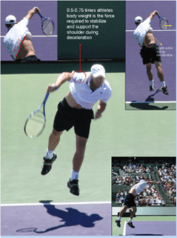

**Deceleration phase following ball impact**

Therefore, in order to **prevent injury** it is essential for the
competitive tennis player to **maintain sufficient rotator cuff
strength, range of motion and dynamic stability of the shoulder joint**.
**[To achieve this, tennis specific strengthening exercises should be
undertaken to either reduce injury risk, or rehabilitate following an
injury to the rotator cuff.]**

### Exercises to avoid Tennis Injury

Pictured below,
[Physiotherapist](https://www.thephysiomovement.com.au/services/townsville-physiotherapy/) Lachlan
demonstrates three specific tennis strengthening progressions to improve
the rotator cuffs capacity to **decelerate** the arm following ball
impact for the tennis serve.

**Exercise progression 1: Banded external rotation at neutral shoulder
elevation**

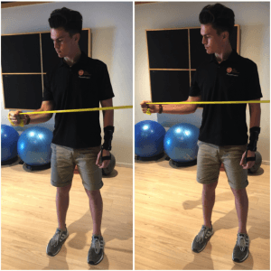

**Exercise 1: Banded external rotation at neutral shoulder elevation**

**Exercise Progression 2: Banded external rotation at 90 degrees
shoulder elevation**

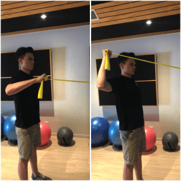** **

**Exercise 2: Banded external rotation at 90 degrees shoulder
elevation**

**Exercise Progression 3: Swiss Ball wall bounces at 90 degrees
abduction**

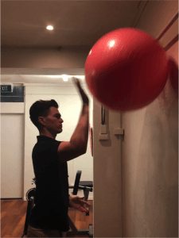

**Exercise 3: Swiss Ball wall bounces at 90 degrees abduction**

Whilst these exercises pictured above are great for improving the
strength of the rotator cuff muscles in preparation for tennis serve, it
is essential that if you are experiencing shoulder pain that you seek
advice from our Sports focused
[Physiotherapists](https://www.thephysiomovement.com.au/services/townsville-physiotherapy/)
at The Physio Movement for a comprehensive assessment and treatment plan
to allow you to return to tennis pain free.

For any further questions relating to this article, Lachlan can be
contacted at [The Physio
Movement](https://www.thephysiomovement.com.au/contact-us/)** **

** **

### Shoulder injuries: A common complaint for tennis players 

16 July 2021

**With the tennis season now well and truly upon us, Fortius Clinic
Consultant Shoulder and Elbow Surgeon [Mr Ali
Narvani](https://www.fortiusclinic.com/specialists/mr-ali-narvani)
provides advice about common shoulder injuries.**

Shoulder pain is extremely common in tennis players. Studies suggest up
to 25% of high-level players aged 12 to 19 and up to 50% of middle-aged
players have shoulder pain.

The pain is mainly linked to overuse injuries related to repetitive
activity of the muscles around the shoulder (particularly the rotator
cuff) and those muscles that stabilise the shoulder blade (scapula).

An elite tennis player can hit up to 1,000 serves in a single tournament
and the fastest tennis serve recorded is 263km/hour. To produce this
speed, the shoulder needs to rotate more than 2,500 degrees per second
which is equivalent to seven circles per second. Taking into
consideration the huge number of repetitive strokes and the high stroke
speed, it is not surprising that tennis players are particularly prone
to shoulder injuries.

## **Common shoulder injuries**

###  The most common shoulder conditions in tennis players include impingement, superior labral (SLAP) lesions, damage to the rotator cuff (including partial and full thickness rotator cuff tears), acromioclavicular (ACJ) pain and damage to the long head of the biceps.

### 

The rotator cuff tendons attach the upper arm bone to the shoulder blade
and pass through a narrow channel. If the balance of the shoulder is
disturbed, particularly with repetitive overuse injury, these tendons
can become impinged and damaged. There could also be damage to the
labrum which is an oval shaped soft tissue ring attached to the socket
of the shoulder joint.

However, these conditions are usually secondary to an 'imbalance' in the
shoulder. Imbalances can be an abnormal position or movement of the
shoulder blade (scapula dyskinesis), decreased internal rotation of the
shoulder which is not adequately compensated for by increased external
rotation (called glenohumeral internal rotation deficit: GIRD) or
alteration in the 'kinetic chain'.  

Decreased internal rotation is mainly due to the tightening of the
capsule at the back of the shoulder. The capsule is the soft tissue
blanket that covers the ball and the socket joint.

The kinetic chain is the linking together of the different body segments
during a tennis stroke including feet, ankles, lower legs, knees, upper
legs, hips, pelvis, spine, shoulder blades, shoulders, upper arms,
elbows, forearms, wrists and fingers. This chain is vital in terms of
maximising efficiency and force and minimising the risk of injury to
each of the segments including the shoulder.

## **Treatment for shoulder injuries**

Shoulder injuries are split into 2 categories -- conditions A which can
lead to another set of conditions called conditions B. Conditions A
include shoulder blade posture and movement abnormalities, reduced
internal rotation and kinetic chain abnormalities. Conditions B include
impingement, rotator cuff tears, superior labral lesions and damage to
the long head of biceps. The best outcomes are achieved when conditions
A are addressed in conjunction with conditions B. Similar to when you
change the tyre on a car and need to also pay attention to the wheel
balance and alignment.

Initial treatment usually involves physiotherapy. Some patients may have
a corticosteroid injection to dampen the inflammation (but not repeated
injections). Surgery is usually only considered if the condition remains
despite physiotherapy. Surgical procedures vary depending on the injury,
but it is usually keyhole surgery and may involve the repair or
reconstruction of the various structural issues (rotator cuff tears or
labral lesions).

## **Avoiding shoulder injuries**

Tennis players can reduce their risk of injury in a number of ways:

- Correction of poor technique

- Adjustment of training volume and intensity

- Adequate warm up

- Ensuring they have the correct equipment including appropriate tennis
racquet grip size, weight and string tension. Footwear which is
appropriate for the playing surface is also important

- Making sure that all the segments of the 'kinetic chain' are in good
condition and addressing any dysfunction of the body segments

- Optimising core stability

- Preventive exercises to increase shoulder blade (scapula)
stabilization, increase rotator cuff strength and optimise shoulder
rotation

## **The right equipment**

Over the years, tennis racquets have changed enormously. The modern
racquets are lighter, stiffer and have a larger head. Lighter racquets
allow a faster swing but this can mean less protection to the arm during
the shock of impact. Stiffer racquets increase the speed of ball rebound
but may also result in a greater shock impact. Larger head sizes enable
higher speeds of ball rebound, have a bigger sweet spot and are
therefore more forgiving but they may be harder to control and can lead
to more rotational force in the hand.

It's important to seek the advice of a tennis coach to ensure that you
have the right racquet for you and your playing style.

# Rotator Cuff Injuries in Tennis Players

[Rami G.
Alrabaa](https://www.ncbi.nlm.nih.gov/pubmed/?term=Alrabaa%20RG%5BAuthor%5D&cauthor=true&cauthor_uid=32827301), [Mario H.
Lobao](https://www.ncbi.nlm.nih.gov/pubmed/?term=Lobao%20MH%5BAuthor%5D&cauthor=true&cauthor_uid=32827301),
and [William N.
Levine](https://www.ncbi.nlm.nih.gov/pubmed/?term=Levine%20WN%5BAuthor%5D&cauthor=true&cauthor_uid=32827301)

### Purpose of Review

This review presents epidemiology, etiology, management, and surgical
outcomes of rotator cuff injuries in tennis players.

### Recent Findings

Rotator cuff injuries in tennis players are usually progressive overuse
injuries ranging from partial-thickness articular- or bursal-sided tears
to full-thickness tears. Most injuries are partial-thickness
articular-sided tears, while full-thickness tears tend to occur in
older-aged players. The serve is the most energy-demanding motion in the
sport, and it accounts for 45 to 60% of all strokes performed in a
tennis match, putting the shoulder at increased risk of overuse injury
and rotator cuff tears. Studies have shown deficits in shoulder range of
motion and scapular dyskinesia to occur even acutely after a tennis
match. First-line treatment for rotator cuff injuries in any overhead
athlete consists of conservative non-operative management with
appropriate rest, anti-inflammatory drugs, followed by a specific
rehabilitation program. Operative treatment is usually reserved for
older-aged players and to those who fail to return to play after
conservative measures. Surgical options include rotator cuff debridement
with or without tendon repair, biceps tenodesis, and labral procedures.
Unlike rotator cuff repairs in the general population, repairs in the
elite tennis athlete have less than ideal rates of return to sport to
the same level of performance.

### Summary

Rotator cuff injuries are a common cause of pain and dysfunction in
tennis players and other overhead athletes. The etiology of rotator cuff
tears in tennis players is multifactorial and usually results from
microtrauma and internal impingement in the younger athlete leading to
partial tearing and degenerative full-thickness tears in older players.
Surgical treatment is pursued in athletes who are still symptomatic
despite an extensive course of non-operative treatment as outcomes with
regard to returning to sport to the same pre-injury level are modest at
best. Debridement alone is usually preferred over rotator cuff repairs
for partial tears in younger players due to potential over-constraining
of the shoulder joint and decreased rates of return to sport after
rotator cuff repairs.

## **Introduction**

Tennis players are susceptible to upper extremity injuries as chronic
repetitive supraphysiologic forces are generated at the shoulder and
elbow throughout a typical match. The shoulder is involved in all
strokes in the sport and is particularly prone to injury during the
serve and overhead. Similar to other overhead sports, upper extremity
injuries are chronic and secondary to repetitive microtrauma and
overuse, while lower extremity injuries in tennis athletes tend to be
acute injuries
[[1](https://www.ncbi.nlm.nih.gov/pmc/articles/PMC7661672/#CR1),
[2](https://www.ncbi.nlm.nih.gov/pmc/articles/PMC7661672/#CR2)].
Multiple epidemiologic studies have noted that the most common injuries
in tennis athletes are lower extremity injuries, closely followed by
upper extremity injuries that typically involve the shoulder and elbow
and lastly the trunk which commonly involves injuries to the lower back
[[3](https://www.ncbi.nlm.nih.gov/pmc/articles/PMC7661672/#CR3)--[5](https://www.ncbi.nlm.nih.gov/pmc/articles/PMC7661672/#CR5)].

The overall prevalence of shoulder injuries among tennis players of all
levels ranges from 4 to 17%
[[6](https://www.ncbi.nlm.nih.gov/pmc/articles/PMC7661672/#CR6),
[7](https://www.ncbi.nlm.nih.gov/pmc/articles/PMC7661672/#CR7)]. A
recent study noted that apart from lower extremity injuries, shoulder
injuries were the most common cause of professional tennis player
departure from the sport
[[8](https://www.ncbi.nlm.nih.gov/pmc/articles/PMC7661672/#CR8)]. The
spectrum of shoulder pathology includes chronic rotator cuff
inflammation (tendinosis), subacromial bursitis, partial-thickness
rotator cuff tears, posterior capsule contracture, long head of biceps
injuries, labral tears, scapular dyskinesia, and superior labrum
anterior-to-posterior (SLAP) tears. This review will focus on rotator
cuff tears, but it is important to keep in mind that tennis players
often present with concomitant pathologies.

## **Rotator Cuff Injuries in Tennis Players**

The overall injury incidence in tennis players across all competitive
levels is estimated to be between 0.05 and 2.9 injuries per player per
year and ranges from 0.04 to 3.0 injuries per player per 1000 h played
[[3](https://www.ncbi.nlm.nih.gov/pmc/articles/PMC7661672/#CR3)]. In
elite adolescent athletes, overall injury rates are higher ranging from
2 to 20 injuries per 1000 h played
[[6](https://www.ncbi.nlm.nih.gov/pmc/articles/PMC7661672/#CR6)].
Overuse injuries to the shoulder have been shown to contribute to nearly
4 to 17% of all tennis injuries
[[1](https://www.ncbi.nlm.nih.gov/pmc/articles/PMC7661672/#CR1),
[2](https://www.ncbi.nlm.nih.gov/pmc/articles/PMC7661672/#CR2),
[4](https://www.ncbi.nlm.nih.gov/pmc/articles/PMC7661672/#CR4),
[6](https://www.ncbi.nlm.nih.gov/pmc/articles/PMC7661672/#CR6),
[7](https://www.ncbi.nlm.nih.gov/pmc/articles/PMC7661672/#CR7)], but
the true incidence of rotator cuff tears in tennis athletes remains
unclear
[[9](https://www.ncbi.nlm.nih.gov/pmc/articles/PMC7661672/#CR9)]. The
prevalence of rotator cuff tears in overhead athletes may be
underreported as many cuff tears are asymptomatic in athletes. Connor
and colleagues
[[10](https://www.ncbi.nlm.nih.gov/pmc/articles/PMC7661672/#CR10)]
reported on imaging findings in completely asymptomatic shoulders of
overhead athletes, and they found that 40% of dominant shoulders had MRI
findings consistent with partial or full-thickness rotator cuff tears,
while none of the non-dominant shoulders had any significant MRI
findings. Another study imaged asymptomatic elite adolescent tennis
players and found higher frequency of rotator cuff tendinosis on MRI of
the dominant shoulder when compared with the non-dominant shoulder
[[11](https://www.ncbi.nlm.nih.gov/pmc/articles/PMC7661672/#CR11)].
Rotator cuff injuries have also been extensively studied in baseball
pitchers. Lesniak and colleagues
[[12](https://www.ncbi.nlm.nih.gov/pmc/articles/PMC7661672/#CR12)]
imaged the dominant shoulder in professional baseball pitchers who were
completely asymptomatic and found that around half of the pitchers had
partial or full-thickness rotator cuff tears. Moreover, the authors
reported that pitchers with higher cumulative innings pitched had
increased likelihood of rotator cuff tears on MRI even though they were
asymptomatic. These findings suggest that rotator cuff injuries in
overhead throwing athletes may be an adaptive response in order to
accommodate the extremes in range of motion required for success in the
sport
[[13](https://www.ncbi.nlm.nih.gov/pmc/articles/PMC7661672/#CR13)•].

Rotator cuff pathology is common in the general elderly population in
the form of degenerative tears to the anterosuperior rotator cuff with
increasing prevalence with age
[[14](https://www.ncbi.nlm.nih.gov/pmc/articles/PMC7661672/#CR14)].
Full-thickness tears are uncommon in the athlete under 35 years of age,
but the rate increases in players older than 50 years of age
[[15](https://www.ncbi.nlm.nih.gov/pmc/articles/PMC7661672/#CR15)]. As
tennis players age, the primary cause of rotator cuff injury shifts from
microtrauma due to posterosuperior internal impingement causing
partial-thickness cuff tears to degenerative changes leading to
full-thickness tears. Partial-thickness rotator cuff tears in the
overhead athlete mostly affect the articular side of the tendon and are
known as PASTA (partial articular-sided tendon avulsion) lesions.
Bursal-sided tears are less common in the overhead athlete and are
associated with subacromial impingement. Tears in athletes can also
exhibit extension into an intratendinous or intralaminar portion of the
tendon and are referred to as PAINT (partial-thickness articular surface
intratendinous tears) lesions
[[13](https://www.ncbi.nlm.nih.gov/pmc/articles/PMC7661672/#CR13),
[16](https://www.ncbi.nlm.nih.gov/pmc/articles/PMC7661672/#CR16)].
Partial-thickness tears can be classified according to Ellman
[[17](https://www.ncbi.nlm.nih.gov/pmc/articles/PMC7661672/#CR17)] in
3 grades based on tear depth (grade 1, < 3 mm deep or 25% of tendon
width; grade 2, 3--6 mm or 50%; grade 4, > 6 mm or > 50%). This
classification was revised by Snyder
[[18](https://www.ncbi.nlm.nih.gov/pmc/articles/PMC7661672/#CR18)] to
include location (bursal or articular) and tear severity.

Several mechanisms have been described to cause rotator cuff injuries in
overhead athletes, including tensile overload, internal rotation
deficit, internal impingement, scapular dyskinesia, and less commonly
external impingement
[[19](https://www.ncbi.nlm.nih.gov/pmc/articles/PMC7661672/#CR19)].
Repetitive and rapid eccentric contraction of the rotator cuff to
decelerate the arm during the follow-through phase of the throw
generates tensile forces that progressively overload the rotator cuff
tendons leading to hypertrophy, microtrauma, and eventual failure of the
tendon fibers
[[20](https://www.ncbi.nlm.nih.gov/pmc/articles/PMC7661672/#CR20)].
These injuries have been well studied in professional baseball pitchers
with literature reporting compressive loads as high as 860 N across the
glenohumeral joint and humeral angular velocities up to 8000°/s during
the throwing motion; the rotator cuff muscles act to offset these
extreme forces to keep the humeral head stable and centered on the
glenoid
[[21](https://www.ncbi.nlm.nih.gov/pmc/articles/PMC7661672/#CR21),
[22](https://www.ncbi.nlm.nih.gov/pmc/articles/PMC7661672/#CR22)].
During the tennis serve, there is major stress across the
posterosuperior rotator cuff tendons from eccentric contraction to
decelerate the arm from its maximum angular velocity
[[23](https://www.ncbi.nlm.nih.gov/pmc/articles/PMC7661672/#CR23)].

Competitive tennis players and overhead athletes frequently develop
excessive shoulder external rotation that seems to be an adaptation to
the repetitive external rotation involved in the late cocking phase of
the throwing motion. This leads to a corresponding glenohumeral internal
rotation deficit (GIRD) as repeated microtrauma to the posterior capsule
during the deceleration phase of the throw leads to scar formation and
subsequent posterior capsule contracture. As shoulder internal rotation
is essential in tennis especially for high velocity serving strokes and
forehand ground strokes
[[24](https://www.ncbi.nlm.nih.gov/pmc/articles/PMC7661672/#CR24)],
GIRD alters the shoulder kinematics increasing the risk of shoulder
injuries in tennis players and overhead athletes
[[25](https://www.ncbi.nlm.nih.gov/pmc/articles/PMC7661672/#CR25),
[26](https://www.ncbi.nlm.nih.gov/pmc/articles/PMC7661672/#CR26)].

During the late cocking phase of the serve, maximal external rotation
and abduction of the shoulder cause abutment between the greater
tuberosity of the humerus and the posterosuperior glenoid labrum. This
abutment increases the contact pressure in the articular surface of the
posterosuperior rotator cuff leading to a characteristic bipolar injury
to the posterosuperior labrum and the articular aspect of the posterior
supraspinatus and anterior infraspinatus tendons
(Fig. [1](https://www.ncbi.nlm.nih.gov/pmc/articles/PMC7661672/figure/Fig1/)).
Walch and colleagues
[[27](https://www.ncbi.nlm.nih.gov/pmc/articles/PMC7661672/#CR27)]
dubbed this "internal impingement" and described arthroscopic findings
of fraying of the posterosuperior labrum and partial-thickness tearing
of the undersurface of the rotator cuff. GIRD and internal impingement
seem to be intimately associated with one another. Burkhart and
colleagues
[[20](https://www.ncbi.nlm.nih.gov/pmc/articles/PMC7661672/#CR20)]
proposed that the posterior capsular contracture may be the primary
structural alteration for the development of internal impingement.
Repeated eccentric contraction of the posterosuperior cuff leads to
hypertrophy and subsequent stiffness of the posterior structures
limiting anterior translation of the humeral head in abduction and
external rotation ultimately leading to internal impingement.

[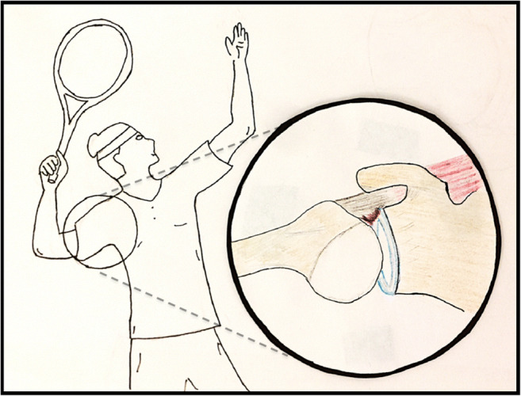](https://www.ncbi.nlm.nih.gov/pmc/articles/PMC7661672/figure/Fig1/)

**With repetitive abduction and external rotation, the overhead athlete
can develop internal impingement leading to partial-thickness tearing of
the posterosuperior rotator cuff and labrum**

Altered scapular mechanics also play a role in cuff injuries. In the
late cocking and early acceleration phases of throwing when the humerus
is maximally abducted and externally rotated, the scapula undergoes
upward rotation to help maintain glenohumeral articular congruency
[[28](https://www.ncbi.nlm.nih.gov/pmc/articles/PMC7661672/#CR28)].
Imbalance or weakness of the periscapular or posterior cuff muscles may
disrupt the dynamic relationship of the scapula and is referred to as
scapular dyskinesia. Burkhart and colleagues
[[20](https://www.ncbi.nlm.nih.gov/pmc/articles/PMC7661672/#CR20)]
have described the SICK (scapular malposition, inferior medial border
prominence, coracoid pain and malposition, and dyskinesis of scapular
movement) scapula syndrome which comprises a characteristic set of
features and findings associated with altered scapular kinematics in
overhead athletes. Disruption of the scapulohumeral rhythm may also lead
to external impingement of the cuff along the coracoacromial arch and
result in rotator cuff injuries
[[19](https://www.ncbi.nlm.nih.gov/pmc/articles/PMC7661672/#CR19)].
The ability to maintain scapular upward rotation during serving seems to
be important to prevent chronic injury risk in tennis players. Rich and
colleagues
[[29](https://www.ncbi.nlm.nih.gov/pmc/articles/PMC7661672/#CR29)•]
demonstrated that fatigued tennis players had decreased scapular upward
rotation during serving, suggesting that heavy serving activity during
tournaments acutely leads to abnormal scapular movement patterns that
can play a role in long-term rotator cuff injuries. The authors
recommend close monitoring of scapular upward rotation in tennis players
returning to play after shoulder injuries.

External or subacromial impingement as described by Neer
[[30](https://www.ncbi.nlm.nih.gov/pmc/articles/PMC7661672/#CR30)] is
a common cause of rotator cuff disease in the older population as the
cuff tendons impinge in the coracoacromial arch. Although less common in
overhead athletes, external impingement can be a cause of rotator cuff
disease, bursitis, and cuff dysfunction, as well as subscapularis tears
due to repetitive impingement of the lesser tubercle against the
coracoid during the follow-through phase of the forehand ground stroke.
Although several injury mechanisms exist, one mechanism alone may not be
solely involved in the injury process as several mechanisms act in a
cascade of events overtime leading to rotator cuff injuries in overhead
athletes.

## **Tennis Specific Considerations**

The serve is the predominant stroke in tennis accounting for 45 to 60%
of all strokes in a service game
[[31](https://www.ncbi.nlm.nih.gov/pmc/articles/PMC7661672/#CR31),
[32](https://www.ncbi.nlm.nih.gov/pmc/articles/PMC7661672/#CR32)]. As
most tournaments are composed of 3-set matches and a player averages 120
serves and 210 ground strokes per match
[[33](https://www.ncbi.nlm.nih.gov/pmc/articles/PMC7661672/#CR33)•], a
high-level tennis player can accumulate around 5400 serves during a
competitive season (45 matches per year) without accounting for ground
strokes. In contrast, a Major League Baseball pitcher averages
approximately 100 pitches per game every 4 days and an overall count of
2655 pitches throughout the season.

Tennis players must use the kinetic chain efficiently to generate power
shots. Forces generated at the feet, legs, knees, and thighs travel
through the core (abdomen and trunk) and are transmitted to the
shoulder, elbow, wrist, hand, and ultimately the racket
[[34](https://www.ncbi.nlm.nih.gov/pmc/articles/PMC7661672/#CR34)].
The shoulder plays a crucial role in this kinetic chain by transmitting
forces while producing a wide range of motion. This is particularly
evident in the serve, which has been documented to be the most strenuous
stroke on the upper extremity. An explosive contraction of the internal
rotator muscles with the shoulder in abduction and external rotation
produces an angular velocity of 2420°/s at the acceleration phase of the
serve
[[31](https://www.ncbi.nlm.nih.gov/pmc/articles/PMC7661672/#CR31)].
Depending on the athlete's strength, endurance, flexibility, and skill
level, improper technique or fatigue disrupts the kinetic chain leading
to inefficient energy transfer and overloading across subsequent joints
which can lead to injuries
[[24](https://www.ncbi.nlm.nih.gov/pmc/articles/PMC7661672/#CR24)]. It
has been shown that inappropriate knee flexion during a serve
significantly increases the mechanical loads to the upper extremity
[[35](https://www.ncbi.nlm.nih.gov/pmc/articles/PMC7661672/#CR35)].
Elite and experienced players seem to have more efficient energy
transfers in their kinetic chain compared with novice or recreational
players who tend to overload the shoulder and elbow joints due to
improper technique leading to higher injury risk
[[36](https://www.ncbi.nlm.nih.gov/pmc/articles/PMC7661672/#CR36),
[37](https://www.ncbi.nlm.nih.gov/pmc/articles/PMC7661672/#CR37)].
Energy transfer between segments (kinetic chain) is a critical concept
related to sports injury. An energy flow study comparing injured and
uninjured tennis players showed that with higher quality of energy
transfer from the trunk to the hand and racket led to increased ball
velocity and decreased upper limb joint kinetics
[[38](https://www.ncbi.nlm.nih.gov/pmc/articles/PMC7661672/#CR38)].
Injured players had a lower overall quality of energy flow through the
upper extremity, lower ball velocity, and higher energy absorbed by the
shoulder and elbow which likely predisposed them to overuse injuries.

Three main serve types have been described including flat, top-spin or
kick, and slice. The top-spin serve is commonly taught to junior tennis
players or shorter athletes so that the ball clears the net while still
landing in the service box; the top-spin serve is also commonly used as
the second serve because of its reliability. Motion analysis and
biomechanical studies have shown that the top-spin serve results in the
greatest force, while the slice serve had the lowest overall forces and
torques generated on the shoulder
[[39](https://www.ncbi.nlm.nih.gov/pmc/articles/PMC7661672/#CR39)].
Therefore, the top-spin serve should be used judiciously in younger
players due to the potential risk of shoulder injuries. This
biomechanical data is also relevant to rehabilitation of shoulder
injuries, injury prevention, and return-to-play protocols; players
recovering from shoulder injuries or surgery should start with slice
serves as they generate the least forces and progress top-spin or kick
serve at later stages of rehabilitation.

As described earlier, GIRD and internal impingement are intimately
related and contribute to shoulder injuries and rotator cuff tears in
tennis players
[[40](https://www.ncbi.nlm.nih.gov/pmc/articles/PMC7661672/#CR40)]. A
recent study demonstrated significant decrease in internal rotation of
the dominant shoulder in tennis players after 3 h of play
[[41](https://www.ncbi.nlm.nih.gov/pmc/articles/PMC7661672/#CR41)•].
These acute changes in shoulder range of motion influence the serve
kinetic chain predisposing to shoulder injury during long matches.
Tennis players should be encouraged to stretch after matches and allow
for adequate time to rest in between matches to restore baseline
shoulder range of motion to avoid injury and maintain performance.
Another study by Rich and colleagues
[[29](https://www.ncbi.nlm.nih.gov/pmc/articles/PMC7661672/#CR29)•]
examined healthy tennis players without any shoulder injuries and had
them undergo a tennis serving protocol in order to induce fatigue. The
study reported that scapular upward rotation was significantly
diminished after fatigue but returned to baseline within 1 day.
Similarly, the authors draw attention to the decreased range of motion
and altered kinematics of the shoulder after prolonged tennis and
caution any athlete to return to competition within a day after heavy
serving.

Tennis rackets have transformed from heavy wooden models to larger yet
lighter and stiffer graphite composite models
[[2](https://www.ncbi.nlm.nih.gov/pmc/articles/PMC7661672/#CR2)].
Modern rackets and strings allow for faster balls and increased spin at
the expense of higher torques transmitted to the shoulder and elbow
which may account for upper extremity overuse injuries
[[32](https://www.ncbi.nlm.nih.gov/pmc/articles/PMC7661672/#CR32)]. In
terms of play surface, hard courts result in faster ball speeds, which
theoretically subject the upper extremity to higher forces; however,
there is no evidence showing higher injury rates due to a specific
playing surface
[[2](https://www.ncbi.nlm.nih.gov/pmc/articles/PMC7661672/#CR2),
[42](https://www.ncbi.nlm.nih.gov/pmc/articles/PMC7661672/#CR42)].

## **Clinical Evaluation**

### History

Most overhead athletes and tennis players with rotator cuff injuries
present with progressive dull shoulder pain, early fatigue, and
decreased performance
[[19](https://www.ncbi.nlm.nih.gov/pmc/articles/PMC7661672/#CR19)].
Pain location is vague and can radiate laterally to the deltoid.
Anterior shoulder pain may indicate concomitant labral tear, proximal
biceps pathology, or anterior instability, while posterior pain suggests
posterior labral pathology or instability. The onset of symptoms, any
history of shoulder instability, and other traumatic events should be
documented. Symptoms are commonly exacerbated after overhead activities
and especially after the serve.

The overhead athlete may have specific complaints related to
performance, like early fatigue, decreased strength, decreased throwing
or serving velocity, decreased accuracy, or mechanical symptoms.
Information about the athlete's training regimen, compliance to rest
days, and frequency of competition and practice sections is important to
assess for overuse. Possible contributing factors include any recent
changes in strokes or equipment that may suggest improper or less ideal
technique. Finally, the athlete should be screened for other sources of
pain including the back, core, and lower extremities as restoring proper
technique is the main focus in rehabilitation if a technical deficiency
is identified
[[2](https://www.ncbi.nlm.nih.gov/pmc/articles/PMC7661672/#CR2),
[35](https://www.ncbi.nlm.nih.gov/pmc/articles/PMC7661672/#CR35)].

### Physical Exam

Detailed physical examination of the shoulder is performed beginning
with inspection, palpation, range of motion evaluation, strength
assessment, and progressing to provocative maneuvers. Inspection of
bilateral scapulae from behind the patient with the entire torso exposed
is paramount to detect differences in scapular motion between sides that
may indicate SICK scapula. Asymmetric position, protraction, or a
deficit in upward rotation of the scapula with range of motion may
indicate scapular dyskinesia. Selective atrophy of the supraspinatus
and/or infraspinatus when compared with the contralateral shoulder is a
sign of suprascapular nerve compression, which can clinically present
with weakness and pain similar to a rotator cuff tear.

Palpation proceeds in a systematic fashion assessing for tenderness of
the sternoclavicular joint, acromioclavicular joint, proximal biceps
tendons, and along the supraspinatus and infraspinatus fossa. Range of
motion is compared with the contralateral shoulder in forward elevation
in the scapular plane, external and internal rotation with the arm at
the side, abduction, and external and internal rotation in abduction.
GIRD can be evident in the dominant shoulder in tennis players with
increased external rotation in abduction and a corresponding decrease in
internal rotation. Although there is increased external rotation and
decreased internal rotation in the dominant shoulder compared with the
non-dominant arm, the total arc of rotation of both shoulders should be
equivalent
[[25](https://www.ncbi.nlm.nih.gov/pmc/articles/PMC7661672/#CR25)].
Rotator cuff strength is assessed and compared with the contralateral
shoulder. Subtle differences may not be detected as other more powerful
muscles contribute to shoulder motion and the cuff muscles are rarely
testing in isolation. While rotator cuff tears in elderly patients may
result in significant objective weakness and lag signs, that is unusual
in athletes and younger players even in the presence of full-thickness
rotator cuff tears because other powerful muscles like the deltoid,
pectoralis major, and latissimus dorsi compensate for the rotator cuff
deficiencies.

Provocative maneuvers then focus on different structures about the
shoulder. Classic impingement (external or subacromial impingement) is
assessed with the Neer and Hawkins tests. Since concomitant pathology is
common in overhead athletes, maneuvers to identify labral pathology and
instability are always performed. Athletes with anterior-inferior
instability will demonstrate apprehension with abduction and external
rotation and have positive relocation and anterior release signs.
Superior labral pathology including SLAP tears can be assessed with the
active compression and posterior stress tests. Clinically diagnosing
SLAP tears is difficult as there is no single test with optimal
specificity. Despite the availability of a specific exam maneuver, one
study reported that labral lesions were best identified by a combination
of the modified dynamic labral shear and active compression maneuvers
[[43](https://www.ncbi.nlm.nih.gov/pmc/articles/PMC7661672/#CR43)].
Posterior labral pathology is examined with the Jerk and Kim tests.
Closely associated proximal biceps tendon pathology is assessed with the
Speed and Yergason maneuvers. With the emphasis on the detection of
internal impingement in overhead athletes, several examination maneuvers
have been developed including the modified relocation test and the
internal rotation resistance test
[[44](https://www.ncbi.nlm.nih.gov/pmc/articles/PMC7661672/#CR44),
[45](https://www.ncbi.nlm.nih.gov/pmc/articles/PMC7661672/#CR45)].

### Imaging

Accurate diagnosis requires correlating a thorough history and physical
exam with imaging findings. Plain radiographs are obtained in all
patients and include an anteroposterior view of the scapula (Grashey),
axillary, and scapular Y views. The morphology of the acromion is
assessed on the scapular Y view and classified as flat, curved, or
hooked. Hooked acromions are more often associated with rotator cuff
tears
[[46](https://www.ncbi.nlm.nih.gov/pmc/articles/PMC7661672/#CR46),
[47](https://www.ncbi.nlm.nih.gov/pmc/articles/PMC7661672/#CR47)].
Other radiographic findings that suggest rotator cuff tears include
sclerosis or cysts in the greater tuberosity
[[9](https://www.ncbi.nlm.nih.gov/pmc/articles/PMC7661672/#CR9)].
Ultrasound imaging to assess rotator cuff integrity has the benefits of
being low-cost, easy patient tolerance, and dynamic evaluation of the
tendons. However, ultrasound remains operator- and facility-dependent
[[48](https://www.ncbi.nlm.nih.gov/pmc/articles/PMC7661672/#CR48)]. A
meta-analysis on the effectiveness of ultrasound for the diagnosis of
rotator cuff injuries showed a sensitivity of 84% and specificity of 89%
for partial-thickness tears and a sensitivity of 96% and specificity of
93% for full-thickness tears
[[49](https://www.ncbi.nlm.nih.gov/pmc/articles/PMC7661672/#CR49)].

The gold standard to diagnose rotator cuff tears is magnetic resonance
imaging (MRI). Advantages include the ability to evaluate concomitant
pathology including the biceps tendon, labrum, capsule and cartilage in
addition to less operator-dependency, and high accuracy. A meta-analysis
showed a pooled sensitivity and specificity of 80% and 95%,
respectively, for diagnosing partial-thickness cuff tears on MRI with
higher sensitivity and specificity values (0.91 and 0.97) for
full-thickness tears
[[50](https://www.ncbi.nlm.nih.gov/pmc/articles/PMC7661672/#CR50)].
Higher-field strength MRIs and the availability of musculoskeletal
radiologists led to improved accuracy. Differentiating between
tendinosis and partial-thickness tears can be difficult using
conventional MRIs. Enhanced diagnostic accuracy can be achieved for
diagnosing partial-thickness cuff tears and labral pathology with the
use of MR arthrography (MRA)
(Fig. [2](https://www.ncbi.nlm.nih.gov/pmc/articles/PMC7661672/figure/Fig2/)),
placing the arm in the throwing position in abduction and external
rotation (ABER view), and higher-field (3 T) strength magnets
[[51](https://www.ncbi.nlm.nih.gov/pmc/articles/PMC7661672/#CR51)].
One study of arthroscopically confirmed partial-thickness cuff tears
with a horizontal component showed that only 21% of the lesions were
detected on standard coronal oblique MRI images, while 100% of the
lesions were identified on ABER views
[[52](https://www.ncbi.nlm.nih.gov/pmc/articles/PMC7661672/#CR52)].

[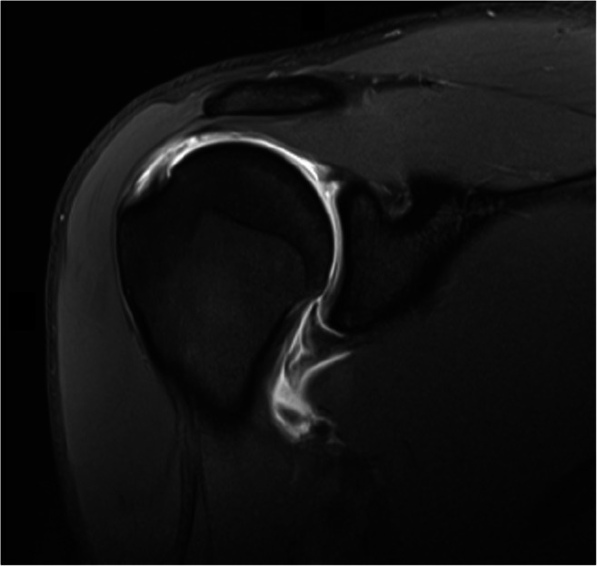](https://www.ncbi.nlm.nih.gov/pmc/articles/PMC7661672/figure/Fig2/)

MR arthrogram of the dominant right shoulder of a 20-year-old male
overhead athlete showing partial articular-sided tearing of the
supraspinatus. The tear appears to involve approximately 75% of the
tendon thickness with an intact bursal surface. This patient was treated
with repair of the partial tear with an arthroscopic transtendon repair
technique shown in Figs.
[​Figs.3,3](https://www.ncbi.nlm.nih.gov/pmc/articles/PMC7661672/figure/Fig3/),
[​,4,4](https://www.ncbi.nlm.nih.gov/pmc/articles/PMC7661672/figure/Fig4/),
and
[​and55](https://www.ncbi.nlm.nih.gov/pmc/articles/PMC7661672/figure/Fig5/)

The clinician must use caution when interpreting MRI studies. As
previously mentioned, several studies have found abnormalities of the
rotator cuff on imaging in completely asymptomatic overhead athletes and
tennis players
[[10](https://www.ncbi.nlm.nih.gov/pmc/articles/PMC7661672/#CR10)--[12](https://www.ncbi.nlm.nih.gov/pmc/articles/PMC7661672/#CR12)].
Moreover, the timing of the MRI after injury or onset of symptoms is
important to consider as there can be signal abnormalities found in
overhead athletes after competition, which can take up to a week to
normalize on imaging
[[53](https://www.ncbi.nlm.nih.gov/pmc/articles/PMC7661672/#CR53),
[54](https://www.ncbi.nlm.nih.gov/pmc/articles/PMC7661672/#CR54)].

## **Management**

Treatment of rotator cuff injuries in tennis players depends on several
patient- and injury-specific factors including onset of injury,
thickness of the cuff tear, extent of impairment, presence of
concomitant injuries, timing within the season or off-season (in an
elite or professional athlete), and response to non-operative treatment.

### Non-operative

First-line non-operative treatment of rotator cuff injuries in tennis
players includes rest from the sport and overhead activities, physical
therapy, and a rehabilitation program. Duration of non-operative
treatment varies on severity of symptoms, pathology, and the individual
athlete. Most treatment plans involve at least 3 months as a reasonable
period for a comprehensive rehabilitation program
[[9](https://www.ncbi.nlm.nih.gov/pmc/articles/PMC7661672/#CR9),
[54](https://www.ncbi.nlm.nih.gov/pmc/articles/PMC7661672/#CR54),
[55](https://www.ncbi.nlm.nih.gov/pmc/articles/PMC7661672/#CR55)].
Non-operative treatment should be exhausted prior to consideration of
surgery for the elite tennis player as the results of surgical
intervention are unpredictable in terms of resolution of symptoms and
return to previous level of sport.

During the resting phase of treatment, NSAIDs may be used to decrease
inflammation and pain to assist in the rehabilitation phase. Selected
athletes may also benefit from a corticosteroid injection to decrease
inflammation and facilitate therapy especially if there are signs of
subacromial impingement or bursal-sided tearing
[[13](https://www.ncbi.nlm.nih.gov/pmc/articles/PMC7661672/#CR13)•].
Articular injection is an option for articular-sided rotator cuff
injuries. Corticosteroid injections should be used sparingly in the
young athlete due to risks of tendon weakening and rupture
[[56](https://www.ncbi.nlm.nih.gov/pmc/articles/PMC7661672/#CR56),
[57](https://www.ncbi.nlm.nih.gov/pmc/articles/PMC7661672/#CR57)]. In a
meta-analysis, Boudreault and colleagues
[[58](https://www.ncbi.nlm.nih.gov/pmc/articles/PMC7661672/#CR58)]
reported that oral NSAIDs and corticosteroid injections may have similar
short-term efficacy in terms of pain reduction and functional
improvement in the treatment of rotator cuff tendinopathy. However, this
study was not limited to athletes. Other studies have shown mixed
results with regard to the efficacy of subacromial steroid injections
for rotator cuff pathology in the general population with some studies
demonstrating reduction in pain and improved function, while others
reported no difference when compared with NSAIDs or placebo
[[59](https://www.ncbi.nlm.nih.gov/pmc/articles/PMC7661672/#CR59)--[63](https://www.ncbi.nlm.nih.gov/pmc/articles/PMC7661672/#CR63)].
There is limited evidence-based literature on the use of corticosteroid
shoulder injections in elite athletes. A few case series of collegiate
athletes show at least temporary relief of symptoms with subacromial
steroid injections for rotator cuff pathology, but inconclusive results
at mid- and long-term
[[64](https://www.ncbi.nlm.nih.gov/pmc/articles/PMC7661672/#CR64),
[65](https://www.ncbi.nlm.nih.gov/pmc/articles/PMC7661672/#CR65)]. The
use of platelet-rich plasma (PRP) has gained popularity for the
treatment of various orthopedic conditions. Although there is no
literature on the use of PRP specifically in rotator cuff injuries in
athletes, general population studies show no difference in outcomes
between patients who received PRP and controls for the treatment of
rotator cuff tendinopathy
[[66](https://www.ncbi.nlm.nih.gov/pmc/articles/PMC7661672/#CR66),
[67](https://www.ncbi.nlm.nih.gov/pmc/articles/PMC7661672/#CR67)].
Furthermore, significant variability in the PRP attainment methods
across different systems makes it challenging to draw definitive
conclusions
[[68](https://www.ncbi.nlm.nih.gov/pmc/articles/PMC7661672/#CR68),
[69](https://www.ncbi.nlm.nih.gov/pmc/articles/PMC7661672/#CR69)].

Treatment in the tennis player should evaluate the athlete's serve and
stroke mechanics. As discussed previously, the entire kinetic chain must
be assessed, including lower limbs and core because improper technique
at any link of the chain may disrupt the energy transfer downstream in
the chain manifesting in upper extremity overuse injuries. Therefore,
strength training of the core, lower, and upper extremities as well as
proper serve and stroke mechanics must be emphasized during the
rehabilitation process to minimize recurrent or new site injuries.
Physical therapy begins with exercises focused on maximizing range of
motion followed by strengthening of the rotator cuff and periscapular
muscles. GIRD should be addressed with sleeper stretches of the
posterior capsule
[[20](https://www.ncbi.nlm.nih.gov/pmc/articles/PMC7661672/#CR20)].
Scapular dyskinesia and SICK scapula require progressive stretching
program and integrating scapular strengthening exercises by having the
athlete retract the scapula to its normal anatomic position
[[19](https://www.ncbi.nlm.nih.gov/pmc/articles/PMC7661672/#CR19)].
Once shoulder range of motion improves and rotator cuff strengthening is
enhanced, the last phase of rehabilitation in non-operative treatment
involves a gradual return to sport specific exercises and training. Wilk
and colleagues
[[70](https://www.ncbi.nlm.nih.gov/pmc/articles/PMC7661672/#CR70)•]
reported on an evidence-based comprehensive 4-phase rehabilitation
program for non-operative treatment of shoulder issues including rotator
cuff tears in the overhead athlete. Another review by Cools and
colleagues
[[71](https://www.ncbi.nlm.nih.gov/pmc/articles/PMC7661672/#CR71)]
outlines the rehabilitation guidelines for internal impingement
specifically in the tennis player.

### Operative

When an athlete is unable to return to tennis despite extensive
non-operative treatment, surgery can be pursued. It is important,
however, to have a frank discussion with the patient, trainers, and
managers of elite athletes regarding the unpredictability of surgical
outcomes in terms of return to sport at a high level. Surgical
approaches have evolved from open to mini-open to arthroscopic with
limited literature supporting one approach over another, but
arthroscopic surgery is most commonly preferred and performed in
athletes
[[13](https://www.ncbi.nlm.nih.gov/pmc/articles/PMC7661672/#CR13),
[55](https://www.ncbi.nlm.nih.gov/pmc/articles/PMC7661672/#CR55)].
Surgical treatment includes debridement alone, partial or full-thickness
rotator cuff repair, and treatment of concomitant pathology found at the
time of arthroscopy (including labral or SLAP repair, biceps tenodesis
or tenotomy, or acromioplasty).

Ultimately, patient age, preoperative imaging, size and retraction of
the tear, tissue quality, and surgeon experience or preference play a
role in determining the surgical plan. Surgical treatment begins with
debridement to assess tear depth and extent. Irregular unhealthy tendon
edges and flaps are debrided. Partial-thickness articular-sided cuff
tears are debrided from within the joint to a stable margin. Using a
spinal needle, a monofilament suture is percutaneously placed to mark
the partial-thickness cuff injury. The suture is then identified in the
subacromial space, and the bursal cuff integrity is examined.

Options for management include debridement alone, bioinductive scaffold
placement on the bursal cuff, transtendinous repair, or conversion to
full-thickness tear and repair. Historically, recommendations in the
general population report that tears under 50% of the tendon thickness
can be debrided alone, whereas tears involving more than 50% of the
tendon should be repaired. This "cutoff" has been propagated in the
literature, and there is some biomechanical evidence that suggests
significantly increased strain with partial articular cuff tears
exceeding 50% of the tendon thickness
[[72](https://www.ncbi.nlm.nih.gov/pmc/articles/PMC7661672/#CR72)].
However, there is no technique to accurately determine the thickness of
the tear, and one study has shown that there is poor interobserver
reliability when estimating the extent of partial-thickness tears
[[73](https://www.ncbi.nlm.nih.gov/pmc/articles/PMC7661672/#CR73)].
While the 50% threshold has historically been used for tendon repair,
more recent literature suggests repair only of more advanced
partial-thickness tears exceeding 75% in the young overhead athletic
population
[[9](https://www.ncbi.nlm.nih.gov/pmc/articles/PMC7661672/#CR9),
[55](https://www.ncbi.nlm.nih.gov/pmc/articles/PMC7661672/#CR55)]. This
is largely due to unpredictable outcomes of cuff repair in the athlete
and the risk of over-tensioning the cuff leading to a non-anatomic
repair and possibly functional deficits in the sport.

Partial-thickness articular cuff tears can be repaired with a
transtendinous approach
(Figs. [3](https://www.ncbi.nlm.nih.gov/pmc/articles/PMC7661672/figure/Fig3/),
[​,4,4](https://www.ncbi.nlm.nih.gov/pmc/articles/PMC7661672/figure/Fig4/),
and
[​and5)5](https://www.ncbi.nlm.nih.gov/pmc/articles/PMC7661672/figure/Fig5/))
or by completing the tear creating a full-thickness defect and then
proceeding with repair back to the footprint. This is controversial in
tennis players due the concern of over-tensioning, loss of motion, and
inability to return to tennis. The transtendon repair technique advances
the articular fibers to the medial footprint while maintaining the
lateral fibers intact. It is essential to plan the appropriate placement
of the anchors in order to achieve an anatomic repair; any detached
rotator cable tissue should be restored back to the footprint as
significant compromise of the cable tissue can alter glenohumeral
kinematics
[[74](https://www.ncbi.nlm.nih.gov/pmc/articles/PMC7661672/#CR74)•].

[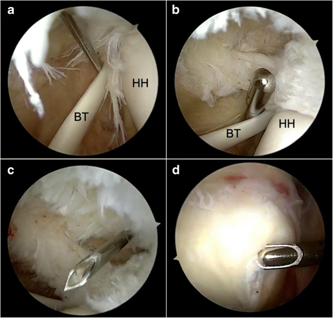](https://www.ncbi.nlm.nih.gov/core/lw/2.0/html/tileshop_pmc/tileshop_pmc_inline.html?title=Click%20on%20image%20to%20zoom&p=PMC3&id=7661672_12178_2020_9675_Fig3_HTML.jpg)

Transtendon repair technique of the partial articular cuff tear shown on
imaging in Fig.
[​Fig.22](https://www.ncbi.nlm.nih.gov/pmc/articles/PMC7661672/figure/Fig2/)
of the patient's right shoulder. Patient is placed in the lateral
decubitus position. (**a**) Intra-articular view from a standard
posterior portal of the articular surface of the supraspinatus shows
partial-thickness tearing and fraying. (**b**) The undersurface of the
cuff is debrided with a motorized shaver to stable margins. (**c**) A
spinal needle can be placed percutaneously through the tear under
visualization, and a monofilament suture can be passed through the
eyelet of the needle in order to mark the tear from within the joint in
order to evaluate its corresponding bursal surface from the subacromial
space. (**d**) The arthroscope and shaver are introduced into the
subacromial space to complete a bursectomy and evaluate the bursal side
of the cuff. In this case, the bursal side is intact; however, there is
significant tearing of the articular side estimated to be at least 75%
of the tendon thickness, so the decision was made to proceed with
transtendon repair (BT, biceps tendon; HH, humeral head)

[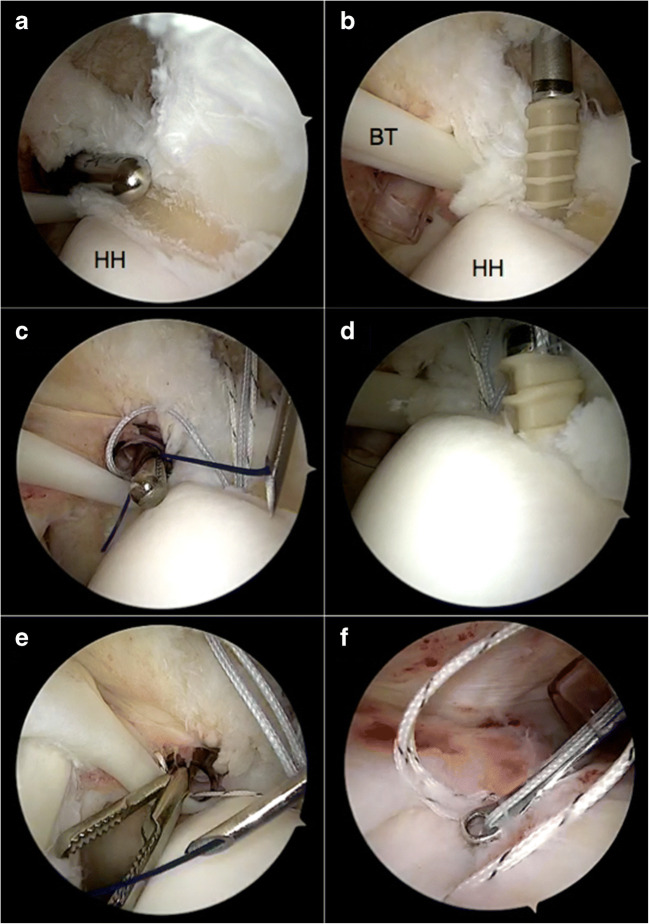](https://www.ncbi.nlm.nih.gov/core/lw/2.0/html/tileshop_pmc/tileshop_pmc_inline.html?title=Click%20on%20image%20to%20zoom&p=PMC3&id=7661672_12178_2020_9675_Fig4_HTML.jpg)

Transtendon repair technique of the partial articular cuff tear shown on
imaging in
Fig. [2](https://www.ncbi.nlm.nih.gov/pmc/articles/PMC7661672/figure/Fig2/)
of the patient's right shoulder. (**a**) View from a standard posterior
portal. The medial footprint is debrided down to bone with a motorized
shared just lateral to the humeral head articular surface. (**b**)
Decision was made to place 2 medial anchors for this repair, so the
first anterior anchor is placed percutaneously, and then sutures are
passed through the tendon. First, a suture limb is retrieved from the
anterior cannula. Then a spinal needle is percutaneously placed through
tendon in anticipation of where the suture must be passed. (**c**) A
monofilament blue suture which is to be used as a shuttling suture is
passed through the eyelet of the spinal needle and is retrieved out the
anterior portal. The blue braided suture from the suture anchor is then
looped around the shuttling suture outside the body from the anterior
cannula. The monofilament shuttling suture is then retrieved from its
percutaneous entry site (where it was placed through the spinal needle),
therefore passing the blue braided suture through the tendon at the
desired location. (**d**) The second posterior suture anchor is then
placed percutaneously. The location of this posterior anchor was crucial
in this case as it was used to reduce the posterior cable tissue that
was detached. (**e**) Again, sutures from the second anchor are passed
through the tendon in the same manner as described. Once all sutures are
passed through the tendon, they are tied in the subacromial space.
(**f**) The arthroscope is introduced into the subacromial space and a
lateral cannula is established. The corresponding suture limbs are tied
together using a knot pusher to reduce the tear (BT, biceps tendon; HH,
humeral head)

[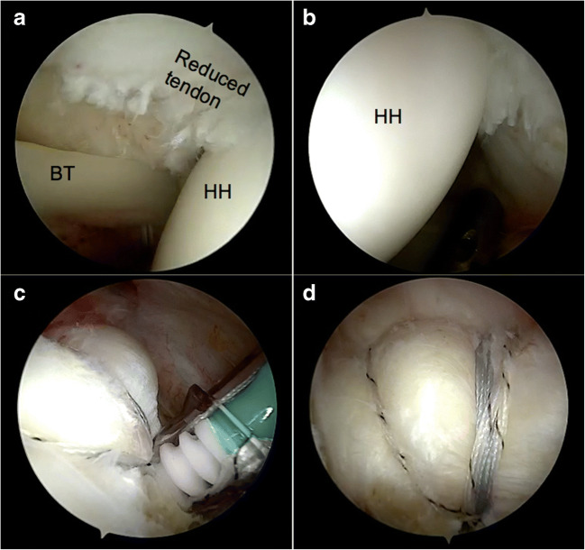](https://www.ncbi.nlm.nih.gov/core/lw/2.0/html/tileshop_pmc/tileshop_pmc_inline.html?title=Click%20on%20image%20to%20zoom&p=PMC3&id=7661672_12178_2020_9675_Fig5_HTML.jpg)

Transtendon repair technique of the partial articular cuff tear shown on
imaging in Fig.
[​Fig.22](https://www.ncbi.nlm.nih.gov/pmc/articles/PMC7661672/figure/Fig2/)
of the patient's right shoulder. (**a**) Intra-articular view from the
posterior portal showing the anterior aspect of the tendon reduced to
the medial footprint. (**b**) Intra-articular view from the anterior
portal showing the posterior aspect of the tendon reduced. At this
point, the decision was made for placement of a lateral row anchor
incorporating all the suture limbs that were tied in order to provide
compression. (**c**) Subacromial view showing placement of the lateral
row anchor incorporating all the suture limbs that were tied. (**d**)
View from the lateral subacromial portal showing the final repair
construct (BT, biceps tendon; HH, humeral head)

Partial articular-sided cuff tears are completed into full tears and
repaired if it is determined that the majority of the tendon thickness
is involved (over 75%), if the quality of the intact lateral fibers are
poor, or if there is substantial bursal-sided involvement.
Full-thickness cuff tears can then be repaired as they are in the
general population using either single- or double-row techniques.
Double-row and transosseous equivalent repairs have been shown to have
increased strength, resistance to cyclic loading, and improved footprint
coverage
[[75](https://www.ncbi.nlm.nih.gov/pmc/articles/PMC7661672/#CR75),
[76](https://www.ncbi.nlm.nih.gov/pmc/articles/PMC7661672/#CR76)].

Intralaminar tears can occur specifically in overhead athletes and are
termed partial-thickness articular surface intratendinous (PAINT)
lesions. These tears can be repaired with side-to-side sutures without
anchoring the repair back to the bony footprint in order to avoid excess
tensioning of the cuff
(Fig. [6](https://www.ncbi.nlm.nih.gov/pmc/articles/PMC7661672/figure/Fig6/))
[[13](https://www.ncbi.nlm.nih.gov/pmc/articles/PMC7661672/#CR13),
[16](https://www.ncbi.nlm.nih.gov/pmc/articles/PMC7661672/#CR16),
[77](https://www.ncbi.nlm.nih.gov/pmc/articles/PMC7661672/#CR77)].
Over-tensioning the repair by passing sutures to medial on the cuff in a
suture anchor repair or not recreating an anatomic footprint during
repair can lead to tightening of the shoulder which will compromise the
kinematics of the tennis player and may lead to functional deficits in
the sport.

[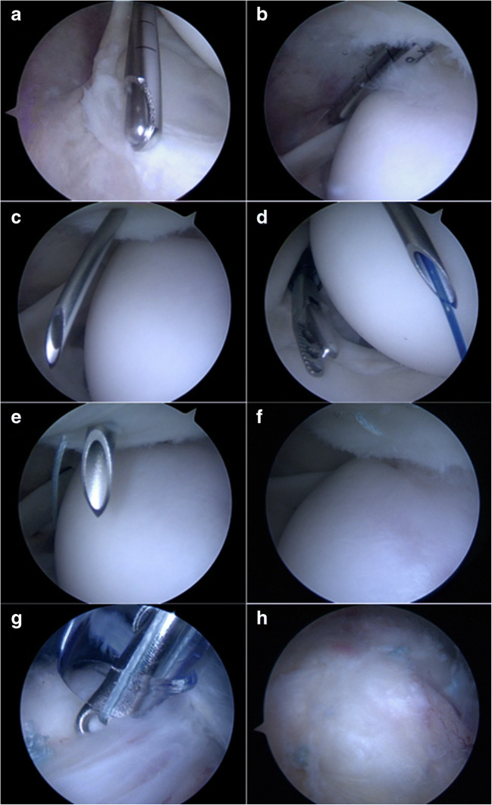](https://www.ncbi.nlm.nih.gov/core/lw/2.0/html/tileshop_pmc/tileshop_pmc_inline.html?title=Click%20on%20image%20to%20zoom&p=PMC3&id=7661672_12178_2020_9675_Fig6_HTML.jpg)

The arthroscopic repair of a laminated rotator cuff tear referred to as
a PAINT (partial-thickness articular surface intratendinous tear) lesion
in a side-to-side fashion to repair the laminated portions without
anchoring back to the footprint in order to avoid over-tensioning of the
cuff and potential deficits in abduction and external rotation. Patient
is a 22-year-old right-hand-dominant male and high-level overhead
athlete with right shoulder pain. MRA confirmed partial-thickness
articular-sided cuff tearing at the posterior supraspinatus and anterior
infraspinatus junction along with posterosuperior labral fraying. These
findings were consistent with internal impingement in this elite
overhead athlete. Patient was placed in the lateral decubitus position,
and diagnostic arthroscopic began from a standard posterior portal.
(**a**) View from the posterior portal shows posterosuperior labral
fraying that was debrided. (**b**) The motorized shaver is placed in
between the laminated flaps to stimulate healing. After debridement of
the tear, the arthroscope is introduced into the subacromial space to
assess the bursal aspect of the cuff which was intact in this case.
(**c**) A spinal needle is placed percutaneously to capture both layers
of the laminated tear. A monofilament suture (blue PDS suture in this
case) is threaded through the eyelet of the spinal needle to serve as a
shuttling suture. (**d**) The shuttling suture is retrieved from the
anterior portal. Outside the anterior portal, a braided high tensile
strength suture is wrapped around the shuttling suture, and the
shuttling suture is retrieved from its percutaneous entry site in order
to pass the suture through the cuff tissue. (**e**) A spinal needle is
then percutaneously introduced to pass the cuff posterior to suture that
was already passed, and a shuttling suture is again passed through the
spinal needle and retrieved from the anterior portal, and the suture
limb from the anterior portal that was already passed through the cuff
is shuttled through. (**f**) These steps create a suture in horizontal
mattress configuration as shown. This process is repeated 3 times in
order to create 3 horizontal mattress sutures to repair the laminated
flaps. (**g**) After all sutures are passed, the arthroscope is
introduced into the subacromial space, and the corresponding suture
limbs are tied to each other through a lateral subacromial cannula.
(**h**) Subacromial view of the final repair construct of the PAINT
lesion without restoration to the footprint to avoid compromise of
abduction and external rotation

## **Outcomes**

A few studies investigate the outcomes of rotator cuff repair or
debridement in tennis players specifically. Sonnery-Cottet and
colleagues
[[15](https://www.ncbi.nlm.nih.gov/pmc/articles/PMC7661672/#CR15)]
retrospectively evaluated 51 tennis players with partial or
full-thickness tears. Thirty-two patients were recreational tennis
players, while 19 were elite competitive tennis players. The authors
reported that full-thickness tears were more common in the older player,
while partial-thickness tears were more common in the younger player. In
their cohort, 42 patients underwent cuff repair, while 9 patients had
debridement alone. Seventy-eight percent (40 of 51) of patients were
able to return to tennis at an average of 10 months after surgery; the
authors reported no difference in return to tennis between the repair or
debridement cohorts. Bigliani and colleagues
[[78](https://www.ncbi.nlm.nih.gov/pmc/articles/PMC7661672/#CR78)]
also retrospectively reviewed their series of rotator cuff repairs in
tennis players. They reviewed 23 tennis players with an average age of
58 years who underwent repair of cuff tears at an average 39-month
follow-up. Overall, 22 of 23 patients returned to tennis with 19
returning to the same level, while 3 returned at a lower level. Only 1
patient was unable to return to tennis. While these 2 studies
demonstrated positive outcomes for return to tennis, more recent studies
in younger athletes show more unpredictable results. A recent small case
series of 8 professional female tennis players who underwent shoulder
surgery on their dominant arm (5 of which were due to rotator cuff
injuries) reported that 7 of 8 players were able to return to
professional play; however, only 2 of 8 were able to return to the same
level of play and ranking postoperatively
[[79](https://www.ncbi.nlm.nih.gov/pmc/articles/PMC7661672/#CR79)•].

Tibone and colleagues
[[80](https://www.ncbi.nlm.nih.gov/pmc/articles/PMC7661672/#CR80)]
also retrospectively reviewed their series of 45 athletes with an
average age of 45 years (with the majority of patients having
partial-thickness tears) and found that only 56% of athletes were able
to return to sport at their pre-injury level. Of the athletes who
required maximal arm abduction and external rotation for their sport,
only 41% (12 of 29) were able to return to play.

A recent meta-analysis
[[81](https://www.ncbi.nlm.nih.gov/pmc/articles/PMC7661672/#CR81)•]
reviewed 25 studies with 859 patients and assessed return to sport after
surgical treatment of rotator cuff injury. The most common sport was
baseball followed by tennis. The authors found that the overall rate of
return to sport was 84.7% with 65.9% of patients returning to the same
level of play. However, when isolating for professional or competitive
athletes, only 49.9% of these athletes were able to return to an
equivalent level of play. Altintas and colleagues
[[82](https://www.ncbi.nlm.nih.gov/pmc/articles/PMC7661672/#CR82)•]
showed in a systematic review of 15 studies (486 patients) that 70.2% of
athletes were able to return to pre-injury level of play after
arthroscopic rotator cuff repair. However, only 61.5% of
elite/competitive athletes did so, and only 38% of overhead athletes
returned to the same level of play. These findings are supported by
another study that showed the majority (88%) of recreational athletes
were able to return to some sport activity after rotator cuff repair
with a decreased percentage (68%) returning to the same sport; but
competitive athletes did so at a much lower rate
[[83](https://www.ncbi.nlm.nih.gov/pmc/articles/PMC7661672/#CR83)].
Another study retrospectively reviewed 32 adolescent athletes (average
age 16) who underwent arthroscopic rotator cuff repair for mostly
partial tears. The authors reported that the majority of overhead
athletes (93%) were able to return to sport; however, more than half
(57%) were forced to play a different position in the sport
[[84](https://www.ncbi.nlm.nih.gov/pmc/articles/PMC7661672/#CR84)•].
Several other studies have shown less than ideal outcomes for overhead
athletes treated operatively for rotator cuff tears in terms of return
to play to the same level. At the professional level, full-thickness
rotator cuff tears may be career-ending injuries. Mazoue and Andrews
[[85](https://www.ncbi.nlm.nih.gov/pmc/articles/PMC7661672/#CR85)]
reviewed a cohort of 16 professional baseball players who underwent
repair for full-thickness cuff tears and noted that only 1 pitcher and 1
position player were able to return to professional play following
surgery on their dominant arm.

In summary, there appears to be a distinction between the older,
recreational tennis player with a full-thickness rotator cuff tear and
the younger, higher level player with a partial-thickness tear. The
outcomes of surgical treatment in terms of return to sport is favorable
for the older recreational athlete, while several studies in the sports
literature show less than ideal return to sport to the same level of
play in the younger more competitive athlete.

## **Conclusions**

Tennis players and other overhead athletes are predisposed to overuse
injuries of the shoulder, including rotator cuff tears. MRI remains the
gold standard for imaging of rotator cuff pathology and other
concomitant injuries about the shoulder. Primary treatment of rotator
cuff tears is non-operative with a period of rest followed by
progressive rehabilitation. Proper technique is emphasized during the
rehabilitation process as well as strengthening of the overall kinetic
chain including the trunk and lower extremities.

Adequate rest between tennis matches can help minimize injury as studies
have shown alterations in shoulder range of motion and scapular
kinematics after prolonged play that self-resolve with rest. Rotator
cuff injuries in the tennis player are most commonly partial
articular-sided tears. Full-thickness tears occur in the older tennis
player and are likely due to degenerative changes. If non-operative
treatment fails, surgical treatment can be pursued, but results are
modest at best for return to sport to pre-injury level of play.
Full-thickness tears are treated as they are in the general population
with repair back to the footprint with suture anchors; however, it must
be recognized that full repair may be difficult for the tennis player to
return to pre-surgical form. Partial-thickness tears can be treated with
debridement alone or with partial repair; the tear can also be completed
into a full-thickness tear and then subsequently repaired to the
footprint. In the general population, partial-thickness articular-sided
tears are generally repaired if the tear involves more than half of the
tendon thickness. A higher threshold exists for repair of cuff tears in
younger high-level athletes as several studies show less than ideal
outcomes in terms of return to sport and return to the same level of
play as compared with the older recreational tennis player. These
decreased outcomes may be related to over-constraint of the athlete's
shoulder after a cuff repair as several studies have shown imaging
consistent with partial-thickness cuff tears in asymptomatic overhead
athletes suggesting that the "pathology" may be an adaptive response to
allow for extremes of range of motion in abduction and external
rotation. Finally, newer technology including use of a bioinductive
scaffold to enhance healing may be an option to consider in the future,
but further research is necessary before it can be widely recommended.

**[References:]**

1. Chung KC, Lark ME. Upper extremity injuries in tennis players:
diagnosis, treatment, and management. Hand Clin. 2017;33(1):175--186.
[[PMC free
article](https://www.ncbi.nlm.nih.gov/pmc/articles/PMC5125509/)]
[[PubMed](https://www.ncbi.nlm.nih.gov/pubmed/27886833)] [[Google
Scholar](https://scholar.google.com/scholar_lookup?journal=Hand+Clin&title=Upper+extremity+injuries+in+tennis+players:+diagnosis,+treatment,+and+management&author=KC+Chung&author=ME+Lark&volume=33&issue=1&publication_year=2017&pages=175-186&pmid=27886833&)]

2. Dines JS, Bedi A, Williams PN, Dodson CC, Ellenbecker TS, Altchek
DW, Windler G, Dines DM. Tennis injuries: epidemiology, pathophysiology,
and treatment. J Am Acad Orthop Surg. 2015;23(3):181--189.
[[PubMed](https://www.ncbi.nlm.nih.gov/pubmed/25667400)] [[Google
Scholar](https://scholar.google.com/scholar_lookup?journal=J+Am+Acad+Orthop+Surg&title=Tennis+injuries:+epidemiology,+pathophysiology,+and+treatment&author=JS+Dines&author=A+Bedi&author=PN+Williams&author=CC+Dodson&author=TS+Ellenbecker&volume=23&issue=3&publication_year=2015&pages=181-189&pmid=25667400&)]

3. Pluim BM, Staal JB, Windler GE, Jayanthi N. Tennis injuries:
occurrence, aetiology, and prevention. Br J Sports Med.
2006;40(5):415--423. [[PMC free
article](https://www.ncbi.nlm.nih.gov/pmc/articles/PMC2577485/)]
[[PubMed](https://www.ncbi.nlm.nih.gov/pubmed/16632572)] [[Google
Scholar](https://scholar.google.com/scholar_lookup?journal=Br+J+Sports+Med&title=Tennis+injuries:+occurrence,+aetiology,+and+prevention&author=BM+Pluim&author=JB+Staal&author=GE+Windler&author=N+Jayanthi&volume=40&issue=5&publication_year=2006&pages=415-423&pmid=16632572&)]

4. Hutchinson MR, Laprade RF, Burnett QM, 2nd, Moss R, Terpstra J.
Injury surveillance at the USTA Boys' Tennis Championships: a 6-yr
study. Med Sci Sports Exerc. 1995;27(6):826--830.
[[PubMed](https://www.ncbi.nlm.nih.gov/pubmed/7658943)] [[Google
Scholar](https://scholar.google.com/scholar_lookup?journal=Med+Sci+Sports+Exerc&title=Injury+surveillance+at+the+USTA+Boys'+Tennis+Championships:+a+6-yr+study&author=MR+Hutchinson&author=RF+Laprade&author=QM+Burnett&author=R+Moss&author=J+Terpstra&volume=27&issue=6&publication_year=1995&pages=826-830&pmid=7658943&)]

5. Winge S, Jorgensen U, Lassen NA. Epidemiology of injuries in Danish
championship tennis. Int J Sports Med. 1989;10(5):368--371.
[[PubMed](https://www.ncbi.nlm.nih.gov/pubmed/2599726)] [[Google
Scholar](https://scholar.google.com/scholar_lookup?journal=Int+J+Sports+Med&title=Epidemiology+of+injuries+in+Danish+championship+tennis&author=S+Winge&author=U+Jorgensen&author=NA+Lassen&volume=10&issue=5&publication_year=1989&pages=368-371&pmid=2599726&)]

6. Abrams GD, Renstrom PA, Safran MR. Epidemiology of musculoskeletal
injury in the tennis player. Br J Sports Med. 2012;46(7):492--498.
[[PubMed](https://www.ncbi.nlm.nih.gov/pubmed/22554841)] [[Google
Scholar](https://scholar.google.com/scholar_lookup?journal=Br+J+Sports+Med&title=Epidemiology+of+musculoskeletal+injury+in+the+tennis+player&author=GD+Abrams&author=PA+Renstrom&author=MR+Safran&volume=46&issue=7&publication_year=2012&pages=492-498&pmid=22554841&)]

7. Lynall RC, Kerr ZY, Djoko A, Pluim BM, Hainline B, Dompier TP.
Epidemiology of National Collegiate Athletic Association men's and
women's tennis injuries, 2009/2010-2014/2015. Br J Sports Med.
2016;50(19):1211--1216.
[[PubMed](https://www.ncbi.nlm.nih.gov/pubmed/26719502)] [[Google
Scholar](https://scholar.google.com/scholar_lookup?journal=Br+J+Sports+Med&title=Epidemiology+of+National+Collegiate+Athletic+Association+men's+and+women's+tennis+injuries,+2009/2010-2014/2015&author=RC+Lynall&author=ZY+Kerr&author=A+Djoko&author=BM+Pluim&author=B+Hainline&volume=50&issue=19&publication_year=2016&pages=1211-1216&pmid=26719502&)]

8. Okholm Kryger K, Dor F, Guillaume M, Haida A, Noirez P, Montalvan B,
Toussaint JF. Medical reasons behind player departures from male and
female professional tennis competitions. Am J Sports Med.
2015;43(1):34--40.
[[PubMed](https://www.ncbi.nlm.nih.gov/pubmed/25398243)] [[Google
Scholar](https://scholar.google.com/scholar_lookup?journal=Am+J+Sports+Med&title=Medical+reasons+behind+player+departures+from+male+and+female+professional+tennis+competitions&author=K+Okholm+Kryger&author=F+Dor&author=M+Guillaume&author=A+Haida&author=P+Noirez&volume=43&issue=1&publication_year=2015&pages=34-40&pmid=25398243&)]

9. Shaffer B, Huttman D. Rotator cuff tears in the throwing athlete.
Sports Med Arthrosc Rev. 2014;22(2):101--109.
[[PubMed](https://www.ncbi.nlm.nih.gov/pubmed/24787724)] [[Google
Scholar](https://scholar.google.com/scholar_lookup?journal=Sports+Med+Arthrosc+Rev&title=Rotator+cuff+tears+in+the+throwing+athlete&author=B+Shaffer&author=D+Huttman&volume=22&issue=2&publication_year=2014&pages=101-109&pmid=24787724&)]

10. Connor PM, Banks DM, Tyson AB, Coumas JS, D'Alessandro DF.
Magnetic resonance imaging of the asymptomatic shoulder of overhead
athletes: a 5-year follow-up study. Am J Sports Med.
2003;31(5):724--727.
[[PubMed](https://www.ncbi.nlm.nih.gov/pubmed/12975193)] [[Google
Scholar](https://scholar.google.com/scholar_lookup?journal=Am+J+Sports+Med&title=Magnetic+resonance+imaging+of+the+asymptomatic+shoulder+of+overhead+athletes:+a+5-year+follow-up+study&author=PM+Connor&author=DM+Banks&author=AB+Tyson&author=JS+Coumas&author=DF+D'Alessandro&volume=31&issue=5&publication_year=2003&pages=724-727&pmid=12975193&)]

11. Johansson FR, Skillgate E, Adolfsson A, Jenner G, DeBri E, Swardh
L, et al. Asymptomatic elite adolescent tennis players' signs of
tendinosis in their dominant shoulder compared with their nondominant
shoulder. J Athl Train. 2015;50(12):1299--1305. [[PMC free
article](https://www.ncbi.nlm.nih.gov/pmc/articles/PMC4741256/)]
[[PubMed](https://www.ncbi.nlm.nih.gov/pubmed/26651279)] [[Google
Scholar](https://scholar.google.com/scholar_lookup?journal=J+Athl+Train&title=Asymptomatic+elite+adolescent+tennis+players'+signs+of+tendinosis+in+their+dominant+shoulder+compared+with+their+nondominant+shoulder&author=FR+Johansson&author=E+Skillgate&author=A+Adolfsson&author=G+Jenner&author=E+DeBri&volume=50&issue=12&publication_year=2015&pages=1299-1305&pmid=26651279&)]

12. Lesniak BP, Baraga MG, Jose J, Smith MK, Cunningham S, Kaplan LD.
Glenohumeral findings on magnetic resonance imaging correlate with
innings pitched in asymptomatic pitchers. Am J Sports Med.
2013;41(9):2022--2027.
[[PubMed](https://www.ncbi.nlm.nih.gov/pubmed/23775245)] [[Google
Scholar](https://scholar.google.com/scholar_lookup?journal=Am+J+Sports+Med&title=Glenohumeral+findings+on+magnetic+resonance+imaging+correlate+with+innings+pitched+in+asymptomatic+pitchers&author=BP+Lesniak&author=MG+Baraga&author=J+Jose&author=MK+Smith&author=S+Cunningham&volume=41&issue=9&publication_year=2013&pages=2022-2027&pmid=23775245&)]

13. Makhni E, ElAttrache N, Ahmad C. Rotator cuff tears in baseball
players. In: Ahmad C, Romeo A, editors. Baseball Sports Medicine.
Philadelphia: Wolters Kluwer; 2019. pp. 181--186. [[Google
Scholar](https://scholar.google.com/scholar_lookup?title=Baseball+Sports+Medicine&author=E+Makhni&author=N+ElAttrache&author=C+Ahmad&publication_year=2019&)]

14. Teunis T, Lubberts B, Reilly BT, Ring D. A systematic review and
pooled analysis of the prevalence of rotator cuff disease with
increasing age. J Shoulder Elb Surg. 2014;23(12):1913--1921.
[[PubMed](https://www.ncbi.nlm.nih.gov/pubmed/25441568)] [[Google
Scholar](https://scholar.google.com/scholar_lookup?journal=J+Shoulder+Elb+Surg&title=A+systematic+review+and+pooled+analysis+of+the+prevalence+of+rotator+cuff+disease+with+increasing+age&author=T+Teunis&author=B+Lubberts&author=BT+Reilly&author=D+Ring&volume=23&issue=12&publication_year=2014&pages=1913-1921&)]

15. Sonnery-Cottet B, Edwards TB, Noel E, Walch G. Rotator cuff tears
in middle-aged tennis players: results of surgical treatment. Am J
Sports Med. 2002;30(4):558--564.
[[PubMed](https://www.ncbi.nlm.nih.gov/pubmed/12130411)] [[Google
Scholar](https://scholar.google.com/scholar_lookup?journal=Am+J+Sports+Med&title=Rotator+cuff+tears+in+middle-aged+tennis+players:+results+of+surgical+treatment&author=B+Sonnery-Cottet&author=TB+Edwards&author=E+Noel&author=G+Walch&volume=30&issue=4&publication_year=2002&pages=558-564&pmid=12130411&)]

16. Conway JE. Arthroscopic repair of partial-thickness rotator cuff
tears and SLAP lesions in professional baseball players. Orthop Clin
North Am. 2001;32(3):443--456.
[[PubMed](https://www.ncbi.nlm.nih.gov/pubmed/11888139)] [[Google
Scholar](https://scholar.google.com/scholar_lookup?journal=Orthop+Clin+North+Am&title=Arthroscopic+repair+of+partial-thickness+rotator+cuff+tears+and+SLAP+lesions+in+professional+baseball+players&author=JE+Conway&volume=32&issue=3&publication_year=2001&pages=443-456&pmid=11888139&)]

17. Ellman H. Diagnosis and treatment of incomplete rotator cuff tears.
Clin Orthop Relat Res. 1990;254:64--74.
[[PubMed](https://www.ncbi.nlm.nih.gov/pubmed/2182260)] [[Google
Scholar](https://scholar.google.com/scholar_lookup?journal=Clin+Orthop+Relat+Res&title=Diagnosis+and+treatment+of+incomplete+rotator+cuff+tears&author=H+Ellman&volume=254&publication_year=1990&pages=64-74&)]

18. Snyder SJ, Pachelli AF, Del Pizzo W, Friedman MJ, Ferkel RD, Pattee
G. Partial thickness rotator cuff tears: results of arthroscopic
treatment. Arthroscopy. 1991;7(1):1--7.
[[PubMed](https://www.ncbi.nlm.nih.gov/pubmed/2009105)] [[Google
Scholar](https://scholar.google.com/scholar_lookup?journal=Arthroscopy.&title=Partial+thickness+rotator+cuff+tears:+results+of+arthroscopic+treatment&author=SJ+Snyder&author=AF+Pachelli&author=W+Del+Pizzo&author=MJ+Friedman&author=RD+Ferkel&volume=7&issue=1&publication_year=1991&pages=1-7&pmid=2009105&)]

19. Economopoulos KJ, Brockmeier SF. Rotator cuff tears in overhead
athletes. Clin Sports Med. 2012;31(4):675--692.
[[PubMed](https://www.ncbi.nlm.nih.gov/pubmed/23040553)] [[Google
Scholar](https://scholar.google.com/scholar_lookup?journal=Clin+Sports+Med&title=Rotator+cuff+tears+in+overhead+athletes&author=KJ+Economopoulos&author=SF+Brockmeier&volume=31&issue=4&publication_year=2012&pages=675-692&pmid=23040553&)]

20. Burkhart SS, Morgan CD, Kibler WB. The disabled throwing shoulder:
spectrum of pathology part I: pathoanatomy and biomechanics.
Arthroscopy. 2003;19(4):404--420.
[[PubMed](https://www.ncbi.nlm.nih.gov/pubmed/12671624)] [[Google
Scholar](https://scholar.google.com/scholar_lookup?journal=Arthroscopy.&title=The+disabled+throwing+shoulder:+spectrum+of+pathology+part+I:+pathoanatomy+and+biomechanics&author=SS+Burkhart&author=CD+Morgan&author=WB+Kibler&volume=19&issue=4&publication_year=2003&pages=404-420&pmid=12671624&)]

21. Dillman CJ, Fleisig GS, Andrews JR. Biomechanics of pitching with
emphasis upon shoulder kinematics. J Orthop Sports Phys Ther.
1993;18(2):402--408.
[[PubMed](https://www.ncbi.nlm.nih.gov/pubmed/8364594)] [[Google
Scholar](https://scholar.google.com/scholar_lookup?journal=J+Orthop+Sports+Phys+Ther&title=Biomechanics+of+pitching+with+emphasis+upon+shoulder+kinematics&author=CJ+Dillman&author=GS+Fleisig&author=JR+Andrews&volume=18&issue=2&publication_year=1993&pages=402-408&pmid=8364594&)]

22. Gainor BJ, Piotrowski G, Puhl J, Allen WC, Hagen R. The throw:
biomechanics and acute injury. Am J Sports Med. 1980;8(2):114--118.
[[PubMed](https://www.ncbi.nlm.nih.gov/pubmed/7361975)] [[Google
Scholar](https://scholar.google.com/scholar_lookup?journal=Am+J+Sports+Med&title=The+throw:+biomechanics+and+acute+injury&author=BJ+Gainor&author=G+Piotrowski&author=J+Puhl&author=WC+Allen&author=R+Hagen&volume=8&issue=2&publication_year=1980&pages=114-118&pmid=7361975&)]

23. Williams GR, Kelley M. Management of rotator cuff and impingement
injuries in the athlete. J Athl Train. 2000;35(3):300--315. [[PMC free
article](https://www.ncbi.nlm.nih.gov/pmc/articles/PMC1323393/)]
[[PubMed](https://www.ncbi.nlm.nih.gov/pubmed/16558644)] [[Google
Scholar](https://scholar.google.com/scholar_lookup?journal=J+Athl+Train&title=Management+of+rotator+cuff+and+impingement+injuries+in+the+athlete&author=GR+Williams&author=M+Kelley&volume=35&issue=3&publication_year=2000&pages=300-315&pmid=16558644&)]

24. Elliott B. Biomechanics and tennis. Br J Sports Med.
2006;40(5):392--396. [[PMC free
article](https://www.ncbi.nlm.nih.gov/pmc/articles/PMC2577481/)]
[[PubMed](https://www.ncbi.nlm.nih.gov/pubmed/16632567)] [[Google
Scholar](https://scholar.google.com/scholar_lookup?journal=Br+J+Sports+Med&title=Biomechanics+and+tennis&author=B+Elliott&volume=40&issue=5&publication_year=2006&pages=392-396&pmid=16632567&)]

25. Wilk KE, Macrina LC, Fleisig GS, Porterfield R, Simpson CD, 2nd,
Harker P, et al. Correlation of glenohumeral internal rotation deficit
and total rotational motion to shoulder injuries in professional
baseball pitchers. Am J Sports Med. 2011;39(2):329--335.
[[PubMed](https://www.ncbi.nlm.nih.gov/pubmed/21131681)] [[Google
Scholar](https://scholar.google.com/scholar_lookup?journal=Am+J+Sports+Med&title=Correlation+of+glenohumeral+internal+rotation+deficit+and+total+rotational+motion+to+shoulder+injuries+in+professional+baseball+pitchers&author=KE+Wilk&author=LC+Macrina&author=GS+Fleisig&author=R+Porterfield&author=CD+Simpson&volume=39&issue=2&publication_year=2011&pages=329-335&pmid=21131681&)]

26. Wilk KE, Macrina LC, Fleisig GS, Aune KT, Porterfield RA, Harker P,
Evans TJ, Andrews JR. Deficits in glenohumeral passive range of motion
increase risk of shoulder injury in professional baseball pitchers: a
prospective study. Am J Sports Med. 2015;43(10):2379--2385.
[[PubMed](https://www.ncbi.nlm.nih.gov/pubmed/26272516)] [[Google
Scholar](https://scholar.google.com/scholar_lookup?journal=Am+J+Sports+Med&title=Deficits+in+glenohumeral+passive+range+of+motion+increase+risk+of+shoulder+injury+in+professional+baseball+pitchers:+a+prospective+study&author=KE+Wilk&author=LC+Macrina&author=GS+Fleisig&author=KT+Aune&author=RA+Porterfield&volume=43&issue=10&publication_year=2015&pages=2379-2385&pmid=26272516&)]

27. Walch G, Boileau P, Noel E, Donell ST. Impingement of the deep
surface of the supraspinatus tendon on the posterosuperior glenoid rim:
an arthroscopic study. J Shoulder Elb Surg. 1992;1(5):238--245.
[[PubMed](https://www.ncbi.nlm.nih.gov/pubmed/22959196)] [[Google
Scholar](https://scholar.google.com/scholar_lookup?journal=J+Shoulder+Elb+Surg&title=Impingement+of+the+deep+surface+of+the+supraspinatus+tendon+on+the+posterosuperior+glenoid+rim:+an+arthroscopic+study&author=G+Walch&author=P+Boileau&author=E+Noel&author=ST+Donell&volume=1&issue=5&publication_year=1992&pages=238-245&)]

28. Myers JB, Laudner KG, Pasquale MR, Bradley JP, Lephart SM. Scapular
position and orientation in throwing athletes. Am J Sports Med.
2005;33(2):263--271.
[[PubMed](https://www.ncbi.nlm.nih.gov/pubmed/15701613)] [[Google
Scholar](https://scholar.google.com/scholar_lookup?journal=Am+J+Sports+Med&title=Scapular+position+and+orientation+in+throwing+athletes&author=JB+Myers&author=KG+Laudner&author=MR+Pasquale&author=JP+Bradley&author=SM+Lephart&volume=33&issue=2&publication_year=2005&pages=263-271&pmid=15701613&)]

29. Rich RL, Struminger AH, Tucker WS, Munkasy BA, Joyner AB, Buckley
TA. Scapular upward-rotation deficits after acute fatigue in tennis
players. J Athl Train. 2016;51(6):474--479. [[PMC free
article](https://www.ncbi.nlm.nih.gov/pmc/articles/PMC5076282/)]
[[PubMed](https://www.ncbi.nlm.nih.gov/pubmed/27434703)] [[Google
Scholar](https://scholar.google.com/scholar_lookup?journal=J+Athl+Train&title=Scapular+upward-rotation+deficits+after+acute+fatigue+in+tennis+players&author=RL+Rich&author=AH+Struminger&author=WS+Tucker&author=BA+Munkasy&author=AB+Joyner&volume=51&issue=6&publication_year=2016&pages=474-479&pmid=27434703&)]

30. Neer CS. Anterior acromioplasty for the chronic impingement
syndrome in the shoulder. J Bone Joint Surg Am. 2005;87a(6):1399.
[[PubMed](https://www.ncbi.nlm.nih.gov/pubmed/15930554)] [[Google
Scholar](https://scholar.google.com/scholar_lookup?journal=J+Bone+Joint+Surg+Am&title=Anterior+acromioplasty+for+the+chronic+impingement+syndrome+in+the+shoulder&author=CS+Neer&volume=87a&issue=6&publication_year=2005&pages=1399&)]

31. Johnson CD, McHugh MP, Wood T, Kibler B. Performance demands of
professional male tennis players. Br J Sports Med. 2006;40(8):696--699.
[[PMC free
article](https://www.ncbi.nlm.nih.gov/pmc/articles/PMC2579459/)]
[[PubMed](https://www.ncbi.nlm.nih.gov/pubmed/16864564)] [[Google
Scholar](https://scholar.google.com/scholar_lookup?journal=Br+J+Sports+Med&title=Performance+demands+of+professional+male+tennis+players&author=CD+Johnson&author=MP+McHugh&author=T+Wood&author=B+Kibler&volume=40&issue=8&publication_year=2006&pages=696-699&pmid=16864564&)]

32. Miller S. Modern tennis rackets, balls, and surfaces. Br J Sports
Med. 2006;40(5):401--405. [[PMC free
article](https://www.ncbi.nlm.nih.gov/pmc/articles/PMC2577483/)]
[[PubMed](https://www.ncbi.nlm.nih.gov/pubmed/16632569)] [[Google
Scholar](https://scholar.google.com/scholar_lookup?journal=Br+J+Sports+Med&title=Modern+tennis+rackets,+balls,+and+surfaces&author=S+Miller&volume=40&issue=5&publication_year=2006&pages=401-405&pmid=16632569&)]

33. Myers NL, Sciascia AD, Kibler WB, Uhl TL. Volume-based interval
training program for elite tennis players. Sports Health.
2016;8(6):536--540. [[PMC free
article](https://www.ncbi.nlm.nih.gov/pmc/articles/PMC5089352/)]
[[PubMed](https://www.ncbi.nlm.nih.gov/pubmed/27370009)] [[Google
Scholar](https://scholar.google.com/scholar_lookup?journal=Sports+Health&title=Volume-based+interval+training+program+for+elite+tennis+players&author=NL+Myers&author=AD+Sciascia&author=WB+Kibler&author=TL+Uhl&volume=8&issue=6&publication_year=2016&pages=536-540&pmid=27370009&)]

34. Kovacs MS. Applied physiology of tennis performance. Br J Sports
Med. 2006;40(5):381--385. [[PMC free
article](https://www.ncbi.nlm.nih.gov/pmc/articles/PMC2653871/)]
[[PubMed](https://www.ncbi.nlm.nih.gov/pubmed/16632565)] [[Google
Scholar](https://scholar.google.com/scholar_lookup?journal=Br+J+Sports+Med&title=Applied+physiology+of+tennis+performance&author=MS+Kovacs&volume=40&issue=5&publication_year=2006&pages=381-385&pmid=16632565&)]

35. Elliott B, Fleisig G, Nicholls R, Escamilia R. Technique effects on
upper limb loading in the tennis serve. J Sci Med Sport.
2003;6(1):76--87.
[[PubMed](https://www.ncbi.nlm.nih.gov/pubmed/12801213)] [[Google
Scholar](https://scholar.google.com/scholar_lookup?journal=J+Sci+Med+Sport&title=Technique+effects+on+upper+limb+loading+in+the+tennis+serve&author=B+Elliott&author=G+Fleisig&author=R+Nicholls&author=R+Escamilia&volume=6&issue=1&publication_year=2003&pages=76-87&pmid=12801213&)]

36. Wei SH, Chiang JY, Shiang TY, Chang HY. Comparison of shock
transmission and forearm electromyography between experienced and
recreational tennis players during backhand strokes. Clin J Sport Med.
2006;16(2):129--135.
[[PubMed](https://www.ncbi.nlm.nih.gov/pubmed/16603882)] [[Google
Scholar](https://scholar.google.com/scholar_lookup?journal=Clin+J+Sport+Med&title=Comparison+of+shock+transmission+and+forearm+electromyography+between+experienced+and+recreational+tennis+players+during+backhand+strokes&author=SH+Wei&author=JY+Chiang&author=TY+Shiang&author=HY+Chang&volume=16&issue=2&publication_year=2006&pages=129-135&pmid=16603882&)]

37. Lo KC, Hsieh YC. Comparison of ball-and-racket impact force in
two-handed backhand stroke stances for different-skill-level tennis
players. J Sports Sci Med. 2016;15(2):301--307. [[PMC free
article](https://www.ncbi.nlm.nih.gov/pmc/articles/PMC4879444/)]
[[PubMed](https://www.ncbi.nlm.nih.gov/pubmed/27274668)] [[Google
Scholar](https://scholar.google.com/scholar_lookup?journal=J+Sports+Sci+Med&title=Comparison+of+ball-and-racket+impact+force+in+two-handed+backhand+stroke+stances+for+different-skill-level+tennis+players&author=KC+Lo&author=YC+Hsieh&volume=15&issue=2&publication_year=2016&pages=301-307&pmid=27274668&)]

38. Martin C, Bideau B, Bideau N, Nicolas G, Delamarche P, Kulpa R.
Energy flow analysis during the tennis serve: comparison between injured
and noninjured tennis players. Am J Sports Med. 2014;42(11):2751--2760.
[[PubMed](https://www.ncbi.nlm.nih.gov/pubmed/25167995)] [[Google
Scholar](https://scholar.google.com/scholar_lookup?journal=Am+J+Sports+Med&title=Energy+flow+analysis+during+the+tennis+serve:+comparison+between+injured+and+noninjured+tennis+players&author=C+Martin&author=B+Bideau&author=N+Bideau&author=G+Nicolas&author=P+Delamarche&volume=42&issue=11&publication_year=2014&pages=2751-2760&pmid=25167995&)]

39. Abrams GD, Sheets AL, Andriacchi TP, Safran MR. Review of tennis
serve motion analysis and the biomechanics of three serve types with
implications for injury. Sports Biomech. 2011;10(4):378--390.
[[PubMed](https://www.ncbi.nlm.nih.gov/pubmed/22303788)] [[Google
Scholar](https://scholar.google.com/scholar_lookup?journal=Sports+Biomech&title=Review+of+tennis+serve+motion+analysis+and+the+biomechanics+of+three+serve+types+with+implications+for+injury&author=GD+Abrams&author=AL+Sheets&author=TP+Andriacchi&author=MR+Safran&volume=10&issue=4&publication_year=2011&pages=378-390&pmid=22303788&)]

40. Myers JB, Laudner KG, Pasquale MR, Bradley JP, Lephart SM.
Glenohumeral range of motion deficits and posterior shoulder tightness
in throwers with pathologic internal impingement. Am J Sports Med.
2006;34(3):385--391.
[[PubMed](https://www.ncbi.nlm.nih.gov/pubmed/16303877)] [[Google
Scholar](https://scholar.google.com/scholar_lookup?journal=Am+J+Sports+Med&title=Glenohumeral+range+of+motion+deficits+and+posterior+shoulder+tightness+in+throwers+with+pathologic+internal+impingement&author=JB+Myers&author=KG+Laudner&author=MR+Pasquale&author=JP+Bradley&author=SM+Lephart&volume=34&issue=3&publication_year=2006&pages=385-391&pmid=16303877&)]

41. Martin C, Kulpa R, Ezanno F, Delamarche P, Bideau B. Influence of
playing a prolonged tennis match on shoulder internal range of motion.
Am J Sports Med. 2016;44(8):2147--2151.
[[PubMed](https://www.ncbi.nlm.nih.gov/pubmed/27184541)] [[Google
Scholar](https://scholar.google.com/scholar_lookup?journal=Am+J+Sports+Med&title=Influence+of+playing+a+prolonged+tennis+match+on+shoulder+internal+range+of+motion&author=C+Martin&author=R+Kulpa&author=F+Ezanno&author=P+Delamarche&author=B+Bideau&volume=44&issue=8&publication_year=2016&pages=2147-2151&pmid=27184541&)]

42. Pluim BM, Clarsen B, Verhagen E. Injury rates in recreational
tennis players do not differ between different playing surfaces. Br J
Sports Med. 2018;52(9):611--615.
[[PubMed](https://www.ncbi.nlm.nih.gov/pubmed/28209569)] [[Google
Scholar](https://scholar.google.com/scholar_lookup?journal=Br+J+Sports+Med&title=Injury+rates+in+recreational+tennis+players+do+not+differ+between+different+playing+surfaces&author=BM+Pluim&author=B+Clarsen&author=E+Verhagen&volume=52&issue=9&publication_year=2018&pages=611-615&pmid=28209569&)]

43. Ben Kibler W, Sciascia AD, Hester P, Dome D, Jacobs C. Clinical
utility of traditional and new tests in the diagnosis of biceps tendon
injuries and superior labrum anterior and posterior lesions in the
shoulder. Am J Sports Med. 2009;37(9):1840--1847.
[[PubMed](https://www.ncbi.nlm.nih.gov/pubmed/19509414)] [[Google
Scholar](https://scholar.google.com/scholar_lookup?journal=Am+J+Sports+Med&title=Clinical+utility+of+traditional+and+new+tests+in+the+diagnosis+of+biceps+tendon+injuries+and+superior+labrum+anterior+and+posterior+lesions+in+the+shoulder&author=W+Ben+Kibler&author=AD+Sciascia&author=P+Hester&author=D+Dome&author=C+Jacobs&volume=37&issue=9&publication_year=2009&pages=1840-1847&pmid=19509414&)]

44. Hamner DL, Pink MM, Jobe FW. A modification of the relocation test:
arthroscopic findings associated with a positive test. J Shoulder Elb
Surg. 2000;9(4):263--267.
[[PubMed](https://www.ncbi.nlm.nih.gov/pubmed/10979519)] [[Google
Scholar](https://scholar.google.com/scholar_lookup?journal=J+Shoulder+Elb+Surg&title=A+modification+of+the+relocation+test:+arthroscopic+findings+associated+with+a+positive+test&author=DL+Hamner&author=MM+Pink&author=FW+Jobe&volume=9&issue=4&publication_year=2000&pages=263-267&)]

45. Zaslav KR. Internal rotation resistance strength test: a new
diagnostic test to differentiate intra-articular pathology from outlet
(Neer) impingement syndrome in the shoulder. J Shoulder Elb Surg.
2001;10(1):23--27.
[[PubMed](https://www.ncbi.nlm.nih.gov/pubmed/11182732)] [[Google
Scholar](https://scholar.google.com/scholar_lookup?journal=J+Shoulder+Elb+Surg&title=Internal+rotation+resistance+strength+test:+a+new+diagnostic+test+to+differentiate+intra-articular+pathology+from+outlet+(Neer)+impingement+syndrome+in+the+shoulder&author=KR+Zaslav&volume=10&issue=1&publication_year=2001&pages=23-27&)]

46. Bigliani LU, Ticker JB, Flatow EL, Soslowsky LJ, Mow VC. The
relationship of acromial architecture to rotator cuff disease. Clin
Sports Med. 1991;10(4):823--838.
[[PubMed](https://www.ncbi.nlm.nih.gov/pubmed/1934099)] [[Google
Scholar](https://scholar.google.com/scholar_lookup?journal=Clin+Sports+Med&title=The+relationship+of+acromial+architecture+to+rotator+cuff+disease&author=LU+Bigliani&author=JB+Ticker&author=EL+Flatow&author=LJ+Soslowsky&author=VC+Mow&volume=10&issue=4&publication_year=1991&pages=823-838&pmid=1934099&)]

47. Pearsall AW, Bonsell S, Heitman RJ, Helms CA, Osbahr D, Speer KP.
Radiographic findings associated with symptomatic rotator cuff tears. J
Shoulder Elb Surg. 2003;12(2):122--127.
[[PubMed](https://www.ncbi.nlm.nih.gov/pubmed/12700562)] [[Google
Scholar](https://scholar.google.com/scholar_lookup?journal=J+Shoulder+Elb+Surg&title=Radiographic+findings+associated+with+symptomatic+rotator+cuff+tears&author=AW+Pearsall&author=S+Bonsell&author=RJ+Heitman&author=CA+Helms&author=D+Osbahr&volume=12&issue=2&publication_year=2003&pages=122-127&)]

48. Rudzki JR, Shaffer B. New approaches to diagnosis and arthroscopic
management of partial-thickness cuff tears. Clin Sports Med.
2008;27(4):691--717.
[[PubMed](https://www.ncbi.nlm.nih.gov/pubmed/19064151)] [[Google
Scholar](https://scholar.google.com/scholar_lookup?journal=Clin+Sports+Med&title=New+approaches+to+diagnosis+and+arthroscopic+management+of+partial-thickness+cuff+tears&author=JR+Rudzki&author=B+Shaffer&volume=27&issue=4&publication_year=2008&pages=691-717&pmid=19064151&)]

49. Smith TO, Back T, Toms AP, Hing CB. Diagnostic accuracy of
ultrasound for rotator cuff tears in adults: a systematic review and
meta-analysis. Clin Radiol. 2011;66(11):1036--1048.
[[PubMed](https://www.ncbi.nlm.nih.gov/pubmed/21737069)] [[Google
Scholar](https://scholar.google.com/scholar_lookup?journal=Clin+Radiol&title=Diagnostic+accuracy+of+ultrasound+for+rotator+cuff+tears+in+adults:+a+systematic+review+and+meta-analysis&author=TO+Smith&author=T+Back&author=AP+Toms&author=CB+Hing&volume=66&issue=11&publication_year=2011&pages=1036-1048&pmid=21737069&)]

50. Smith TO, Daniell H, Geere JA, Toms AP, Hing CB. The diagnostic
accuracy of MRI for the detection of partial- and full-thickness rotator
cuff tears in adults. Magn Reson Imaging. 2012;30(3):336--346.
[[PubMed](https://www.ncbi.nlm.nih.gov/pubmed/22260933)] [[Google
Scholar](https://scholar.google.com/scholar_lookup?journal=Magn+Reson+Imaging&title=The+diagnostic+accuracy+of+MRI+for+the+detection+of+partial-+and+full-thickness+rotator+cuff+tears+in+adults&author=TO+Smith&author=H+Daniell&author=JA+Geere&author=AP+Toms&author=CB+Hing&volume=30&issue=3&publication_year=2012&pages=336-346&pmid=22260933&)]

51. Meister K, Thesing J, Montgomery WJ, Indelicato PA, Walczak S,
Fontenot W. MR arthrography of partial thickness tears of the
undersurface of the rotator cuff: an arthroscopic correlation. Skelet
Radiol. 2004;33(3):136--141.
[[PubMed](https://www.ncbi.nlm.nih.gov/pubmed/14513293)] [[Google
Scholar](https://scholar.google.com/scholar_lookup?journal=Skelet+Radiol&title=MR+arthrography+of+partial+thickness+tears+of+the+undersurface+of+the+rotator+cuff:+an+arthroscopic+correlation&author=K+Meister&author=J+Thesing&author=WJ+Montgomery&author=PA+Indelicato&author=S+Walczak&volume=33&issue=3&publication_year=2004&pages=136-141&)]

52. Lee SY, Lee JK. Horizontal component of partial-thickness tears of
rotator cuff: imaging characteristics and comparison of ABER view with
oblique coronal view at MR arthrography initial results. Radiology.
2002;224(2):470--476.
[[PubMed](https://www.ncbi.nlm.nih.gov/pubmed/12147844)] [[Google
Scholar](https://scholar.google.com/scholar_lookup?journal=Radiology.&title=Horizontal+component+of+partial-thickness+tears+of+rotator+cuff:+imaging+characteristics+and+comparison+of+ABER+view+with+oblique+coronal+view+at+MR+arthrography+initial+results&author=SY+Lee&author=JK+Lee&volume=224&issue=2&publication_year=2002&pages=470-476&pmid=12147844&)]

53. Hechtman K, Bemden A, Thorpe M, Blaske K, Arteaga J. Paper 160: MRI
evaluation of rotator cuff inflammation in baseball pitchers pre and
post-competition. Arthroscopy. 2012;28(8):e268. [[Google
Scholar](https://scholar.google.com/scholar_lookup?journal=Arthroscopy.&title=Paper+160:+MRI+evaluation+of+rotator+cuff+inflammation+in+baseball+pitchers+pre+and+post-competition&author=K+Hechtman&author=A+Bemden&author=M+Thorpe&author=K+Blaske&author=J+Arteaga&volume=28&issue=8&publication_year=2012&pages=e268&)]

54. Liu JN, Garcia GH, Gowd AK, Cabarcas BC, Charles MD, Romeo AA, et
al. Treatment of partial thickness rotator cuff tears in overhead
athletes. Curr Rev Musculoskelet Med. 2018;11(1):55--62. [[PMC free
article](https://www.ncbi.nlm.nih.gov/pmc/articles/PMC5825340/)]
[[PubMed](https://www.ncbi.nlm.nih.gov/pubmed/29330670)] [[Google
Scholar](https://scholar.google.com/scholar_lookup?journal=Curr+Rev+Musculoskelet+Med&title=Treatment+of+partial+thickness+rotator+cuff+tears+in+overhead+athletes&author=JN+Liu&author=GH+Garcia&author=AK+Gowd&author=BC+Cabarcas&author=MD+Charles&volume=11&issue=1&publication_year=2018&pages=55-62&pmid=29330670&)]

55. Weiss LJ, Wang D, Hendel M, Buzzerio P, Rodeo SA. Management of
rotator cuff injuries in the elite athlete. Curr Rev Musculoskelet Med.
2018;11(1):102--112. [[PMC free
article](https://www.ncbi.nlm.nih.gov/pmc/articles/PMC5825345/)]
[[PubMed](https://www.ncbi.nlm.nih.gov/pubmed/29332181)] [[Google
Scholar](https://scholar.google.com/scholar_lookup?journal=Curr+Rev+Musculoskelet+Med&title=Management+of+rotator+cuff+injuries+in+the+elite+athlete&author=LJ+Weiss&author=D+Wang&author=M+Hendel&author=P+Buzzerio&author=SA+Rodeo&volume=11&issue=1&publication_year=2018&pages=102-112&pmid=29332181&)]

56. Schneeberger AG, Nyffeler RW, Gerber C. Structural changes of the
rotator cuff caused by experimental subacromial impingement in the rat.
J Shoulder Elb Surg. 1998;7(4):375--380.
[[PubMed](https://www.ncbi.nlm.nih.gov/pubmed/9752647)] [[Google
Scholar](https://scholar.google.com/scholar_lookup?journal=J+Shoulder+Elb+Surg&title=Structural+changes+of+the+rotator+cuff+caused+by+experimental+subacromial+impingement+in+the+rat&author=AG+Schneeberger&author=RW+Nyffeler&author=C+Gerber&volume=7&issue=4&publication_year=1998&pages=375-380&)]

57. Wei AS, Callaci JJ, Juknelis D, Marra G, Tonino P, Freedman KB, et
al. The effect of corticosteroid on collagen expression in injured
rotator cuff tendon. J Bone Joint Surg Am. 2006;88(6):1331--1338. [[PMC
free article](https://www.ncbi.nlm.nih.gov/pmc/articles/PMC3071041/)]
[[PubMed](https://www.ncbi.nlm.nih.gov/pubmed/16757768)] [[Google
Scholar](https://scholar.google.com/scholar_lookup?journal=J+Bone+Joint+Surg+Am&title=The+effect+of+corticosteroid+on+collagen+expression+in+injured+rotator+cuff+tendon&author=AS+Wei&author=JJ+Callaci&author=D+Juknelis&author=G+Marra&author=P+Tonino&volume=88&issue=6&publication_year=2006&pages=1331-1338&pmid=16757768&)]

58. Boudreault J, Desmeules F, Roy JS, Dionne C, Fremont P, Macdermid
JC. The efficacy of oral non-steroidal anti-inflammatory drugs for
rotator cuff tendinopathy: a systematic review and meta-analysis. J
Rehabil Med. 2014;46(4):294--306.
[[PubMed](https://www.ncbi.nlm.nih.gov/pubmed/24626286)] [[Google
Scholar](https://scholar.google.com/scholar_lookup?journal=J+Rehabil+Med&title=The+efficacy+of+oral+non-steroidal+anti-inflammatory+drugs+for+rotator+cuff+tendinopathy:+a+systematic+review+and+meta-analysis&author=J+Boudreault&author=F+Desmeules&author=JS+Roy&author=C+Dionne&author=P+Fremont&volume=46&issue=4&publication_year=2014&pages=294-306&pmid=24626286&)]

59. Buchbinder R, Green S, Youd JM. Corticosteroid injections for
shoulder pain. Cochrane Database Syst Rev. 2003;1:CD004016. [[PMC free
article](https://www.ncbi.nlm.nih.gov/pmc/articles/PMC6464922/)]
[[PubMed](https://www.ncbi.nlm.nih.gov/pubmed/12535501)] [[Google
Scholar](https://scholar.google.com/scholar_lookup?journal=Cochrane+Database+Syst+Rev&title=Corticosteroid+injections+for+shoulder+pain&author=R+Buchbinder&author=S+Green&author=JM+Youd&volume=1&publication_year=2003&pages=CD004016&)]

60. Blair B, Rokito AS, Cuomo F, Jarolem K, Zuckerman JD. Efficacy of
injections of corticosteroids for subacromial impingement syndrome. J
Bone Joint Surg Am. 1996;78(11):1685--1689.
[[PubMed](https://www.ncbi.nlm.nih.gov/pubmed/8934482)] [[Google
Scholar](https://scholar.google.com/scholar_lookup?journal=J+Bone+Joint+Surg+Am&title=Efficacy+of+injections+of+corticosteroids+for+subacromial+impingement+syndrome&author=B+Blair&author=AS+Rokito&author=F+Cuomo&author=K+Jarolem&author=JD+Zuckerman&volume=78&issue=11&publication_year=1996&pages=1685-1689&pmid=8934482&)]

61. Alvarez CM, Litchfield R, Jackowski D, Griffin S, Kirkley A. A
prospective, double-blind, randomized clinical trial comparing
subacromial injection of betamethasone and xylocaine to xylocaine alone
in chronic rotator cuff tendinosis. Am J Sports Med.
2005;33(2):255--262.
[[PubMed](https://www.ncbi.nlm.nih.gov/pubmed/15701612)] [[Google
Scholar](https://scholar.google.com/scholar_lookup?journal=Am+J+Sports+Med&title=A+prospective,+double-blind,+randomized+clinical+trial+comparing+subacromial+injection+of+betamethasone+and+xylocaine+to+xylocaine+alone+in+chronic+rotator+cuff+tendinosis&author=CM+Alvarez&author=R+Litchfield&author=D+Jackowski&author=S+Griffin&author=A+Kirkley&volume=33&issue=2&publication_year=2005&pages=255-262&pmid=15701612&)]

62. Mohamadi A, Chan JJ, Claessen FM, Ring D, Chen NC. Corticosteroid
injections give small and transient pain relief in rotator cuff
tendinosis: a meta-analysis. Clin Orthop Relat Res.
2017;475(1):232--243. [[PMC free
article](https://www.ncbi.nlm.nih.gov/pmc/articles/PMC5174041/)]
[[PubMed](https://www.ncbi.nlm.nih.gov/pubmed/27469590)] [[Google
Scholar](https://scholar.google.com/scholar_lookup?journal=Clin+Orthop+Relat+Res&title=Corticosteroid+injections+give+small+and+transient+pain+relief+in+rotator+cuff+tendinosis:+a+meta-analysis&author=A+Mohamadi&author=JJ+Chan&author=FM+Claessen&author=D+Ring&author=NC+Chen&volume=475&issue=1&publication_year=2017&pages=232-243&pmid=27469590&)]

63. Withrington RH, Girgis FL, Seifert MH. A placebo-controlled trial
of steroid injections in the treatment of supraspinatus tendonitis.
Scand J Rheumatol. 1985;14(1):76--78.
[[PubMed](https://www.ncbi.nlm.nih.gov/pubmed/3890159)] [[Google
Scholar](https://scholar.google.com/scholar_lookup?journal=Scand+J+Rheumatol&title=A+placebo-controlled+trial+of+steroid+injections+in+the+treatment+of+supraspinatus+tendonitis&author=RH+Withrington&author=FL+Girgis&author=MH+Seifert&volume=14&issue=1&publication_year=1985&pages=76-78&pmid=3890159&)]

64. Cohen SB, Towers JD, Bradley JP. Rotator cuff contusions of the
shoulder in professional football players: epidemiology and magnetic
resonance imaging findings. Am J Sports Med. 2007;35(3):442--447.
[[PubMed](https://www.ncbi.nlm.nih.gov/pubmed/17158276)] [[Google
Scholar](https://scholar.google.com/scholar_lookup?journal=Am+J+Sports+Med&title=Rotator+cuff+contusions+of+the+shoulder+in+professional+football+players:+epidemiology+and+magnetic+resonance+imaging+findings&author=SB+Cohen&author=JD+Towers&author=JP+Bradley&volume=35&issue=3&publication_year=2007&pages=442-447&pmid=17158276&)]

65. Payne LZ, Altchek DW, Craig EV, Warren RF. Arthroscopic treatment
of partial rotator cuff tears in young athletes. A preliminary report.
Am J Sports Med. 1997;25(3):299--305.
[[PubMed](https://www.ncbi.nlm.nih.gov/pubmed/9167807)] [[Google
Scholar](https://scholar.google.com/scholar_lookup?journal=Am+J+Sports+Med&title=Arthroscopic+treatment+of+partial+rotator+cuff+tears+in+young+athletes.+A+preliminary+report&author=LZ+Payne&author=DW+Altchek&author=EV+Craig&author=RF+Warren&volume=25&issue=3&publication_year=1997&pages=299-305&pmid=9167807&)]

66. Carr AJ, Murphy R, Dakin SG, Rombach I, Wheway K, Watkins B,
Franklin SL. Platelet-rich plasma injection with arthroscopic
acromioplasty for chronic rotator cuff tendinopathy: a randomized
controlled trial. Am J Sports Med. 2015;43(12):2891--2897.
[[PubMed](https://www.ncbi.nlm.nih.gov/pubmed/26498958)] [[Google
Scholar](https://scholar.google.com/scholar_lookup?journal=Am+J+Sports+Med&title=Platelet-rich+plasma+injection+with+arthroscopic+acromioplasty+for+chronic+rotator+cuff+tendinopathy:+a+randomized+controlled+trial&author=AJ+Carr&author=R+Murphy&author=SG+Dakin&author=I+Rombach&author=K+Wheway&volume=43&issue=12&publication_year=2015&pages=2891-2897&pmid=26498958&)]

67. Kesikburun S, Tan AK, Yilmaz B, Yasar E, Yazicioglu K.
Platelet-rich plasma injections in the treatment of chronic rotator cuff
tendinopathy: a randomized controlled trial with 1-year follow-up. Am J
Sports Med. 2013;41(11):2609--2616.
[[PubMed](https://www.ncbi.nlm.nih.gov/pubmed/23893418)] [[Google
Scholar](https://scholar.google.com/scholar_lookup?journal=Am+J+Sports+Med&title=Platelet-rich+plasma+injections+in+the+treatment+of+chronic+rotator+cuff+tendinopathy:+a+randomized+controlled+trial+with+1-year+follow-up&author=S+Kesikburun&author=AK+Tan&author=B+Yilmaz&author=E+Yasar&author=K+Yazicioglu&volume=41&issue=11&publication_year=2013&pages=2609-2616&pmid=23893418&)]

68. Oh JH, Kim W, Park KU, Roh YH. Comparison of the cellular
composition and cytokine-release kinetics of various platelet-rich
plasma preparations. Am J Sports Med. 2015;43(12):3062--3070.
[[PubMed](https://www.ncbi.nlm.nih.gov/pubmed/26473014)] [[Google
Scholar](https://scholar.google.com/scholar_lookup?journal=Am+J+Sports+Med&title=Comparison+of+the+cellular+composition+and+cytokine-release+kinetics+of+various+platelet-rich+plasma+preparations&author=JH+Oh&author=W+Kim&author=KU+Park&author=YH+Roh&volume=43&issue=12&publication_year=2015&pages=3062-3070&pmid=26473014&)]

69. Mazzocca AD, McCarthy MB, Chowaniec DM, Cote MP, Romeo AA, Bradley
JP, et al. Platelet-rich plasma differs according to preparation method
and human variability. J Bone Joint Surg Am. 2012;94(4):308--316.
[[PubMed](https://www.ncbi.nlm.nih.gov/pubmed/22336969)] [[Google
Scholar](https://scholar.google.com/scholar_lookup?journal=J+Bone+Joint+Surg+Am&title=Platelet-rich+plasma+differs+according+to+preparation+method+and+human+variability&author=AD+Mazzocca&author=MB+McCarthy&author=DM+Chowaniec&author=MP+Cote&author=AA+Romeo&volume=94&issue=4&publication_year=2012&pages=308-316&pmid=22336969&)]

70. Wilk KE, Williams RA, Dugas JR, Cain EL, Andrews JR. Current
concepts in the assessment and rehabilitation of the thrower's shoulder.
Oper Tech Sports Med. 2016;24(3):170--180. [[Google
Scholar](https://scholar.google.com/scholar_lookup?journal=Oper+Tech+Sports+Med&title=Current+concepts+in+the+assessment+and+rehabilitation+of+the+thrower's+shoulder&author=KE+Wilk&author=RA+Williams&author=JR+Dugas&author=EL+Cain&author=JR+Andrews&volume=24&issue=3&publication_year=2016&pages=170-180&)]

71. Cools AM, Declercq G, Cagnie B, Cambier D, Witvrouw E. Internal
impingement in the tennis player: rehabilitation guidelines. Br J Sports
Med. 2008;42(3):165--171.
[[PubMed](https://www.ncbi.nlm.nih.gov/pubmed/18070811)] [[Google
Scholar](https://scholar.google.com/scholar_lookup?journal=Br+J+Sports+Med&title=Internal+impingement+in+the+tennis+player:+rehabilitation+guidelines&author=AM+Cools&author=G+Declercq&author=B+Cagnie&author=D+Cambier&author=E+Witvrouw&volume=42&issue=3&publication_year=2008&pages=165-171&pmid=18070811&)]

72. Mazzocca AD, Rincon LM, O'Connor RW, Obopilwe E, Andersen M,
Geaney L, Arciero RA. Intra-articular partial-thickness rotator cuff
tears: analysis of injured and repaired strain behavior. Am J Sports
Med. 2008;36(1):110--116.
[[PubMed](https://www.ncbi.nlm.nih.gov/pubmed/17885223)] [[Google
Scholar](https://scholar.google.com/scholar_lookup?journal=Am+J+Sports+Med&title=Intra-articular+partial-thickness+rotator+cuff+tears:+analysis+of+injured+and+repaired+strain+behavior&author=AD+Mazzocca&author=LM+Rincon&author=RW+O'Connor&author=E+Obopilwe&author=M+Andersen&volume=36&issue=1&publication_year=2008&pages=110-116&pmid=17885223&)]

73. Spencer EE, Jr, Dunn WR, Wright RW, Wolf BR, Spindler KP, McCarty
E, Ma CB, Jones G, Safran M, Holloway GB, Kuhn JE. Interobserver
agreement in the classification of rotator cuff tears using magnetic
resonance imaging. Am J Sports Med. 2008;36(1):99--103.
[[PubMed](https://www.ncbi.nlm.nih.gov/pubmed/17932406)] [[Google
Scholar](https://scholar.google.com/scholar_lookup?journal=Am+J+Sports+Med&title=Interobserver+agreement+in+the+classification+of+rotator+cuff+tears+using+magnetic+resonance+imaging&author=EE+Spencer&author=WR+Dunn&author=RW+Wright&author=BR+Wolf&author=KP+Spindler&volume=36&issue=1&publication_year=2008&pages=99-103&pmid=17932406&)]

74. Pinkowsky GJ, ElAttrache NS, Peterson AB, Akeda M, McGarry MH, Lee
TQ. Partial-thickness tears involving the rotator cable lead to abnormal
glenohumeral kinematics. J Shoulder Elb Surg. 2017;26(7):1152--1158.
[[PubMed](https://www.ncbi.nlm.nih.gov/pubmed/28359696)] [[Google
Scholar](https://scholar.google.com/scholar_lookup?journal=J+Shoulder+Elb+Surg&title=Partial-thickness+tears+involving+the+rotator+cable+lead+to+abnormal+glenohumeral+kinematics&author=GJ+Pinkowsky&author=NS+ElAttrache&author=AB+Peterson&author=M+Akeda&author=MH+McGarry&volume=26&issue=7&publication_year=2017&pages=1152-1158&)]

75. Baums MH, Spahn G, Steckel H, Fischer A, Schultz W, Klinger HM.
Comparative evaluation of the tendon-bone interface contact pressure in
different single- versus double-row suture anchor repair techniques.
Knee Surg Sports Traumatol Arthrosc. 2009;17(12):1466--1472. [[PMC free
article](https://www.ncbi.nlm.nih.gov/pmc/articles/PMC2782118/)]
[[PubMed](https://www.ncbi.nlm.nih.gov/pubmed/19305972)] [[Google
Scholar](https://scholar.google.com/scholar_lookup?journal=Knee+Surg+Sports+Traumatol+Arthrosc&title=Comparative+evaluation+of+the+tendon-bone+interface+contact+pressure+in+different+single-+versus+double-row+suture+anchor+repair+techniques&author=MH+Baums&author=G+Spahn&author=H+Steckel&author=A+Fischer&author=W+Schultz&volume=17&issue=12&publication_year=2009&pages=1466-1472&pmid=19305972&)]

76. Dilisio MF, Miller LR, Higgins LD. Transtendon, double-row,
transosseous-equivalent arthroscopic repair of partial-thickness,
articular-surface rotator cuff tears. Arthrosc Tech.
2014;3(5):e559--e563. [[PMC free
article](https://www.ncbi.nlm.nih.gov/pmc/articles/PMC4246408/)]
[[PubMed](https://www.ncbi.nlm.nih.gov/pubmed/25473606)] [[Google
Scholar](https://scholar.google.com/scholar_lookup?journal=Arthrosc+Tech&title=Transtendon,+double-row,+transosseous-equivalent+arthroscopic+repair+of+partial-thickness,+articular-surface+rotator+cuff+tears&author=MF+Dilisio&author=LR+Miller&author=LD+Higgins&volume=3&issue=5&publication_year=2014&pages=e559-e563&pmid=25473606&)]

77. Brockmeier SF, Dodson CC, Gamradt SC, Coleman SH, Altchek DW.
Arthroscopic intratendinous repair of the delaminated partial-thickness
rotator cuff tear in overhead athletes. Arthroscopy.
2008;24(8):961--965.
[[PubMed](https://www.ncbi.nlm.nih.gov/pubmed/18657747)] [[Google
Scholar](https://scholar.google.com/scholar_lookup?journal=Arthroscopy.&title=Arthroscopic+intratendinous+repair+of+the+delaminated+partial-thickness+rotator+cuff+tear+in+overhead+athletes&author=SF+Brockmeier&author=CC+Dodson&author=SC+Gamradt&author=SH+Coleman&author=DW+Altchek&volume=24&issue=8&publication_year=2008&pages=961-965&pmid=18657747&)]

78. Bigliani LU, Kimmel J, McCann PD, Wolfe I. Repair of rotator cuff
tears in tennis players. Am J Sports Med. 1992;20(2):112--117.
[[PubMed](https://www.ncbi.nlm.nih.gov/pubmed/1558235)] [[Google
Scholar](https://scholar.google.com/scholar_lookup?journal=Am+J+Sports+Med&title=Repair+of+rotator+cuff+tears+in+tennis+players&author=LU+Bigliani&author=J+Kimmel&author=PD+McCann&author=I+Wolfe&volume=20&issue=2&publication_year=1992&pages=112-117&pmid=1558235&)]

79. Young SW, Dakic J, Stroia K, Nguyen ML, Safran MR. Arthroscopic
shoulder surgery in female professional tennis players: ability and
timing to return to play. Clin J Sport Med. 2017;27(4):357--360.
[[PubMed](https://www.ncbi.nlm.nih.gov/pubmed/27347868)] [[Google
Scholar](https://scholar.google.com/scholar_lookup?journal=Clin+J+Sport+Med&title=Arthroscopic+shoulder+surgery+in+female+professional+tennis+players:+ability+and+timing+to+return+to+play&author=SW+Young&author=J+Dakic&author=K+Stroia&author=ML+Nguyen&author=MR+Safran&volume=27&issue=4&publication_year=2017&pages=357-360&pmid=27347868&)]

80. Tibone JE, Elrod B, Jobe FW, Kerlan RK, Carter VS, Shields CL, Jr,
Lombardo SJ, Yocum L. Surgical treatment of tears of the rotator cuff in
athletes. J Bone Joint Surg Am. 1986;68(6):887--891.
[[PubMed](https://www.ncbi.nlm.nih.gov/pubmed/3733777)] [[Google
Scholar](https://scholar.google.com/scholar_lookup?journal=J+Bone+Joint+Surg+Am&title=Surgical+treatment+of+tears+of+the+rotator+cuff+in+athletes&author=JE+Tibone&author=B+Elrod&author=FW+Jobe&author=RK+Kerlan&author=VS+Carter&volume=68&issue=6&publication_year=1986&pages=887-891&pmid=3733777&)]

81. Klouche S, Lefevre N, Herman S, Gerometta A, Bohu Y. Return to
sport after rotator cuff tear repair: a systematic review and
meta-analysis. Am J Sports Med. 2016;44(7):1877--1887.
[[PubMed](https://www.ncbi.nlm.nih.gov/pubmed/26316611)] [[Google
Scholar](https://scholar.google.com/scholar_lookup?journal=Am+J+Sports+Med&title=Return+to+sport+after+rotator+cuff+tear+repair:+a+systematic+review+and+meta-analysis&author=S+Klouche&author=N+Lefevre&author=S+Herman&author=A+Gerometta&author=Y+Bohu&volume=44&issue=7&publication_year=2016&pages=1877-1887&pmid=26316611&)]

82. • Altintas B, Anderson N, Dornan GJ, Boykin RE, Logan C, Millett
PJ. Return to sport after arthroscopic rotator cuff repair: is there a
difference between the recreational and the competitive athlete? Am J
Sports Med. 2019:363546519825624. **This recent study shows decreased
rate of return to sport in the professional or elite athlete as compared
with the recreational player after rotator cuff repair.**

83. Antoni M, Klouche S, Mas V, Ferrand M, Bauer T, Hardy P. Return to
recreational sport and clinical outcomes with at least 2years follow-up
after arthroscopic repair of rotator cuff tears. Orthop Traumatol Surg
Res. 2016;102(5):563--567.
[[PubMed](https://www.ncbi.nlm.nih.gov/pubmed/27133977)] [[Google
Scholar](https://scholar.google.com/scholar_lookup?journal=Orthop+Traumatol+Surg+Res&title=Return+to+recreational+sport+and+clinical+outcomes+with+at+least+2years+follow-up+after+arthroscopic+repair+of+rotator+cuff+tears&author=M+Antoni&author=S+Klouche&author=V+Mas&author=M+Ferrand&author=T+Bauer&volume=102&issue=5&publication_year=2016&pages=563-567&pmid=27133977&)]

84. Azzam MG, Dugas JR, Andrews JR, Goldstein SR, Emblom BA, Cain EL.,
Jr Rotator cuff repair in adolescent athletes. Am J Sports Med.
2018;46(5):1084--1090.
[[PubMed](https://www.ncbi.nlm.nih.gov/pubmed/29438628)] [[Google
Scholar](https://scholar.google.com/scholar_lookup?journal=Am+J+Sports+Med&title=Rotator+cuff+repair+in+adolescent+athletes&author=MG+Azzam&author=JR+Dugas&author=JR+Andrews&author=SR+Goldstein&author=BA+Emblom&volume=46&issue=5&publication_year=2018&pages=1084-1090&pmid=29438628&)]

85. Mazoue CG, Andrews JR. Repair of full-thickness rotator cuff tears
in professional baseball players. Am J Sports Med. 2006;34(2):182--189.
[[PubMed](https://www.ncbi.nlm.nih.gov/pubmed/16260470)] [[Google
Scholar](https://scholar.google.com/scholar_lookup?journal=Am+J+Sports+Med&title=Repair+of+full-thickness+rotator+cuff+tears+in+professional+baseball+players&author=CG+Mazoue&author=JR+Andrews&volume=34&issue=2&publication_year=2006&pages=182-189&pmid=16260470&)]

Articles from Current Reviews in Musculoskeletal Medicine are provided
here courtesy of **Humana Press**

## Formats:

- Article

> |

- [PubReader](https://www.ncbi.nlm.nih.gov/pmc/articles/PMC7661672/?report=reader)

> |

- [PDF
(13M)](https://www.ncbi.nlm.nih.gov/pmc/articles/PMC7661672/pdf/12178_2020_Article_9675.pdf)

> |

- [Cite](https://www.ncbi.nlm.nih.gov/pmc/articles/PMC7661672/)

## Share

- [Facebook](https://www.facebook.com/sharer/sharer.php?u=https%3A%2F%2Fwww.ncbi.nlm.nih.gov%2Fpmc%2Farticles%2FPMC7661672%2F)

- [Twitter](https://twitter.com/intent/tweet?url=https%3A%2F%2Fwww.ncbi.nlm.nih.gov%2Fpmc%2Farticles%2FPMC7661672%2F&text=Rotator%20Cuff%20Injuries%20in%20Tennis%20Players)

- [Google+](https://plus.google.com/share?url=https%3A%2F%2Fwww.ncbi.nlm.nih.gov%2Fpmc%2Farticles%2FPMC7661672%2F)

### Save items

[[View more
options]](https://www.ncbi.nlm.nih.gov/pmc/articles/PMC7661672/)

### Similar articles in PubMed

- [Rotator cuff tears in overhead
athletes.](https://www.ncbi.nlm.nih.gov/pubmed/23040553)[Clin Sports
Med. 2012]

- [Rotator cuff pathology in
athletes.](https://www.ncbi.nlm.nih.gov/pubmed/9327536)[Sports Med.
1997]

- [Partial-Thickness Rotator Cuff Tear by Itself Does Not Cause Shoulder
Pain or Muscle Weakness in Baseball
Players.](https://www.ncbi.nlm.nih.gov/pubmed/31609639)[Am J Sports
Med. 2019]

- [Rotator cuff tears in middle-aged tennis players: results of surgical
treatment.](https://www.ncbi.nlm.nih.gov/pubmed/12130411)[Am J Sports
Med. 2002]

- [Multimedia article. The arthroscopic management of partial-thickness
rotator cuff tears: a systematic review of the
literature.](https://www.ncbi.nlm.nih.gov/pubmed/21296545)[Arthroscopy.
2011]

[See
reviews...](https://www.ncbi.nlm.nih.gov/sites/entrez?db=pubmed&cmd=link&linkname=pubmed_pubmed_reviews&uid=32827301&log%24=relatedreviews&logdbfrom=pmc)[See
all...](https://www.ncbi.nlm.nih.gov/sites/entrez?db=pubmed&cmd=link&linkname=pubmed_pubmed&uid=32827301&log%24=relatedarticles&logdbfrom=pmc)

### Links

- [PubMed](https://www.ncbi.nlm.nih.gov/pubmed/32827301/)

### Recent Activity

[Clear](javascript:historyDisplayState('ClearHT'))[Turn
Off](javascript:historyDisplayState('HTOff'))

- [Rotator Cuff Injuries in Tennis
Players](https://www.ncbi.nlm.nih.gov/portal/utils/pageresolver.fcgi?recordid=6184194515983f2ced9c1ac2)

> Rotator Cuff Injuries in Tennis Players
>
> Current Reviews in Musculoskeletal Medicine. 2020 Dec; 13(6)734

- [Shoulder injuries in tennis
players](https://www.ncbi.nlm.nih.gov/portal/utils/pageresolver.fcgi?recordid=6184194289b27879fe39946f)

> Shoulder injuries in tennis players
>
> British Journal of Sports Medicine. 2006 May; 40(5)435

[See more...](https://www.ncbi.nlm.nih.gov/sites/myncbi/recentactivity)

- [[Review] Upper Extremity Injuries in Tennis Players:
Diagnosis, Treatment, and
Management.](https://www.ncbi.nlm.nih.gov/pubmed/27886833/)[Hand
Clin. 2017]

- [[Review] Tennis injuries: epidemiology, pathophysiology,
and treatment.](https://www.ncbi.nlm.nih.gov/pubmed/25667400/)[J Am
Acad Orthop Surg. 2015]

- [[Review] Tennis injuries: occurrence, aetiology, and
prevention.](https://www.ncbi.nlm.nih.gov/pubmed/16632572/)[Br J
Sports Med. 2006]

- [Epidemiology of injuries in Danish championship
tennis.](https://www.ncbi.nlm.nih.gov/pubmed/2599726/)[Int J Sports
Med. 1989]

<!-- -->

- [[Review] Epidemiology of musculoskeletal injury in the
tennis player.](https://www.ncbi.nlm.nih.gov/pubmed/22554841/)[Br J
Sports Med. 2012]

- [Epidemiology of National Collegiate Athletic Association men's and
women's tennis injuries,
2009/2010-2014/2015.](https://www.ncbi.nlm.nih.gov/pubmed/26719502/)[Br
J Sports Med. 2016]

- [Medical reasons behind player departures from male and female
professional tennis
competitions.](https://www.ncbi.nlm.nih.gov/pubmed/25398243/)[Am J
Sports Med. 2015]

<!-- -->

- [[Review] Tennis injuries: occurrence, aetiology, and
prevention.](https://www.ncbi.nlm.nih.gov/pubmed/16632572/)[Br J
Sports Med. 2006]

- [[Review] Epidemiology of musculoskeletal injury in the
tennis player.](https://www.ncbi.nlm.nih.gov/pubmed/22554841/)[Br J
Sports Med. 2012]

- [[Review] Upper Extremity Injuries in Tennis Players:
Diagnosis, Treatment, and
Management.](https://www.ncbi.nlm.nih.gov/pubmed/27886833/)[Hand
Clin. 2017]

- [[Review] Tennis injuries: epidemiology, pathophysiology,
and treatment.](https://www.ncbi.nlm.nih.gov/pubmed/25667400/)[J Am
Acad Orthop Surg. 2015]

- [Injury surveillance at the USTA Boys' Tennis Championships: a 6-yr
study.](https://www.ncbi.nlm.nih.gov/pubmed/7658943/)[Med Sci Sports
Exerc. 1995]

- [Epidemiology of National Collegiate Athletic Association men's and
women's tennis injuries,
2009/2010-2014/2015.](https://www.ncbi.nlm.nih.gov/pubmed/26719502/)[Br
J Sports Med. 2016]

- [[Review] Rotator cuff tears in the throwing
athlete.](https://www.ncbi.nlm.nih.gov/pubmed/24787724/)[Sports Med
Arthrosc Rev. 2014]

- [Magnetic resonance imaging of the asymptomatic shoulder of overhead
athletes: a 5-year follow-up
study.](https://www.ncbi.nlm.nih.gov/pubmed/12975193/)[Am J Sports
Med. 2003]

- [Asymptomatic Elite Adolescent Tennis Players' Signs of Tendinosis in
Their Dominant Shoulder Compared With Their Nondominant
Shoulder.](https://www.ncbi.nlm.nih.gov/pubmed/26651279/)[J Athl
Train. 2015]

- [Glenohumeral findings on magnetic resonance imaging correlate with
innings pitched in asymptomatic
pitchers.](https://www.ncbi.nlm.nih.gov/pubmed/23775245/)[Am J Sports
Med. 2013]

<!-- -->

- [[Review] A systematic review and pooled analysis of the
prevalence of rotator cuff disease with increasing
age.](https://www.ncbi.nlm.nih.gov/pubmed/25441568/)[J Shoulder Elbow
Surg. 2014]

- [Rotator cuff tears in middle-aged tennis players: results of surgical
treatment.](https://www.ncbi.nlm.nih.gov/pubmed/12130411/)[Am J
Sports Med. 2002]

- [[Review] Arthroscopic repair of partial-thickness rotator
cuff tears and SLAP lesions in professional baseball
players.](https://www.ncbi.nlm.nih.gov/pubmed/11888139/)[Orthop Clin
North Am. 2001]

- [[Review] Diagnosis and treatment of incomplete rotator
cuff tears.](https://www.ncbi.nlm.nih.gov/pubmed/2182260/)[Clin
Orthop Relat Res. 1990]

- [Partial thickness rotator cuff tears: results of arthroscopic
treatment.](https://www.ncbi.nlm.nih.gov/pubmed/2009105/)[Arthroscopy.
1991]

<!-- -->

- [[Review] Rotator cuff tears in overhead
athletes.](https://www.ncbi.nlm.nih.gov/pubmed/23040553/)[Clin Sports
Med. 2012]

- [[Review] The disabled throwing shoulder: spectrum of
pathology Part I: pathoanatomy and
biomechanics.](https://www.ncbi.nlm.nih.gov/pubmed/12671624/)[Arthroscopy.
2003]

- [Biomechanics of pitching with emphasis upon shoulder
kinematics.](https://www.ncbi.nlm.nih.gov/pubmed/8364594/)[J Orthop
Sports Phys Ther. 1993]

- [The throw: biomechanics and acute
injury.](https://www.ncbi.nlm.nih.gov/pubmed/7361975/)[Am J Sports
Med. 1980]

- [Management of rotator cuff and impingement injuries in the
athlete.](https://www.ncbi.nlm.nih.gov/pubmed/16558644/)[J Athl
Train. 2000]

<!-- -->

- [[Review] Biomechanics and
tennis.](https://www.ncbi.nlm.nih.gov/pubmed/16632567/)[Br J Sports
Med. 2006]

- [Correlation of glenohumeral internal rotation deficit and total
rotational motion to shoulder injuries in professional baseball
pitchers.](https://www.ncbi.nlm.nih.gov/pubmed/21131681/)[Am J Sports
Med. 2011]

- [Deficits in Glenohumeral Passive Range of Motion Increase Risk of
Shoulder Injury in Professional Baseball Pitchers: A Prospective
Study.](https://www.ncbi.nlm.nih.gov/pubmed/26272516/)[Am J Sports
Med. 2015]

<!-- -->

- [Impingement of the deep surface of the supraspinatus tendon on the
posterosuperior glenoid rim: An arthroscopic
study.](https://www.ncbi.nlm.nih.gov/pubmed/22959196/)[J Shoulder
Elbow Surg. 1992]

- [[Review] The disabled throwing shoulder: spectrum of
pathology Part I: pathoanatomy and
biomechanics.](https://www.ncbi.nlm.nih.gov/pubmed/12671624/)[Arthroscopy.
2003]

<!-- -->

- [Scapular position and orientation in throwing
athletes.](https://www.ncbi.nlm.nih.gov/pubmed/15701613/)[Am J Sports
Med. 2005]

- [[Review] The disabled throwing shoulder: spectrum of
pathology Part I: pathoanatomy and
biomechanics.](https://www.ncbi.nlm.nih.gov/pubmed/12671624/)[Arthroscopy.
2003]

- [[Review] Rotator cuff tears in overhead
athletes.](https://www.ncbi.nlm.nih.gov/pubmed/23040553/)[Clin Sports
Med. 2012]

- [Scapular Upward-Rotation Deficits After Acute Fatigue in Tennis
Players.](https://www.ncbi.nlm.nih.gov/pubmed/27434703/)[J Athl
Train. 2016]

<!-- -->

- [Anterior acromioplasty for the chronic impingement syndrome in the
shoulder. 1972.](https://www.ncbi.nlm.nih.gov/pubmed/15930554/)[J
Bone Joint Surg Am. 2005]

<!-- -->

- [Performance demands of professional male tennis
players.](https://www.ncbi.nlm.nih.gov/pubmed/16864564/)[Br J Sports
Med. 2006]

- [[Review] Modern tennis rackets, balls, and
surfaces.](https://www.ncbi.nlm.nih.gov/pubmed/16632569/)[Br J Sports
Med. 2006]

- [Volume-based Interval Training Program for Elite Tennis
Players.](https://www.ncbi.nlm.nih.gov/pubmed/27370009/)[Sports
Health. 2016]

<!-- -->

- [[Review] Applied physiology of tennis
performance.](https://www.ncbi.nlm.nih.gov/pubmed/16632565/)[Br J
Sports Med. 2006]

- [Performance demands of professional male tennis
players.](https://www.ncbi.nlm.nih.gov/pubmed/16864564/)[Br J Sports
Med. 2006]

- [[Review] Biomechanics and
tennis.](https://www.ncbi.nlm.nih.gov/pubmed/16632567/)[Br J Sports
Med. 2006]

- [Technique effects on upper limb loading in the tennis
serve.](https://www.ncbi.nlm.nih.gov/pubmed/12801213/)[J Sci Med
Sport. 2003]

- [Comparison of shock transmission and forearm electromyography between
experienced and recreational tennis players during backhand
strokes.](https://www.ncbi.nlm.nih.gov/pubmed/16603882/)[Clin J Sport
Med. 2006]

- [Comparison of Ball-And-Racket Impact Force in Two-Handed Backhand
Stroke Stances for Different-Skill-Level Tennis
Players.](https://www.ncbi.nlm.nih.gov/pubmed/27274668/)[J Sports Sci
Med. 2016]

- [Energy flow analysis during the tennis serve: comparison between
injured and noninjured tennis
players.](https://www.ncbi.nlm.nih.gov/pubmed/25167995/)[Am J Sports
Med. 2014]

<!-- -->

- [[Review] Review of tennis serve motion analysis and the
biomechanics of three serve types with implications for
injury.](https://www.ncbi.nlm.nih.gov/pubmed/22303788/)[Sports
Biomech. 2011]

<!-- -->

- [Glenohumeral range of motion deficits and posterior shoulder
tightness in throwers with pathologic internal
impingement.](https://www.ncbi.nlm.nih.gov/pubmed/16303877/)[Am J
Sports Med. 2006]

- [Influence of Playing a Prolonged Tennis Match on Shoulder Internal
Range of Motion.](https://www.ncbi.nlm.nih.gov/pubmed/27184541/)[Am J
Sports Med. 2016]

- [Scapular Upward-Rotation Deficits After Acute Fatigue in Tennis
Players.](https://www.ncbi.nlm.nih.gov/pubmed/27434703/)[J Athl
Train. 2016]

<!-- -->

- [[Review] Tennis injuries: epidemiology, pathophysiology,
and treatment.](https://www.ncbi.nlm.nih.gov/pubmed/25667400/)[J Am
Acad Orthop Surg. 2015]

- [[Review] Modern tennis rackets, balls, and
surfaces.](https://www.ncbi.nlm.nih.gov/pubmed/16632569/)[Br J Sports
Med. 2006]

- [Injury rates in recreational tennis players do not differ between
different playing
surfaces.](https://www.ncbi.nlm.nih.gov/pubmed/28209569/)[Br J Sports
Med. 2018]

<!-- -->

- [[Review] Rotator cuff tears in overhead
athletes.](https://www.ncbi.nlm.nih.gov/pubmed/23040553/)[Clin Sports
Med. 2012]

<!-- -->

- [[Review] Tennis injuries: epidemiology, pathophysiology,
and treatment.](https://www.ncbi.nlm.nih.gov/pubmed/25667400/)[J Am
Acad Orthop Surg. 2015]

- [Technique effects on upper limb loading in the tennis
serve.](https://www.ncbi.nlm.nih.gov/pubmed/12801213/)[J Sci Med
Sport. 2003]

<!-- -->

- [Correlation of glenohumeral internal rotation deficit and total
rotational motion to shoulder injuries in professional baseball
pitchers.](https://www.ncbi.nlm.nih.gov/pubmed/21131681/)[Am J Sports
Med. 2011]

<!-- -->

- [Clinical utility of traditional and new tests in the diagnosis of
biceps tendon injuries and superior labrum anterior and posterior
lesions in the
shoulder.](https://www.ncbi.nlm.nih.gov/pubmed/19509414/)[Am J Sports
Med. 2009]

- [A modification of the relocation test: arthroscopic findings
associated with a positive
test.](https://www.ncbi.nlm.nih.gov/pubmed/10979519/)[J Shoulder
Elbow Surg. 2000]

- [Internal rotation resistance strength test: a new diagnostic test to
differentiate intra-articular pathology from outlet (Neer) impingement
syndrome in the
shoulder.](https://www.ncbi.nlm.nih.gov/pubmed/11182732/)[J Shoulder
Elbow Surg. 2001]

<!-- -->

- [[Review] The relationship of acromial architecture to
rotator cuff
disease.](https://www.ncbi.nlm.nih.gov/pubmed/1934099/)[Clin Sports
Med. 1991]

- [Radiographic findings associated with symptomatic rotator cuff
tears.](https://www.ncbi.nlm.nih.gov/pubmed/12700562/)[J Shoulder
Elbow Surg. 2003]

- [[Review] Rotator cuff tears in the throwing
athlete.](https://www.ncbi.nlm.nih.gov/pubmed/24787724/)[Sports Med
Arthrosc Rev. 2014]

- [[Review] New approaches to diagnosis and arthroscopic
management of partial-thickness cuff
tears.](https://www.ncbi.nlm.nih.gov/pubmed/19064151/)[Clin Sports
Med. 2008]

- [[Review] Diagnostic accuracy of ultrasound for rotator
cuff tears in adults: a systematic review and
meta-analysis.](https://www.ncbi.nlm.nih.gov/pubmed/21737069/)[Clin
Radiol. 2011]

<!-- -->

- [[Review] The diagnostic accuracy of MRI for the detection
of partial- and full-thickness rotator cuff tears in
adults.](https://www.ncbi.nlm.nih.gov/pubmed/22260933/)[Magn Reson
Imaging. 2012]

- [MR arthrography of partial thickness tears of the undersurface of the
rotator cuff: an arthroscopic
correlation.](https://www.ncbi.nlm.nih.gov/pubmed/14513293/)[Skeletal
Radiol. 2004]

- [Horizontal component of partial-thickness tears of rotator cuff:
imaging characteristics and comparison of ABER view with oblique
coronal view at MR arthrography initial
results.](https://www.ncbi.nlm.nih.gov/pubmed/12147844/)[Radiology.
2002]

<!-- -->

- [Magnetic resonance imaging of the asymptomatic shoulder of overhead
athletes: a 5-year follow-up
study.](https://www.ncbi.nlm.nih.gov/pubmed/12975193/)[Am J Sports
Med. 2003]

- [Glenohumeral findings on magnetic resonance imaging correlate with
innings pitched in asymptomatic
pitchers.](https://www.ncbi.nlm.nih.gov/pubmed/23775245/)[Am J Sports
Med. 2013]

[See more ...](https://www.ncbi.nlm.nih.gov/pmc/articles/PMC7661672/)

- [[Review] Rotator cuff tears in the throwing
athlete.](https://www.ncbi.nlm.nih.gov/pubmed/24787724/)[Sports Med
Arthrosc Rev. 2014]

- [[Review] Treatment of Partial Thickness Rotator Cuff
Tears in Overhead
Athletes.](https://www.ncbi.nlm.nih.gov/pubmed/29330670/)[Curr Rev
Musculoskelet Med. 2018]

- [[Review] Management of Rotator Cuff Injuries in the Elite
Athlete.](https://www.ncbi.nlm.nih.gov/pubmed/29332181/)[Curr Rev
Musculoskelet Med. 2018]

<!-- -->

- [Structural changes of the rotator cuff caused by experimental
subacromial impingement in the
rat.](https://www.ncbi.nlm.nih.gov/pubmed/9752647/)[J Shoulder Elbow
Surg. 1998]

- [The effect of corticosteroid on collagen expression in injured
rotator cuff
tendon.](https://www.ncbi.nlm.nih.gov/pubmed/16757768/)[J Bone Joint
Surg Am. 2006]

- [[Review] The efficacy of oral non-steroidal
anti-inflammatory drugs for rotator cuff tendinopathy: a systematic
review and
meta-analysis.](https://www.ncbi.nlm.nih.gov/pubmed/24626286/)[J
Rehabil Med. 2014]

- [[Review] Corticosteroid injections for shoulder
pain.](https://www.ncbi.nlm.nih.gov/pubmed/12535501/)[Cochrane
Database Syst Rev. 2003]

- [A placebo-controlled trial of steroid injections in the treatment of
supraspinatus
tendonitis.](https://www.ncbi.nlm.nih.gov/pubmed/3890159/)[Scand J
Rheumatol. 1985]

- [Rotator cuff contusions of the shoulder in professional football
players: epidemiology and magnetic resonance imaging
findings.](https://www.ncbi.nlm.nih.gov/pubmed/17158276/)[Am J Sports
Med. 2007]

- [Arthroscopic treatment of partial rotator cuff tears in young
athletes. A preliminary
report.](https://www.ncbi.nlm.nih.gov/pubmed/9167807/)[Am J Sports
Med. 1997]

- [Platelet-Rich Plasma Injection With Arthroscopic Acromioplasty for
Chronic Rotator Cuff Tendinopathy: A Randomized Controlled
Trial.](https://www.ncbi.nlm.nih.gov/pubmed/26498958/)[Am J Sports
Med. 2015]

- [Platelet-rich plasma injections in the treatment of chronic rotator
cuff tendinopathy: a randomized controlled trial with 1-year
follow-up.](https://www.ncbi.nlm.nih.gov/pubmed/23893418/)[Am J
Sports Med. 2013]

- [Comparison of the Cellular Composition and Cytokine-Release Kinetics
of Various Platelet-Rich Plasma
Preparations.](https://www.ncbi.nlm.nih.gov/pubmed/26473014/)[Am J
Sports Med. 2015]

[See more ...](https://www.ncbi.nlm.nih.gov/pmc/articles/PMC7661672/)

- [[Review] The disabled throwing shoulder: spectrum of
pathology Part I: pathoanatomy and
biomechanics.](https://www.ncbi.nlm.nih.gov/pubmed/12671624/)[Arthroscopy.
2003]

- [[Review] Rotator cuff tears in overhead
athletes.](https://www.ncbi.nlm.nih.gov/pubmed/23040553/)[Clin Sports
Med. 2012]

- [[Review] Internal impingement in the tennis player:
rehabilitation
guidelines.](https://www.ncbi.nlm.nih.gov/pubmed/18070811/)[Br J
Sports Med. 2008]

<!-- -->

- [[Review] Management of Rotator Cuff Injuries in the Elite
Athlete.](https://www.ncbi.nlm.nih.gov/pubmed/29332181/)[Curr Rev
Musculoskelet Med. 2018]

<!-- -->

- [Intra-articular partial-thickness rotator cuff tears: analysis of
injured and repaired strain
behavior.](https://www.ncbi.nlm.nih.gov/pubmed/17885223/)[Am J Sports
Med. 2008]

- [Interobserver agreement in the classification of rotator cuff tears
using magnetic resonance
imaging.](https://www.ncbi.nlm.nih.gov/pubmed/17932406/)[Am J Sports
Med. 2008]

- [[Review] Rotator cuff tears in the throwing
athlete.](https://www.ncbi.nlm.nih.gov/pubmed/24787724/)[Sports Med
Arthrosc Rev. 2014]

- [[Review] Management of Rotator Cuff Injuries in the Elite
Athlete.](https://www.ncbi.nlm.nih.gov/pubmed/29332181/)[Curr Rev
Musculoskelet Med. 2018]

<!-- -->

- [Partial-thickness tears involving the rotator cable lead to abnormal
glenohumeral
kinematics.](https://www.ncbi.nlm.nih.gov/pubmed/28359696/)[J
Shoulder Elbow Surg. 2017]

<!-- -->

- [Comparative evaluation of the tendon-bone interface contact pressure
in different single- versus double-row suture anchor repair
techniques.](https://www.ncbi.nlm.nih.gov/pubmed/19305972/)[Knee Surg
Sports Traumatol Arthrosc. 2009]

- [Transtendon, double-row, transosseous-equivalent arthroscopic repair
of partial-thickness, articular-surface rotator cuff
tears.](https://www.ncbi.nlm.nih.gov/pubmed/25473606/)[Arthrosc Tech.
2014]

<!-- -->

- [[Review] Arthroscopic repair of partial-thickness rotator
cuff tears and SLAP lesions in professional baseball
players.](https://www.ncbi.nlm.nih.gov/pubmed/11888139/)[Orthop Clin
North Am. 2001]

- [Arthroscopic intratendinous repair of the delaminated
partial-thickness rotator cuff tear in overhead
athletes.](https://www.ncbi.nlm.nih.gov/pubmed/18657747/)[Arthroscopy.
2008]

<!-- -->

- [Rotator cuff tears in middle-aged tennis players: results of surgical
treatment.](https://www.ncbi.nlm.nih.gov/pubmed/12130411/)[Am J
Sports Med. 2002]

- [Repair of rotator cuff tears in tennis
players.](https://www.ncbi.nlm.nih.gov/pubmed/1558235/)[Am J Sports
Med. 1992]

- [Arthroscopic Shoulder Surgery in Female Professional Tennis Players:
Ability and Timing to Return to
Play.](https://www.ncbi.nlm.nih.gov/pubmed/27347868/)[Clin J Sport
Med. 2017]

<!-- -->

- [Surgical treatment of tears of the rotator cuff in
athletes.](https://www.ncbi.nlm.nih.gov/pubmed/3733777/)[J Bone Joint
Surg Am. 1986]

<!-- -->

- [[Review] Return to Sport After Rotator Cuff Tear Repair:
A Systematic Review and
Meta-analysis.](https://www.ncbi.nlm.nih.gov/pubmed/26316611/)[Am J
Sports Med. 2016]

- [Return to recreational sport and clinical outcomes with at least
2years follow-up after arthroscopic repair of rotator cuff
tears.](https://www.ncbi.nlm.nih.gov/pubmed/27133977/)[Orthop
Traumatol Surg Res. 2016]

- [Rotator Cuff Repair in Adolescent
Athletes.](https://www.ncbi.nlm.nih.gov/pubmed/29438628/)[Am J Sports
Med. 2018]

- [Repair of full-thickness rotator cuff tears in professional baseball
players.](https://www.ncbi.nlm.nih.gov/pubmed/16260470/)[Am J Sports
Med. 2006]

[Support Center](https://www.ncbi.nlm.nih.gov/pmc/articles/PMC7661672/)
[Support
Center](https://support.ncbi.nlm.nih.gov/ics/support/KBList.asp?Time=2021-11-04T13:32:53-04:00&Snapshot=%2Fprojects%2FPMC%2FPMCViewer@4.52&Host=ptpmc102&ncbi_phid=8A1B56681840E7E10000000004C104C1&ncbi_session=8A1AFD9818419421_1475SID&from=https%3A%2F%2Fwww.ncbi.nlm.nih.gov%2Fpmc%2Farticles%2FPMC7661672%2F&Db=pmc&folderID=132&Ncbi_App=pmc&Page=literature&style=classic&deptID=28049)

From <https://www.ncbi.nlm.nih.gov/pmc/articles/PMC7661672/>

# Shoulder injuries in tennis players

[H van der
Hoeven](https://www.ncbi.nlm.nih.gov/pubmed/?term=van%20der%20Hoeven%20H%5BAuthor%5D&cauthor=true&cauthor_uid=16632575)
and [W B
Kibler](https://www.ncbi.nlm.nih.gov/pubmed/?term=Kibler%20WB%5BAuthor%5D&cauthor=true&cauthor_uid=16632575)

[Author
information](https://www.ncbi.nlm.nih.gov/pmc/articles/PMC2577490/)
[Article notes](https://www.ncbi.nlm.nih.gov/pmc/articles/PMC2577490/)
[Copyright and License
information](https://www.ncbi.nlm.nih.gov/pmc/articles/PMC2577490/)
[Disclaimer](https://www.ncbi.nlm.nih.gov/pmc/about/disclaimer/)

This article has been [cited
by](https://www.ncbi.nlm.nih.gov/pmc/articles/PMC2577490/citedby/) other
articles in PMC.

[Go to:](https://www.ncbi.nlm.nih.gov/pmc/articles/PMC2577490/)

## Abstract

The mechanism of the overhead action in throwing sports has been studied
extensively. This motion is unnatural and highly dynamic, often
exceeding the physiological limits of the joint. Owing to overload of
various anatomical structures, the shoulder is susceptible to injury.
Optimal shoulder function requires good kinetic chain function, optimal
stability, and coordination of the scapula in the overhead action. A
well balanced action of the rotator cuff muscles and capsular structures
is necessary to obtain a stable centre of rotation during the overhead
action. This review concerns shoulder injuries, related to the overhead
motion in tennis players, which can be explained by the same mechanism
as thrower's shoulder.

**Keywords:** shoulder, tennis, kinetic chain, glenohumeral internal
rotation deficit, SICK scapula

The shoulder is the most mobile joint in the human body. Its anatomical
design provides stability allowing a wide range of motion in all
directions. This leads to a fragile equilibrium between stability and
mobility, particularly in the tennis player, who is trying to generate
as much energy as possible for the serving motion. In sports science
literature, this is referred to as the "thrower's dilemma". The
repetition of the abduction‐external rotation movement of the arm during
the overhead action---for example, in a tennis serve, baseball throw,
and javelin throw---carries an increased risk of overloading various
structures around the shoulder. As the large majority of shoulder
injuries in tennis players have multiple anatomical, physiological, and
biomechanical alterations that combine in various ways to produce
specific injury patterns and patterns of dysfunction, knowledge of the
alterations that may occur is essential for understanding the clinical
symptoms and treatment options of shoulder injuries.

[Go to:](https://www.ncbi.nlm.nih.gov/pmc/articles/PMC2577490/)

## Biomechanical aspects

To understand the function of the shoulder in the tennis serve, it is
important to examine all aspects that contribute to this action,
including the kinetic chain, scapular function, and the role of the
static and dynamic shoulder stabilisers.

### Kinetic chain theory

The tennis serve has five different phases: (*a*) wind up (knee flexion,
trunk rotation); (*b*) early cocking; (*c*) late cocking (position of
maximal abduction‐external rotation); (*d*) acceleration phase
(including long axis rotation); (*e*) follow through (fig
1[​1](https://www.ncbi.nlm.nih.gov/pmc/articles/PMC2577490/figure/fig1/)).

[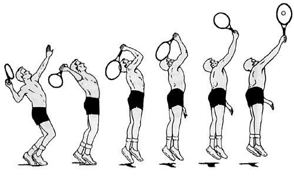](https://www.ncbi.nlm.nih.gov/core/lw/2.0/html/tileshop_pmc/tileshop_pmc_inline.html?title=Click%20on%20image%20to%20zoom&p=PMC3&id=2577490_sm23218.f1.jpg)

[Open in a separate
window](https://www.ncbi.nlm.nih.gov/pmc/articles/PMC2577490/figure/fig1/?report=objectonly)

**Figure 1** Different phases of the tennis service motion.

During the serve, the shoulder is part of a kinetic energy chain, in
which the body is considered as a linked system of articulated segments,
each part contributing to the final energy needed for hitting the ball
(fig
2[​2).](https://www.ncbi.nlm.nih.gov/pmc/articles/PMC2577490/figure/fig2/)).
All segments (leg, hip, trunk, shoulder, elbow, and wrist) of the
kinetic chain have to be in perfect shape to be able to create a
sufficient level of energy to produce an effective serve. To create an
optimal service motion with maximum power release, the following
prerequisites are necessary: an intact kinetic chain function, normal
scapular function, and intact dynamic and static stabilisers of the
shoulder.

[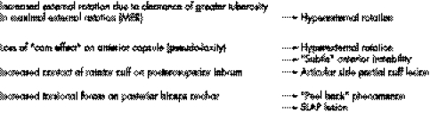](https://www.ncbi.nlm.nih.gov/core/lw/2.0/html/tileshop_pmc/tileshop_pmc_inline.html?title=Click%20on%20image%20to%20zoom&p=PMC3&id=2577490_sm23218.f2.jpg)

[Open in a separate
window](https://www.ncbi.nlm.nih.gov/pmc/articles/PMC2577490/figure/fig2/?report=objectonly)

**Figure 2** Posterosuperior shift of centre of rotation. SLAP, Superior
labrum anterior to posterior.

The kinetic chain allows generation, summation, and transfer of forces
from the legs to the hand. Sequential involvement of the links of the
chain allows the force generated by ground reaction forces, and activity
of the large, powerful leg and trunk muscles to be transferred to the
shoulder and upper arm.
Kibler[^1^](https://www.ncbi.nlm.nih.gov/pmc/articles/PMC2577490/#ref1)
calculated that 51% of total kinetic energy and 54% of total force are
developed in the leg/hip/trunk link and can be defined as the force
generators of the kinetic chain. In the same way the shoulder can be
seen as a funnel and force regulator. Finally the arm, elbow, and wrist
act as a force delivery mechanism. Breakage of a link in the proximal
part of the chain will lead to a higher demand on the more distally
located segments. Only enhancement of the functional ability of these
distal segments will result in the same level of energy at the end of
the kinetic chain. This is called the "catch up" phenomenon (fig
3[​3).](https://www.ncbi.nlm.nih.gov/pmc/articles/PMC2577490/figure/fig3/)).
From this mechanism, it is clear that the more distal parts of the
kinetic chain (shoulder, elbow, and wrist) are more susceptible to
overuse and injury than the proximal parts.

[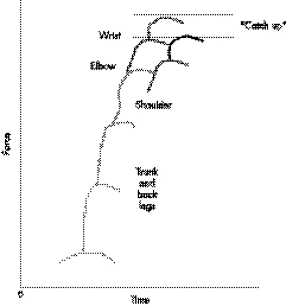](https://www.ncbi.nlm.nih.gov/core/lw/2.0/html/tileshop_pmc/tileshop_pmc_inline.html?title=Click%20on%20image%20to%20zoom&p=PMC3&id=2577490_sm23218.f3.jpg)

[Open in a separate
window](https://www.ncbi.nlm.nih.gov/pmc/articles/PMC2577490/figure/fig3/?report=objectonly)

**Figure 3** Schematic illustration of the kinetic chain theory.

### Scapular function

The scapula plays a pivotal role in the function of the shoulder.
Firstly, it acts as a stable base for the humeral head during the
overhead motion to guarantee a congruent socket during the tennis serve.
Secondly, it has to move around the thoracic wall, while the arm moves
from early cocking to late cocking and follow through
(retraction/protraction). In the same way the scapula has to move in an
upward direction (rotation) in order to clear the acromion from the
moving humeral head. Finally, it forms a stable base for the intrinsic
and extrinsic muscles that control arm motion and the position of the
scapular against the thorax. Fine tuning of scapular motion is provided
by coupling of muscle action. The serratus anterior and trapezius muscle
act together to stabilise the scapula against the thoracic wall.
Similarly, elevation of the scapula is regulated by coupling of the
upper and lower trapezius muscle, as well as the serratus anterior and
the rhomboideus. Dysfunction of these muscles leads to scapular
dyskinesis, caused by inflexibility, weakness, and imbalance of the
muscles. This dysfunction can be either primary through direct injury of
the muscles or secondary as a result of pain induced muscular
inhibition.[^2^](https://www.ncbi.nlm.nih.gov/pmc/articles/PMC2577490/#ref2)

In the clinical situation, three types of scapular dyskinesis can be
distinguished, although overlap between the three types can be present.
The first of these, type I, is inferomedial scapular border prominence,
which becomes more evident in the cocking position. It is often
associated with tightness at the anterior side of the shoulder
(inflexibility of the pectoralis major/minor muscles) and weakness of
the lower trapezius and serratus anterior muscles. Posterior tipping of
the scapula is responsible for functional narrowing of the subacromial
space during the overhead motion, leading to pain in the
abduction/externally rotated position. This is often noticed in the
early stages of shoulder disorders.

The type II pattern is winging of the entire medial border at rest. It
becomes more prominent in the cocking position and after repetitive
elevation of the upper extremity, and is caused by fatigue of the
stabilising muscles (trapezius, rhomboideus) (fig
4[​4](https://www.ncbi.nlm.nih.gov/pmc/articles/PMC2577490/figure/fig4/)).

[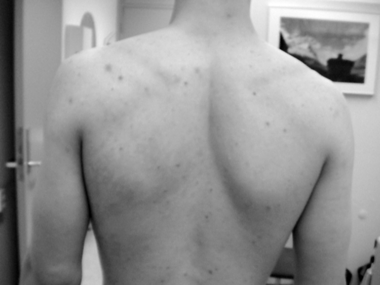](https://www.ncbi.nlm.nih.gov/pmc/articles/PMC2577490/figure/fig4/)

**Figure 4** Type II scapular dyskinesis of the right shoulder in a man
with anterior instability. The patient has given permission for
publication of this figure.

Both types of scapular dyskinesis create an abnormal position of
protraction at rest, as well as an abnormal pattern of motion during the
overhead action. A lack of retraction and elevation of the scapula in
the cocking and acceleration phase is present and subsequently leads to
an abnormal relation between the humeral head and the glenoid, referred
to as "hyperangulation". In this position, distraction forces occur at
the front of the shoulder, which can possibly cause capsular stretching
and instability. At the posterior side of the shoulder, compressive
forces are generated, which may contribute to posterior impingement of
the shoulder (fig
5[​5](https://www.ncbi.nlm.nih.gov/pmc/articles/PMC2577490/figure/fig5/)).

[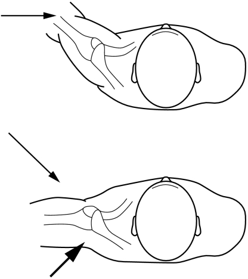](https://www.ncbi.nlm.nih.gov/core/lw/2.0/html/tileshop_pmc/tileshop_pmc_inline.html?title=Click%20on%20image%20to%20zoom&p=PMC3&id=2577490_sm23218.f5.jpg)

[Open in a separate
window](https://www.ncbi.nlm.nih.gov/pmc/articles/PMC2577490/figure/fig5/?report=objectonly)

**Figure 5** Loss of retraction of the scapula causes an abnormal angle
between the humeral head and scapula (thick arrow).

Type III scapular dyskinesis displays prominence of the superior medial
border of the scapula and is often associated with impingement and
rotator cuff injury. It is clear that scapular dyskinesis plays an
important role, but further validation of this clinical finding is
needed.

The term "SICK scapula" was introduced to describe a pathological state
of the scapula, characterised by scapular malposition, inferior medial
border prominence, coracoid pain and malposition, and kinesis
abnormalities of the
scapula.[^3^](https://www.ncbi.nlm.nih.gov/pmc/articles/PMC2577490/#ref3)
This syndrome, characterised by a drooping shoulder, is often seen in
overhead athletes and is thought to contribute to the development of
shoulder injuries. In most tennis players such an abnormal position of
the scapula can be detected. Although it seems that the affected
shoulder has a lower position compared with the healthy side, actually
there is scapular malposition consisting of forward tilting and
protraction. According to
Kibler,[^3^](https://www.ncbi.nlm.nih.gov/pmc/articles/PMC2577490/#ref3)
this clinical picture is associated with anterior coracoid based pain,
posterosuperior localised pain, and pain at the superolateral side of
the shoulder (subacromial space, acromioclavicular joint). The anterior
localised pain in particular can be confused with other causes of
anterior shoulder pain, such as instability or a SLAP (superior labrum
anterior to posterior) lesion. The pain at the posterior side is caused
by insertional pain of the levator scapulae and is due to chronic
overtension by the abducted and protracted scapula.

### Capsulolabral complex

The role of the capsulolabral complex in the development of a shoulder
injury remains a topic of debate. The most important function of the
ligaments is to limit the range of motion of the shoulder joint. At the
beginning of abduction/external rotation, it is mainly the dynamic
stabilisers that keep the shoulder in a central position in the glenoid
socket. At the end of the range of motion, the ligamentous structures
become more important. At maximal abduction and external rotation, the
inferior glenohumeral ligament (IGHL) is taut and limits further
movement.[^4^](https://www.ncbi.nlm.nih.gov/pmc/articles/PMC2577490/#ref4)
In the IGHL, a distinctive reinforcement is present, called the anterior
band, which moves in front of the humeral head, providing a restraint to
anterior and inferior displacement. Behind this, the posterior part of
the IGHL shifts in front of the posterior side of the humeral head in
abduction and internal rotation, protecting the head against posterior
displacement. This dynamic interplay of the ligaments means that, in the
overhead athlete, the shoulder area is often susceptible to injury.
Several explanations have been developed to clarify the pathogenesis of
shoulder injuries in overhead athletes.

As mentioned above, one explanation is that the repetitive nature of the
serve causes microtrauma of the anterior capsule. Elongation of the
ligaments may be responsible for (subtle) instability. The anterior
displacement of the humeral head shifts the centre of rotation to a more
anterior position. This probably brings the tuberculum majus and rotator
cuff tendon close to the posterior glenoid, causing internal
impingement. Although posterior impingement occurs in healthy shoulders,
it can become pathological in the tennis player.

Halbrecht *et
al*,[^5^](https://www.ncbi.nlm.nih.gov/pmc/articles/PMC2577490/#ref5)
however, showed that an anterior subluxated shoulder will have less
contact at the posterosuperior edge of the glenoid.

When we look at the clinical picture of the shoulder in the overhead
athlete, the combination of signs and symptoms cannot be explained by
anterior capsular insufficiency alone.

### Glenohumeral internal rotation deficit (GIRD)

A common finding in tennis players is a change in the rotational arc of
the shoulder. Usually, there is an increase in external rotation and a
decrease in internal rotation. Burkhart *et
al*[^6^](https://www.ncbi.nlm.nih.gov/pmc/articles/PMC2577490/#ref6)
proposed that this loss of internal rotation caused by posteroinferior
capsular contracture is the essential lesion in thrower's shoulder.
GIRD can be defined as the loss in degrees of glenohumeral internal
rotation of the throwing shoulder compared with the non‐throwing
shoulder. It has been suggested there is an association of GIRD with the
development of shoulder
injuries.[^7^](https://www.ncbi.nlm.nih.gov/pmc/articles/PMC2577490/#ref7)
If the limitation of internal rotation exceeds the gain in external
rotation, resulting in a decrease in rotational arc (>10% of the
contralateral side), the shoulder is susceptible to
injury.[^3^](https://www.ncbi.nlm.nih.gov/pmc/articles/PMC2577490/#ref3)

According to the theory of Burkhart *et
al*,[^2^](https://www.ncbi.nlm.nih.gov/pmc/articles/PMC2577490/#ref2)
the posterior capsule is subjected to distractive forces in the follow
through stage of the overhead motion. These forces (750 N) have to be
resisted by the posteroinferior capsule and the compressive forces of
the rotator cuff muscles, especially the infraspinatus muscle. These
authors believe that these distractive forces cannot fully be
compensated for by activity of the infraspinatus muscle. One of the
factors contributing to this phenomenon is the eccentric activity of the
infraspinatus muscle. Because of the eccentric contraction, adaptive
changes occur in the muscle belly. This results in a decrease in active
tension, an increase in passive muscle tension, and disturbed
proprioceptive
mechanisms.[^8^](https://www.ncbi.nlm.nih.gov/pmc/articles/PMC2577490/#ref8)
This thixotropic mechanism of the infraspinatus muscle will contribute
to higher loads on the posterior capsule. The posterior capsule reacts
with hypertrophy and reduced capsular pliability. The stiffness and
shortening of the posterior structures have consequences for
stabilisation of the shoulder during abduction and external rotation.

According to the theory of O'Brien *et
al*,[^9^](https://www.ncbi.nlm.nih.gov/pmc/articles/PMC2577490/#ref9)
the IGHL is the most important stabilising capsular component in the
shoulder (anterior band in abduction/external rotation; posterior band
in internal rotation). In the position of abduction and external
rotation of the shoulder, the posterior IGHL is positioned under the
humeral head. In the case of a functionally shortened posterior IGHL, a
posterosuperior directed force exists, shifting the centre of rotation
of the shoulder to a more posterosuperior location (fig
6[​6).](https://www.ncbi.nlm.nih.gov/pmc/articles/PMC2577490/figure/fig6/)).
The consequences of this posterosuperior shift have been depicted by
Burkhart *et
al*[^6^](https://www.ncbi.nlm.nih.gov/pmc/articles/PMC2577490/#ref6)
(fig
2[​2](https://www.ncbi.nlm.nih.gov/pmc/articles/PMC2577490/figure/fig2/)).

[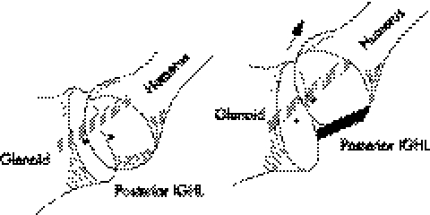](https://www.ncbi.nlm.nih.gov/core/lw/2.0/html/tileshop_pmc/tileshop_pmc_inline.html?title=Click%20on%20image%20to%20zoom&p=PMC3&id=2577490_sm23218.f6.jpg)

[Open in a separate
window](https://www.ncbi.nlm.nih.gov/pmc/articles/PMC2577490/figure/fig6/?report=objectonly)

**Figure 6** In abduction/external rotation, the posterior inferior
glenohumeral ligament (IGHL) shifts under the humeral head. Shortening
exerts an upwards directed force, shifting the centre of rotation to a
more posterosuperior position.

The hypothesis of Burkhart *et al* has recently been supported by
Grossman *et
al*,[^10^](https://www.ncbi.nlm.nih.gov/pmc/articles/PMC2577490/#ref10)
who found that, by creating a posterior capsular contracture in a
cadaveric model, a posterosuperior shift of the centre of rotation
occurred in abduction and external rotation.

The relation between SLAP lesion and instability, proposed by this
theory, is supported by several
studies,^[11](https://www.ncbi.nlm.nih.gov/pmc/articles/PMC2577490/#ref11),[12](https://www.ncbi.nlm.nih.gov/pmc/articles/PMC2577490/#ref12)^
in which an increase in anterior translation was found after creation of
a SLAP lesion in cadaveric shoulders. Repairing the lesion led to a
return to normal total range of motion and
translation.[^12^](https://www.ncbi.nlm.nih.gov/pmc/articles/PMC2577490/#ref12)
This is in accordance with the "circle concept theory" proposed by
Burkhart *et
al*[^6^](https://www.ncbi.nlm.nih.gov/pmc/articles/PMC2577490/#ref6)---that
is, breakage of the labral ring causes apparent laxity to the opposite
side of the ring.

The model described by Burkhart *et al* seems to be the most appropriate
at this time to explain the pathological findings in thrower's
shoulder. In clinical practice, the biomechanical findings correlate
well with the clinical signs and symptoms occurring in tennis players
with shoulder problems.

[Go to:](https://www.ncbi.nlm.nih.gov/pmc/articles/PMC2577490/)

## History

Clinical findings show that players initially experience shoulder pain
in the late cocking position and acceleration phase of the tennis
service, although usually a long history of non‐specific pain and a
variety of (non)‐surgical treatments has preceded this. Most of the
time, pain is located deep in the shoulder, often at the posterior side,
although anterior localised pain can also be present, because of
contracted structures (coracoid based tightness) at the front of the
shoulder. Pain is often experienced at the medial side of the scapula,
resulting from insertional pain of the scapula stabilising muscles.
During the course of the injury, pain is aggravating and the ability to
serve at a maximal level is impossible (dead arm syndrome). At a later
stage, forehand and backhand strokes may also be impaired. Many patients
complain of soreness and stiffness in the shoulder, especially before
and after loading of the shoulder. They can also have feelings of
instability or clicking sensations.

[Go to:](https://www.ncbi.nlm.nih.gov/pmc/articles/PMC2577490/)

## Physical examination

A shoulder examination starts by inspecting, from behind, the scapula in
a resting position. The position of the scapula is defined (see scapular
function). Dynamic scapular dyskinesis is detected by asking the patient
to raise and/or abduct both arms repeatedly in a rhythmic motion, until
fatigue of the scapular stabilisers results in failure to keep the
scapula well positioned in relation to the thoracic wall. Active
scapular retraction and elevation are checked.

The next step is to look for muscle atrophy. Palpation of areas of
tenderness is important, but one should be aware of secondary causes of
the pain (insertional pain, secondary impingement, etc). Active and
passive range of motion should be examined and compared with the
non‐injured shoulder. Passive range of motion is best tested with the
patient lying on his/her side. In this position, the scapula is fixed
and the true passive range of external and internal rotation can be
measured (fig
7[​7](https://www.ncbi.nlm.nih.gov/pmc/articles/PMC2577490/figure/fig7/)).

[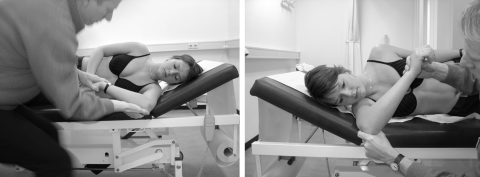](https://www.ncbi.nlm.nih.gov/core/lw/2.0/html/tileshop_pmc/tileshop_pmc_inline.html?title=Click%20on%20image%20to%20zoom&p=PMC3&id=2577490_sm23218.f7.jpg)

[Open in a separate
window](https://www.ncbi.nlm.nih.gov/pmc/articles/PMC2577490/figure/fig7/?report=objectonly)

**Figure 7** On the left side, passive internal rotation is normal. On
the right side, the dominant throwing arm clearly shows limited passive
internal rotation. Testing the arc of rotation in this position is the
most reliable way to detect differences between the two shoulders. The
patient has given permission for publication of this figure.

The next step is to perform tests for impingement (Neer test, empty can
test, Hawkins test, external rotation resistance test, etc) and
instability (sulcus sign, apprehension test, relocation test,
hyper‐abduction test, posterior apprehension test). It is wise to
perform several tests, because none of them are sufficiently sensitive
and specific on their
own.[^13^](https://www.ncbi.nlm.nih.gov/pmc/articles/PMC2577490/#ref13)
Therefore the diagnosis can be readily reached with a standard
examination.[^14^](https://www.ncbi.nlm.nih.gov/pmc/articles/PMC2577490/#ref14)

In addition, more specific tests can be very useful in examining the
shoulder of the overhead athlete. As mentioned above, the position of
the scapula is of great importance in the normal functioning of the
shoulder. A protracted scapula will cause functional narrowing of the
subacromial space, mimicking symptoms of impingement.
Kibler[^3^](https://www.ncbi.nlm.nih.gov/pmc/articles/PMC2577490/#ref3)
introduced the scapular assistance test, which can be very useful for
detecting a secondary impingement in the shoulder of an overhead
athlete. This test involves assisting scapular upwards rotation by
manually stabilising the upper medial border and rotating the inferior
medial border while the arm is abducted. The test is positive when
relief of the impingement symptoms, clicking or rotator cuff weakness,
is found. Another helpful test in assessing the role of the scapula is
the scapula resistance test, also described by
Kibler.[^3^](https://www.ncbi.nlm.nih.gov/pmc/articles/PMC2577490/#ref3)
In this test the entire medial border of the scapula is stabilised in a
normal retracted position. The test is considered positive if there is
increased muscle strength of the rotator cuff in the stabilised
position. Another finding is that pain occurring in the relocation test
disappears by repositioning the scapula.

A further striking feature in the throwing shoulder is that posterior
localised pain experienced deep in the shoulder in the apprehensive
position that disappears during the relocation test may be associated
with posterosuperior labral pathology. Several tests have been developed
to detect superior labral pathology (active compression test, biceps
load test, etc). However, none of these are sufficiently reliable to
prove the presence of a SLAP
lesion.^[15](https://www.ncbi.nlm.nih.gov/pmc/articles/PMC2577490/#ref15),[16](https://www.ncbi.nlm.nih.gov/pmc/articles/PMC2577490/#ref16)^

It can be hard to establish a provocative test at an early stage of the
disease. Sometimes it is possible to provoke specific pain experienced
by the athlete in the cocking phase by placing the arm in the cocking
position and manually resisting active internal rotation by the athlete
from that position, simulating acceleration of the upper arm (the
thrower's test).

The flexibility and strength of the hip and trunk also need to be
investigated. A weakness in the hip abductors can be detected by the one
leg stance and one leg squat. A loss of control in these positions has
been correlated with back and shoulder injury.

[Go to:](https://www.ncbi.nlm.nih.gov/pmc/articles/PMC2577490/)

## Imaging

A radiographic evaluation may be necessary to establish the diagnosis or
to rule out intra‐articular pathology. Concomitant pathology can also be
detected.[^14^](https://www.ncbi.nlm.nih.gov/pmc/articles/PMC2577490/#ref14)
Magnetic resonance imaging arthrography is considered to be the state of
the art technique.
Meister[^17^](https://www.ncbi.nlm.nih.gov/pmc/articles/PMC2577490/#ref17)
confirmed high sensitivity and specificity with respect to under surface
rotator cuff pathology (>90%), as well as for labral pathology.

Findings at magnetic resonance imaging can be very difficult to detect.
There are many variations in the appearance of the labral attachment to
the glenoid. In particular, the superior labrum can be difficult to
interpret. A blurring of contrast in the biceps anchor may be the only
radiological sign of a SLAP lesion (fig
8[​8](https://www.ncbi.nlm.nih.gov/pmc/articles/PMC2577490/figure/fig8/)).

[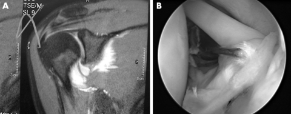](https://www.ncbi.nlm.nih.gov/core/lw/2.0/html/tileshop_pmc/tileshop_pmc_inline.html?title=Click%20on%20image%20to%20zoom&p=PMC3&id=2577490_sm23218.f8.jpg)

[Open in a separate
window](https://www.ncbi.nlm.nih.gov/pmc/articles/PMC2577490/figure/fig8/?report=objectonly)

**Figure 8** (A) Blurring of contrast is seen in the superior labrum;
(B) an arthroscopic view of the same patient showing extensive damage to
the biceps anchor. The patient has given permission for publication of
this figure.

[Go to:](https://www.ncbi.nlm.nih.gov/pmc/articles/PMC2577490/)

## Implications for treatment

Treatment of these kinds of injury in the tennis player requires a
thorough knowledge of the aetiological factors. If only the local damage
in the shoulder is treated, treatment is doomed to fail. In evaluating
patients, a standard examination should be conducted, and appropriate
treatment to improve the function of the kinetic chain prescribed. This
is followed by a well founded interpretation of scapular function.
Correction of abnormal scapular motion patterns is necessary to improve
maintenance of the centre of rotation of the humeral head in every
position of the arm. Improvement of retraction of the scapula in the
cocking position and stabilisation against the thoracic wall are
necessary to guarantee a "full tank of energy" in the late cocking and
acceleration phase. Perfect couple forces of the trapezius
ascendens/descendens and serratus anterior/rhomboideus are needed for
proper elevation of the scapula in order to clear the subacromial space
for abduction and external rotation of the shoulder. Concomitantly, a
normal active and passive range of motion has to be established. A
normal arc of rotation is necessary to allow normal shoulder kinematics.
The occurrence of GIRD particularly predisposes these athletes to
shoulder injury. Daily stretching of the shortened structures at the
posterior side of the shoulder is important. At an early stage of the
disease, it may be possible to restore normal range of motion in two
weeks, but it will generally take much longer in long standing cases and
older athletes.

These are the starting points for rehabilitating the shoulder in the
overhead athlete. At a later stage, more selective strengthening
exercises for the rotator cuff muscles are added to the programme to
improve the dynamic stabilisation of the shoulder. Introducing these
exercises too early into the rehabilitation process will lead to
overloading of these muscles and a delay in achieving rehabilitation
goals. When treatment goals concerned with kinetic chain and scapular
function are fulfilled, more sport specific drills are introduced, which
gradually build to the level of the desired sporting performance.
Periodical evaluation of kinetic chain function, scapular function, and
muscular strength can be very useful in preventing shoulder injuries.

[Go to:](https://www.ncbi.nlm.nih.gov/pmc/articles/PMC2577490/)

## Operative treatment

In more advanced cases, with intra‐articular disruption of structures,
such as posterosuperior impingement, SLAP lesion, and/or (subtle)
instability, surgical treatment may be inevitable. The treatment is
directed to the intra‐articular pathology. A SLAP lesion can be treated
arthroscopically with good to excellent results. Fixing the loose
superior labrum to the upper glenoid will stabilise the biceps anchor
and neutralise the rotational forces on the biceps anchor, which had led
to injury of the superior labrum and the "peel back" phenomenon. In
overhead athletes, the lesion of the biceps anchor is usually localised
at the posterior part of the glenoid. Stabilisation of the biceps anchor
posteriorly is needed to counteract the peel back forces during the
overhead action.

Special attention must be given to the integrity of the anteroinferior
capsule. If there is still redundancy of the anterior capsule after
repair of the biceps anchor, a capsular plication can be added to the
surgical procedure. Sometimes an articular sided partial rupture of the
rotator cuff is present, which is due to hyper twisting of the tendon
fibres and rubbing of the cuff against the posterior glenoid.
Debridement of the cuff lesion (usually posterior supraspinatus tendon)
and fraying of the superior labrum are sufficient in most cases. In more
extensive defects, repair of the cuff may be necessary, influencing the
prognosis and rehabilitation protocol. Owing to the probability of
combined intra‐articular lesions, it is wise to establish a well defined
preoperative diagnosis, using a standard physical and radiological
examination. This provides the opportunity to develop a well based
treatment programme, conservative or surgical. It requires cooperation
from the athletes, and establishes well defined treatment goals and a
realistic prediction of returning to sport.

[Go to:](https://www.ncbi.nlm.nih.gov/pmc/articles/PMC2577490/)

## Return to sport

The results of SLAP repair show that there is a reasonable chance of the
athlete returning to the level of sport reached before injury. According
to the literature, return to sport can be achieved in most cases.
Burkhart and
Parten[^18^](https://www.ncbi.nlm.nih.gov/pmc/articles/PMC2577490/#ref18)
found an 87% return to the pre‐injury level. Ide *et
al*[^19^](https://www.ncbi.nlm.nih.gov/pmc/articles/PMC2577490/#ref19)
stated that a return to the pre‐injury level of sport was possible in
84% of baseball players, but also stated that the success rate in the
literature showed great variability (22--92%), and was mainly dependent
on the aetiology of the injury---that is, overhead sports showed a lower
rate of return to sport than others. The main reason is that the
overhead action is an unnatural, complex motion at the physiological
limits of the shoulder. Therefore it is crucial to take preventive
measures in this patient group. Preseason screening and regular
inspection of overhead athletes with respect to kinetic chain function,
scapular function, and shoulder function can prevent the development of
serious intra‐articular damage.

### What is already known on this topic

- The overhead action in throwing sports is unnatural and highly
dynamic, often exceeding the physiological limits of the shoulder,
making it susceptible to injury

- Optimal shoulder function requires good kinetic chain function,
optimal stability, and coordination of the scapula in the overhead
action, and a well balanced action of rotator cuff muscles and
capsular structures is necessary to obtain a stable centre of rotation
during the overhead action

### What this study adds

- The theoretical assumptions of the pathophysiology of the thrower's
shoulder can be used for the tennis player, as, during the serve, the
same phases can be distinguished

- To reduce the risk of shoulder injury in tennis, careful evaluation of
kinetic chain function, scapular function, rotator cuff muscle
balance, and the integrity of the capsular structures should be
carried out, and specific training programmes incorporating scapular
stabilisation and capsular stretching at an early stage of shoulder
injury can prevent intra‐articular damage of the shoulder

[Go to:](https://www.ncbi.nlm.nih.gov/pmc/articles/PMC2577490/)

## Conclusion

Shoulder injuries in tennis players are both a diagnostic and
therapeutic challenge. Knowledge of every aspect of the development of
shoulder disorders is necessary to apply proper treatment modalities.
This includes understanding of the kinetic chain function in tennis,
scapular stability, and the interaction of the capsulolabral complex of
the shoulder. It is important to recognise early signs of shoulder
dysfunction to be able to treat this complex problem at the earliest
opportunity. Intervention at an early stage can alter the natural course
of the disorder and may prevent the development of serious
intra‐articular injury.

[Go to:](https://www.ncbi.nlm.nih.gov/pmc/articles/PMC2577490/)

## Abbreviations

GIRD - glenohumeral internal rotation deficit

IGHL - inferior glenohumeral ligament

SLAP - superior labrum anterior to posterior

[Go to:](https://www.ncbi.nlm.nih.gov/pmc/articles/PMC2577490/)

## Footnotes

Informed consent was obtained for publication of figures 4 and 7

Competing interests: none declared

[Go to:](https://www.ncbi.nlm.nih.gov/pmc/articles/PMC2577490/)

## References

1. Kibler W B. Biomechanical analysis of the shoulder during tennis
activities. Clin Sports Med 19951479--85.
[[PubMed](https://www.ncbi.nlm.nih.gov/pubmed/7712559)] [[Google
Scholar](https://scholar.google.com/scholar_lookup?journal=Clin+Sports+Med&volume=14&publication_year=1995&pages=79-85&pmid=7712559&)]

2. Burkhart S S, Morgan C D, Kibler W B. The disabled throwing
shoulder: spectrum of pathology. Part III. Arthroscopy 200319404--420.
[[PubMed](https://www.ncbi.nlm.nih.gov/pubmed/12671624)] [[Google
Scholar](https://scholar.google.com/scholar_lookup?journal=Arthroscopy&volume=19&publication_year=2003&pages=404-420&pmid=12671624&)]

3. Kibler W B. The role of the scapula in athletic shoulder function.
Am J Sports Med 199826325--337.
[[PubMed](https://www.ncbi.nlm.nih.gov/pubmed/9548131)] [[Google
Scholar](https://scholar.google.com/scholar_lookup?journal=Am+J+Sports+Med&volume=26&publication_year=1998&pages=325-337&pmid=9548131&)]

4. Gagey O J, Gagey N. The hyperabduction test: an assessment of the
laxity of the inferior glenohumeral ligament. J Bone Joint Surg [Br]
20018369--74. [[PubMed](https://www.ncbi.nlm.nih.gov/pubmed/11245541)]
[[Google
Scholar](https://scholar.google.com/scholar_lookup?journal=J+Bone+Joint+Surg+%5bBr%5d&volume=83&publication_year=2001&pages=69-74&)]

5. Halbrecht J L, Tirman P, Atkin D. Internal impingement of the
shoulder: comparison of findings between the throwing and nonthrowing
shoulders of college baseball players. Arthroscopy 199915253--256.
[[PubMed](https://www.ncbi.nlm.nih.gov/pubmed/10231101)] [[Google
Scholar](https://scholar.google.com/scholar_lookup?journal=Arthroscopy&volume=15&publication_year=1999&pages=253-256&pmid=10231101&)]

6. Burkhart S S, Morgan C D, Kibler W B. The disabled throwing
shoulder: spectrum of pathology. Part I: pathoanatomy and biomechanics.
Arthrosccopy 200319404--420.
[[PubMed](https://www.ncbi.nlm.nih.gov/pubmed/12671624)] [[Google
Scholar](https://scholar.google.com/scholar_lookup?journal=Arthrosccopy&volume=19&publication_year=2003&pages=404-420&)]

7. Myers J B, Laudner K G, Pasquale M R.*et al* Posterior capsular
tightness in throwers with internal impingement. Presented at the Annual
Meeting of Orthopaedic Surgeons, February 23--27 2005

8. Reisman S, Walsh L D, Proske U. Warm‐up stretches reduce sensations
of stiffness and soreness after eccentric exercise. Med Sci Sport Exerc
37929--936. [[PubMed](https://www.ncbi.nlm.nih.gov/pubmed/15947716)]
[[Google
Scholar](https://scholar.google.com/scholar_lookup?journal=Med+Sci+Sport+Exerc&volume=37&pages=929-936&)]

9. O'Brien S J, Neves M C, Arnoczky S P.*et al* The anatomy and
histology of the inferior glenohumeral ligament complex of the shoulder.
Am J Sports Med . 1990;18449--456.
[[PubMed](https://www.ncbi.nlm.nih.gov/pubmed/2252083)]

10. Grossman M G, Tibone J E, McGarry M H. A cadaveric model of the
throwing shoulder: a possible aetiology of superior labrum
anterior‐to‐superior lesions. J Bone Joint Surg [Am] 200587824--831.
[[PubMed](https://www.ncbi.nlm.nih.gov/pubmed/15805213)] [[Google
Scholar](https://scholar.google.com/scholar_lookup?journal=J+Bone+Joint+Surg+%5bAm%5d&volume=87&publication_year=2005&pages=824-831&)]

11. Panossian V R, Mihata T, Tibone J E. Biomechanical analysis of
isolated type II SLAP lesions and repair. J Shoulder Elbow Surg
200514529--534.
[[PubMed](https://www.ncbi.nlm.nih.gov/pubmed/16194747)] [[Google
Scholar](https://scholar.google.com/scholar_lookup?journal=J+Shoulder+Elbow+Surg&volume=14&publication_year=2005&pages=529-534&pmid=16194747&)]

12. McMahon P J, Burkart A, Musahl V.*et al*J Shoulder Elbow Surg
2004339--44. [[PubMed](https://www.ncbi.nlm.nih.gov/pubmed/14735072)]
[[Google
Scholar](https://scholar.google.com/scholar_lookup?journal=J+Shoulder+Elbow+Surg&volume=3&publication_year=2004&pages=39-44&pmid=14735072&)]

13. McFarland E G, O'Neill O, Hsu C. Reliability and reproducibility
of shoulder laxity testing. J Bone Joint Surg [Br] 200082(suppl
II)156--157. [[Google
Scholar](https://scholar.google.com/scholar_lookup?journal=J+Bone+Joint+Surg+%5bBr%5d&volume=82&publication_year=2000&pages=156-157&)]

14. Rubin B D. Evaluation of the overhead athlete: examination and
ancillary testing. Arthrosccopy 200319(suppl 1)42--46.
[[PubMed](https://www.ncbi.nlm.nih.gov/pubmed/14673418)] [[Google
Scholar](https://scholar.google.com/scholar_lookup?journal=Arthrosccopy&volume=19&publication_year=2003&pages=42-46&)]

15. Parentis M A, Mohr K J, Elattrache N S. Disorders of the superior
labrum: review and treatment guides. Clin Orthop Relat Res
200240077--87.
[[PubMed](https://www.ncbi.nlm.nih.gov/pubmed/12072748)] [[Google
Scholar](https://scholar.google.com/scholar_lookup?journal=Clin+Orthop+Relat+Res&volume=400&publication_year=2002&pages=77-87&pmid=12072748&)]

16. Myers T H, Zemanovic J R, Andrews J R. The resisted external
rotation resistance test. A new test for the diagnosis of superior
labrum anterior tot posterior lesions. Am J Sports Med .
2005;331315--1320.
[[PubMed](https://www.ncbi.nlm.nih.gov/pubmed/16002494)]

17. Meister K. Injuries in the throwing athlete. Part two. Am J Sports
Med 200028587--601.
[[PubMed](https://www.ncbi.nlm.nih.gov/pubmed/10921657)] [[Google
Scholar](https://scholar.google.com/scholar_lookup?journal=Am+J+Sports+Med&volume=28&publication_year=2000&pages=587-601&pmid=10921657&)]

18. Burkhart S S, Parten P M. Dead arm syndrome: torsional SLAP lesions
versus internal impingement. Techniques in Shoulder and Elbow Surgery
2001274--84. [[Google
Scholar](https://scholar.google.com/scholar_lookup?journal=Techniques+in+Shoulder+and+Elbow+Surgery&volume=2&publication_year=2001&pages=74-84&)]

19. Ide J, Maeda S, Takagi K. Sports activity after arthroscopic
superior labral repair using suture anchors in overhead athletes. Am J
Sports Med 200533507--512.
[[PubMed](https://www.ncbi.nlm.nih.gov/pubmed/15722289)] [[Google
Scholar](https://scholar.google.com/scholar_lookup?journal=Am+J+Sports+Med&volume=33&publication_year=2005&pages=507-512&pmid=15722289&)]

Articles from British Journal of Sports Medicine are provided here
courtesy of **BMJ Publishing Group**

From <https://www.ncbi.nlm.nih.gov/pmc/articles/PMC2577490/>
