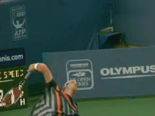
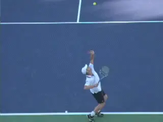
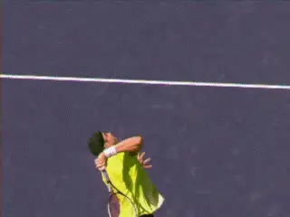
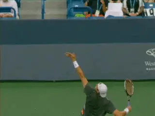
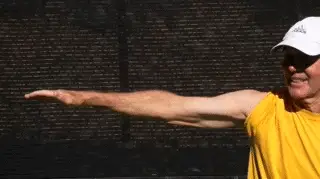

# Internal Shoulder Rotation - Key to serving power

**Internal Shoulder Rotation:**

**Key to Serving Power**

**Chas Stumpfel**

After playing tennis for over 40 years, I made a sudden and unexpected
discovery about the serve. In the 1980s, I had played league tennis at
the 3.5 to 4.0 level and for two years had won the championship of a
larger league at work.

I played serve and volley tennis and my serve was very effective at my
level. I had worked frequently and seriously on improving my serve. But
it never progressed to a higher level of pace. I read every tennis book
available, but there were no new ideas and I basically gave up the idea
of improving my serve further.

Then in 2011, I learned about research that showed the primary source of
racket speed in the serve was created by something called "internal
shoulder rotation". According to the Australian biomechanical
researcher Bruce Elliott, internal shoulder rotation was responsible for
40% of forward racket head speed.

Internal shoulder rotation, the research also showed, was set up by
something else called "external shoulder rotation." I had never heard
these terms.

Discovering the role of these rotations was a shock to me, but in
reality they had been documented by Elliott et al as early as 1995.
Elliott applied three dimensional quantitative camera systems to measure
the contributions of the various joints and their motions to racket head
speed for the serve. ([link](The%20Power%20Serve%20-%20Part%201.docx) to read Bruce's article
on the Power Serve.)

**Follow John Isner's elbow as you look for the upper arm to rotate as
it adds speed to the racket. This is internal shoulder rotation.**

**Follow Andy Roddick's forearm backward, the forearm is an indication
of exactly how the upper arm rotates. This is external shoulder
rotation.**

**[The irony is that high level servers had always used both external
and internal shoulder rotation, instinctively or naturally.]** At
that moment I realized that neither I, nor most players, nor even most
coaches, understood the way racket head speed was maximized on the
serve.

After over 30 years of study and practice, I realized I had missed the
main concept of the serve and the source of its force. From that day
forward, I wanted to understand these shoulder rotations as completely
as possible.

As I grew to understand these critical rotations I realized that many of
my own beliefs about the serve were false, misleading and had stopped
progress on my serve. This article attempts to clarify these two key
concepts: external and internal shoulder rotation.

For the purposes of simplicity the article excludes other important
components of the service motion that also contribute to racket head
speed, for example, elbow extension, shoulder extension, wrist flexion,
leg drive, etc. The focus here is on how the shoulder rotates, and how
you can learn to recognize this in your own serve.

Most players have the idea that swinging faster creates more pace. Few
understand in addition that rotating the arm faster is actually the key
to maximizing pace in any serve.

**Just as the arm is straightening, the shoulder internally rotates
explosively causing the racket head to accelerate. This rotation
continues into the follow-through.**

### Internal Shoulder Rotation

**[So what exactly is internal shoulder rotation? Internal shoulder
rotation is the rotation of the upper arm in the shoulder joint that
accelerates the racket forward.]**

In a tennis serve, this rotation starts during the upward swing to the
ball and continues out into the follow-through. During this rotation,
the racket head turns over around 180 degrees in about two tenths of a
second.

This rotation is critical especially in accelerating the racket after it
has moved up from the racket dip and the arm has become near straight,
at that time, as a checkpoint, the racket is roughly edge-on to the
ball.

The racket goes from this edge-on position to face-on to the ball at
impact mainly and simply as the result of internal shoulder rotation. (A
widespread misunderstanding attributes this edge-on to face-on
transition to 'pronation', a poorly defined and misleading term in
tennis usage.)

### External Shoulder Rotation

But it is vital to understand that the ability to create great internal
shoulder rotation depends on what happens previously in the motion.
There is another critical rotation that precedes internal rotation and
sets up the arm in position for this to happen. This is external
shoulder rotation.

**The amount of external shoulder rotation, as indicated here by the
backward motion of the forearm, will determine how much racket head
speed can be produced later by internal shoulder rotation.**

The purpose of the wind up is to externally rotate the shoulder ending
with the racket deep in the drop position. External shoulder rotation of
the upper arm at the shoulder is indicated by the forearm position. A
significant amount of external shoulder rotation, well beyond the norm,
is critical, because it determines how much force the internal shoulder
rotation can supply to accelerate the racket to impact. This issue will
be discussed under "Function".

### The Demos

To understand this better, let's look specifically at how the arm moves
in the shoulder joint. Let's isolate these two rotations independently
from the service motion to see more clearly how they work. You can do
the same demos for yourself.

Extend your arm straight out to your side from your shoulder. With your
arm straight, rotate the entire arm as a unit from the shoulder.

When the hand rotates so that the thumb goes forward, that is internal
shoulder rotation. When the hand rotates so that the thumb goes backward
(in the opposite direction) that is external shoulder rotation.

**When the thumb rotates downward, that's internal rotation. When it
rotates upward, that's external.**

Now bend the elbow at 90 degrees and again rotate the upper arm back and
forth to see external shoulder rotation with a bent elbow. During the
service motion wind-up external shoulder rotation occurs with the elbow
bent. With the elbow bent the forearm position shows the amount of
external shoulder rotation, the forearm is a very useful indicator in
high speed videos.

### Function

So why are these rotations so powerful? That's because internal
shoulder rotation of the upper arm is capable of both extremely rapidly
acceleration and rotation rates. For the serve, the rotation rates can
exceed 3000 degrees per second. These same joint rotations are shared by
great pitchers and great quarterbacks.

***Basically, the function of the external rotation is to stretch the
internal shoulder rotation muscles, particular the two largest muscles
attached to your arm, the Latissimus Dorsi and the Pectoralis Major,
commonly known as the lat and the pec.***

***[Once the muscles that [produce internal shoulde]r
rotation have been [pre-stretched] they shorten very rapidly
in a few hundredths of a second leading to impact]***. This is an
example of what biomechanists call the ***stretch shortening
cycle*.**

**The pre-stretched internal shoulder rotator muscles rotate the racket
to impact in a few hundredths of a second for a high level pro serve.**

The racket's well-known positions of **edge-on to the ball in the
upward swing** and **face-on to the ball at
impact** are the direct result of the explosive
shortening of the stretched muscles during internal shoulder rotation.

### Timing

**What are the timing considerations of the stretch shortening cycle for
an effective serve?**

The quick use of the pre-stretched muscles is critical. To create added
racket speed this must happen within a few tenths of a second. The more
quickly they are used, the more energy is returned.

**The heart of the high performance service motion is this
pre-stretching of the internal shoulder rotation muscles through
external shoulder rotation all happening over only tenths of a
second.** This is followed by trained timing that
shortens these pre-stretched muscles explosively over approximately the
last 30 milliseconds before impact.

**[It's important to note that [the orientation of the arm to torso is
critical to minimize the risk of shoulder impingement when unleashing
this powerful force.]]** For safety, the upper arm
must always be positioned in the proper orientation relative to the
shoulders.

There are of course many other complex factors that go into high
performance serving. There are also deeper explanations of how internal
and external shoulder rotation function that can go down literally to
the molecular level. These are some of the topics I hope to address in
future articles.

Chas Stumpfel is a research physicist (retired)

speed imaging applications.

He is a recreational player who has been

interested in tennis stroke techniques since

the 1970s, especially those for the serve.

In 2011, he was surprised and fascinated to

learn of research of that showed the racket

head speed for the serve was largely powered by

a joint motion that was not well known in

tennis.
