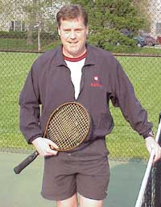

# Realities of the straight arm forehand

**Realities of the Straight Arm Forehand**

**Dr. Brian Gordon**

Brian Gordon changed the way the tennis world looked at the forehand
almost 10 years ago now with the results of his biomechanical research,
introducing the concept of the ATP forehand. What his data showed was
that a compact outside backswing, a flip into what he called the
"dynamic slot," ([link](Developing%20an%20ATP%20Forehand%20-%20Part1.docx)) and making
contact with a straight hitting arm optimized the creation of speed
combined with spin, Roger Federer being the pure model.

After collaborating with Rick Macci for many years, Brian is now
creating his own research facility in Miami. His further thoughts on arm
position on the on the forehand may surprise you. The obsession with the
straight arm he touched off does not necessarily fit perfectly with the
realities of training elite players. Hear him discuss the range of
options and also give his take on forehands hit with various degrees of
elbow bend.

*Video demonstration — the original video for this article was hosted on TennisPlayer.net.*

Dr. Brian Gordon has changed the understanding of the

Biomechanically Engineered Stroke Technique (BEST) is the

only empirically based stroke mechanics system in the world,

growing from three decades of both academic and applied on

court research. He is a founder of the Tennis Center for

Performance Research in Miami, Florida, which is creating a

new paradigm for player development. The center has assembled

an unprecedented group of specialists with cutting edge

knowledge across the entire range of tennis performance.

To visit his website, [**[Click

Here!]**](https://tennisperformanceresearch.com/)

Top contact him directly, [**[Click

Here!]**](mailto:gamabrian@icloud.com)

---

<!-- prevnext-nav -->
[← Quantifying Shot Outputs](quantifying-shot-outputs.md)  |  [Biomechanics Index](index.md)  |  [Researching the Serve →](researching-the-serve.md)
