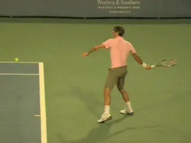

# The 4 Pillars of the ATP Type III Swing 

**The 4 Pillars of the ATP Type III Swing**

**Dr. Brian Gordon**

My recent articles have questioned the assertion that females can't hit
an "ATP Forehand". ([link](Have%20Tennis%20Coaches%20Failed%20female%20athletes.docx).) But
what is an ATP forehand? Good question.

It is not clear when the predominant forehand style on the men's tour
received the official designation of the "ATP Forehand". What is clear
is that it is common terminology in tennis these days and the subject of
much discussion and disagreement.

There is no consensus definition that I'm aware of. It seems to mean
different things to different people, as not all ATP players use the
exact same swing.

**Background**

I began investigating the swing types about two decades ago. Using
various motion quantification systems to assess the technique of many
players in terms of the biomechanics, I began to formulate a definition
of the basic components of what I myself defined as the "ATP
Forehand".

Noting that significant variability existed, I proposed what I called
the Type III forehand -- an optimized gender-neutral model based on my
research, neuromuscular theory and my work on the court. While the terms
have been used interchangeably, the Type III is an ATP forehand but not
many ATP forehands are Type III.

In this article I am combining two approaches to outline the 4 pillars
of the Type III swing. The text will take a technically oriented
approach using terminology from biomechanics. The accompanying video
will try to explain the pillars in more conventional teaching language.
Hopefully the two reinforce each other!

**What are the key components not in some so-called ATP forehands, but
in the Type III swing?**

**Four Pillars**

**Pillar 1: the body motions to create forward racquet speed are
separate from those creating vertical racquet
speed.**

The 4 pillars of the model Type III base swing are presented here. It
should be noted that within the Type III model there are several
specific adaptations to handle different types of incoming shots
(height, spin, speed etc).

My purpose here is to briefly review the key attributes as a conceptual
refresher and help clarify what my work actually found.

Analysts and teaching professionals tend to focus on the backswing and
the finish but **it is important note that the Type III model is
defined by only the forward swing.** The pillars
are independent of the backswing and follow through.

These parts of the swing are a focus in the Type III instructional
pedagogy and analysis only to the extent they are made as efficacious
(proper positions entering and exiting forward swing), compact and/or
safe as possible.

**Unique Sources of Racquet Velocity**

The sources of racket velocity are the highest level of abstraction of
the Type III model and is the foundation of the "heavy ball". Simply
stated, the body motions used to create forward racquet speed (torso
rotation and non-twisting shoulder rotation) are separate from those
causing vertical speed (shoulder twisting rotation or internal
rotation).

**Pillar II: Independent arm movement is the key to a more linear swing
path.**

**[The result is the ability to concurrently maximize speed and spin.
There is no trade-off.]**

**The independent arm contribution is key.**
**The separation of racquet velocity to unique sources is only truly
possible if the hitting arm is accelerated through the body rotation. In
other words the shoulder joint is used to propel the arm (in addition to
torso rotation) to a very forward contact point. Therefore the Type III
swing is multi-segment with two horizontal degrees of freedom (torso
rotation plus shoulder non-twisting rotation).**

***Advancing the arm through the torso rotation implies an additional
muscular load at the shoulder joint. Proper sequencing of the body
rotations (pelvis, torso, arm) attenuates this additional load. The Type
III model is characterized by a very specific sequencing (timing and
magnitude) of these body rotations.***

**Pillar III: The more linear path to the ball, in line with close to
the shot line.**

**Forward Swing Hand Path**

**The two horizontal degrees of freedom produce the conditions
necessary to create a more linear hand path from the end of the
backswing to contact. This is a critical attribute of the Type III model
and allows the hand path trajectory to align closely with the shot
direction. Toward this end, the hand is positioned to the outside of the
body exiting the backswing.**

**Linearizing the end point (hand) of a two degrees of freedom system
(torso rotation and non-twisting shoulder rotation) requires specific
proportions for each rotation throughout the
motion.** **[This is an additional consideration in
the sequencing of body rotations in the Type III model. Not only is
rotation sequencing necessary to decrease the load on the shoulder it
must also facilitate hand path linearization.]**

**Neuromuscular Facilitation**

The more linear hand path in the forward swing allows neuromuscular
facilitation in the generation of vertical racquet head speed. The
linear hand path implies a forward oriented pulling force on the grip.

**[Assuming the head of the racquet is outside of the hand (pulling
force) as the forward swing is initiated it will rotate into the dynamic
slot (the flip in tennis speak). The racquet rotation will in turn
rotate the arm externally prior to internal rotation that creates
vertical racquet head speed.]**

**In other words, the racquet rotates the arm (externally) then the
arm (internally) rotates the racquet to produce vertical racquet head
speed. Generated this way, the external to internal coupling engages
certain elements of the stretch-shorten
mechanism.**

**Pillar IV: The head of the racquet is outside the hand, leading to
external then internal rotation of the arm.**

These elements enhance the internal shoulder rotation used to produce
vertical racquet head speed. External rotation of the arm in the dynamic
slot (flip) and internal rotation near contact are both optimized if the
arm is straight. Therefore, a straight arm (or close to it) is required
in the Type III model.

**Where We Go From Here**

The Type III model has been presented, referenced (directly and
indirectly) and even "borrowed" often over the last few years. What
has become clear is that I've not done a great job explaining it because
even many that have been trained in, and/or extensively exposed to the
concepts have serious misconceptions. Hopefully this more concise review
will clear these up. If not, and as an additional step, I will apply the
concepts to the video analysis of some current players in the next
article. These players will represent a diverse cross-section of
forehand options in the professional realm. Should be interesting!

Dr. Brian Gordon has changed the understanding of the

Biomechanically Engineered Stroke Technique (BEST) is the

only empirically based stroke mechanics system in the world,

growing from three decades of both academic and applied on

court research. He is a founder of the Tennis Center for

Performance Research in Miami, Florida, which is creating a

new paradigm for player development. The center has assembled

an unprecedented group of specialists with cutting edge

knowledge across the entire range of tennis performance.

To visit his website, [**[Click

Here!]**](https://tennisperformanceresearch.com/)

Top contact him directly, [**[Click

Here!]**](mailto:gamabrian@icloud.com)
