# The ATP Two Handed Backhand - The Forward Swing

**The ATP Two Handed Backhand:**

**The Forward Swing**

**Dr. Brian Gordon**

In the last article we looked at the preparation in what I call the ATP
style, or Type 3, two-handed backhand. We focused on the take back and
then the creation of the dynamic slot. ([link](The%20ATP%20Two%20Handed%20Backhand%20-The%20Take%20Back%20and%20Dynamic%20Slot.docx).)

Now let's turn to the forward swing mechanics, beginning with some
history and important background. To do this let's revisit some key
positions and actions at the initiation of the forward swing.

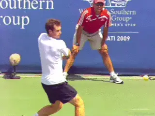

**What drives the mechanics of the forward swing in the ATP
two-hander?**

Recall that at the end of the backswing the top arm elbow was positioned
slightly to the hitting side of the body. Further, in the early forward
swing that elbow was repositioned even further to the hitting side.

This is the consequence of it straightening, whether than happens
passively or actively. This position clears a direct path for that arm
to accelerate throughout the torso rotation in the forward swing.

This independent acceleration of the arms is one of the key attributes
of the Type 3 swing. It enhances the ability to establish the dynamic
slot. It also allows the top arm to be oriented well forward at contact.
This contact further forward is a second key attribute of the Type 3
swing.

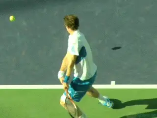

**The independent acceleration of the arms is what makes the ATP
backhand unique.**

**Two Types of Racquet Speed**

This forward orientation of the top arm approaching contact is the key
to creating the specific joint rotations for both forward and vertical
racquet head speed.

The primary joint rotation contributor to vertical racquet head speed is
the internal shoulder rotation of the top arm. But, the only way this
rotation can cause vertical motion of the racquet head is if the upper
arm is pointing relatively forward. This in turn is only possible if it
is very forward at contact.

To convince yourself of this run two tests with racquet in your top
hand. In the first test place the left upper arm against your side with
the elbow bent. Internal rotation of the shoulder will cause the racquet
head to move forward and/or laterally. In the second test orient the
left arm forward (as in toward the net) with the elbow straight.
Shoulder internal rotation will now cause the racquet head to move
vertically.

If your tests were run correctly it becomes clear that shoulder internal
rotation, or what I call twisting rotation, is a very effective creator
of vertical racquet head speed. Again this is assuming the top arm can
be oriented forward at contact.

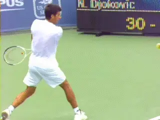

**With the top arm more forward, internal shoulder rotation creates
vertical racquet speed.**

The beauty of this is that shoulder internal rotation can now be
uniquely assigned to vertical racquet head speed. This is independent of
the other joint rotations used generate forward racquet head speed. This
partitioning allows maximization of both ball speed and spin and is the
key to the "heavy ball" seen in high level tennis.

**The Transition Point**

Now let's move on to the specifics of the forward swing, which I break
into two parts. This is because the mechanical actions that accelerate
the racquet are different in each.

The two parts are separated by what I call the transition point. The
transition point is the point at which the racquet tip and the butt end
of the racquet become aligned laterally. This is the point when the tip
of the racquet is directly behind the butt end and perpendicular to the
baseline.

Recall from the previous article how the dynamic slot was created in the
early forward swing when the racquet flipped down and laterally
backwards. This was a result of the force produced by the bottom arm
pulling forward on the grip.

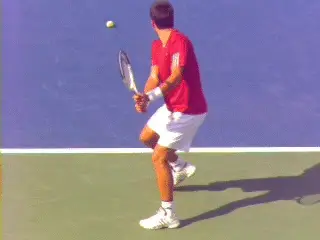

**The initial, linear swing up to the transition point with the racquet
shaft perpendicular to the baseline.**

The direction of this force is optimized by the set up position at the
end of the backswing. If executed correctly, the flip aligns the long
axis of the length of the racquet close to the direction of the pulling
force from the hands.

This means that for most of the first part of the forward swing the
hands are pulling the racquet on a relatively straight line with the
racquet long axis closely aligned with the swing path.

The acceleration of the racquet over the first part of the forward swing
is relatively linear. In this brief period, the racquet is being pulled
along like a rope.

**So in the first part of the forward swing, essentially the racquet
is accelerating butt end first. At a certain point, however, the racquet
needs to rotate in order to position the racquet head for contact. This
is what I call the "transition," from a largely linear period of
acceleration to one that is much more rotational in
nature.**

**[As the rotation of the racquet starts after the transition point, it
adds racquet head speed in a very short period of time. This increase in
racquet head speed occurs in two primary directions, horizontally and
vertically]**.

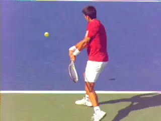

**From the transition point to the rotation of the racquet into
contact.**

**Vertical Racquet Speed**

Let's look at the increase in vertical racquet speed first. This
increase is related to the creation of the dynamic slot.

To review, the dynamic slot is a neuromuscular enhancement technique
that allows the shoulder internal rotators to produce more force. The
"flip" into the dynamic slot causes the top upper arm to rotate back,
via shoulder external rotation.

When the internal rotators are activated at this time, pre-tension (a
component of the stretch-shorten cycle) can be achieved. This in turn
can enhance the force production capability of this muscle group.

If the enhancement of the ability of the muscles to produce force
happens in conjunction with the forward position of the top arm near
contact, then the shoulder internal rotation of the top arm can cause
exceptionally fast vertical motion. This is particularly true when the
elbow of the top arm is straight.

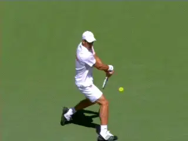

**The rotation of the top arm can cause exceptionally fast vertical
motion.**

At the same time the bottom arm elbow needs to bend from its previous
straight pulling position. Otherwise it can interfere with the rotation
of the top arm. This bending in the bottom arm increases the available
range for top arm shoulder internal rotation. It may also allow shoulder
external rotation in the bottom arm to assist the top arm in creating
vertical racquet head speed.

**Unique Attribute**

Vertical racquet head speed from internal shoulder rotation of the top
arm, enhanced though the actions of the dynamic slot, is a unique
attribute of the Type 3 mechanics. The geometric constraints of the two
handed configuration dictate that to make this work, the optimal arm
configuration is a straight top arm and a bent bottom arm near and at
contact. In fact, at the highest levels this is the predominant arm
structure observed.

This bending of the bottom arm elbow allows greater range for the top
arm shoulder internal rotation. But it has a dual role when we look at
the rotations that create the forward speed of the racquet head as it
approaches contact.

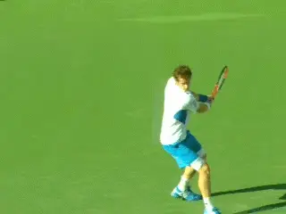

**Watch the bottom arm bend, facilitating the internal shoulder rotation
in the top arm.**

As the bottom elbow bends it causes the bottom hand to slow its forward
motion relative to the top hand. So the bottom hand is still moving
forward, but at a slower rate than the top hand. Functionally this means
that the hands are working in opposition-- the top arm is pushing the
grip against the bottom hand which is slowing down, even though the
bottom hand is still moving forward.

The relative opposing directions of the force applied by the hands
creates a turning effect on the racquet. This is known as a "couple."
In this case it's a push/pull couple. The push is with the top hand,
coupled with the pull of the slowing bottom hand.

**Very Different**

This is very different that the way the racket rotation is created in
the ATP or Type 3 forehand. As we saw, ([link](Developing%20an%20ATP%20Forehand%20-%20Part2.docx)) one of the
most interesting observations was that the centripetal component of the
force on the racquet from the hand caused the angular acceleration
responsible for forward racquet head speed.

On the Type 3 backhand however, it isn't centripetal force. Instead, it
is this push/pull couple. This is what causes the racket to rotate
horizontally into contact. The Type 3 hitting arm configuration is the
only the arm configuration that uses this method.

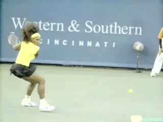

**The type one swing comes from behind the body laterally.**

John Yandell describes this Type 3 arm set up as "bent-straight." He
also describes two other configurations. One is "bent-bent" which is
common on the women's tour and the rarer "straight-straight." ([link](https://www.tennisplayer.net/members/avancedtennis/john_yandell/two_handed_backhand/2hd_bh_simplest_complex/2hd_bh_simplest_complex.html).)
These other two configurations tend to utilize the centripetal component
of the hand force for angular acceleration similar to the forehand.

**Type 3 vs. Type 1**

Compare the Type 3 mechanics to the Type 1 swing used by many of the top
women and junior players. Their swings come from behind the body
laterally and they tend to be bent-bent. ([link](The%20ATP%20Two%20Handed%20Backhand%20-%20The%203%20General%20Types.docx)
for my first article that describes the 3 Types.)

The bent-bent structure allows some players to use a version of a
forehand grip with the bottom hand, Serena Williams, for example. In
contrast, the Type 3 grip structure is something around Continental with
the bottom hand and something between an Eastern forehand and a
Semi-Western forehand with the top.

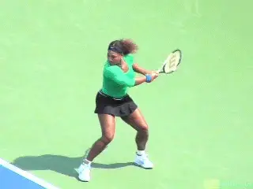

**With the Type 1 swing the contact is typically much further back in
the stance.**

The Type 1 swing is also far more circular, generated primarily by torso
rotation with very little independent acceleration of the arms.The final
racquet angular acceleration to produce forward racquet speed is created
primarily through centripetal force with contact further back in the
stance compared to Type 3.

This combination of backswing racquet position and direction of hand
force in creating the circular swing preclude Type 1 players from
utilizing the muscular enhancement potential of the dynamic slot.
Further, the arm orientation near contact (with the upper arms closer to
side) eliminates shoulder internal rotation as a significant contributor
to vertical racquet head speed.

Since internal rotation does not contribute vertically, other joint
motions of the shoulders, elbows, or wrists are used to create vertical
motion of the racquet head. This implies a tradeoff between speed and
spin. This is because a given joint rotation may be used for horizontal
speed on one shot and vertical speed on another -- essentially a choice
that requires significant alteration in the swing.

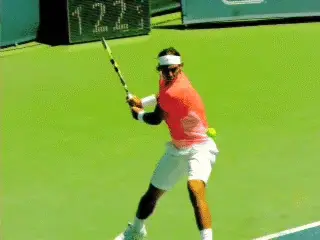

**Nadal's drastic flip in the dynamic slot.**

**True Elegance**

This is the true elegance of the Type 3 swing. In contrast to the Type 1
swing, adding or subtracting spin for a given shot simply requires
controlling the depth of the flip in the dynamic slot combined with the
associated adjustment in the amount of internal shoulder rotation
leading into contact. The structure of the swing and the contributing
joint rotations to vertical and horizontal racquet speed remain
essentially unchanged.

**Tour Examples**

Let's see what the Type 3 forward swing looks like and see some of the
nuances seen on the tour. To do this let's compare Rafael Nadal and
Novak Djokovic. Observe how when Rafa comes out of the dynamic slot, the
racquet flips drastically. You can see that top arm turning, and that he
is also pulling linearly with the bottom hand.

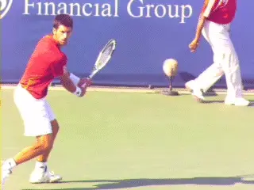

**Djokovic: the purest example of the Type 3 two-hander.**

Because Rafa is a rare example of a straight-straight striker on many
balls, the origins of his angular accelerations aren't clear without 3D
analysis. One thing is clear however, it's simple, beautiful, and
usually effective.

Novak hits the backhand flatter in general, so the degree of flip in the
dynamic slot is less. He doesn't need the racquet as much below the
ball. Watch how he straightens the top arm out and then drives it during
the torso rotation. Approaching contact he bends the bottom elbow
appearing to establish the push-pull couple.

Less flip and less internal rotation of the upper arm means less spin on
the average although he can easily adjust the spin output when needed.
Novak's stroke represents the closest mechanical set up to the Type 3
model.

So that's it for understanding the mechanics. In the next article I
will try to summarize the oncourt keys to creating the ATP two-hander
for yourself. Stay Tuned!

Dr. Brian Gordon has changed the understanding of the

Biomechanically Engineered Stroke Technique (BEST) is the

only empirically based stroke mechanics system in the world,

growing from three decades of both academic and applied on

court research. He is a founder of the Tennis Center for

Performance Research in Miami, Florida, which is creating a

new paradigm for player development. The center has assembled

an unprecedented group of specialists with cutting edge

knowledge across the entire range of tennis performance.

To visit his website, [**[Click

Here!]**](https://tennisperformanceresearch.com/)

Top contact him directly, [**[Click

Here!]**](mailto:gamabrian@icloud.com)
