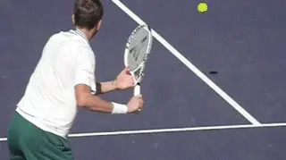
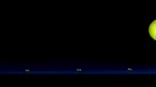
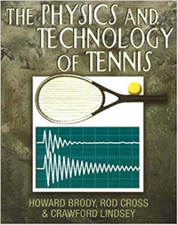
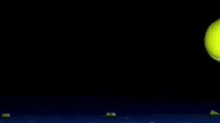
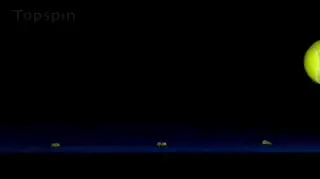

# The Bounce at 10,000 Frames Per Second

### Paul Hamori, MD

**How long is a tennis ball actually on the court surface?**

In my recent article on TPA about contact at 10,000 frames
per second I found that contact is actually about 20% shorter than the
generally published numbers. Additionally, I found that the trend toward
low-tension stringing is probably aimed at increasing contact length
which increases power and spin. ([link](Contact%20at%2010,000%20Frames%20Per%20Second.docx).)

So what about the ball bounce? What are the published figures? How long
is the ball on the court surface? Again I set up controlled filming at
10,000 frames a second.

The generally accepted figure is 5 milliseconds as measured on a hard
court. I found a range of 4.6-5.4 milliseconds. That is depending on
whether the ball is topspin, flat, or slice.

Topspin is the shortest duration, flat is in the middle, slice is the
longest. So the results are 92% to 108% of the published values. That's
less variation than I found with the various durations of balls on the
strings in the last article.

I think this is in generally agreement with what we perceive as players.
When the ball is coming in with heavy topspin we know it's going to get
on us quicker. When it is flat, or heavily sliced we know it's going to
slide longer on the court and potentially be difficult to handle for
that reason. But just as I found with strings, the difference between
gut, nylon and poly are for all intents and purposes minimal.

**Topspin balls have the shortest duration on court during the bounce.**

Although I didn't have the opportunity to film all that, I think the
numbers would differ depending on surface. Clay being softer, in all
likelihood leads to a longer ball contact time than hard court. As an
aside, in the earliest days of my tennis career--this goes back to 1969
--our only winter tennis option was a gymnasium at the University of my
home town on wood.

That gives a whole new meaning to fast. It seemed the ball was sliding
much longer on the wood before coming up.

Every shot was struck below the knees. Similarly, my experience on grass
--in Palm Springs--clearly not the grass of Wimbledon--the ball also
slides significantly longer, and slice is deadly--a good slice is often
unreturnable.

I used to take a hitting lesson with a former world-class professional.
He always used to tell me, "Paul, never give a pro a mid-court slice.
That point is going to be over." A corollary to this however, is always
give a club player a mid-court slice, you probably have a greater than
50% chance of winning the point.

**Physics**

So, let's delve into the physics of the bounce. The following
scientific descriptions are taken from Drs. Howard Brody and Rod Cross
and their seminal works, The Physics and Technology of Tennis ([link](https://www.amazon.com/gp/product/0972275908/ref=dbs_a_def_rwt_bibl_vppi_i1)),
and Technical Tennis ([link](https://www.amazon.com/Technical-Tennis-Racquets-Strings-Courts/dp/0972275932/ref=sr_1_2?dchild=1&qid=1635821441&refinements=p_27%3ARod+Cross&s=books&sr=1-2&text=Rod+Cross).)
Both are must reads for the tennis technology enthusiast.

They may have too much information for many players, but I think there
are important lessons to be learned. As I often tell patients in my
medical practice, knowledge is power--the power to decide what to do.

**7 Phases**

The bounce consists of the following phases: touchdown,
slowing/squashing, spinning, sliding, biting, stretching, then liftoff.
All of this happens in roughly 5 milliseconds. To quote Rod Cross, "the
innocent looking computer generated skid marks of shot spot are the
forensic remnants of an incredible sequence of happenings that, until
now, you simply thought of as in or out."

Three kinds of friction affect the ball bounce: sliding friction,
rolling friction, and static friction. To quote Dr. Rod Cross again,
"Sliding friction acts on the ball while it is sliding on the court.
Rolling friction is a weaker force that acts when the ball is rolling on
the court.

**Two must read books on the physics and technology of tennis.**

"Static friction acts on an object when it is at rest on the surface.
Static friction allows the ball to grip or bite a surface--similar to a
shoe or ball if were stuck down with sticky tape. Static friction acts
to stop the contact surfaces sliding past each other providing the
surfaces are pushed firmly together. **Static friction plays a role in
the bounce of the ball but sliding friction plays a much more important
role in changing speed and spin of the ball**."

Cross describes 4 bounce factors: Angle of incidence, speed/spin,
hardness of the court, smoothness/roughness of court. These factors
subsequently affect how long the ball is down on the court, how fast it
comes off the court, how high it bounces, and what kind of spin it comes
off the court with.

Everyone who took high school physics can probably tell you "**the
angle of incidence is equal to the angle of reflection in a perfectly
elastic collision**". **Simply put this means
the ball comes off of the court at about the same angle it goes into the
court.**

**In real life there is no such thing as a perfectly elastic
collision. In a tennis bounce energy is lost with ball compression and
court compression, and then friction and spin play their role to change
things as well.** **In an elastic collision speed
would not be changed, but the tennis ball bounces leads to a 25-40%
reduction in ball velocity.**

John Yandell was the first to document this in actual match play in his
study of ball flights by Pete Sampras about 20 years ago. ([link](https://www.tennisplayer.net/members/mystheavyball/john_yandell/ball_speed_pro_tennis/ball_speed_pro_tennis_page1.html).)

Tennis balls lose about 20% of their flight speed while traveling
through the air and then go on to lose another 25-40% after the bounce.

**Because of the effect of the bounce, the net result is that the ball
bounces up about three quarters of its vertical
drop.** Excepting serves and overheads, it is
simply the vertical drop of the ball from the maximum height of ball
trajectory that determines how high the ball bounces.

**Higher Bounce**

Which bounces higher? Topspin or slice? This is a paradox--a seeming
contradiction that is nevertheless true. Everyone will tell you topspin
bounces higher--that is our practical experience.

**But for a given angle of incidence, slice bounces higher. However,
slice always comes in at a lower angle--hence our perception that it is
lower bouncing. Topspin is typically coming from a higher peak, and
dropping at a steeper angle, which adds to the higher
bounce.**

**Slice: a lower angle of incidence but a relatively higher bounce.**

Hardness of the court is an obvious factor in how high the ball will
bounce. As in my previous example above, wood bounces extremely low,
grass--particularly traditional grass- bounces low, carpet bounces low,
hard courts bounce higher, and clay courts bounce the highest.

Rod Cross states the following: "For a flat ball coming in a 15° angle,
it comes off grass court at 16°, a hard court at 18°, and clay at 21°.
Hence a 5% difference between the fastest courts--grass and the slowest
courts--clay. I would estimate that wood courts are at about 12% angle.

Court smoothness or roughness affects the friction, which subsequently
affects horizontal ground speed, bounce height, and spin change. As
would be expected, for length of time on the ground, topspin loses less
speed, flat is in the middle, and slice loses the most speed.

Topspin balls come off the ground retaining topspin, flat balls come off
the ground with topspin rotation as do most slices.

**Biting**

Biting is a term used to describe the ball transiently stopping on the
court surface. The bottom of the ball that has a transient stop while
the top of the ball continues with rotation and forward speed.

Topspin bites sooner than back spin and flat shots which slide more
prior to biting. The spin after the bounce is primarily a factor of how
fast the top of the ball is moving relative to the bottom of the ball at
the time of biting or the bottom of the ball stopping.

**Flat balls come off the ground with topspin.**

Thus, topspin balls come off with continued significant topspin. In fact
in pro tennis often with more topspin than was originally created by the
racket. In his study of ball bounces at the U.S.Open in 1997, John
Yandell found that after the bounce balls hit with topspin actually had
about 2000rpms greater than before the bounce ([Click
here](https://www.tennisplayer.net/members/biomechanics/mystheavyball/john_yandell/spintest_part2/spintest_part2.html)).

Flat balls come off with some topspin. Slice balls are variable
depending on slice rotation speed coming into the bounce. Typically,
they come off with a slight topspin rotation, although they also can
come off flat.

**Here are the averaged numbers from my experiments.**

Topspin balls had 1785rpm coming into the bounce and 2725rpm coming out.
The flat balls were basically zero rpm coming into the bounce and
2175rpm coming out. The slice balls had 1575rpm of underspin coming into
the bounce and had 1485rpms of topspin coming out.

A rule of thumb supplied by Dr. Cross is **"balls that hit the court
at less than 20° tend to slide through the bounce and sliding friction
will determine how the ball bounces. Balls that hit the court at greater
than 20° tend to bite more and come up at age steeper
angle."**

**So What?**

**How if at all does this apply to your daily tennis? Primarily, since
the brain is a prediction engine you can use it to predict the
bounce.**

**You have many clues. This starts with the sound of the ball off of
your opponent's racket, then trajectory, angle of incidence, and
observed spin. From all this you can start to anticipate what kind of
bounce you're going to get and where you are going to need to position
your body in order to take the ball at a comfortable
level.**

**Compare the bounce for topspin, flat, and slice.**

Topspin balls come in steeper, bite sooner, and bounce higher. Flat
balls slide more, come off with slight topspin, and loose less speed
than slice. Slice balls come in lower, slide significantly longer and
slow significantly more leading to some potential timing issues. You
commonly see even pros missing a sliced ball after a long series of
topspin balls prior to the slice.

Teaching pros the world over are fond of a drill first developed by
Timothy Gallwey called "bounce-- hit." It's a way of focusing the
mind on the ball at the most important time--during the bounce and just
prior to contact.

In order to do this drill simply say to yourself in your mind (or out
loud if it's not a competitive match) "bounce" when the ball bounces
and "hit" as you hear the contact. This is an amazing drill that can
dial in your strokes for timing and consistency.

One last point in closing: I pose a rhetorical question: The ball is on
the ground between 4.6 and 5.4 milliseconds. Can you see it bounce? The
answer has to be yes or you have been making some pretty bad line calls.
How can the brain process such a short time interval? In a future
article I will reveal the answer.

I began writing the book that is the basis for this article - [The Art
and Science of Ball
Watching](https://drpaulhamori.com/index.php/product/the-art-and-science-of-ball-watching/) -
in August of 2019 and finished it in January of 2021. In a sense,
though, I have been working on it since I started playing tennis
fifty-five years ago at the age of five. In high school I played four
years of varsity tennis in addition to sanctioned USTA junior
tournaments. I probably reached a 4.5-5.0 level. I considered playing
small college tennis, but by then I was burned out on the sport, and
knew that my pre-med studies wouldn't allow time for college tennis.

But tennis was in my blood, and I started playing again with a passion
after medical school. During this time, I really started to study the
technical aspects of the game.

My idea for the book started out with various technical ideas that I had
been kicking around by watching great players over several generations.
In the end I came to the conclusion that good racket to ball contact
depends on good ball watching. I wrote the book to teach myself how to
see racket to ball contact and my hope is it can help you do the same.
