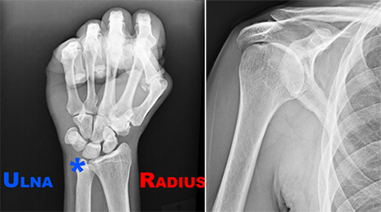
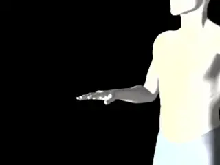
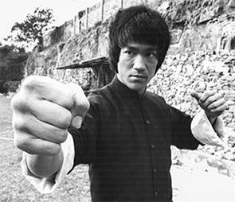
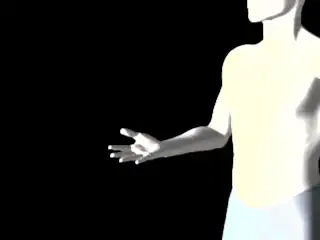
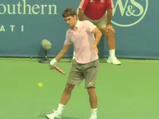
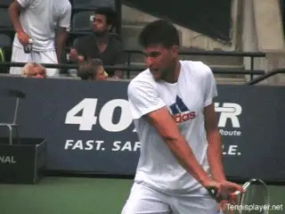
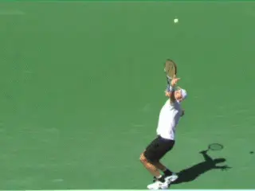

# The Most Important Bones in Tennis

### Paul Hamori, MD

**The ulna styloid and the humerus. The
movement of these two bones is a key to understanding stroke
production.**

There are 206 bones in the human skeleton. Which of these are the most
important in tennis?

For the purposes of this article I am limiting myself to the upper body.
The two bones are the ulna styloid and the humerus.

I won't deny that tennis is a game of moving with some hitting. As
such, getting yourself in proper position allows proper stroking of the
ball. This is where the pros excel far beyond any amateur. However,
assuming you can get yourself in proper position, these two bones can be
imagined as alternate or additional keys to execute high quality swings.

The ulna styloid is the thinner bone in your forearm. The humerus is the
single bone in the upper arm.

The motions of the arm have been well described by biomechanists in all
the strokes. (See the [Biomechanics
section](Science%20of%20Biomechanics%20TOC.docx).) But visualizing the
images of the movement of these bones gives players and coaches
additional images to use in developing or improving technique.

**The Wrist**

I have not heard much about it lately, but the tennis training tool The
Wrist Assist is a device popularized and advertised by Brad Gilbert that
carried the slogan "feel what the pros feel". ([link](http://squarehittennis.com/index.html).)

**Agassi: wrist laid back before, during, and after contact.**

I still have my wrist assist and every once in a blue moon I hook it up
to my old Pro staff and hit a few rally balls on my tennis wall in my
basement. The gist of this tool is that it prevents forward flexion of
the wrist during stroking of the tennis ball.

During his prime, Andre Agassi was renowned for his unbelievable
forehand power. At the time everyone thought Agassi was quite wristy,
but high-speed video shows there was very little flexion of his wrist.

His wrist remained laid back before, at, and after the hit. The main
source of his power turned out to be internal rotation of the arm in the
shoulder joint. The arm, hand and racket rotated essentially as a unit.

There may be a slight amount of flexion coming into ball striking but it
is minimal. Significant forward flexion only occurs toward the end of
the follow-through as part of the deceleration phase of the stroke.

**Acceleration**

In My Book the Art and Science of Ball Watching ([link](https://drpaulhamori.com/product/the-art-and-science-of-ball-watching/).)
I have a section devoted to the physics of tennis. In that section I
talk about Bruce Lee's 1 inch punch.

**Bruce Lee used massive acceleration in his one inch and six inch
punches.**

Bruce Lee could break a board starting from a one-inch distance. He
accomplished this with extreme acceleration.

He also had a 6-inch punch. And this punch is more apropos to the
kinetics of tennis strokes. In the 6-inch punch Bruce Lee's combination
of flexing of the legs, coiling of the torso, flexion of the arm, and
external rotation of the shoulder--followed by the unwinding of this
process, which led to tremendous hand speed.

**The Bones**

Many of us have been shown by our teaching pros the proper use of the
shoulder and arm in tennis strokes. However, thinking about the bones in
action brings the point home even more clearly.

Moving these 2 bones correctly allows you to maximize racquet head speed
to gain the most power with the least effort.

A common terminology confusion in coaching regards the term
"pronation." **In reality, pronation is the independent rotation of
the forearm and hand from the elbow joint.**

Biomechanical research has shown this movement has no significant role
in tennis strokes. Yes, the forearm rotates. But this is because it is
attached to the upper arm.

**Pronation: Independent counter-clockwise rotation of the hand from the
elbow joint.**

It's not an independent movement. What we perceive to be pronation is
actually caused by internal or external shoulder rotation.

For the purposes of tennis, and acceleration through the kinetic chain,
these motions are the most important. Internal rotation on the forehand
and the serve. External rotation on the one-handed backhand.

**The Chain**

The kinetic chain in tennis is the sequence of events that leads to
acceleration and racquet head speed. It is a complex process of body
movements. The combination of turning the torso, flexing the knees,
rotating the upper arm from the shoulder joint, and then unwinding this
entire process leads to a synergistic acceleration of the racquet head
providing power and spin.

The last part of this chain is the rotation of the arm from the
shoulder. So, let's look at the forehand, the one handed backhand and
the serve, the 3 shots where the rotation of the arm is most dramatic,
and see how this works.

**Forehand**

**Look at how the ulna bone has rotated until it is pointing basically
up at the sky in the full wiper motion.**

Initially we prepare the torso with a unit turn which places the
shoulders sideways to the net or even turned a bit further. Typically,
as the forward swing starts, the face of the racket will be pointed
somewhat down toward the court---the so-called tap the dog position. Or
it may eventually face the court completely---the so-called pat the dog
position.

As we approach the ball, we start to rotate the shoulder internally. The
wrist remains stable.

There is little or no forward flexion. This is true with eastern or mild
semi-western grips. With the more extreme western grips, with the palm
mostly or completely under the handle, the wrist lay back is reduced or
eliminated, but there is still no forward flex in the swing.

**[Look at the last frame in the animation.] [The ulna styloid
has rotated with the rest of the arm until the joint with the hand is
pointing basically up to the sky in a full windshield wiper
finish.]** **This rotation of the ulna can serve
as an excellent image to generate the wiper.**

**One Hand Backhand**

We again start with a unit body turn, putting the shoulders sideways to
the net. With the backhand, often the feet are sideways to the net in a
closed stance. As we execute the unit turn we simultaneously find our
grip and rotate the shoulder internally.

This leads to the butt cap of the racquet and the ulnar styloid pointing
straight out to the net. As we initiate the stroke the butt cap and
ulnar styloid lead the process and we began to externally rotate the
shoulder.

**Look in the animation and the arm and forearm. The ulnar styloid is
pointing to the sky. Again, visualizing this
image** **is a great key to insure full external
rotation.**

**On the backhand the external rotation of the hitting arm from the
shoulder means the ulna styloid at the joint with the wrist points
directly up at the sky**

**Serve**

There are a multitude of ways to get to the trophy position in the serve
and I won't go into those details. From the trophy position you will
see that the ulnar styloid is pointing 45° to the sky with the shoulder
externally rotated.

As we initiate the stroke the ulnar styloid and the butt cap lead the
upward trajectory of the hand. As the hand rises, we then internally
rotate the shoulder.

**Watch the hand arm and racket rotate until the ulner styloid points
directly down at the court.**

The racquet head will shoot up with huge acceleration, pass the hand and
reach the ball. This internal rotation continues after contact.

Watch the rotation. Again, we can use the position of ulna styloid as a
key image. It has rotated until it points directly down at the court.
The lack of this full rotation is a common weakness in huge numbers of
recreational players.

**Conclusion**

Although there are many ways to key strokes, I think visualizing the
actual bones in action brings the message home in a tangible way. I hope
this article provides you a better understanding of the upper extremity
mechanics in tennis, and hopefully visual images you can use in your own
game.

I began writing the book that is the basis for this article - [The Art
and Science of Ball
Watching](https://drpaulhamori.com/index.php/product/the-art-and-science-of-ball-watching/) -
in August of 2019 and finished it in January of 2021. In a sense,
though, I have been working on it since I started playing tennis
fifty-five years ago at the age of five. In high school I played four
years of varsity tennis in addition to sanctioned USTA junior
tournaments. I probably reached a 4.5-5.0 level. I considered playing
small college tennis, but by then I was burned out on the sport, and
knew that my pre-med studies wouldn't allow time for college tennis.

But tennis was in my blood, and I started playing again with a passion
after medical school. During this time, I really started to study the
technical aspects of the game.

My idea for the book started out with various technical ideas that I had
been kicking around by watching great players over several generations.
In the end I came to the conclusion that good racket to ball contact
depends on good ball watching. I wrote the book to teach myself how to
see racket to ball contact and my hope is it can help you do the same.

---

<!-- prevnext-nav -->
[← Most Complex Motion in Sports](the-most-complex-motion-in-sports.md)  |  [Biomechanics Index](index.md)  |  [Next ATP Forehand →](the-next-atp-forehand.md)
