# The Power Serve - Part 1

**The Power Serve:**

**Part 1**

**Bruce Elliott**

Sometimes I am asked if the purpose of my research is to show teaching
pros how to teach the serve. Absolutely not! Teaching professionals can
teach me how to teach the serve.

What my work does do is break the serve down into its mechanical parts.
For teachers or players this means they can have a better understanding
of the service action and how to modify technique to improve efficiency
or to reduce the chance of injury.

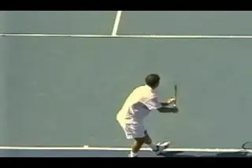

**Fluency or coordination of the body parts is the first key to the
power serve.**

**Strength Base: The Prerequisite**

***If you want to serve with power, you must load the body. But
here's the catch: two places that you typically load the body are where
injuries now are occurring in tennis, particularly on the pro circuit.
These are the shoulder and the elbow.*** So, some
of the things I want to explain have to do with how you actually reduce
the loading on those areas, while still developing the power serve.

**[It's very important to understand that, if you want to serve at a
high speed, you've got to prepare your body physically. You cannot just
learn the power serve without a strength base. So let's see what a
strength base entails.]**

**[First, you must have core stability. To be good at tennis, you
definitely need core stability. Basically, that's stability across the
pelvis, or the lower abdominal area.]**

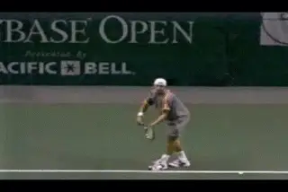

**The trick is to load the shoulder and elbow---but without causing
injury.**

***[The other thing you need is shoulder stability. You can't just go
out and rotate your arm as quickly as you possibly can, without having a
stable shoulder. You need core stability and you need shoulder
stability, before you start to introduce high speed serves.]***

So that's the cautionary tale, but what about the serve itself?

**Keys to the Power Serve**

**First, you need fluency or coordination. You need the body parts to
flow together.**

**Second, you need to use elastic energy. You need to set the system up
so that elastic energy is used during the serve to improve the speed of
movement.**

If I was to tell you, you could get a 20 percent dividend in the stock
market, you'd all want me to tell you how.

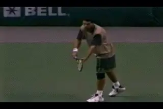

**Using multiple body segments - not just the arm is another key to
power.**

I'm giving you a tip from a tennis coaching perspective that's better
than that. You can be guaranteed a 20 percent bonus on the power of your
serve if you use elastic energy, and I'll show you how to set that up.

**The third thing is you need to use as many segments of your body in
the motion as you possibly can.**

**You don't just hit the serve with the arm. You need to use multiple
segments, like you do in the forehand, like you do in the backhand.**

**You've got to coordinate those segments together so that you get back
to my first point, and have a motion that is fluent.**

***[And the last thing you need to increase the movement of the racquet
is the distance that the racquet moves, so that you can build up speed.
To use a technical term, you've got to increase displacement. You've
got to increase the distance that the racquet can move so it has a
greater opportunity to build speed.]***

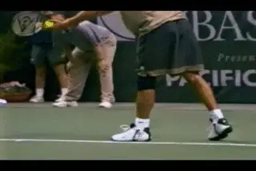

**Our research shows the Foot Up technique gives better height from the
leg drive.**

**Foot Action**

There are two types of foot action that you can use in the serve. What I
would call the foot up and what I would call the foot back.

**[The foot back technique places the feet apart. The foot up technique
places the back foot up near the front foot.]** And obviously,
you can have the foot anywhere in between, so it's not just one or the
other. It can be the whole range in between.

**[Our research studies show that if you use the foot up technique, you
get better height on your drive. You usually impact the ball
higher.]**

**[If you use the foot back technique, it's better for driving your
body forward. So if you want to get into the net very quickly, quite
often people will use that foot back technique.]**

**Now does that mean one technique is better than the other?
Absolutely not. If the player uses the foot back technique, he is
probably very good at moving forward into the court, but he may need to
place particular effort to hit up and out to the ball. It's a trade
off.**

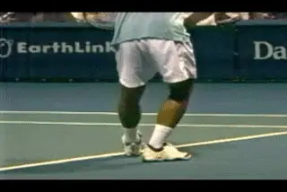

**The foot back technique drives the body forward into the court and
toward the net.**

**The Leg Drive**

The next element as you go up the tree or the bio-mechanical chain is
obviously the legs--the knees and the leg drive.

**Why do you need a good leg drive? I'll give you three reasons.**

**If you have a leg drive and you drive up with my legs, it drives your
shoulder up, and that drives your racquet down.**

**You get two bonuses with that. You get elastic energy, so all the
muscles across your chest are put on stretch. That's number one.**

** **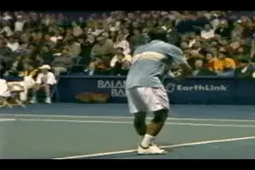

**Leg drive and trunk rotation lead to elastic energy and optimal racket
displacement.**

**You also increase distance that the racquet moves down behind my
back.** The "scratch-the-back" that we all used in coaching does not
work with today's modern serve.

**[Trunk rotation also positions the racquet further away from the back.
It should be down near the backside. That will give you an idea as to
whether they've got a good leg (and trunk) drive or not.]**

**And the third thing, I can tell you from work that we have done
recently, you'll get less loading on the shoulder and elbow - the two
areas most susceptible to injury that I mentioned above.**

**[To achieve these three bonuses, you've got to come out of that knee
bend or flexion with as much drive as you can possibly muster. Remember,
you do not jump off the ground under any circumstances. [You drive
yourself off the ground.]]**

**The Trunk**

**As you move up the body, the next thing to look at is the trunk. I'll
talk for quite awhile about the trunk, because it's so important to the
serve. You'll see that if you set the serve up right, you're going
to spend more time on the legs and trunk than on the upper limb, which
is next in the chain.**

**So let's look at the trunk in two parts. The first part of trunk
movement is backwards. This is the rotation of the hips and rotation of
the shoulders backwards away from the net. What should you look for? A
number of things.**

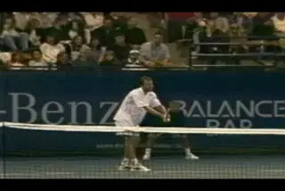

**You want the shoulders to rotate more than the hips in the movement
backwards.**

**First, that there is some rotation of the hips. Secondly, there is
more rotation of the shoulders. That puts the muscles of the trunk on
stretch, so that's going to help us with elastic energy, and we're
going to use that elastic energy to help drive the whole system
forward.**

**So we want rotation of the hips, rotation of the shoulders, and we
want more rotation of the shoulders than of the
hips.**

**Be careful with the hips. Sometimes the hips don't turn all that much
initially, but you still want the trunk to turn on top of the hips.**

This is related to the stance. Let's go back now to stage one and the
foot up technique. If you are using the foot up technique, make sure
that your back foot comes up and behind the front foot. Make sure that
your back foot doesn't come around in front of the front foot.

If you bring your back foot up and place it in front, it will cut out
the action of your hips. So if you use a foot up technique, make sure
that you position the back foot, by tucking it in against the front
foot, because then you can rotate your hips.

Where would you want the hips to be? You certainly want them to rotate
so that they are at least at in line with the direction of the serve.

If you start with your hips very square to the net, be careful, because
you can't rotate your shoulders and put your muscles on stretch.

***Starting with the shoulder open can facilitate the stretch between
the shoulders and the hips.***

**[It might be a good teaching point to start with, but when players can
actually serve, you are better to start more open. They then can rotate
backwards, and they can put some stretch between the line of the
shoulders and the line of the hips. That is, you can rotate the
shoulders beyond the hips.]**

If that doesn't make sense on a serve, think of a forehand. Think when
you're hitting a groundstroke. You always rotate your shoulders further
your hips. Doing this, you are actually putting your trunk muscles on
stretch. And you want the same in the serve.

**Three Forms of Trunk Rotation**

So you want to use the trunk to develop power in the serve.

Your trunk can rotate in three different ways, so let's examine each
one. It can rotate forward, like I'm going to do a somersault. That's
forward rotation. It can rotate as if there was an axis stuck through my
head. So I can twist around this long axis. Or, I can have my back
shoulder rotate over the top of my front shoulder.

**[Let me go through that again. I can rotate forward. I can twist
backwards, then forwards. And I can have the back shoulder rotate over
the top of the front shoulder, as in a cartwheel.]**

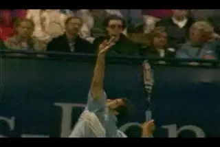

**Sampras demonstrates perfect "shoulder over shoulder" rotation.**

In the past, I probably believed that you just rotated around a twist
axis, and that's the key to the service.

I twist back. I twist forward. Seems logical. That seems to be what all
the coaching books have said. Just rotate into the serve.

But I have to tell you I'm sorry, that's not right. That's not the
way you serve. It's not the way the good guys serve. It's not the way
the good girls serve.

They all rotate forward. That is true. You do rotate around that twist
axis. But the key to a good service action is that you rotate shoulder
over shoulder.

**Pete Sampras rotates perfectly shoulder over shoulder. He rotates so
that one shoulder goes almost over the top of the other.**

It's not on a perfect line, but it's one shoulder over the top of the
other. So think of the trunk as three movements, but think more of
shoulder over shoulder.

Now the question is whether the right shoulder over left shoulder is
totally activated by the right shoulder? Absolutely not. The front side
plays a role. You pull down and you push up.

But don't too think of pulling down, too early because it will collapse
your base. ***Think first of driving the back shoulder up. But when
you start to get a fully developed serve, you'll see players push up
and pull down.***

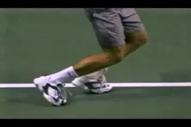

**The shoulder over shoulder rotation leads to a left foot landing.**

**The Landing**

What foot do you land on in the follow-through? Think about it. What
foot do you land on? If you believe that you rotate around a twist axis,
it's logical to assume that you land on your right foot, and then set
off to the net (Beginners may actually do this and that may be OK).

**But if you believe what I'm saying, that you in actual fact rotate
shoulder over shoulder, you would land on your left foot, if you're
right-handed. I land on my left foot, if I go shoulder over
shoulder.**

And that is in fact what virtually all of the top servers do: Sampras,
Andy Roddick, Taylor Dent, Greg Rusedski.

**In the great servers the arm can rotate backwards, or externally as
much as 170 degrees.**

**Arm Rotation**

So let's look at the next factor: external rotation. Hopefully, that's
not a new term to students of the serve. In a good service action of a
mature player who's been prepared to do this, you'll see that the
external rotation of the upper arm is backwards almost to the
horizontal.

If you go out and look at the major League pitchers, you'll see the
same thing. Their arm is almost parallel with the ground.

In our filming at the Olympics, and we found that for top servers, both
males and females, the average amount of rotation was about 170 degrees
(or 80 degrees from when the upper arm is vertical).

**[So you need to rotate that arm all the way back, or as far as you
can. And the only way to get that you get it to rotate back is to drive
with your legs, and to drive with your shoulder. This is what drives the
racquet away from the back.]**

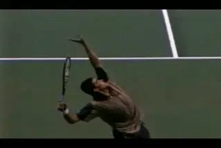

**To check for external rotation with the naked eyed - how far has the
racket dropped down and how far is it from the body?**

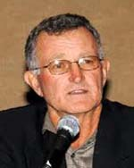

**Bruce Elliott** is a leading figure in the history of quantitative bio
mechanical research. He has published over 130 articles, including many
of the earliest and most important quantitative studies in tennis. He
was a major contributor to World-Class Tennis Technique, and to the
recent ITF book Biomechanics of Advanced Tennis. As a player and coach,
his focus is on integrating research into coaching and teaching. A
professor in biomechanics at the University of Western Australia , he is
a keynote speaker at major teaching conferences throughout the world.

---

<!-- prevnext-nav -->
[← The Backswing The Upper Body Part 2](the-backswing-the-upper-body-part-2.md)  |  [Biomechanics Index](index.md)  |  [The Power Serve Part 2 →](the-power-serve-part-2.md)
