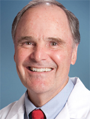

# The Serving Nodes

**The Serving Nodes**

**Dr. Ben Kibler**

In his first two articles, noted orthopedic surgeon and tennis
researcher Dr. Ben Kibler has shared the results of his ongoing studies
of the serve and elite servers. ([link](The%20Push%20Serve%20and%20Pull%20Serve.docx) for Part 1. [link](Cocking,%20Loading%20and%20the%20Back%20Foot.docx) for Part 2.)

In this third article he outlines his overview of what he calls the
Serving Nodes. These are a series of key positions and motions in
efficient, high level biomechanical serving. There is more here about
the critical role of the back foot.

But Ben also explains the role of correct hip tilt, a much misunderstood
topic, as well as the correct rotational offset angle between the hips
and shoulders, and the range of correct alignment between the shoulder
and racket arm in the windup.

This is important, valuable work which provides a basis for
reinforcing--or over turning--many widely held ideas about the serve.
I've learned a lot from Ben and am delighted to share his work on
TPA!

Dr. Ben Kibler is an orthopedic surgeon and Medical Director at the
Lexington Clinic Sports Medicine Center, in Lexington, Kentucky. He is
the Sports Medicine Advisor to the Professional Tennis Registry and also
the Women's Tennis Association. Ben is currently working with WTA tour
officials and coaches on a study of women's professional serving. Ben
is a member of the USTA Sports Science Committee and was a founding
member, and is Past President, of the Society for Tennis Medicine and
Science. In 1998, he received PTR's Stanley Plagenhoef Award for his
work in sport science. In 2009, he received the International Tennis
Hall of Fame Educational Merit Award.
