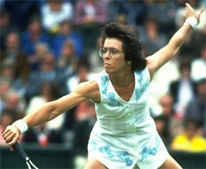
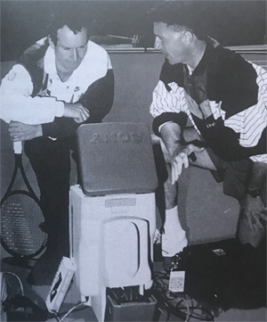

# Understanding Mental Imagery - Part 1

**Understanding Mental Imagery:**

**Part 1**

**Archie Dan Smith, MD**

**The goal when using mental imagery is to see and feel yourself playing
tennis within your own mind, as if you were actually physically playing
tennis---seeing yourself as if a real life experience was happening.**

**This is also called mental rehearsal or
visualization.** And the research shows that the
use of mental imagery in this fashion has a demonstrable, positive
impact in helping you hit your shots when you need them.

**What did Billie Jean King discover about the power of mental imagery?
See below!**

**Types of Imagery**

There are four commonly recognized types of mental imagery. These are
visual, kinesthetic, auditory, and olfactory---seeing, feeling, hearing,
and smelling. But the two most relevant to tennis are visual and
kinesthetic.

Visual imagery means creating pictures in your mind, using your mind's
mental camera. This can be done from two perspectives. The first is
internal. The second is external. [Internal visual imagery means you
imagine being inside your own body.] [You are seeing images as
through your own eyes.] You see the ball leave the opponents
racket and coming toward you. You visualize what you actually see when
you play points[. **[This is called first person
perspective.]**]

**What are the types of mental imagery and how do they apply to
tennis?**

[External visual imagery is viewing yourself from the perspective of an
observer], as if you were watching television or video of
yourself. **This is third person perspective.**

**[Kinesthetic imagery is when you imagine the feeling of playing in
your own body.]** You feel your body is performing the movement.
You feel your legs as you run toward the ball. You feel your body and
arms as you hit the stroke. You feel the contact with the ball in the
sweet spot of the racket.

With kinesthetic imagery you experience the feeling of actual playing a
physical point. This can be done solely in terms of imagined feelings,
or in conjunction with imagined images.

**Which Type?**

So is either visual imagery or kinesthetic imagery somehow "better"?
This has been reviewed by multiple researchers with conflicting results.
My personal take is that the most useful form of imaging is probably
dependent on the stage of learning. In early learning external visual
perspective seems to be the most beneficial. For later stages, internal
imagery is probably better.

**Test all the variations of mental imagery in different scenarios.**

Kinesthetic imagery in my view is likely most helpful to the skilled
athlete---a player who knows what his shots feel like. And kinesthetic
imagery is especially powerful when combined with an internal visual
perspective.

But I recommend using them all. We are all different, so what works best
for one may not work best for another. Different players will naturally
gravitate toward one type or the other visual imagery, or toward
kinesthetic imagery or some combination of all three.

I say test all variations imagining a variety of different scenarios and
game situations. Experiment with mentally practicing your strokes.
Experiment with mentally playing points. What works best in one scenario
may not necessarily work best in another.

**Research**

Why is the use of mental imagery so powerful? The research shows that
the brain experiences highly vivid imagery as identical or close to
identical to actual play. **When you imagine yourself performing to
perfection, doing precisely what you want when you want to do it, you
are actually physiologically creating neural patterns in your brain,
just as if you had physically performed the
action.**

As one researcher put it mental imagery creates "the neural patterns in
our brain teach our muscles to do exactly what we want them to do."

But I also think there is something else. Somehow, visualization adds
another dynamic.

**What did Jack Nicklaus's mental home movies look like?**

The duplication of the physical and the mental reinforces and adds to
your muscle memory. It adds an element that is separate and apart from
your usual physical practice. There are many, many studies that document
this and I believe it is a fact. In the first two articles we discussed
actual muscle memory practice. ( for [Part
1](Understanding%20Muscle%20Memory%20-%20Part%201.docx).  for
[Part 2](Understanding%20Muscle%20Memory%20-%20Part%202.docx).) There is
a correlation on a neurophysiological level between physical muscle
memory practice and the use of imagery.

Program and reprogram your mind and muscles utilizing imagery of your
ideal physical practice. This is very powerful in the creation of new
neural pathways.

Taken together with your physical practice, the additional imagined
neural patterns serve to reinforce and strengthen your game. The brain
sees the imagery, your strokes, and the point you are imagining, as a
real life situation.

**Why Use Imagery?**

If you are a club player who wants to improve, to help your tennis team,
to get revenge for that last painful loss, or simply to play better and
enjoy this great sport more than you already do, then use imagery. There
are numerous examples of pro athletes explaining its power in their
sports.

Here is hockey legend Wayne Gretzky: "I really believe if you visualize
yourself doing something, you can make that image come true. And when it
comes true it's like an electric bolt going up your spine."

Here is golfing legend Jack Nicklaus: "I never hit a shot, not even in
practice, without having a very sharp in focus picture of it in my head.
It's like a color movie. First I see the ball where I want it to
finish, nice and white, sitting up high on bright green grass. Then the
scene quickly changes and I see the ball going there, its path,
trajectory and shape, even its behavior on landing.

The next scene shows me making the kind of swing that will turn the
images into reality on landing. These home movies are a key to my
concentration"

**Working with John Yandell, John McEnroe used visual imagery to
recovery the shape of his service motion and 15 mph.**

And here basketball legend Michael Jordan: "I visualized where I wanted
to be, what kind of player I wanted to become."

Then there is Michael Phelps the most decorated Olympian in history,
with 23 Olympic gold medals. The use of imagery was one of the essential
components of his success.

His coach, Bob Bowman, would have him visualize a perfect race.
According to Bowman, "He's the best I've ever seen--and he may be
the best ever in terms visualization."

**Tennis**

As John Yandell has explained in a seminal TPA article, he
helped John McEnroe use imagery to recreate the shape of his service
motion in 1991, using film of himself from 1984 when he had the best
serve in the world. This result was that John recovered 15mph or more
that he had lost in ball speed and his serving percentages went back up
to the mid 60s, having been stuck in the 40s. ([link](https://www.tennisplayer.net/members/teaching_systems/john_yandell/VisualTennis_Part2/Yandell_VTP2_McEnroe_Case_Study.html).)

In an interview Billie Jean King did with John, she explained that she
discovered that she was spontaneously visualizing shots in matches and
that she then created a series of visual sequences for every aspect of
her game and used them actively for the rest of her career.

These are just two examples from legendary players. The fact is that
whatever your level, imagery can help every aspect of your game, your
strokes, your motivation, your confidence, your tactics, and your
performance outcomes. More on how to do that in the next article.

*Video demonstration — the original video for this article was hosted on TennisPlayer.net.*

Archie Dan Smith, MD is a retired

physician living in Austin, Texas. Here is

how he describes his tennis journey,

leading to the creation of his work on

muscle memory:

"I played for 2 years at my small town

high school. For the next 10 years I

played a dozen times a year with friends.

Then I did not play for decades. About 10

years ago I began to play again. I was a

mid-level 3.5 player but I could tell over

time my game was slipping.

During this period I came up with and

started implementing my theories on muscle

memory. I started getting better. Two

years ago I won the 3.5 men's singles

division in the long running main City of

Austin tournament. I beat a 26 year old in

the finals. Now I am recruited by USTA

teams that have won regionals, and I play

#1 doubles for a team in the Austin Tennis

League. I conclude that there may be

something to my theory."
