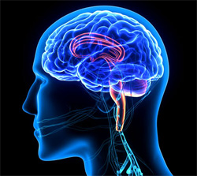
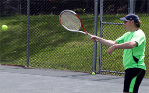
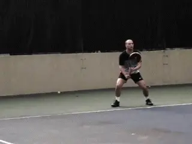
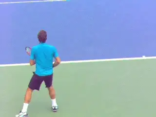

# Understanding Muscle Memory - Part 2

**Understanding Muscle Memory:**

**Part 2**

**Archie Dan Smith, MD**

In my first article I said that 3 weeks of muscle memory practice every
other day is the optimal period to consolidate new muscle memory.

This means practicing on one stroke or shot, trying to hit several
hundred high level repetitions, and not practicing any other shot.
([link](Understanding%20Muscle%20Memory%20-%20Part%201.docx) for
Part 1). According to the research, this is the time frame and the
practice routine needed for the brain to undergo functional change.

Unless you are doing little else but working on your tennis, however, it
may be difficult or impossible for you to practice this intensely every
other day for 3 weeks. But I believe that--regardless of what may be
optimum--you can make significant improvements with less work.

**How much training does it actually take to make real improvements in
muscle memory?**

The intensive 3 week plan described in the first article is a
generalization. Generalizations apply to large groups. Individuals vary.
So what is needed for each individual may be different.

So here is a less ambitious protocol. Practice 3 to 5 times for one
week. Again hitting only one shot and not practicing others. 200 or more
high quality repetitions.

If you are just picking up the sport, your gain with this less ambitious
plan will probably be the greatest. If you have been playing for years,
it may take longer to fully form the preferred pathways. This is because
the development of new muscle memory paths will have to compete with
established memory paths.

But the point is that if you can string together several sessions of
muscle memory practice in a short period of time, you will see real
improvement.

**The time needed to develop muscle memory may vary with your level.**

Though I have never followed the "ideal" protocol, when I started
implementing my theories on muscle memory, I started getting better.

I have completed 5 times of practice every other day a few times. I have
also practiced 6 times over two weeks on two occasions. Currently, I do
muscle memory practice on one stroke 4 times a week or more once every 2
or 3 weeks.

Now when I am trying to improve, I will practice at least 4 times within
one week. I continue to make progress when I commit to at least 4 times
in one week, even if it is once every 2 to 3 months. When I do this, the
improvement is greater and stays with me longer.

Because of my work with muscle memory practice, I have definitely
improved at a faster rate than any of the previous practice routines I
had tried--and it has stayed with me longer.

I was a mid-level 3.5 player but I could tell over time my game was
slipping, despite taking lessons, going to clinics, playing about 3
times per week, and hitting against the ball machine. I figured that is
just how things are when you get older.

Using muscle memory practice, I clearly have gotten better, while most
others have not, in spite of my genetic material and age. I am exactly
the opposite of a "natural athlete". I am short, small, slow, weak,
lacking in coordination and fast reflexes. I am also currently age 67.

**Will high reps in forehand practice help or hurt your backhand?**

Over the past year, I have been ranked #1 in Texas for men 3.5 all ages,
and #1 in men's 3.5 doubles age 50 and above. Now I can hit comfortably
with 4.0s. I also routinely play with or against players who were
college scholarship athletes. This all seems quite remarkable to
me--practically impossible. But it's true.

So I say shoot for the ideal, but accept what you can do, and tailor
your exact practice schedule and routines to the realities of life.

**Transference**

If you are intrigued by my approach, you may nevertheless have doubts
about working so intensely on one stroke at a time. You may feel you are
neglecting or hurting the rest of your game if you focus on, for
example, only the forehand.

The reality is that is usually not the case. Surprisingly it can
actually be the opposite. In fact, if you only hit forehands you may
find that even though you did not hit any backhands, your backhand
actually improved. From personal experience, when I was working on my
forehand crosscourt and did not hit any backhands or volleys, both my
backhand and my volleys also improved.

How could that be possible? There is scientific evidence that explains
it. The principle is called positive transference. This means when you
practice one skill, improvement occurs in related skills.

**Anticipatory knowledge transfers between shots.**

This positive transfer occurs because of the strong cognitive component
in developing muscle memory. When one skill set is learned, the
acquisition and consolidation of the second skill set is easier.

Why? **[Skilled motor tasks, especially in tennis, have an anticipatory
component that is separate from the motor task itself.]** **The
ball is coming toward you. You anticipate and calculate the angle,
trajectory speed, and spin. None of this is a motor action. It is
cognitive.**

**[The critical aspect is starting the movement at the right time with
the right focus on the incoming shot.]** **And the brain can
transfer this new anticipatory knowledge to a different situation that
was not specifically practiced.**

The skill sets you learned when hitting your forehand are now available.
They are already present when you begin hitting your backhand. So your
positive performance in hitting your forehand is now positively
influencing your backhand and volley.

**Technique Transference**

But I also believe that some components of actual stroke technique can
be transferred directly from the forehand to backhand side, and vice
versa. In my experience when I started developing muscle memory, I
started hitting the sweet spot more. I also focused on a smooth swing
and following through.

My other strokes improved because I was improving the fundamentals which
apply to all strokes. In fact, one study showed that up to 70% of the
improvement in one skill can transfer to another--without actual
practice of the second.

So don't worry excessively that you are spending all of your practice
time on only your forehand for 3 weeks. You may be surprised that your
other strokes will not suffer, and could actually improve. My research
and my personal experience convince me that this is a powerful process
that can make a huge difference in your results and your enjoyment of
tennis.

*Video demonstration — the original video for this article was hosted on TennisPlayer.net.*

Archie Dan Smith, MD is a retired

physician living in Austin, Texas. Here is

how he describes his tennis journey,

leading to the creation of his work on

muscle memory:

"I played for 2 years at my small town

high school. For the next 10 years I

played a dozen times a year with friends.

Then I did not play for decades. About 10

years ago I began to play again. I was a

mid-level 3.5 player but I could tell over

time my game was slipping.

During this period I came up with and

started implementing my theories on muscle

memory. I started getting better. Two

years ago I won the 3.5 men's singles

division in the long running main City of

Austin tournament. I beat a 26 year old in

the finals. Now I am recruited by USTA

teams that have won regionals, and I play

#1 doubles for a team in the Austin Tennis

League. I conclude that there may be

something to my theory."
