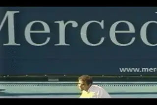
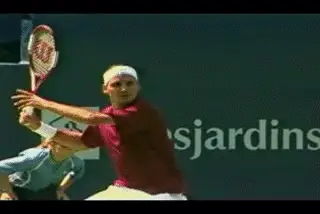
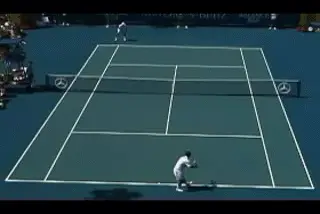
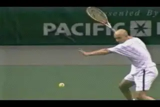
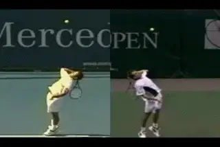
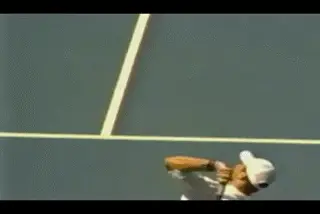
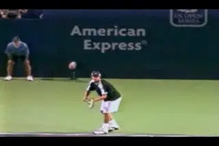

# Mysteries of the Heavy Ball: Introduction

### By John Yandell

**Do certain players really produce a "heavier" ball than others?**

"The Heavy Ball." It's a mythical term. "His ball was so heavy it
was like hitting a bowling ball." Most tennis players and coaches have
had the experience of playing an opponent whose ball seemed unusually
"heavy".

Maybe the ball seemed to get on top of you before you could respond.
Maybe the ball felt like it was going to rip the racket out of your
hand. Maybe it felt like the ball would by pass your strike zone
altogether and bounce over your shoulder or even your head.

Everywhere I go in tennis I hear different versions of the same story.
This player or that player had the "secret" of the heavy ball. It was
Don Budge, Bjorn Borg, Tomas Muster, or Pete Sampras--or some legendary
local college or pro player that you or I never heard of. "This guy hit
the heaviest forehand I've ever played against."

So "heavy ball" is a term with a lot of connotations for a lot of
people. But does it have any real meaning? Is there in fact any such a
thing as a shot that is really "heavier"? If so can we understand it,
quantify it, and/or teach it?

If the heavy ball does really exist, it must be some combination of
speed, spin, and shot trajectory. But what combination? Is it something
that's just natural for a few gifted or lucky players? Is there a way
to intentionally maximize the weight of your shots?

In this section of TPA, we've set out to investigate these
questions in a different way. Thanks to new filming and analytic
technologies, it is now possible to measure the shot signatures of the
top players and to distinguish how they play by the quality of the ball
they produce.

**If the heavy ball exists, is it some unique combination of ball speed
and spin?**

Over the last several years, researchers from Advanced Tennis
Research[(AdvancedTennis.com)](http://www.advancedtennis.com) have been
investigating these factors of ball speed, spin, and trajectory, and
beginning to put the pieces of the puzzle together. A big part of the
story is the evolution in technologies that makes this possible. And
that's part of the ongoing story we plan to tell

**Ball Speed**

We'll start with ball speed, and the ground-breaking research Advanced
Tennis scientists began on the speed of the ball in 1997 and 1998. This
was the first quantitative study to measure the speed of the ball in pro
tennis, beyond what the radar guns told us about the initial velocity of
the serve. We not only studied the speed of the serve, but also of the
groundstrokes, the returns and the volleys.

Although it's absolutely invisible to the human eye, virtually every
shot in pro tennis lost half or more of its speed by the time it reached
the opponent's baseline.

**It's invisible, but every shot in pro tennis, like this serve, loses
half of its speed between the players.**

In the first article we go into detail about how we developed this
information, what the results were, and what it might mean for players
looking for an edge.

**Ball Spin**

After looking at the study of ball speed, we'll go on to look at the
first ever study of the actual spin rates in pro tennis. In 1997, we
filmed at the U.S. Open using a new high speed digital camera technology
that filmed at 250 frames per second. This was the first time that live
professional matches were ever studied by a camera that was fast enough
to actually "see" how the ball spins.

How fast was a Pete Sampras serve really spinning? How about an Andre
Agassi forehand? Our camera allowed us to answer these questions. During
the course of 5 days, we built up and extensive data base of several
hundred spin events with top professional players.

We found for example that there was no such thing as a "flat" first
serve in the pro game. In reality, a 120mph Pete Sampras serve was
actually spinning at an average of over 2500rpm.

We also found that although many people believed that Andre Agassi's
forehand was hit with "heavy" topspin, it was actually spinning at
about 1800rpm, less than half what some of the European players were
developing.

**Contrary to popular belief, Agassi's forehand isn't hit with
"heavy" tospin relative to other pros.**

We also saw for the first time what happened to spin during the bounce
on the court.

**Surprisingly, we found the friction between the ball and the court
created as much topspin as the initial hit (and sometimes more),
something which had important implications for the creation of the
"heavy ball."**

These studies of speed and spin opened a window on the literally
invisible world of ball dynamics. They also raised almost as many
questions as they answered.

We were able to put real numbers to spin and speed in pro tennis for the
first time--key components in trying to understand the heavy ball. But
how did speed and spin actually interact?

The next step in the research was to measure speed and spin
simultaneously, instead of in separate studies. To do this required a
new, more elaborate filming protocol and new original motion analysis
software, developed by Nasif Iskander.

**Nasif was able to measure the speed of 10 returns hit by Pete's
opponents, as well as 3 returns hit by Sampras.**

In 2000 we were able to put these new tools into action. We were able to
film and compare the ball dynamics of two of the best servers in the
history of the game in live tournament play: Pete Sampras and Greg
Rusedski. For the first time we were able to measure the speed and spin
of the serve over the entire course of the flight. Greg Ryan performed
the critical and painstaking task of putting the together to form our
most complete picture yet of the heavy ball.

**How does speed interact with different types spin over the flight of
the serve?**

A critical advance in Nasif's software was the ability to measure the
components in the spin of top players, for example, the level of
sidespin and topspin in the deliveries of Sampras and Rusedski. In
addition, Nasif developed a "shot simulator" that actually allowed us
to measure how changing amounts of spin influenced the curve and the
drop of high speed professional serves.

The results were again surprising. **We found that there was in fact
no such thing as a "topspin" serve, that the majority of spin in the
deliveries of both players was sidespin not topspin. But a critical
difference turned out to be the relative amounts of
topspin.**

**These differences in the type and amount of spin had a significant
impact on the quality of the ball they produced. And it had a
significant effect on the total "heaviness" of the shot at the time of
the return.**

**High speed filming shows that 2/3s or more of the spin on pro serves
is actually sidespin.**

Since Advanced Tennis completed its initial studies of ball speed and
spin, the technology has continued to evolve, making even more detailed
and precise studies possible that can contribute to our understanding of
the nature of the heavy ball in new ways.

Currently Advanced Tennis is engaged in a collaboration with Hawk-Eye
technologies in London, the developer of the "Shot Spot," which has
taken a prominent place in ESPN tennis broadcasts, reviewing line calls.
"Shot Spot" is based on amazing technology developed by the brilliant
young English scientist Paul Hawkins, who first applied it in cricket.

To the average television viewer, this is exciting because it allows for
the potential "instant replay" review of the controversial calls which
frequently have an impact on the outcome of matches (not to mention the
fragile emotional psyches of the players).

But in reality the "Shot Spot" technology can tell us far more,
because it is actually measuring the entire trajectory of every shot hit
in professional tennis. This means Shot Spot can tell us the exact
speeds of the shots of the top balls at any point in the flight of the
ball, as well as the path each shot takes.

**How does the "weight" of Roddick's ball compare to Sampras?**

The one factor that Shot Spot cannot directly measure is spin, which
requires an additional, even faster high speed camera trained
exclusively on the flight of the ball.

In 2004 Paul Hawkins agreed to collaborate with Advanced Tennis in
taking the heavy ball analysis to the next level. This meant that Shot
Spot would allow us to combine their speed and trajectory data with our
high speed spin data. Together we were able to film matches of Roger
Federer, Andy Roddick, Marat Safin, and Lleyton Hewitt. This will allow
us, for starters, to compare the spin Roddick generates on his serve to
Sampras, or Federer.

Over time we hope the end result will be a comprehensive and even more
accurate picture of what actually happens when pro players hit the
tennis ball. Our goal is that by combining speed, trajectory and spin,
we will be able to further unravel the shots of pro players and
facilitate the quest for the heavy ball. So Stay Tuned.

John Yandell is widely acknowledged as one of the leading videographers
and students of the modern game of professional tennis. His high speed
filming for Advanced Tennis and TPA have provided new visual
resources that have changed the way the game is studied and understood
by both players and coaches. He has done personal video analysis for
hundreds of high level competitive players, including Justine
Henin-Hardenne, Taylor Dent and John McEnroe, among others.

In addition to his role as Editor of TPA he is the author of
the critically acclaimed book Visual Tennis. The John Yandell Tennis
School is located in San Francisco, California.
