# The "Heavy" Serve Practical Implications

### By John Yandell

In the first "heavy ball" article on the serves of Pete Sampras and
Greg Rusedski, we found that--everything else being equal--a higher
topspin component in the serve appeared to produce a heavier ball at the
time of the return.

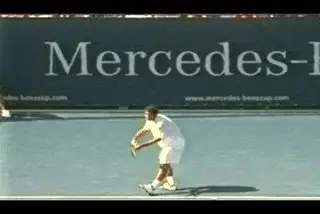

**Pete and Greg: more topspin equals more "weight," but not always.**

Our data showed that the two players had virtually identical average
ball speed and ball spin. But Pete's ball was still heavier at the time
of the return. The difference was in the axis of the rotation and the
relative amounts of slice and topspin in the balls. Pete had a higher
topspin component and this was the difference in the amount of topspin
after the bounce and the height of the bounce. Interestingly our data
was consistent with first hand accounts of what it was actually like to
face the serve of both players. [link](Speed%20and%20Spin.docx)

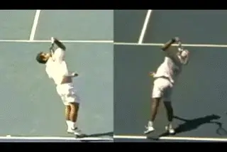

**Pete's racket moves slightly more upward and Greg's slightly more
across.**

**The Next Logical Question**

The next logical question is how did Pete produce that heavy ball? And
then, can I do it myself? What were the differences in Pete's motion
that produced the difference in the sidespin/topspin balance?

**The obvious answer is the path of the racket at contact, and related
to this, the position of the ball toss. The angle of the path of Pete's
racket appears to be slightly steeper, moving more upwards, compared to
Rusedski's, which is moving more sideways and somewhat more across the
ball.**

We can see this at the contact, and also, in the path of the racket
after contact. Rusedski's racket is moving slightly more from his right
to his left. It naturally extends more to the side or further away from
his body after the hit. Pete's racket is also traveling to the side,
but it is also traveling somewhat more upward and forward.

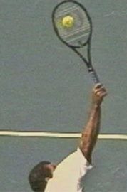

**Small differences int angle of the racket indicate the relative topspin component.**

If you look closely, this small difference is even visible in the still
photos created from the high speed video. Look at the difference in
where the tip of the racket points. Sampras's racket tip is tilted back
a few degrees more to his left. Rusedski's is slightly more straight up
and down. This gives you an idea of the angle that the strings are
traveling at during contact. Again, Rusedski's racket appears to being
going slightly more across the ball. Pete's appears to be traveling
slightly more upward. This difference in the angle of the racket appears
to be consistent with the angle of the ball rotation itself.

Remember one of the surprising things we found was that most of the spin
for both players was sidespin. There was no such thing as hitting up on
the ball from "6 to 12" to create topspin the way many players and
coaches believe. The differences in the topspin component were a matter
of a few degrees. And it makes sense that the difference in the incline
of the racket mirrors this and is also quite close between the two
players. This slightly steeper racket path is what changes the axis of
rotation of the ball and is the key to generating the additional topspin
component in the overall spin.

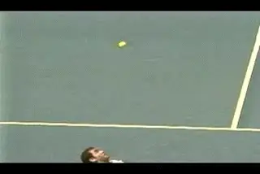

**Is Pete's magic combination the answer for you?**

**Does the Magic Combination Exist?**

**So for Pete the magic combination was keeping the velocity at
115mpm-125mph while hitting up more to generate a higher topspin
component.**

This allowed him to hurt his opponents with sheer speed and hit his fair
share of aces. But it also gave him the ability to generate large
numbers of unreturnable serves due to weight from the extra topspin and
the high bounce this created.

So with this information, are you now equipped to develop the heavy
serve you've always dreamed of? Pete Sampras just pulled the toss back
to his left and bumped up the topspin component a little bit, so it
should be the same for you, right? I don't think it works quite that
way.

The truth is that our study of spin on the serve of these players is
just one small step in trying to unravel the mysteries of the heavy
ball. The whole issue of speed, spin, and type of spin is very complex
and difficult to understand. Using our high speed filming and
proprietary software, we were able to see at least some of the factors
that made Pete's serve so amazing.

But let's be realistic. When it comes to your serve, the question
isn't what worked for Pete. If you could match his speed/spin numbers,
you wouldn't really need to read this article, now would you?

**The real question is what combination of speed, slice, and topspin
is going to make your serve as effective as possible for you, at your
level of play.**

And I think there are a number of possible answers. Because the
so-called "heavy ball" is a mix of speed and spin, it's a relative
concept. Adding more topspin at one level of velocity may not have the
effect that it has at another. In fact, the effect could be the reverse.
More topspin could make your serve less heavy not more.

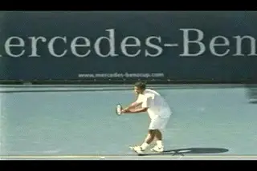

**Extreme body rotation and the left ball position--difficult to
copy.**

If you have read through the site, you may have encountered the series
of articles I wrote on Pete's serve. ([link](../Tour%20strokes/Tour%20strokes%20TOC.docx).) It's a very
detailed look at every aspect of his motion. But like a lot of what I
write on this site, I developed that series motivated by mainly by the
desire to figure out exactly what was happening in his motion. My
purpose wasn't necessarily to suggest that every player at every level
copy every aspect of his motion.

And two aspects of his motion are particularly difficult to copy. These
are the toss with the far left ball position, and the extreme body
rotation. Both are probably key components in producing the super heavy
ball. The body rotation creates additional explosive energy. The left
ball position allowed Pete to direct some of that energy into topspin.

**Ball Position and Weight**

**Now there is no doubt that moving the toss to the left will help any
player create more topspin.** **The question
though is will this make a given serve
"heavier"?** **[[It may make it bounce higher,
but how does it affect the other key component which is the
velocity?] [A heavy ball is fast with heavy spin.] [You
need them both.]]** But "fast" and "heavy spin"
differ by level. What might be "heavy" in the juniors won't
necessarily be "heavy" in college or in the pros. The same will apply
across the vast range of levels in NTRP and club tennis.

The fact is that speed and spin are a trade off. I've heard from more
than one source that Pete Sampras could flatten his serve out and hit
the ball 140mph or more, and that he did it for fun in practice
sometimes. In matches you'd occasionally see him crease 130mph on the
radar gun, but in general he hit with less speed and opted for that
searing spin, with the high topspin component. And it made his ball
almost unplayable.

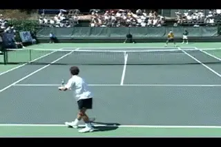

**Jeff Salzenstein: high level experiments with the heavy ball.**

But that's not necessarily going to work even for other players at the
highest levels of the game. Over the last 3 years I've had a
fascinating experience that ended up demonstrating this in my work with
former Stanford star and tour player Jeff Salzenstein. Jeff had studied
the Advanced Tennis high speed video on his own, and he understood the
concept of the Sampras heavy ball. His goal was to improve his already
formidable delivery by making his ball heavier and using Pete as a
model. It was a lot of fun collaborating with him and using comparative
video analysis to help him develop the elements of the Sampras motion,
including both the increased rotation and the ball position on the toss.
I say collaboration because Jeff continually amazed me with his
perceptiveness and his natural intuition about what to do with the
information we were developing. It was incredible just being on the
court standing next to someone who could do the things Jeff can do.

While we were working together, Jeff won a Challenger, qualified for the
U.S. Open, and moved up over 50 spots to the edge of the top 100 on the
computer. But part way through the process he moved away somewhat from
the extreme heavy ball concept. He felt that he was trading too much
speed to get the heavier spin, and that he was generating serves that
weren't as difficult to return as he had hoped. For whatever reason, he
couldn't make the pure Sampras motion produce quite as much velocity to
go with the additional topspin. And this was a player known for having a
very good serve by tour standards. Just ask some of the other players.

So Jeff repositioned his toss somewhat, moving it further away from his
body, slightly more to the side, and lowering the height. He kept many
of the changes we made in his stance and body rotation, but went back
toward hitting the ball flatter and harder, even at the risk of not
getting as many first serves in the box.

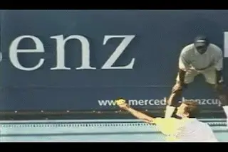

**What really happens when you move the ball left to add spin?**

**This is exactly the same trade off faced by players at every
level--from the tour all the way down to the club player. What happens
when you add topspin and reduce speed? Does that it make your serve
easier or more difficult to return? That's probably the real definition
of "heaviness". Does the ball feel nasty and uncomfortable for the
opponent at the other end of the court.**

**What About Lower Levels?**

I can use my own experience as an example at a much lower level. When I
was playing Norcal senior events, I played a guy I'll call "Bruce"
several times. Bruce was absolutely determined to hit one-handed topspin
backhand returns on both first and second serves. Now that's unusual,
especially in senior tennis. And if he got a hard relatively flat serve
(from me anyway), he could actually do some damage, particularly hitting
down the line in the ad court. But only if he could get the ball at
about waist level.

**Once I noticed this, I started pulling my toss a little more to the
left and hitting "heavier" spin serves to his backhand on literally
every point.** The ball wasn't that fast, but it
would get up to his around shoulder. He would try to come over it, but
he couldn't control the ball. It was amazing to witness, because Bruce
missed virtually every backhand return. I mean he got 5 or 6 returns in
play in the course of a match. He never once tried to move over and get
around the ball to hit forehand returns, even though he knew exactly
where I was going to serve. It must have been some kind of bizarre
matter of principle, but I certainly didn't care. He wasn't that bad a
player, but since he barely made me play on my serve, I beat him far
more easily than I thought I should have. Paradoxically I would have
probably had a tougher time with him if I had mixed up my serve the way
I usually try to.

So there's a page out of the heavy ball story that is probably closer
to reality for most players than Pete Sampras. A heavier topspin
component can make the ball unplayable under certain circumstances at
any level. But the important point is that this application was purely
situational. Hitting the same serve was a liability against the top
players in the Norcal seniors. I know because I tried. They would step
in, clean it on the rise and that was quite unpleasant and discouraging.
The point is that unless you're the greatest player in the history of
the game and can win 14 Grand Slams, there is no probably absolute
"heavy" speed/spin combination.

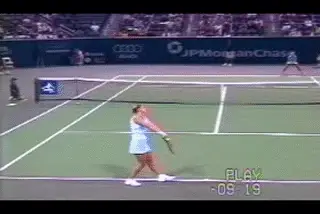

**The women: tossing further to the right and hitting speed but less
topspin.**

**The Women: Different Or?**

The women's pro game is interesting in this respect. You see the women
regularly serve 100mph plus, up to even 125mph. But in general you see
them do this from a ball position much further to the right than Pete or
the other top men. If you look at Lindsay Davenport in the high speed
footage, you can see this. Looking at the angle of her racket at
contact, you can see that the topspin component is minimal in her ball.
The racket is more straight up and down than either Pete or Rusedski.

It's possible of course that the women just haven't been trained to
serve with the same technical elements you see in Pete's motion.
(Justine Henin-Hardenne is one exception.) Or maybe they just feel that
to generate that kind of speed, they need to hit much flatter. The top
woman may sense that the sheer speed is what hurts their opponents, and
topspin reduces their ability to do this. With the relative perspective
we've adopted, velocity may be what makes their serves seem "heavy" .
On the other hand, maybe the women's game is just waiting for a player
who can hit 115mph and create high topspin component.

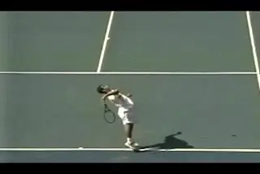

**How many service motions and how many different serves?**

**How Relative Is It?**

So if it's all so relative, what about the idea of having it both ways,
developing multiple serves, and then just adjusting speed and spin,
depending on a given opponent or situation? There is a theory of serving
that goes like this: toss the ball to the right and hit slice, toss to
the left and hit topspin, and toss somewhere in the middle and hit flat.
Won't that give you more variety and effectiveness?

This strategy is still widely taught at the recreational level. It may
sound logical, but it is really bad advice. You just don't see it among
successful competitive players. But isn't that exactly what I did with
Bruce? Not really. Remember, I hit the same serve off the same toss to
the same side of the box on every point. That was my one and only serve
for that match, all off the same motion and toss. And there's a reason
for that. It's hard enough to just have one service motion with one
toss, let alone two or three. No player can go back and forth like that
and be consistent. Not to mention that if you use different tosses on
different serves you instantly telegraph what you are about to do.

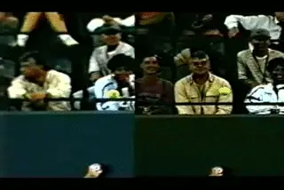

**Which serve goes down the middle and which goes wide?**

**One Pro Element**

**So if there is one thing we all can definitely model from the pros
it is hitting all the serve variations with basically the same motion
and the same toss.** Being a complete player means
being able to go down the middle and wide off the same toss, and to vary
the amount of spin as much as possible as well. Watch the incredible
Sampras animation as he hits a serve down the middle and then wide in
the deuce court. Can you read which serve is coming? The reality is that
the difference is a slight change in the path of the racket to the ball,
a change that occurs literally hundredths of a second before contact.

The difference is probably a few degrees in the angle and the path of
the racket head, but that few degrees is enough to send the ball
straight down the T or hooking wide to the service box sideline. Our
studies show that this is also enough to allow the top players
considerable flexibility in varying the amount of spin, even on balls
delivered to essentially the same location. The chart below shows this,
comparing the ranges of spin for Sampras and Rusedski on serves to all 4
corners of the service boxes.

As we saw the average spin values were virtually the same.
Interestingly, the same was true for the range of spin. Sampras had a
spin range from 1306 rpm to 3916 rpm. Rusedski's range was almost
identical, at 1222 rpm to 4025 rpm.

**Spin Range**

| Sampras: | Deuce Down the T | Ad Down the | Deuce | Ad Wide |
| --- | --- | --- | --- | --- |
|  |  | T | Wide |  |
| Spin |  |  |  |  |
|  |  |  |  |  |
| Range |  |  |  |  |

|          +------------------+--------------+-----------+----------+
|          | 1646 rpm--      | 1222 rpm--  | 1419      | 1306     |
|          |                  |              | rpm--    | rpm--   |
|          +------------------+--------------+-----------+----------+
|  | 2946 rpm | 2651 rpm | 3916 rpm | 3820 rpm |
| --- | --- | --- | --- | --- |

| Rusedski: | Ad Down the | Deuce Down the T | Ad Wide | Deuce |
| --- | --- | --- | --- | --- |
|  | T |  |  | Wide |
| Spin |  |  |  |  |
|  |  |  |  |  |
| Range |  |  |  |  |

|           +--------------+------------------+----------+-----------+
|           | 1222 rpm--  | 2311 rpm--      | 2883     | 2129      |
|           |              |                  | rpm--   | rpm--    |
|           +--------------+------------------+----------+-----------+
|  | 2651 rpm | 3049 rpm | 4025 rpm | 3335 rpm |
| --- | --- | --- | --- | --- |

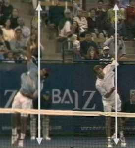
**Sampras and Rusedski probably define the extremes in toss placement.**

So for the average player looking to have the heaviest possible delivery
AND the maximum potential for variety, the key question is going to be
where to position the ball on the toss. How far to the right or left to
produce what combination of speed and spin?

We can get a good idea of the potential range of toss placement from
left to right if we look at the still image comparing Sampras and
Rusedski. But I don't think that we can say that being at one end of
the range or the other is automatically better for any given player.

**A Personal Experiment**

Yes, if you can keep the serve speed high enough and trade some sidespin
for some topspin, then, like Pete, you might produce a ball that will
dominate at your level. And personally I hope you do! I think it's an
experiment every player should have the excitement of conducting for
himself, or herself. As you experiment keep one other critical factor in
mind. If you pull the ball back to the left, the contact should still
stay at the edge of the plane of the body. Many players make the mistake
of pulling the ball to the left, but also moving it too far back so the
contact is actually behind the front edge of the body.

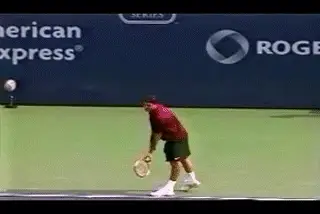

**Federer: a beautifully balanced compromise?**

We can look at one more player who conducted that experiment pretty
successfully: Roger Federer. His contact is probably somewhere in
between the extremes of Pete and Greg.

**Watch how his contact is just at the front edge of the body, and
also how beautifully he lands on balance with his torso more erect than
either of those players.**

More later on his whole service motion and his speed and spin values.
But suffice it to say that he has found a very effective balance that
works within his capabilities and style of game. Is that the
understatement of the tennis year so far? Probably. And it's probably
not a bad place to start your own experiment.

John Yandell is widely acknowledged as one of the leading videographers
and students of the modern game of professional tennis. His high speed
filming for Advanced Tennis and TPA have provided new visual
resources that have changed the way the game is studied and understood
by both players and coaches. He has done personal video analysis for
hundreds of high level competitive players, including Justine
Henin-Hardenne, Taylor Dent and John McEnroe, among others.

In addition to his role as Editor of TPA he is the author of
the critically acclaimed book Visual Tennis. The John Yandell Tennis
School is located in San Francisco, California.
