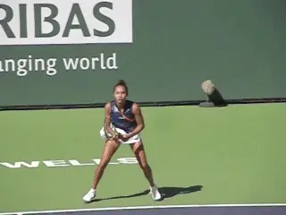
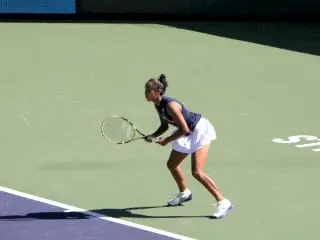
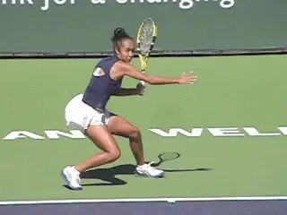
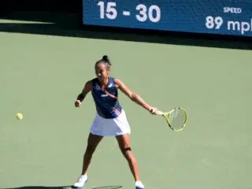
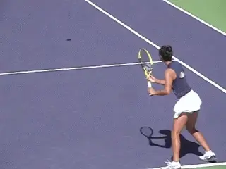
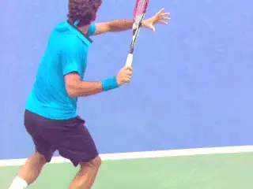

# Leylah Fernandez Forehand

### **Analyzed by John Yandell**

**Leylah Fernandez's straight arm forehand.**

Leylah Fernandez's forehand! Could it be any different from our study
of Daniil Medvedev's last month? ([link](https://www.tennisplayer.net/members/tour_strokes/john_yandell/daniil_medvedev_forehand).)

You might think Medvedev looks more WTA, and Leylay more ATP. That's
how crazy and diversified strokes can be on the tour.

When we look at Leylah's forehand the first thing that is overwhelming
obvious is that she hits with a straight arm. Really totally straight.

There are probably others but only other WTA player I have studied who
has that straight arm is Ash Barty ([link](https://www.tennisplayer.net/bulletin/forum/tennisplayer/84339-interactive-forum-december-2019-ash-barty-forehand).)
So let's go through it element by element. Leylah is a lefty, but all
the key points apply.

**Grip**

Leylah has a relatively mild semi-western grip. Her index knuckle is on
bevel 4. Her heal pad though looks squarely on bevel 3, or aligned
behind the racket face. It's probably close to Andre Agassi, slightly
stronger that Roger Federer, but clearly less extreme than Nadal or
Djokovic.

**A strong unit turn and left arm stretch.**

**Unit Turn**

Leylah has a great, strong unit turn. She slides her opposite hand up
the throat of the racket. Then she keeps that hand on the throat until
her racket is in the center of her torso.

Then she stretches her opposite arm all the way across so that it is
parallel with the baseline and perpendicular to the sideline. Her
shoulders turn somewhat beyond 90 degrees, with her chin over her front
shoulder.

This is the classic pro body turn position, unless your name is Daniil
Medvedev. At this point her racket is tilted slightly backwards, with
the tip slightly above head level, and her elbow is bent and pointing in
toward her waist.

**Perfectly straight arm and great extension.**

**Straight Arm**

She then extends her elbow and straightens her hitting arm. She
maintains this position making contact with the arm perfectly straight.

This puts her contact well in front of her legs and torso. Again much
further in front than Medvedev or for that matter any player with the
more common double bend hitting arm shape.

The result is that her swing has incredible forward extension. On many
balls her arm stays straight until her hand reaches about the center of
her torso, and as her arm continues across to the edge of her torso, she
still has probably a couple of feet of spacing.

**Finishes**

On many balls, she has a full wiper action in her forward swing, with
the racket face turning over until the bottom edge is square with the
court and pointing at the sideline. On others she hits flatter with
little or no wiper action, but with similar extension. The exception is
when she hits with a reverse finish, her racket finishing over her head.

**A flat finish, a wiper finish, and a reverse finish.**

**Stances**

In addition to the 3 typical pro finishes she also hits from all 3
typical stances. Predominately she hits semi-open. But she also hits
fully open, and neutral, again like almost all pro players.

As with many other women players, she can also hit from what we can call
a squatting stance, with a much lower contact point with her knees
deeply bent and sometimes actually touching the court. Would like to
hear subscriber views on this, but presumably this is to control the
bounce height on hard hit, heavy balls.

**But is it Type 3?**

So is it the classic pro Type 3 forehand identified by the great Dr.
Brian Gordon and modeled so perfectly by Roger Federer? ([link](https://www.tennisplayer.net/bulletin/forum/tennisplayer/96060-interactive-forum-december-2021-leylah-fernandez-forehand#post96060)
for his introduction to Leylah's forehand in the Interactive Forum.)

**All 3 stances plus the squat.**

Nope! If we look closely at her backswing, we can see that Leylah does
appear to keep her racket hand mostly on the left, hitting side of her
body.

But look at the relationship between her arm and her racket head. The
Type 3 forehand turbo charges the hitting shoulder by placing the racket
head to the outside of the hand with the face tilting somewhat downward.
This creates the dynamic flip at the start of the forward swing.

Leylah doesn't do this. Instead she clearly moves her hand and racket
to the inside before starting forward. This creates a compact inside
loop. Compare this to Roger Federer.

It's is compact but that still this makes it a Type 2 forehand in this
key respect. In his brilliant introduction to the Fernandez footage in
the Interactive Forum, Brian explains this in more detail ([link](https://www.tennisplayer.net/bulletin/forum/tennisplayer/96060-interactive-forum-december-2021-leylah-fernandez-forehand#post96060).)

In a true Type 3 forehand there is also a sequencing in the forward
torso rotation with the hips rotating slightly earlier than the
shoulders. In Leylah's case the hips and shoulders appear to rotate
forward in concert.

So does this negate all the other positive elements we've looked at
above? No, it's just that, possibly or likely, the lack of the flip and
the rotation sequence reduce the forward or horizontal racket speed.

**Leylah has a compact backswing, but her racket and hand position still
make it WTA compared to Federer.**

Still the straight arm, the early contact, and the extension could also
be creating more vertical racket speed. This means these elements could
increase the spin component, although from watching Leylah it's obvious
that her forehand is relatively flat.

We weren't really set up to film spin, but on a few examples that we
could measure total spin was at about 1900rpms. That's not a high
number at least compared to the men's game obviously.

But it's about the same as Andre Agassi and Pete Sampras in the 1990s.
And not that far off Medvedev's 2100ish rpm average. ([link](https://www.tennisplayer.net/members/mystheavyball/john_yandell/modern_heavy_ball).)
It's close to the top of the range of the women we measured in the late
90s. ([link](https://www.tennisplayer.net/members/mystheavyball/john_yandell/Spintest/spin_test.html).)

So as we said at the top of this article, it's a wide technical world
out there! And it's great to see the range of options in the women's
game as well as the men.

John Yandell is widely acknowledged as one of the leading videographers
and students of the modern game of professional tennis. His high speed
filming for Advanced Tennis and TPA have provided new visual
resources that have changed the way the game is studied and understood
by both players and coaches. He has done personal video analysis for
hundreds of high level competitive players, including Justine
Henin-Hardenne, Taylor Dent and John McEnroe, among others.

In addition to his role as Editor of TPA he is the author of
the critically acclaimed book Visual Tennis. The John Yandell Tennis
School is located in San Francisco, California.
