# The Pro Return

### **Bobby Bernstein**

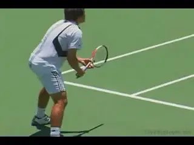

**The pro return: more complex than we may assume.**

What happens when pro players hit the return of serve? It's a simple
question, without a simple answer

As Administrator of Coaching Education for USTA Player Development, I
have been filming and studying the top players for the last few years,
including their returns. What our filming to date shows may surprise
you. So let's have a look at some important and sometimes debated
issues. These include:

1.  **The Split Step**

2.  **Positioning**

3.  **Types of Returns**

4.  **Grips in the Ready Position**

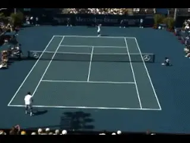

**The film shows that the split step begins before the server
hits and that pro players are in the air at
contact.**

**The Split Step**

Conventional wisdom says that the returner should split step as the
server makes contact with the ball. The film shows this isn't quite how
it happens. What we actually see is that most players are already in the
air at the time of the contact. **The split step actually begins a few
fractions of a second before the server hits. At this point the
server's racket is still on it's way up to the
ball.**

The second thing the film shows is that **pro players don't actually
land in the split step position until the ball is about half way to
them, or roughly when the ball crosses the net.**
This makes sense when we think about the amount of reaction time it
takes for the body to respond and move to a fast moving event like a
130mph serve. Work by famed tennis physicist Howard Brody suggests that
it takes about 3/10s of a second or a little more for the body to react
and begin to move in tennis or other sports. This is about the time it
takes that 130 mph serve to reach the net.

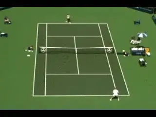

**As he lands on the court, Agassi's left foot has already flaired in
the direction of his backhand return.**

But there is something else. Traditionally when we think of the split
step we think of the player landing on both feet in a balanced position
ready to move either way to the ball. That's not always how it happens
on the pro return. Take a close look at the feet as the players come
down. You'll see that **before the player lands on the court, the
foot closest to the ball can actually start to flare in the direction of
the return. This is the start of the turn or the preparation for the
return.**

**So the players are starting the split step well before contact. They
do this by unweighting before the server hits. This puts them in the air
at contact**. **And sometimes they are actually
starting their move to the ball before they land on the
court.** Were players taught this? I don't think
so. It's an adaption developed through experience over time.
**<<Similar to an antelope jumping to see where the predator is and
change direction to run away in an opposite direction when
landing...>>**

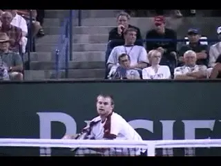

**Do expert returners focus on the upper body for clues about the
serve?**

Can it be developed, and if so how? The conventional wisdom is that the
key is to timing the return is focus on the ball and react to the
contact. But there is some interesting new research that suggests
something different. A study done by a researcher in Virginia used
goggles to record what the players did with their eyes on the return.
What she found was that **expert returners focused on the ball, but
they were also looking at the body of the server, particularly the upper
body. The same research showed that novice players didn't do this, but
could be looking at different areas around the court almost
randomly.**

**Probably what this indicates is that the brain of the returner is
picking up clues about the return from watching the body of
server.** They might not know or be able to explain
what those clues are because it probably happens subconsciously. It's
just **something that the player's develop automatically from
focusing on the right area of the body.** This may
explain some of the footage we've seen in which a player like Pete
Sampras appears to be reacting and starting his move to one side faster
than research says is humanly possible.

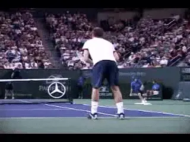

**Return practice should simulate match play.**

**Practicing Recognition**

To build up your own recognition skills, it is important to make
practicing similar to match play. This means the returner shouldn't
know in advance where the serve is going. This is a common mistake I
see. Coaches sometimes tell players where the serve is going, or hit
multiple serves over and over to the same location. This inhibits the
returner's ability to react properly. Imagine approaching the net and
knowing ahead of time that the passing shot was going down the line. If
you practiced this you would lose the anticipation necessary to be an
effective volleyer. Be careful that you aren't impeding your natural
ability to develop anticipation.

**Return Position**

**Now let's take a look at where the players stand on the returns on
both first and second serve, and how this is sometimes related to the
type of return they hit.** We think that **the
great returns in tennis are the ones players hit early or on the
rise.**

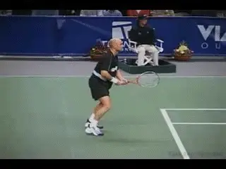

**We're used to thinking of players moving in to hit big returns.**

These are the type of returns we have seen Andre Agassi hit so many
times, or Jimmy Connors before him. What we see on these returns is that
**[[the motions are very compact]. The player is [using the
speed of the ball], and [timing the return,]
usually [playing the ball on the rise.]] Often the
returner will be up on the baseline or even
slightly inside it when he makes contact.** This
has all been widely noted.

One thing that hasn't been as widely noticed is a completely different
strategy. It's one that is becoming more and more common in pro tennis,
**especially on the second serve. Instead of moving in and using a
compact motion, you see many players moving back and taking a bigger
swing.** Normally we think of moving back as an
option for a first serve, to give more time. But now you'll see a
player like Roger Federer **move back and run around to hit a big
forehand on the second ball, particularly in the deuce
court**. The swing here is usually comparable to a
normal groundstroke. You even see this at times with a player like
Agassi.

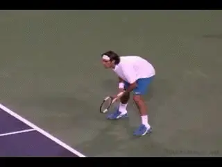

**Moving back to hit a big return with a big swing.**

**What's the advantage?** First, ***[the [ball
slows down] and [spin
outs]]*** **It loses some of the
energy. This means the returner can often hit the
ball on the way down, after the top of the bounce. This makes it
easier to time.** This also **makes the contact
at a more comfortable height. From this position
the returner can hit an aggressive return, again
similar to a groundstroke.** **He can also neutralize the
serve and start the point with a deep, heavy
topspin ball. This works well against players who
aren't serve and volleying.**

There's another potential advantage to this strategy that we don't
usually think about, and this has to do with court position. **[It's
great to hit aggressive returns up on the baseline. They can be very
dramatic when they work. But it's also possible to hit yourself [out of
position with an aggressive return.] The problem is
that]** **unless the return is a winner or really forces
the opponent, it can leave the court open and make you
vulnerable**. **[[By moving back,] the
returner not only gets] to take a bigger
swing**, **he is in a better position to defend
and to cover the court.**

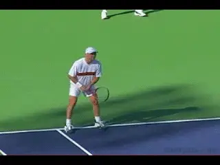

**On an aggressive return you can move in so far that you leave the
court open.**

On the return, if you are near the sideline you can move so far into the
court that, all of a sudden the entire other half of the court is open.
Now basically any ball the opponent hits to the open court can end up
being a winner. Or if it isn't a winner, its can put the returner in
dire circumstances, making it extremely difficult to recover and get
control of the point. **So just focusing on striking the return
aggressively can actually backfire.** **It needs
to be linked to how you want to play the rest of the
point.**

**Effective returning** in pro tennis is a
**combination of being in the proper position,**
**picking the right shot,** and **picking the
right placement.** **[It's not a matter of just
good ball striking.]** **The question is where do you put
that return to give yourself the best opportunity to start off the
point?**

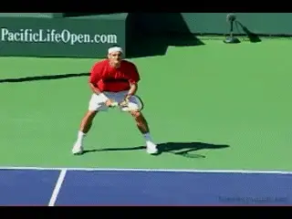

**Note Federer's incredible balance as he moves in and neutralizes with
a backhand chip.**

**Neutralize the First Serve**

This brings us to one more interesting return option we are seeing more
and more in the pro game. It's a play Federer uses to neutralize big
servers. Rather than moving back to gain time, Federer actually
**moves in and then chips the ball, especially on the
backhand.** Taylor Dent does it too. He also chips
a large percentage of his forehand returns.

As a coach I think the idea of getting the ball back in play is
underrated. You can't win the point if you don't give yourself the
opportunity to play the point. **So make the
return.** **Force the server to play the
ball.** Make sure **you don't hit yourself out
of position**. **You don't necessarily have to
take the offense away from the server with the
return**. **Try neutralizing the serve
first.**

**One very effective play here is deep down the
middle. [The exchanges] in pro tennis
are [so fast] now that [the server's often have trouble
recovering] if they have to back up to hit that next
ball**. **Don't give the
server a ball that he can more forward inside the baseline and
hit.** **Force him to stop or even back up to
play the next shot.**

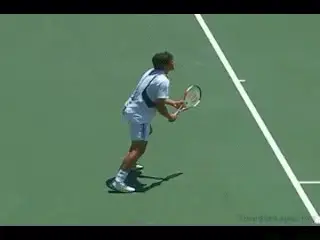

**Waiting with a continental allows players to neutralize with a chip
return.**

So what we have seen is a reversal of conventional wisdom in two
different ways. **The first reversal has to do with our understanding
of an aggressive return.** We're used to thinking
that when players move forward they're thinking attack. **But by
moving back you can be aggressive in different
way.** This is by **[giving yourself time to
load] [and take a bigger swing at the
ball]**.

We're also used to thinking that players move back to neutralize a big
serve. The second reversal is that, **besides moving forward to hit,
players now move forward to neutralize and start points by chipping with
underspin.** This is one of the things that makes
Roger Federer so complete.

**He can execute all these options as well or better than any other
player.**

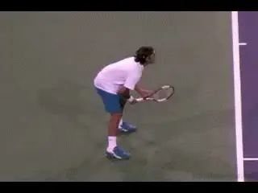\
**A complete player with a complete return game.**

**Grips**

A final area we have looked at in our filming is return grips. **In
the ready position, which grip or grips do the players wait
with?** Although there are exceptions, such as
Rafael Nadal, who holds his left hand on the racket throat when he
returns, most two handed players hold the racquet with both hands on the
racket. Their left or top hand will be in the normal grip they use on
the backhand. But with the right hand, they'll hold their forehand
grip. If the return comes to their backhand, they'll rotate the right
hand toward the top of the frame to create their normal backhand grip
structure.

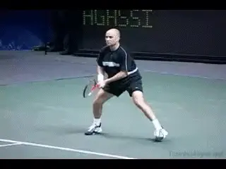

**Two handers wait with a forehand grip and rotate the hand during the
turn.**

One handed players have more variety in the grips they wait with. They
might wait with either the forehand or the backhand grip in the ready
position. However, **players who chip a lot of returns, like Federer
and Dent, will wait with an in between grip**.
**Most players who wait with an in between grip will then switch to
their normal forehand groundstroke grip if they are going to
swing.** Interestingly, Federer does something a
little different. When he drives his forehand return on the first serve,
he uses a slightly less extreme grip than his normal groundstroke. There
was another pretty good player who did the same thing: Pete Sampras.

On the backhand, virtually **all the one handers go to their regular
backhand grip if they decide to swing.** What it
all seems to mean is that **it's important [to wait with]
[grips that are appropriate to the range of returns you actually
hit.]**

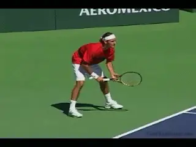

**Federer hits drive returns with a less extreme grip.**

The importance of the serve in today's game is widely recognized, but
the equal importance of the return is often overlooked. **Next time
you watch a match focus on the returner and try to notice what they are
really doing.** As with the variety in the modern
pro serve, there are many ways to return. Players should have multiple
options when it comes to getting the ball back. **[This is why it is
important to practice against a variety of servers and types of
serves.] [Developing your own return skills is definitely vital
to getting to the next level, whatever your ambitions or current level
of play.]**

                                                                                                                                          During the last 10 years as a USTA National Coach,
he has worked with virtually every top young
American in the player development program,
including Andy Roddick. Currently Bobby is
spearheading a major filming initiative for USTA,
recording and analyzing the strokes of dozens of
world class players and sharing the results with
players and coaches throughout the country. Prior to
working at the USTA, Bobby coached three years at
the Palmer Tennis Academy. He was also Director of
Tennis at the Wightman Tennis Center in Weston,
Massachusetts. Bobby graduated from Brandeis
University in 1985 with a degree in American
Studies, where he captained the men's tennis team.
